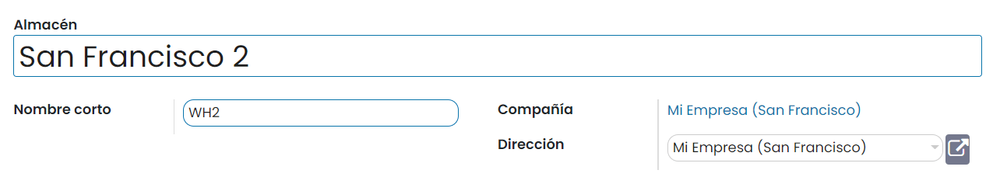
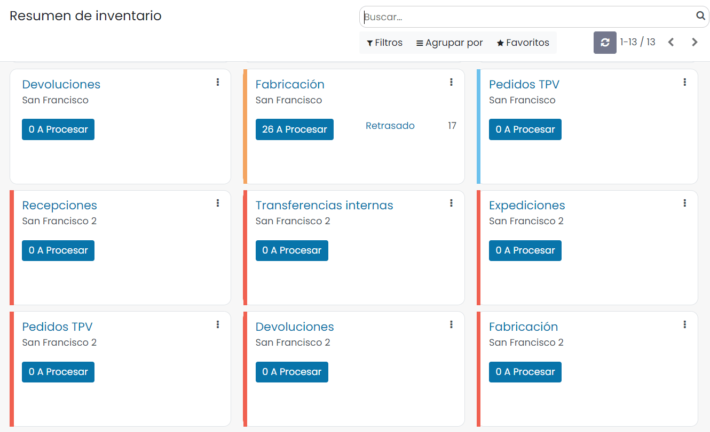
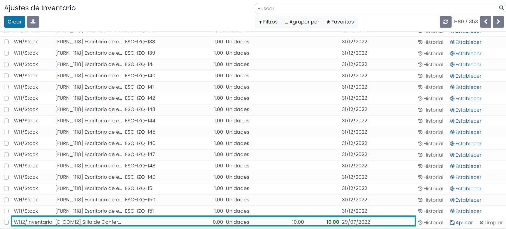
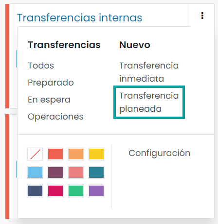
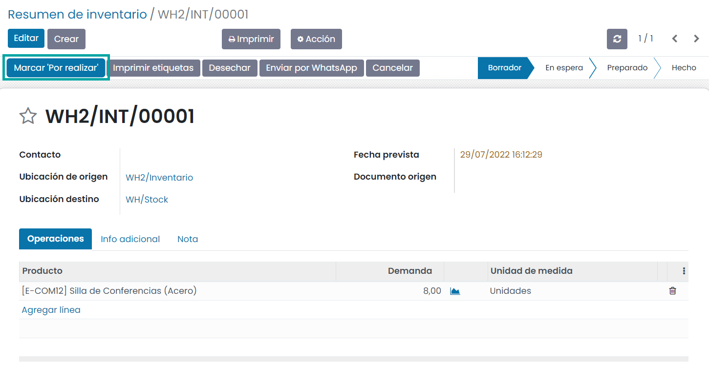

==============================
Transferencias entre almacenes
==============================

Cuando se tienen varios almacenes, es posible que necesites trasladar bienes de un almacén a otro. Tal comportamiento se
denomina transferencias entre almacenes. Aunque esta acción es físicamente fácil de realizar, la parte administrativa
puede ser complicada. Afortunadamente, Daeris incluye un flujo intuitivo que ayuda a ahorrar tiempo al registrar dichos traslados.

Configuración
=============

Primero, navega a la pantalla :menuselection:`Inventario --> Configuración --> Ajustes` y habilite la función
**Ubicaciones de almacenamiento**. Luego, haz clic en *Guardar*.

.. important::
   Si deseas gestionar varias rutas en tus almacenes, habilita la función **Rutas multietapa**.

Crear un nuevo almacén
======================

El siguiente paso es crear un nuevo almacén. Para hacerlo, navega a la pantalla :menuselection:`Inventario --> Configuración --> Almacenes`
y haz clic en *Crear*. Completa el nombre del almacén y un nombre corto. El nombre corto debe ser de máximo cinco caracteres:

.. note::
   El nombre corto aparece en tus órdenes de transferencia y demás documentos de almacén. Se recomienda utilizar uno que
   sea fácil de entender (por ejemplo: WH/[primeras letras de la ubicación]).

Ahora, regresa a la pantalla de información general de Inventario. Ahí se generaron de forma automática nuevas operaciones
relacionadas con tu almacén:

Crear un nuevo inventario
=========================

Si creas un nuevo almacén, tal vez ya tengas un inventario existente en él. En ese caso, debes crear un inventario en
Daeris. Si este no es el caso, ignora este paso.

En la aplicación de Inventario, selecciona :menuselection:`Operaciones --> Ajuste de inventario`. Luego, crea un nuevo
inventario al hacer clic en *Crear*. Complete la referencia de inventario y la fecha y asegúrate de seleccionar el
almacén y ubicación correctos. Selecciona el producto e indica la cantidad real disponible en el almacén:

No olvides validar tu inventario una vez que hayas registrado el estado de todos tus productos.

Crear un traslado interno
=========================

El paso final es crear tu traslado interno. Si deseas trasladar ocho unidades de un producto de tu primer almacén a otro,
procede como se indica a continuación.

En la pantalla de información general de Inventario, selecciona un movimiento interno de uno de los dos almacenes. Para
hacerlo, haz clic en :menuselection:`Nuevo --> Transferencia planeada`:

En la nueva ventana, selecciona la ubicación de origen y la ubicación de destino. Agrega los productos que deseas
trasladar al hacer clic en *Agregar línea*, luego haz clic en *Guardar* y *Marcar Por realizar* cuando acabes:

A continuación, haz clic en *Validar*. El estado de la orden ahora es *Hecho*, lo que indica que el traslado ya se ha
realizado:

