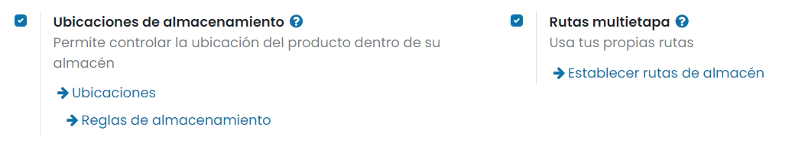
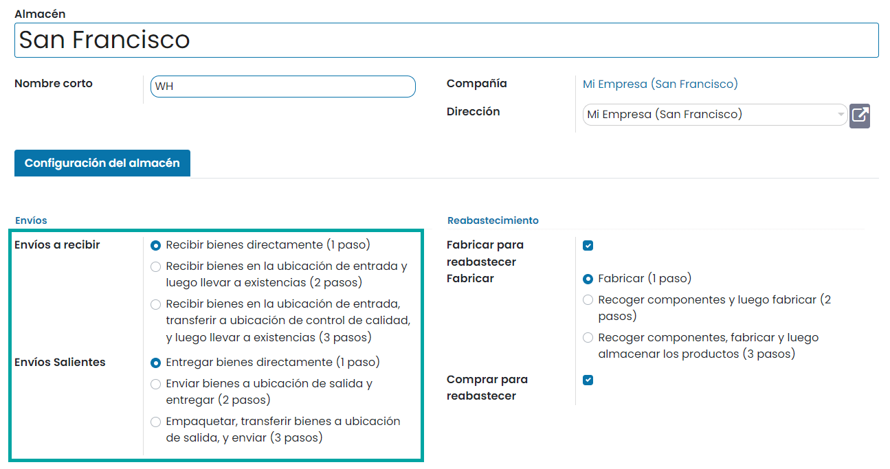
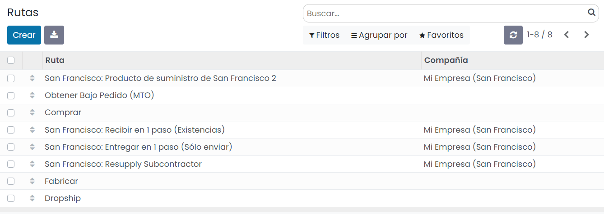
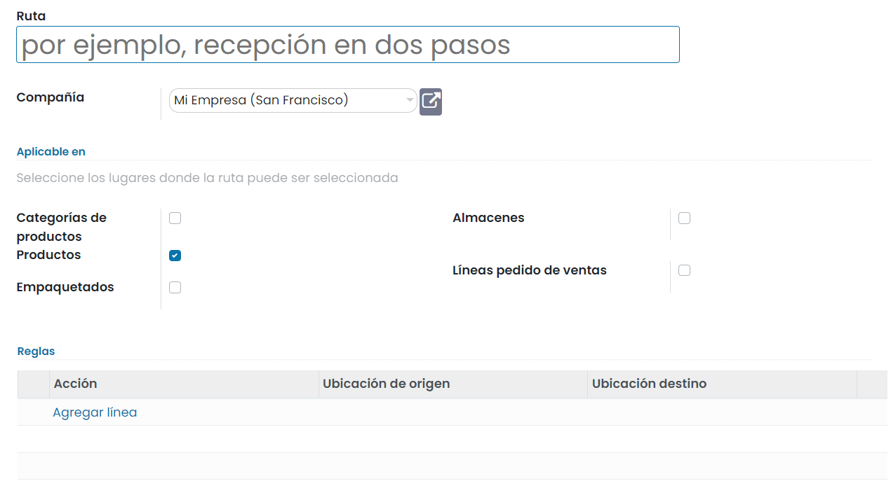
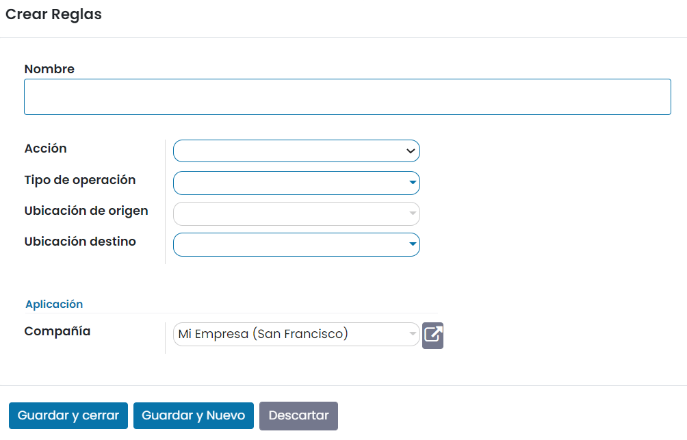

===============================
Usar rutas y reglas pull o push
===============================

En la gestión de inventario, la estrategia de cadena de suministro determina cuando deben fabricarse los productos,
entregarse a centros de distribución y estar disponibles en el canal minorista.

Este tipo de procesos estratégicos se pueden configurar mediante las *Rutas*, así como las reglas *push y pull*. Una vez
que todo está configurado de forma adecuada, la aplicación de Inventario puede generar automáticamente los traslados
siguiendo las instrucciones dadas por las reglas.

¿Cómo funciona?
===============

Reglas pull
-----------

Con las *reglas pull*, la demanda de algunos productos activa los aprovisionamientos, mientras que las *reglas push*
se activan debido a productos que llegan a ubicaciones específicas.

Se puede decir que las *reglas pull* se utilizan para cumplir con un pedido de venta. Por lo tanto, Daeris genera una
necesidad en la ubicación del cliente para cada producto en el pedido. Debido a que las *reglas pull* se activan debido
a una necesidad, Daeris busca una *regla pull* definida en la ubicación del cliente. En este caso, se encuentra una
*regla pull* de orden de entrega que traslada productos del área de envío a la ubicación del cliente, y se crea un
traslado entre ambas ubicaciones.

Luego, Daeris encuentra otra *regla pull* que trata de satisfacer la necesidad del área de envío: la regla de empaquetado
que traslada productos del área de empaquetado al área de envío. Y, finalmente, se activan otras reglas hasta que se crea
un traslado entre las existencias y el área de recolección.

.. note::
   Daeris genera todos estos traslados, empezando por el final y yendo hacia atrás. Mientras trabaja, el operador procesa
   estos traslados en el orden inverso: primero la recolección, luego el empaquetado y después la orden de entrega.

Reglas push
-----------

Por otro lado, las *reglas push* son mucho más fáciles de entender. En lugar de generar documentos según las necesidades,
se activan en vivo cuando los productos llegan a una ubicación específica. Las *reglas push* básicamente dicen:
"cuando un producto llega a una ubicación específica, se debe trasladar a otra ubicación".

Un ejemplo simple sería: cuando un producto llega al área de recepción, se debe trasladar a la ubicación de almacenamiento.
Como se pueden aplicar distintas reglas a distintos productos, puede asignar distintas ubicaciones de almacenamiento a
distintos productos.

Otra regla podría ser: cuando lleguen productos a la ubicación, se deben trasladar al área de control de calidad. Una vez
realizado el control de calidad, se deben trasladar a la ubicación de inventario.

.. note::
   Las *reglas push* se pueden activar solo si ninguna *regla pull* generó los traslados ascendentes.

.. important::
   Los conjuntos de reglas como estas se llaman rutas. El grupo en la regla define como se agrupan o no los productos en
   el mismo traslado. Por ejemplo, durante la operación de recolección, todas las órdenes se agrupan en un traslado,
   mientras que la operación de empaquetado respeta el agrupamiento por pedido de cliente.

Uso de rutas y reglas
=====================

Ya que las rutas son un conjunto de *reglas push y pull*, Daeris te ayuda a gestionar la configuración avanzada de rutas como:

-  Gestionar cadenas de fabricación de productos.

-  Gestionar ubicaciones predeterminadas por producto.

-  Definir rutas dentro de tus almacenes de acuerdo a las necesidades empresariales, como el control de calidad, servicios
   posventa, o devoluciones de proveedores.

-  Ayudar a la gestión de alquileres al generar movimientos de devolución automatizados para los productos alquilados.

Para configurar una ruta como las descritas anteriormente, navega a la pantalla :menuselection:`Inventario --> Configuración --> Ajustes`
y activa la función de **Rutas multietapa**:

.. note::
   La función de *Ubicaciones de almacenamiento* se activa de forma automática con las *Rutas multietapa*.

Una vez hecho esto, pulsa el botón *Guardar* de la pantalla de ajustes.

Rutas configuradas por defecto
------------------------------

Las rutas configuradas por defecto en Daeris están disponibles en la pantalla :menuselection:`Inventario --> Configuración --> Almacenes`.
Accede al detalle de tu almacén y edítalo para ver las rutas configuradas por defecto para envíos entrantes y salientes:

Algunas rutas más avanzadas, como la de recolección-empaquetado-envío, ya están configuradas para facilitarte la vida.
Se basan en tu elección de envíos. Una vez que hayas tomado una decisión, navega a la pantalla :menuselection:`Inventario --> Configuración --> Rutas`
para ver las rutas que Daeris generó para ti:

Rutas personalizadas
--------------------

Para crear una ruta personalizada, navega a la pantalla :menuselection:`Inventario --> Configuración --> Rutas`, haz clic
en *Crear* y decide dónde se puede seleccionar esta ruta:

Cada lugar tiene un comportamiento distinto, es importante seleccionar solo los de utilidad y adaptar cada ruta en consecuencia:

-  Al aplicar la ruta en una **categoría de producto**, se aplican todas las reglas configuradas en la ruta a todos los
   productos de la categoría.

-  El mismo comportamiento se aplica a los **almacenes**. Si seleccionas almacenes, todos los traslados que ocurren
   dentro del almacén seleccionado y cumplen las condiciones de las reglas vinculadas siguen esa ruta.

-  Para las **líneas de pedidos de venta**, es más o menos lo contrario. Debes elegir la ruta tu mismo al crear el presupuesto.
   Esto es bastante útil si algunos productos utilizan rutas diferentes.

-  Por último, hay rutas que se pueden aplicar a **productos**. Estas funcionan más o menos como las categorías de productos:
   una vez seleccionada, debes establecer manualmente a qué productos se aplica.

Las reglas disponibles activan varias acciones. Si Daeris ofrece reglas *push y pull*, también hay otras disponibles.
A continuación se detallan:

-  **Obtener Desde**: Esta regla se activa por la necesidad de un producto en una ubicación específica. La necesidad puede
   venir de un pedido de venta validado o de una orden de producción que requiere un componente específico. Cuando la
   necesidad aparece en la ubicación de destino, Daeris genera una recolección para satisfacer esta necesidad.

-  **Empujar a**: Esta regla se activa por la llegada de algunos productos en la ubicación de origen definida. En caso de
   que muevas productos de la ubicación de origen, Daeris genera una recolección para mover esos productos a la ubicación
   de destino.

-  **Pull y Push**: Esta regla permite generar recolecciones en las dos situaciones que se explicaron anteriormente.
   Significa que cuando se necesitan productos en una ubicación específica, se crea un traslado de una ubicación anterior
   para satisfacer esa necesidad. Esto crea una necesidad en la ubicación anterior y se activa una regla para satisfacerla.
   Una vez que se satisfaga la segunda necesidad, los productos se envían a la primera ubicación y se satisfacen todas las
   necesidades.

-  **Fabricar**: Cuando se necesitan productos en la ubicación de origen, se crea una orden de producción para satisfacer
   la necesidad.

-  **Comprar**: Cuando se necesitan productos en la ubicación de destino, se crea una solicitud de presupuesto para
   satisfacer la necesidad.

Para crear una regla, pulsa el enlace *Agregar línea* de la pestaña de **Reglas**. El sistema desplegará una ventana
donde se puede informar un nombre, la acción, el tipo de operación y las ubicaciones origen y destino:

Por otro lado, el **método de suministro**, permite definir qué pasa en la ubicación de origen:

-  **Obtener del stock**: Los productos se toman de las existencias disponibles de la ubicación de origen.

-  **Activar otra regla**: El sistema trata de encontrar una regla de existencias para traer los productos a la
   ubicación de origen. Se ignoran las existencias disponibles.

-  **Tomar de almacén, si no está disponible, active otra regla**: Se toman los productos de las existencias disponibles
   de la ubicación de origen. Si no hay existencias disponibles, el sistema trata de encontrar una regla para traer
   productos a la ubicación de origen.