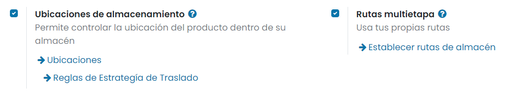
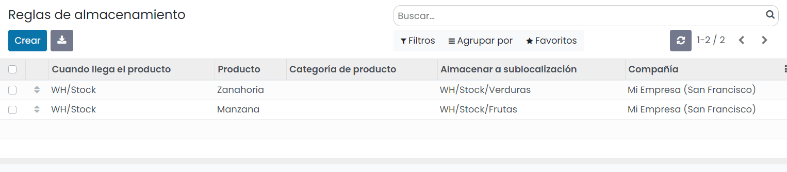
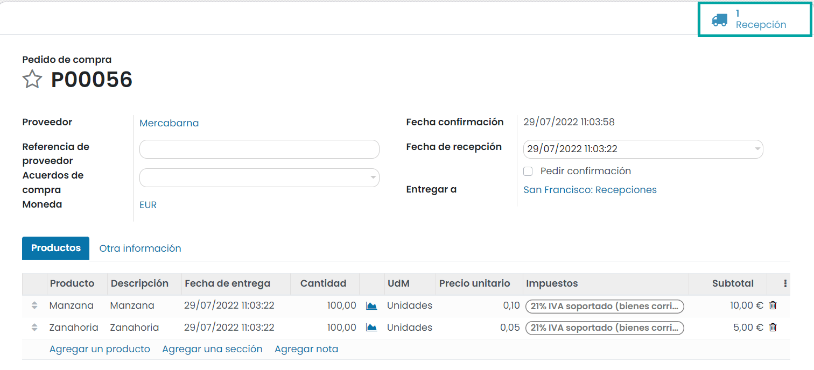
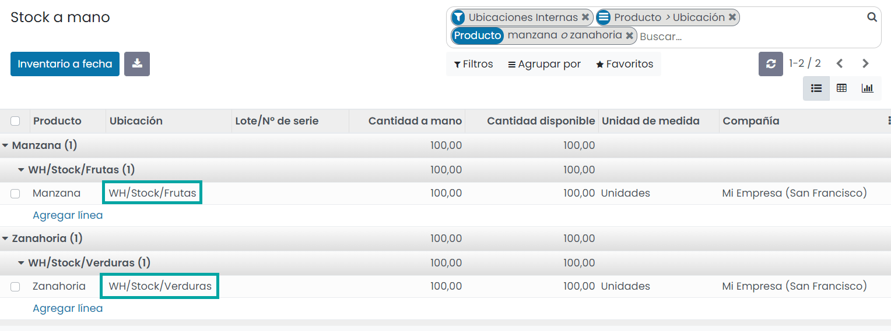

====================================
¿Qué es una regla de almacenamiento?
====================================

Una buena implementación de almacén se encarga de que los productos se muevan automáticamente a su ubicación de destino.
Para facilitar este proceso, Daeris usa reglas de almacenamiento. Pero, ¿qué es una regla de almacenamiento? El
almacenamiento es el proceso de tomar los productos recibidos y ponerlos directamente en la ubicación más adecuada.

Si, por ejemplo, un almacén contiene sustancias volátiles, es importante asegurarse de que ciertos productos no se
almacenen cerca debido a una potencial reacción química. Aquí es donde intervienen las reglas de almacenamiento, para
evitar almacenar productos erróneamente.

Configuración
-------------

Navega a la pantalla :menuselection:`Inventario --> Configuración --> Ajustes` y activa la opción de **Rutas multietapa**.
Ten en cuenta que al activar las rutas multietapa también se activarán las ubicaciones de almacén. Una vez marcada la
opción, pulsa el botón *Guardar* de la pantalla de ajustes.

Crear una regla de almacenamiento
---------------------------------

En algunos casos, como para una tienda minorista que almacena frutas y verduras, se deben almacenar productos en
distintas ubicaciones para mantener la calidad de los productos. Supongamos que hay una ubicación de almacén *WH/Stock*
y dos ubicaciones secundarias *WH/Stock/Verduras* y *WH/Stock/Frutas*.

Para gestionar dichas ubicaciones, crearemos reglas de almacenamiento. Para hacerlo, navega a la pantalla
:menuselection:`Inventario --> Configuración --> Reglas de almacenamiento`. Luego, haz clic en *Crear* y configura tu
primera regla que indica la ubicación principal a la que ingresará el producto antes de ser redirigido a la ubicación adecuada:

.. note::
   Las reglas de almacenamiento se pueden definir ya sea por producto o por categoría de producto.

Si le compras manzanas y zanahorias a tu proveedor, se agruparán en la misma recepción, pero se redirigirán a la ubicación
adecuada de forma automática gracias a las reglas de almacenamiento:

Esta información está disponible en el informe de inventario disponible desde la pantalla
:menuselection:`Inventario --> Informes --> Informe de inventario`:

