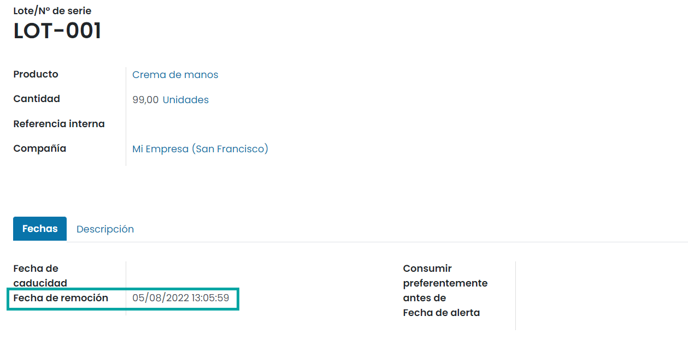

==============================
¿Qué es una regla de remoción?
==============================

Normalmente, las estrategias de remoción se definen en las operaciones de recepción para seleccionar los mejores
productos y así optimizar la distancia para el trabajador, con fines de control de calidad, o para mover primero los
productos con la fecha de caducidad más próxima.

Cuando se debe realizar un movimiento de producto, Daeris encuentra los productos disponibles que se pueden asignar a la
transferencia. La forma en la que Daeris asigna estos productos depende de la estrategia de remoción que se definió
en la categoría de producto o en la ubicación.

¿Cómo funciona?
===============

First In First Out (FIFO): Primero en entrar, primero en salir
--------------------------------------------------------------

Al usar la estrategia FIFO, la demanda de algunos productos activa una regla de remoción que solicita un traslado del
número de lote o de serie que ingresaste primero a tus existencias.

Para ser más claros, imagina que tienes tres lotes de clavos en tu almacén. Tienen los siguientes números de lote: 00001,
00002, 00003, cada uno tiene 5 cajas de clavos. 00001 ingresó al inventario el 23 de mayo, 00002 el 25 de mayo y 00003 el
1 de junio. Un cliente compra 6 cajas el 11 de junio. Con la estrategia FIFO, se solicita un traslado de cinco cajas de
00001 y una caja de 00002, porque 00001 ingresó a tus existencias antes que los demás. Se toma la caja de 00002 porque
tiene la fecha de ingreso más antigua después de 00001.

Así, para cada pedido de un producto con la estrategia FIFO, Daeris solicita un traslado de los bienes que llevan en tu
inventario la mayor cantidad de tiempo.

Last In First Out (LIFO): Último en entrar, primero en salir
------------------------------------------------------------

Al igual que para FIFO, la estrategia LIFO se basa en mover productos según la fecha en la que ingresaron a las existencias.
En este caso, la demanda de algunos productos activa una regla de remoción que solicita un traslado del último número
de lote o de serie que ingresó a tus existencias.

Para un mejor entendimiento, imagina que tienes tres lotes de tornillos en tu almacén. Tienen los siguientes números de
lote: 10001, 10002, 10003, cada uno con 10 cajas de tornillos. 10001 ingresó a las existencias el 1 de junio, 10002 el
3 de junio y 10003 el 6 de junio. Un cliente compra 7 cajas el 8 de junio. Con la estrategia LIFO, se solicita un traslado
de siete cajas de 10003 porque tiene la última fecha de ingreso a las existencias.

Básicamente, para cada pedido de un producto con la estrategia LIFO, se solicita un traslado para el último producto que
ingresó a tus existencias.

.. note::
   Esta estrategia está prohibida en muchos países y puede llevar a tener solo productos antiguos u obsoletos en tus
   existencias.

First Expiry First Out (FEFO): Primero en caducar, primero en salir
-------------------------------------------------------------------

La estrategia FEFO es un poco diferente de las dos anteriores. En este caso, lo importante es la fecha de caducidad y no
la fecha en la que el producto ingresó a las existencias.

Imagina tres lotes de cajas de 6 huevos. Tienen los siguientes números de lote: 20001, 20002, y 20003, cada uno con 5
cajas. 20001 ingresó a las existencias el 1 de julio y su fecha de caducidad es el 15 de julio, 20002 ingresó el 2 de
julio y su fecha de caducidad es el 14 de julio y 20003 ingresó el 4 de julio y su fecha de caducidad es el 21 de julio.
Un cliente compra 6 cajas el 5 de julio. Con la estrategia FEFO, se solicita un traslado de 5 cajas de 20002 y una de
20001. El traslado de todas las cajas del lote 20002 es porque tienen la fecha de caducidad más próxima. El traslado
también solicita una caja de 20001 porque tiene la fecha de caducidad más próxima después de 20002.

Recuerda que para cada pedido de un producto con la estrategia FEFO, se solicita un traslado para el producto que tiene
la fecha de caducidad más próxima a la fecha del pedido.

Uso de estrategias de remoción
==============================

Para usar las estrategias de remoción navega a la pantalla :menuselection:`Inventario --> Configuración --> Ajustes`. Luego
activa las funciones de **Ubicaciones de almacenamiento**, **Rutas multietapa** y **Lotes y números de serie**:

.. note::
   Para trabajar con la estrategia FEFO activa también la función de **Fechas de caducidad**.

Una vez hecho esto, pulsa el botón *Guardar* de la pantalla de ajustes.

A continuación, debes definir tu estrategia de remoción en las categorías de productos a través de la pantalla
:menuselection:`Inventario --> Configuración --> Categorías de producto`:

First In First Out (FIFO): Primero en entrar, primero en salir
--------------------------------------------------------------

Como se ha mencionado anteriormente, la estrategia FIFO implica que los productos almacenados primero son los primeros en
salir. Las empresas deben usar este método si venden productos con ciclos de demanda cortos, como ropa, y así garantizar
que no se quedarán con estilos anticuados en sus existencias.

Para este ejemplo, se crean tres lotes de camisas blancas. Son de la categoría de productos *Todos/Ropa*, donde se ha
establecido FIFO como su estrategia de remoción. Ahora es posible visualizar los tres lotes disponibles en la ubicación
de existencias (*WH/Stock*):

El lote 000001 contiene 5 camisas, 000002 contiene 3 camisas y 000003 contiene 2. Como se puede ver, 000001 ingresó a
las existencias primero. Creamos un pedido de venta de seis camisas blancas para verificar que los productos de ese lote
son los primeros en salir.

En el pedido de venta vinculado a la recolección puedes ver que se reservaron los números de lote más antiguos gracias
a la estrategia FIFO:

Last In First Out (LIFO): Último en entrar, primero en salir
------------------------------------------------------------

La estrategia LIFO es lo contrario que FIFO. De hecho, los productos que ingresaron los últimos, son los primeros en salir.
Se utiliza principalmente con productos sin vida útil.

A pesar de que las camisas blancas del ejemplo anterior son ropa, se puede decir que son atemporales. Así que se pueden
usar para probar la estrategia LIFO. Una vez más, abre la categoría de producto en :menuselection:`Inventario --> Configuración --> Categorías de producto`
y cambia la estrategia de remoción a LIFO:

Ahora, crea un pedido de venta para 4 camisas:

Al validar la transferencia de inventario, se puede observar que se reservan productos de los lotes 000003 y 000002, en
ese orden:

.. important::
   ¡Recuerda que la estrategia LIFO está prohibida en muchos países!

First Expiry First Out (FEFO): Primero en caducar, primero en salir
-------------------------------------------------------------------

Con la estrategia FEFO, los productos no se recolectan según su fecha de recepción. En este caso, se envían según su
fecha de caducidad.

.. note::
   Para obtener más información sobre fechas de caducidad, consulta la
   :ref:`documentación relacionada <inventario_y_fabricacion/inventario/fechas_caducidad>`.

Al activar las fechas de caducidad en los ajustes de inventario es posible definir distintas fechas en el número de
serie o de lote que se usaran en FEFO. Se pueden establecer estas fechas en :menuselection:`Inventario --> Productos --> Lotes/Números de serie`:

.. note::
   Para poder establecer la fecha de remoción del lote o número de serie, es necesario que el producto tenga activa la
   marca de **Fecha de caducidad** en la pestaña de *Inventario* del formulario del producto.

Los lotes se recolectan según la fecha de remoción, de la más antigua a la más reciente. Los lotes sin fecha de
remoción definida se recolectan después de los lotes con fecha de remoción.

.. note::
   Las otras fechas solo son para fines informativos y de reportes. ¡Los lotes con fechas de caducidad pasadas se
   pueden recolectar para órdenes de entrega si no se remueven de las existencias!

Para usar la estrategia FEFO navega a la pantalla :menuselection:`Inventario --> Configuración --> Categorías de producto`
y cambia la estrategia de remoción a FEFO:

En este caso en específico, usamos el producto de crema para manos, donde tenemos dos lotes:

+-----------------------+---------------+-----------------------+
| **Lote / No Serie**   | **Producto**  | **Fecha caducidad**   |
+=======================+===============+=======================+
| LOT-001               | Crema manos   | 05/08/2022            |
+-----------------------+---------------+-----------------------+
| LOT-002               | Crema manos   | 12/08/2022            |
+-----------------------+---------------+-----------------------+

Cuando hacemos una venta de 25 unidades de crema para manos se puede ver que los números de lote que Daeris reservó
automáticamente son los que tienen la fecha de caducidad más cercana: LOT-001:

.. image:: remocion/reglas-remocion-10.png
   :align: center
   :alt: Reglas de remoción (10)