:show-content:

=============
Mantenimiento
=============

Muchas de las empresas que fabrican productos u ofrecen servicios, disponen de maquinaria industrial y equipos informáticos
que deben disponer de un mantenimiento adecuado para evitar incidencias que pueden afectar gravemente a la productividad y
calidad del producto final. Realizar procesos de mantenimiento sobre los recursos y activos de las empresas que lo requieran,
alarga su vida útil y evita problemas inesperados.

Desde la aplicación de mantenimiento de Daeris es posible gestionar el mantenimiento de los equipos, realizar el
seguimiento, calcular estadísticas, etc.

.. youtube:: 2UuR426_1Qw
    :align: right
    :width: 700
    :height: 394

Configuración
=============

.. _inventario_y_fabricacion/mantenimiento/configurar_equipos:

Configurar equipos de mantenimiento
-----------------------------------

Los equipos de mantenimiento agrupan usuarios con acceso a la aplicación de mantenimiento. Cada equipo puede disponer de
múltiples miembros y un miembro puede estar asociado a varios equipos. A estos equipos se les pueden asociar mantenimientos
sobre cada equipamiento, permitiendo distribuir las tareas entre todos los integrantes del equipo.

Para crear o editar los equipos de mantenimiento, navega a la pantalla :menuselection:`Mantenimiento --> Configuración --> Equipos de mantenimiento`.
Desde el listado es posible visualizar los equipos y los miembros asociados a cada uno de ellos:

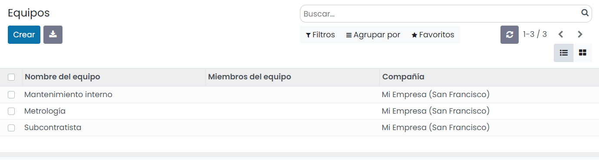

Para crear un nuevo equipo haz clic sobre el botón *Crear* e informa sobre el nombre del equipo, un nombre descriptivo.
En el campo *Miembros del equipo*, debes seleccionar los usuarios que integrarán el grupo.

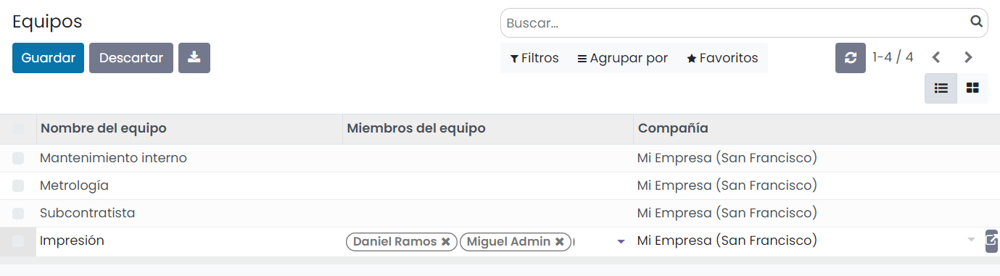

Por último, haz clic sobre el botón *Guardar*.

.. _inventario_y_fabricacion/mantenimiento/configurar_categorias:

Configurar categorías de equipamiento
-------------------------------------

Las categorías de equipamientos permiten agrupar el equipamiento de una empresa. En función de las actividades de la
empresa se pueden disponer de distintas categorías de equipamiento, como por ejemplo:

-  Maquina industrial

-  Mobiliario de oficina

-  Equipos informáticos

-  Telefonía

-  Herramientas especificas asociadas a la actividad de la empresa

-  Programas informáticos

Para crear una nueva categoría de equipamiento navega a la pantalla :menuselection:`Mantenimiento --> Configuración --> Categorías de equipamiento`.
Desde el listado es posible visualizar todas las categorías así como su responsable asociado:

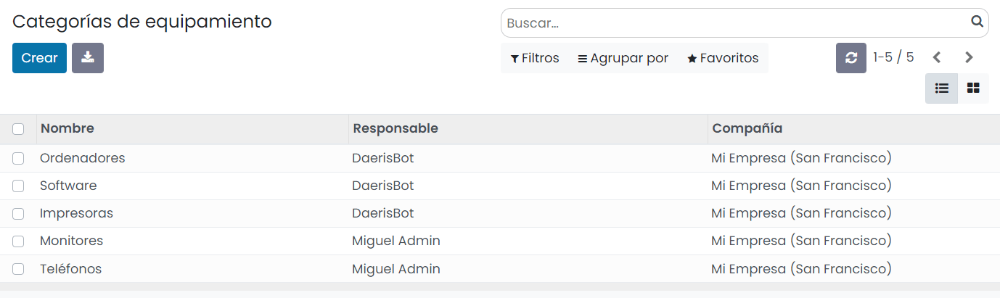

Para crear una nueva categoría haz clic sobre el botón *Crear*. Al acceder a la pantalla de formulario es posible informar
un nombre de categoría, un responsable, un alias de correo y comentarios. Además, el formulario incorpora dos botones
inteligentes para acceder a los equipamientos asociados a la categoría y a las peticiones de mantenimiento de la categoría:

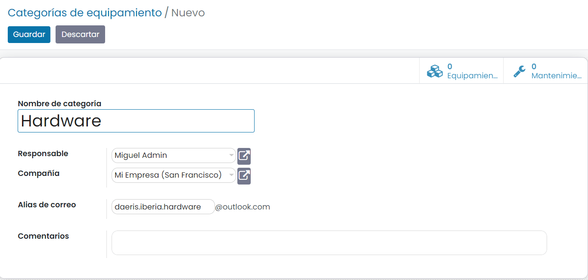

.. note::
   En el caso de haber configurado un alias de correo, será posible dar de alta nuevas peticiones de mantenimiento enviando
   un correo al alias especificado en la categoría. Dichas peticiones serán de tipo correctivo y estarán asociadas al
   responsable de la categoría.

.. seealso::
   * :doc:`../varios/correo_electronico/recibir_correos`

.. _inventario_y_fabricacion/mantenimiento/gestión_equipamiento:

Gestión del equipamiento
========================

El equipamiento de una empresa se compone de todos los instrumentos de los que se sirve para poder realizar las tareas
relacionadas con sus funciones. En función de las actividades de la empresa se pueden disponer de distintas categorías
de equipamiento, como por ejemplo:

-  Maquina industrial

-  Mobiliario de oficina

-  Equipos informáticos

-  Telefonía

-  Herramientas especificas asociadas a la actividad de la empresa

-  Programas informáticos

Para poder realizar el mantenimiento del equipamiento de una empresa es necesario darlo de alta en una aplicación que
permita su gestión. Para visualizar los registros de equipamiento navega a la pantalla :menuselection:`Mantenimiento --> Equipamientos`:

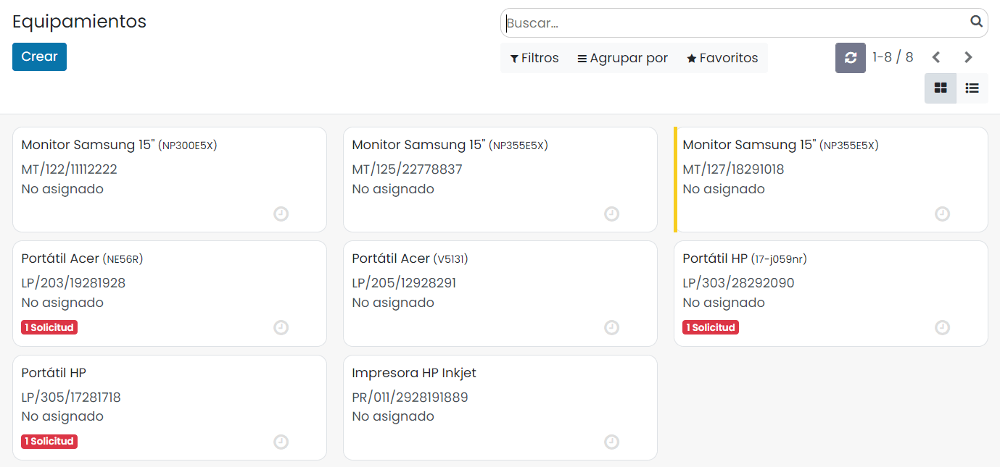

Desde esta pantalla es posible visualizar todas las herramientas, maquinaria, o equipos informáticos, dados de alta en el
sistema. Sobre cada ficha se visualiza el nombre del equipamiento, así como su numero de série, responsable, solicitudes
de mantenimiento asociadas y fecha de asignación. También es posible filtrar y agrupar los registros mediante los botones
de filtrado y agrupación.

Para dar de alta un nuevo equipamiento haz clic sobre el botón *Crear*. La aplicación navega al formulario de edición del
registro de equipamiento desde donde es posible informar:

-  El nombre del equipamiento.

-  La categoría asociada al equipamiento.

-  La compañía asociada al equipamiento.

-  El modo de uso del equipamiento, pudiendo seleccionar entre:

   -  *Departamento*, en el caso de que sea de uso compartido. En este caso se mostrará el campo *Departamento* para poder
      seleccionarlo.

   -  *Empleado*, en el caso de que sea un único usuario el que utilice el equipamiento. En este caso se mostrará el campo
      *Empleado*, desde donde poder seleccionarlo.

   -  *Otro*, en el caso de que el uso no se corresponda en exclusiva a un empleado o un departamento. En este caso será
      posible seleccionar *Empleado* y *Departamento*.

-  El equipo de mantenimiento que dará soporte al equipamiento y el técnico.

-  La ubicación donde se encuentra el equipamiento.

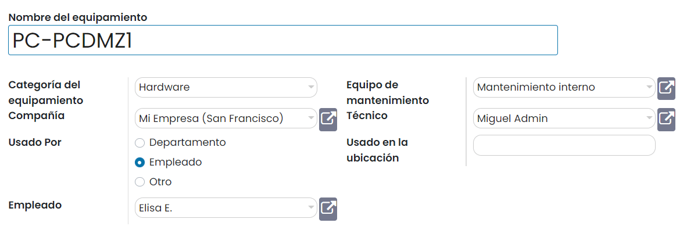

Bajo la pestaña **Descripción** es posible incorporar toda la información relevante del equipamiento:

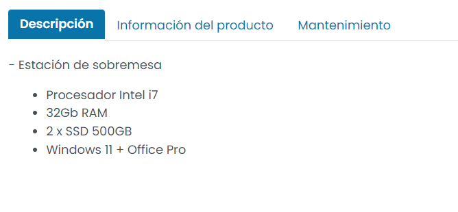

En la pestaña **Información del producto** es posible informar:

-  El nombre del proveedor del producto, así como su código de referencia, modelo y número de serie.

-  La fecha de alta del producto.

-  El coste total

-  La fecha de vencimiento de la garantía. Este campo es importante para poder hacer uso de la garantía en el caso de
   posibles incidencias.

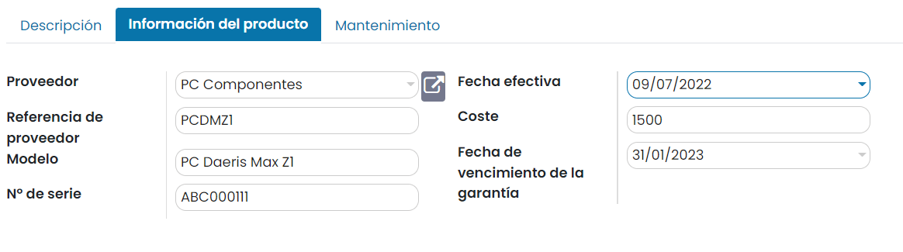

En la pestaña **Mantenimiento** es posible informar la frecuencia del mantenimiento preventivo y la duración de la tarea
de realizar el mantenimiento preventivo:

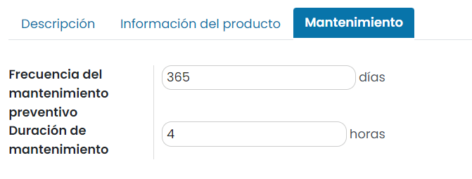

.. note::
   Si se informan las fechas de mantenimiento preventivo, el sistema se ocupará de planificar las tareas, incorporando
   una notificación sobre el historial de notificaciones.

Al finalizar la edición de equipamiento es necesario hacer clic sobre el botón *Guardar*.

Gestión del mantenimiento
=========================

Distribución y consulta de las peticiones de mantenimiento
----------------------------------------------------------

Para consultar las peticiones de mantenimiento agrupadas por equipos de mantenimiento navega a la pantalla
:menuselection:`Mantenimiento --> Tablero`. En esta pantalla se visualizan los distintos equipos de mantenimiento y el
número de peticiones pendientes de realizar, así como las no programadas:

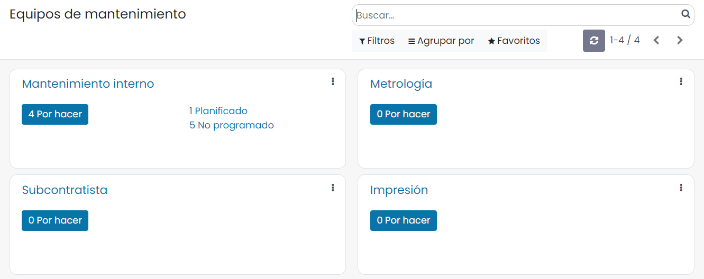

Mediante el botón de peticiones **Por hacer**, se accede a la pantalla kanban de peticiones de mantenimiento pendientes
de realizar del equipo:

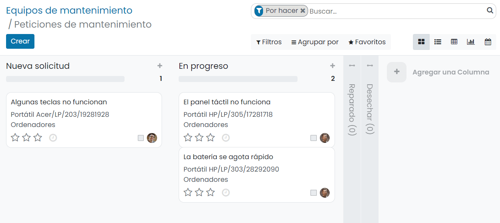

Mediante el botón de tareas planificadas es posible acceder al calendario de las actividades programadas:

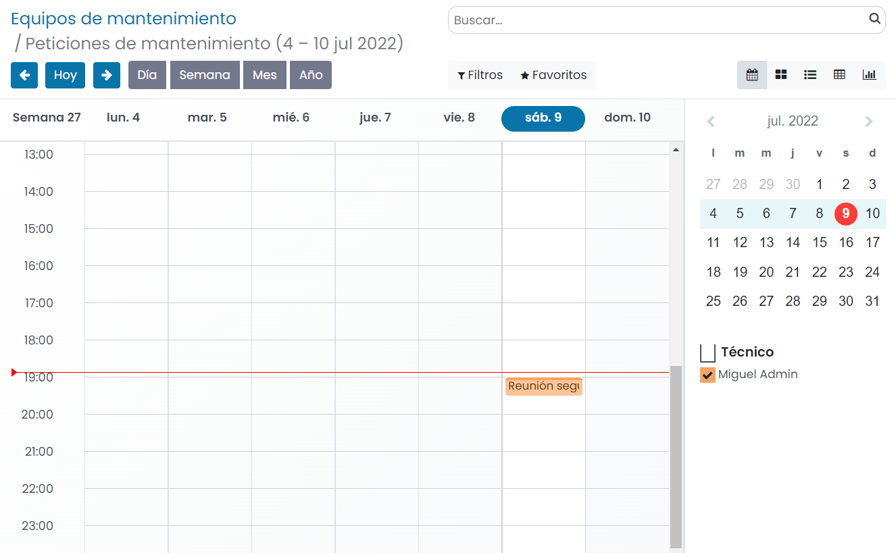

Mediante el botón (tres puntos) de la parte superior derecha de la ficha kanban es posible acceder a la pantalla de
peticiones de mantenimiento filtrado por equipo y estado (todos, por hacer, en progreso, hecho). También es posible
acceder al informe gráfico de solicitudes de mantenimiento, así como a la pantalla de configuración del equipo:

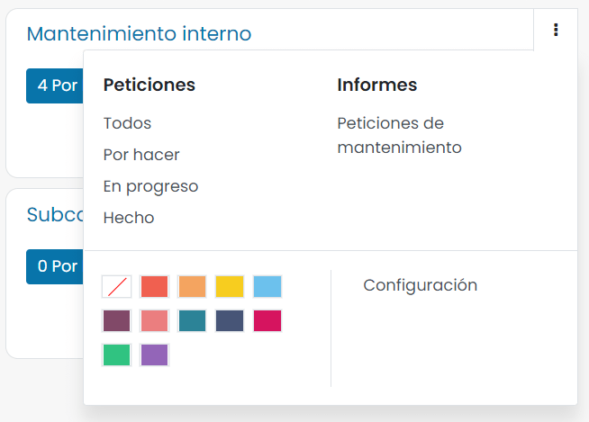

Gestionar las peticiones de mantenimiento
-----------------------------------------

Para gestionar las solicitudes de mantenimiento navega a la pantalla :menuselection:`Mantenimiento --> Mantenimiento --> Peticiones de mantenimiento`:

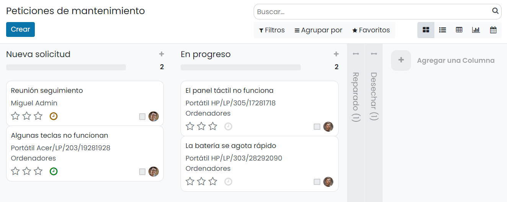

Desde la pantalla kanban es posible visualizar todas las peticiones de mantenimiento agrupadas por etapas y es posible
filtrar y agrupar por diversos campos. También es posible modificar el formato de visualización pudiendo seleccionar entre
kanban, lista, pivote, gráfico y calendario:

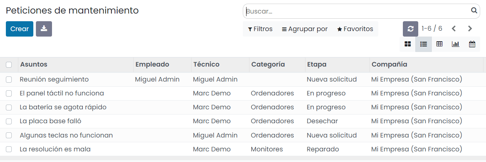

Para crear una nueva solicitud de mantenimiento haz clic sobre el botón *Crear*. Esta acción muestra la pantalla de
detalle de la solicitud, desde donde es posible informar:

-  El texto descriptivo de la solicitud. En las solicitudes de mantenimiento preventivo generadas automáticamente se
   informa con el literal *Mantenimiento preventivo* más el nombre del equipamiento.

-  El creador de la solicitud.

-  El equipamiento que requiere mantenimiento.

-  La fecha de alta de la solicitud.

-  El tipo de mantenimiento, pudiendo seleccionar entre *Preventivo*, para aquellas peticiones de mantenimiento de
   equipamientos cuyo estado es óptimo y *Correctivo* para aquellos equipamientos que sufren alguna incidencia.

-  El equipo que debe atender la petición.

-  El responsable de atender la petición.

-  La fecha prevista en la que se atenderá la petición.

-  La duración planificada en horas que se estima de las acciones que se deben realizar para realizar el mantenimiento.

-  La prioridad de la petición, cuya función es la de anteponer las peticiones más urgentes.

-  La compañía asociada a la petición.

-  La descripción, que permite introducir detalles sobre la petición.

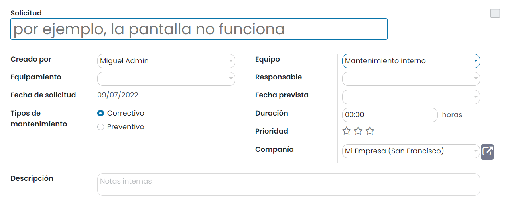

Al finalizar la edición de la solicitud es necesario guardar los cambios mediante el botón *Guardar*.

La solicitud dispondrá de estado *Nueva solicitud*:

Cuando el responsable de atenderla comience a realizar las tareas de mantenimiento deberá cambiar el estado a *En progreso*
haciendo clic sobre la barra de estados:

Una vez finalizadas las tareas de mantenimiento será necesario cambiar el estado a *Reparado* en el caso de que se haya
podido realizar el mantenimiento o *Desechar* en el caso de que el equipamiento se haya tenido que dar de baja debido a
que no se ha podido corregir el problema:

Consultar el calendario de mantenimiento
----------------------------------------

Para consultar las solicitudes de mantenimiento desde el calendario, navega a la pantalla
:menuselection:`Mantenimiento --> Mantenimiento --> Calendario de Mantenimiento`:

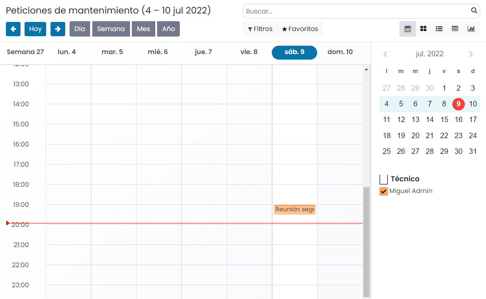

Desde esta pantalla es posible visualizar la vista de calendario de todas las peticiones de mantenimiento, pudiendo
seleccionar el modo de visualización del calendario de días, meses, o años.

Al hacer clic sobre una petición de mantenimiento es posible visualizar su descripción, el tiempo de reparación, el tipo
de mantenimiento, el técnico y la prioridad:

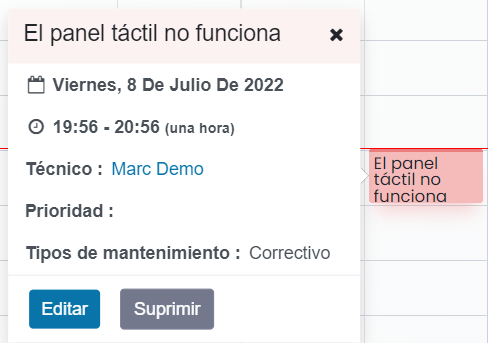

Al hacer clic sobre una franja del calendario es posible crear una nueva petición de mantenimiento mediante el desplegable
*Nuevo evento* sobre el que se debe informar el asunto. Posteriormente se puede crear la petición mediante el botón *Crear*
o editarla mediante el botón *Editar* para acabar de cumplimentar sus detalles sobre el formulario de la petición:

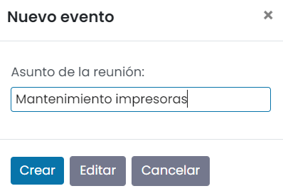

Informes
========

Para analizar los datos de las peticiones de mantenimiento navega a la pantalla :menuselection:`Mantenimiento --> Informes --> Peticiones de mantenimiento`.
Desde esta pantalla es posible visualizar las peticiones de mantenimiento en formato gráfico. Inicialmente se muestra un
gráfico de barras, el número de peticiones agrupado por técnico y estado, y es posible filtrar y agrupar usando los botones
correspondientes:

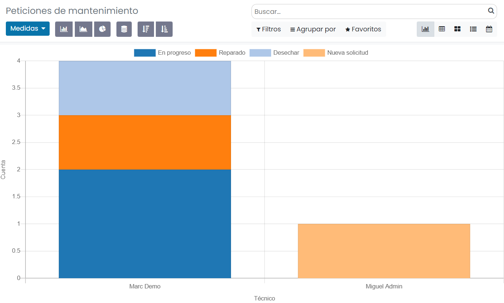

Mediante los botones de tipo de gráfico es posible cambiar la forma de visualizar los datos, pudiendo seleccionar entre
el gráfico de barras, de líneas y circular:

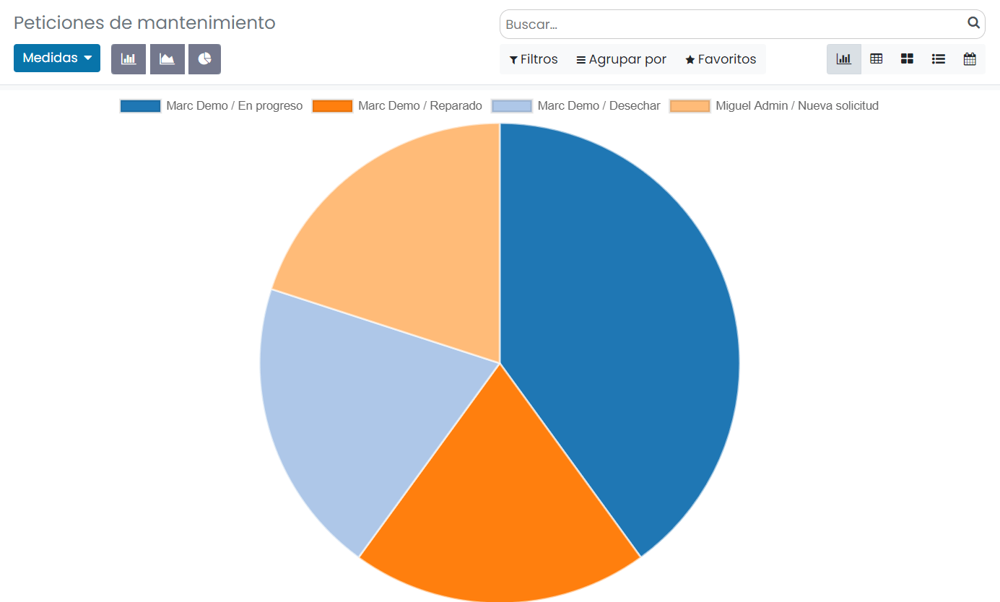