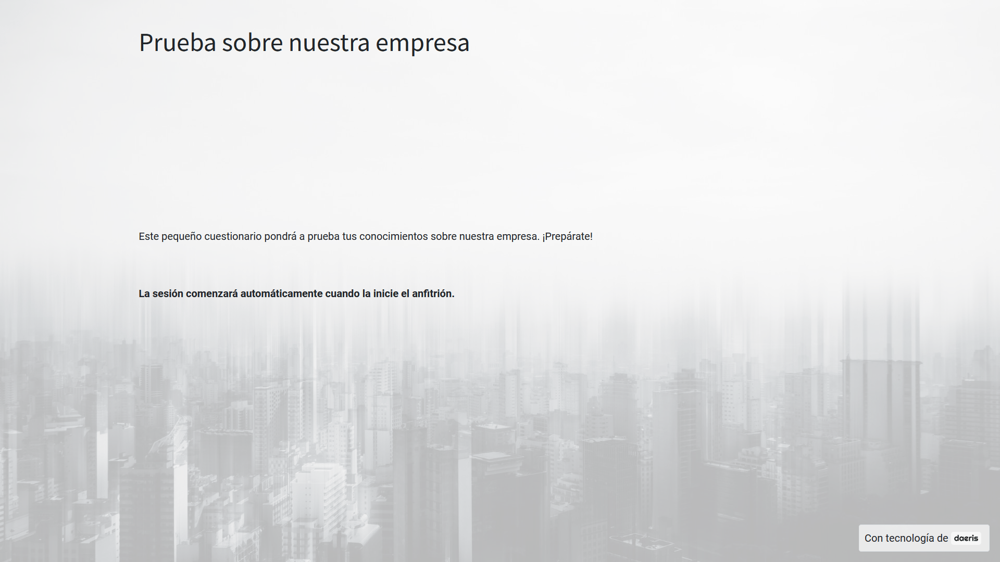

:show-content:

=========
Encuestas
=========

Obtener respuestas a determinadas consultas es muy importante a la hora de tomar decisiones sobre nuestro negocio. Obtener el punto de vista de los clientes y clientes potenciales es básico para no errar en la toma de decisiones. Las encuestas ayudan a obtener toda esta información.

Daeris dispone de una aplicación de encuestas la cual permite hacer multitud de preguntas de diferentes temáticas, así como incluir respuestas en distintos formatos.

Gracias a la aplicación de encuestas, es posible obtener y analizar, toda la información que necesites de tus clientes y clientes potenciales.

.. youtube:: KtmKa6AZ310
    :align: right
    :width: 700
    :height: 394

Crear encuestas
===================

Para crear una encuesta navega a la pantalla :menuselection:`Encuestas --> Encuestas` y haz clic sobre el botón *Crear*.

El sistema navega al formulario de edición desde donde es posible informar los siguientes campos:

- **Título de la encuesta**: Se recomienda incorporar un texto breve y descriptivo.
- **Responsable**: Usuario gestor de la encuesta.
- **Imagen**: Imagen descriptiva del contenido de la encuesta. Esta imagen se muestra como fondo de pantalla cuando se realiza la encuesta. Se recomienda una imagen en formato JPG o PNG de calidad media de un tamaño de 1920 x 1200.

Mediante el enlace *Añadir una sección* puedes incorporar secciones para agrupar las preguntas por diferentes temáticas.

Mediante el enlace *Añade una pregunta* puedes incorporar las preguntas y respuestas que compondrán tu encuesta.

Al pulsar el enlace se muestra el formulario para generar las preguntas.

Sobre el campo **pregunta** se ha de realizar la consulta de la forma más clara y concisa posible.

Sobre el campo **tipo de pregunta** se ha de seleccionar una opción que se relaciona directamente con la forma de responderla.
Es posible seleccionar una de las siguientes opciones:

- **Cuadro de texto múltiples líneas**: El cliente dispone de un recuadro donde incorporar un texto amplio.
- **Única línea de texto**: El cliente solo dispone de una línea de texto para responder. Dispone de las siguientes opciones de respuesta:

    - **La entrada debe ser un correo electrónico**: Permite validar que la respuesta proporcionada tenga formato de correo electrónico.
    - **Guardar como correo electrónico de usuario**: En el caso de seleccionar la opción anterior, se habilita la opción que permite guardar la respuesta como correo del usuario.
    - **Guardar como apodo de usuario**: Permite guardar el apodo del usuario que realiza la encuesta.
    - **Validar entrada**: Permite validar el tamaño mínimo y máximo de la cadena de texto introducida.

- **Valor numérico**: El cliente solo puede responder incorporando un número. Dispone de las siguientes opciones de respuesta:

    - **Validar entrada**: Permite validar que el cliente no incorpora un número superior ni inferior a los indicados.
    - **Respuesta correcta**: Permite indicar el número correcto. Si no se incorpora este número en la respuesta se dará como fallida.
    - **Puntuados**: Permite incluir la pregunta como parte de la puntuación del cuestionario.
    - **Puntuación**: Permite incorporar el valor de la puntuación a la respuesta correcta.

.. image:: encuestas/opciones_respuestas2.png
   :align: center
   :alt: Opciones de respuesta para Valor numérico.

- **Fecha**: El cliente solo puede responder incorporando una fecha. Dispone de las siguientes opciones de respuesta:

    - **Validar entrada**: Permite validar que el cliente no incorpora una fecha superior ni inferior a los indicados.
    - **Respuesta correcta**: Permite indicar la fecha correcta. Si no se incorpora este número en la respuesta se dará como fallida.
    - **Puntuados**: Permite incluir la pregunta como parte de la puntuación del cuestionario.
    - **Puntuación**: Permite incorporar el valor de la puntuación a la respuesta correcta.

- **Fecha y hora**:  El cliente solo puede responder incorporando una fecha y hora. Dispone de las siguientes opciones de respuesta:

    - **Validar entrada**: Permite validar que el cliente no incorpora una fecha y hora superior ni inferior a los indicados.
    - **Respuesta correcta**: Permite indicar la fecha y hora correcta. Si no se incorpora este número en la respuesta se dará como fallida.
    - **Puntuados**: Permite incluir la pregunta como parte de la puntuación del cuestionario.
    - **Puntuación**: Permite incorporar el valor de la puntuación a la respuesta correcta.

- **Elección múltiple: sólo una respuesta**: El cliente solo puede responder seleccionando una de las posibles respuestas. Mediante la pestaña de respuestas es posible incorporar tantas respuestas como posibilidades se quieran ofrecer al cliente. Es posible incluir puntuación a cada posible respuesta.

.. image:: encuestas/opciones_respuestas5.png
   :align: center
   :alt: Opciones de respuesta para Elección múltiple: sólo una respuesta.

- **Elección múltiple: respuestas múltiples permitidas**: El cliente puede responder seleccionando varias de las posibles respuestas. Mediante la pestaña de respuestas es posible incorporar tantas respuestas como posibilidades se quieran ofrecer al cliente. Es posible incluir puntuación a cada posible respuesta.

- **Matriz**: Permite crear una tabla matriz de posibles respuestas a seleccionar por el cliente. Bajo la pestaña de respuestas puedes incorporar como opciones, las columnas de la matriz, y como filas, las filas de la matriz.

.. image:: encuestas/opciones_respuestas7.png
   :align: center
   :alt: Opciones de respuesta para Matriz.

Sobre la pestaña *Descripción* es posible incorporar explicaciones adicionales sobre la pregunta o ilustrarla con imágenes o videos.

Sobre la pestaña *Opciones* es posible incorporar las siguientes:

- **Respuesta obligatoria**: Obliga al usuario a responder la pregunta. Es posible incorporar un mensaje de error personalizado.

- **Tipo de Matriz**: Permite seleccionar una o varias opciones por fila. Sólo disponible para respuesta de tipo matriz.

- **Imagenes sobre respuestas**: Permite enriquecer cada una de las respuestas con imágenes. Solo permitido para respuestas de tipo *selección múltiple*.

- **Visualización condicional**: Muestra la pregunta, después de responder la pregunta desencadenante.

- **Mostrar campo de comentarios**: Permite introducir un campo donde el cliente puede comentar la respuesta, e incluso usar dicho comentario como respuesta.

- **Límite de tiempo**: Permite fijar un máximo de segundos para responder. Esta opción solo está disponible para las sesiones en vivo.

Una vez creadas las preguntas de la encuesta, es necesario hacer clic sobre el botón *Guardar y cerrar* ,acción que te vuelve a posicionar sobre el formulario de la encuesta.

Bajo la pestaña *Descripción* de la encuesta, es posible informar el texto que se mostrará al iniciarla. Es recomendable incorporar información relevante sobre la encuesta, así como las pautas que se deben seguir.

Bajo la pestaña *Mensaje final* de la encuesta, es posible informar el texto que se mostrará al finalizarla. En él, se puede incorporar un mensaje de agradecimiento.

Desde la pestaña *opciones* de la encuesta, puedes informar varios parámetros de configuración.
Sobre el apartado *Cuestionario* podemos informar los siguientes campos:

- **Diseño**: Permite mostrar una página con todas las preguntas, una página por sección o una página por pregunta.
- **Modo de progresión**: Si seleccionamos *Número* se mostrará el número de preguntas respondidas sobre el número total de preguntas por responder. Si se selecciona *porcentaje* mostrará la media de preguntas respondidas.
- **Límite de tiempo**: Al informar esta opción, incorporamos un tiempo máximo para realizar la encuesta.
- **Selección**: Si seleccionamos *Aleatorizado por sección* es posible indicar el número de preguntas aleatorias por sección. Este modo no aplica en las sesiones en vivo.
- **Botón de retroceso**: Esta opción permite a los usuarios volver a las páginas anteriores.

Sobre el apartado *Candidatos* podemos informar los siguientes campos:

- **Modo de acceso**: Esta opción permite dar acceso a la encuesta a cualquier persona que disponga del enlace o solamente a aquellos usuarios invitados a realizarla.
- **Necesario iniciar sesión**: Si esta informado, los usuarios deben iniciar sesión, incluso si disponen de un enlace válido.
- **Límite de intentos**: Informando esta opción es posible limitar el número de veces que puede realizar un usuario la encuesta.

Sobre el apartado *Puntuación* podemos informar los siguientes campos:

- **Puntuación**: Esta opción permite indicar si queremos mostrar la puntuación obtenida a los asistentes tras finalizar la encuesta, así como mostrar las respuestas.
- **% de Éxito**: Porcentaje de preguntas respondidas correctamente para aprobar la encuesta.
- **Es una certificación**: Indicador requerido para tratar la encuesta como una certificación.
- **Plantilla de correo electrónico**: Plantilla de correo que se envía a los usuarios cuando logran la certificación. Anexo, contiene el documento que acredita su certificación.
- **Plantilla de certificación**: Plantilla del documento que acredita la certificación. Es posible seleccionar entre varios modelos, así como previsualizarlos mediante el botón *previsualizar*.
- **Dar medalla**: Mediante esta opción otorgamos una medalla al usuario que logra la certificación. Esta medalla se añade al conjunto de medallas que el usuario dispone en su perfil. Solo está disponible si la encuesta es una certificación y requiere autentificación.
- **Medalla de certificación**: Medalla que acredita la certificación. Mediante el asistente de creación es posible indicar el nombre, el mensaje que enviamos al usuario tras recibir la medalla, una imagen descriptiva, así como el nivel.

Sobre el apartado *Sesión en vivo* podemos informar los siguientes campos:

- **Recompensa las respuestas rápidas**: Mediante esta opción se recompensa a los usuarios si responden rápidamente a las preguntas.
- **Código de sesión**: Código que el usuario ha de introducir para iniciar la encuesta. Es posible incorporar cualquier texto y recomendado cambiarlo para cada encuesta.

Una vez completados los campos necesarios, pulsa el botón *Guardar*.

Probar encuestas
====================

Para validar que una encuesta se ha definido correctamente, es necesario acceder al formulario de detalle de la encuesta y pulsar
el botón *Prueba*.

Al pulsar el botón prueba, se abre una nueva pestaña sobre el sitio web, permitiéndote completar una encuesta en modo de prueba.
Sobre la parte superior aparece un mensaje indicando que la encuesta es una prueba.
Además, aparece la descripción de la encuesta, así como el botón *Iniciar encuesta*. Como fondo de la página aparece la imagen de la encuesta.

Al hacer clic sobre el botón *Iniciar encuesta* o presionando la tecla *Intro* es posible iniciar la primera pregunta de la encuesta.

.. image:: encuestas/encuestas_siguiente1.png
   :align: center
   :alt: Pregunta de una encuesta

Mediante el botón *Siguiente* es posible ir avanzando sobre las preguntas de la encuesta.

Al finalizar la encuesta aparecerá el mensaje final, así como distintas opciones en función de la configuración que se haya realizado.
Puedes volver al formulario de detalle de la encuesta pulsando el botón *Esta es una encuesta de prueba. Editar encuesta*.

En el caso de que desees borrar los datos de prueba que se hayan introducido en el sistema a la hora de realizar la prueba, debes navegar al formulario de detalle de la encuesta
y hacer clic sobre el menú **acción**, seleccionando la opción **Encuesta: Borrar respuestas de prueba**.

.. image:: encuestas/borrar_encuesta.png
   :align: center
   :alt: Borrar datos de prueba de una encuesta

Compartir encuestas
====================

Para **compartir** una encuesta, navega a la pantalla :menuselection:`Encuestas --> Encuestas` y haz clic sobre la encuesta
que deseas compartir.

Sobre el formulario de detalle de la encuesta, haz clic sobre el botón *Compartir*.

El sistema muestra una nueva ventana, desde donde es posible compartir un enlace público web de la encuesta y enviarlo por correo electrónico a una lista de contactos o direcciones de correo.
Esta opción permite múltiples respuestas por destinatario (en este caso, la opción de la encuesta Se requiere iniciar sesión debe estar inactiva).

Una vez tu audiencia haya recibido el correo, dispondrá de acceso haciendo clic sobre el botón *Iniciar encuesta*.

Al pulsar sobre el enlace, se mostrará la pantalla de inicio de la encuesta. Los usuarios podrán iniciar la encuesta mediante el botón *Iniciar encuesta*.

Una vez completadas las preguntas, y enviada la encuesta, el sistema almacenará los resultados para que puedan ser analizadas las respuestas.

Analizar resultados
====================

Para **Ver los resultados** de una encuesta, navega a la pantalla :menuselection:`Encuestas --> Encuestas` y haz clic sobre la encuesta
que deseas analizar.  Posteriormente, haz clic sobre el botón *Ver resultados*.

A continuación, el sistema mostrará un informe con los resultados de la encuesta, con el objetivo de que puedas realizar el análisis correspondiente.

Encuestas interactivas
======================

Las encuestas interactivas o sesiones en vivo, permiten realizar encuestas a varios participantes en un mismo momento, siendo controlados en todo momento por un administrador.

Para **Crear una sesión en vivo** de una encuesta, navega a la pantalla :menuselection:`Encuestas --> Encuestas` y haz clic sobre la encuesta
que deseas iniciar.  Posteriormente, haz clic sobre el botón *Crear sesión en vivo*.

La aplicación navega a una nueva página donde se encuentra el enlace para compartir con los participantes.
Mediante el botón *copiar*, es posible copiar el enlace que, se deberá compartir con los participantes.

Cuando un participante hace clic sobre el enlace, se abre la pantalla de inicio de encuesta y se le indica que se mantenga
a la espera hasta que el anfitrión inicie la sesión.

El administrador (anfitrión), puede iniciar la encuesta haciendo clic sobre el botón que aparece a la derecha de la página.

Cuando el anfitrión inicia la primera pregunta, se mantiene a la espera de que respondan los asistentes.

La página de los asistentes se actualiza con la primera pregunta

Cuando el asistente responde la primera pregunta, se mantiene a la espera de que el anfitrión inicie la segunda pregunta.

Cuando los asistentes han respondido a la pregunta, el anfitrión puede pasar a la segunda pregunta haciendo clic sobre el botón derecho.

El anfitrión, visualiza las respuestas respondidas por los asistentes.

Este comportamiento entre anfitrión y asistentes, se repite pregunta a pregunta hasta completar la encuesta.
Al finalizar la encuesta, el anfitrión visualiza los resultados.

Si el anfitrión quiere visualizar los detalles de los resultados debe hacer clic sobre el botón **resultados**. De otro modo, debe hacer clic sobre el botón **Cerrar**.

Cuando el anfitrión visualiza los resultados o cierra la encuesta, el asistente también visualiza su puntuación y le aparece un enlace para
visualizar sus resultados.

