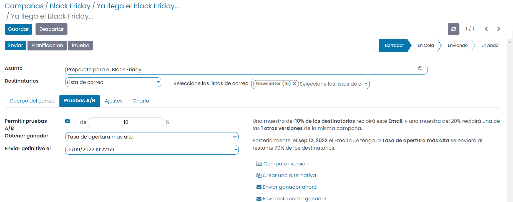
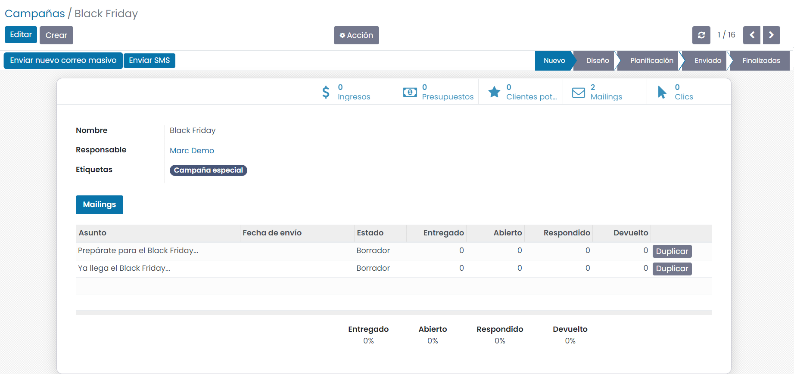
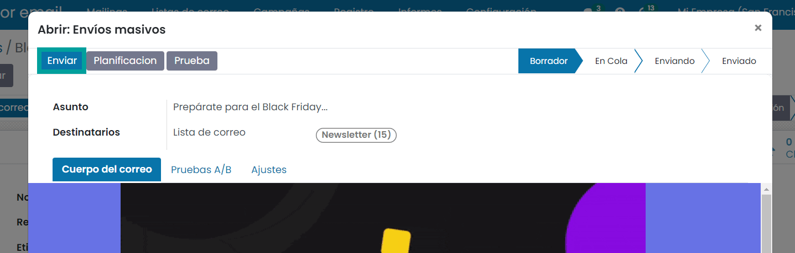
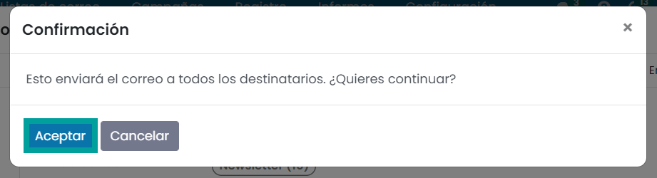
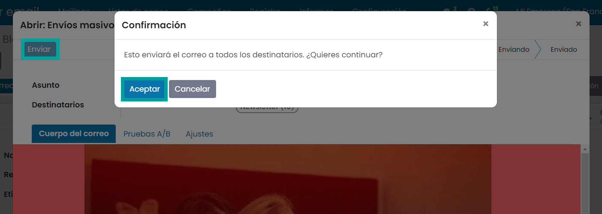
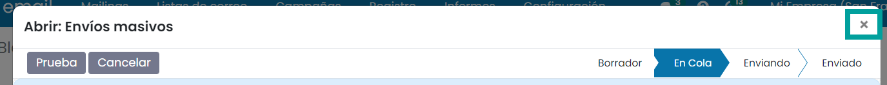

=========
Campañas
=========

Crear etapas
====================

Para gestionar con etapas las campañas de marketing, debes navegar a la pantalla
:menuselection:`Marketing por email --> Configuración --> Ajustes`, y activar la opción **Campañas de correo**.

Una vez marcada la opción, debes guardar los ajustes mediante el botón **Guardar**.

El sistema añade una nueva sección de **Campañas** dentro del módulo de marketing, que permite agrupar varios mailings
y SMS de Marketing dentro de una campaña, además de gestionar las propias campañas en diferentes etapas y realizar su seguimiento.

Inicialmente el sistema solo dispone de una etapa configurada. Si deseas incorporar nuevas etapas para gestionar
tus compañas navega a la pantalla :menuselection:`Marketing por email --> Configuración --> Etapas` e informa las
etapas en función de tus necesidades.

.. tip::
   Mediante el icono que aparece junto al nombre de la etapa, puedes arrastrar la etapa a la posición deseada para incorporar el orden de visualización.

Las etapas te permitirán agrupar tus campañas según las necesidades de tu negocio.

Crear una campaña
====================

Para activar el uso de las campañas de marketing, debes navegar a la pantalla
:menuselection:`Marketing por email --> Configuración --> Ajustes`, y activar la opción **Campañas de correo**.

Para crear una nueva campaña debes navegar a la pantalla :menuselection:`Marketing por email --> Campañas`, y pulsar el botón **Crear**.

El sistema despliega un formulario desde donde poder introducir el nombre, el responsable y las etiquetas de la campaña.

.. image:: campanas/campana04.png
   :align: center
   :alt: Crear campañas de marketing

Si pulsamos el botón **añadir**, la información será registrada. Si pulsamos el botón **editar**, pasaremos a
visualizar la campaña en modo formulario.

Crear mailings asociados a campañas
====================================

Para gestionar una campaña debes navegar a la pantalla :menuselection:`Marketing por email --> Campañas`, y hacer clic sobre la campaña deseada.

Desde la propia campaña es posible generar un nuevo mailing mediante el botón **enviar un nuevo correo masivo**.

Esta acción, te permite navegar a la pantalla de edición del nuevo mailing.

Desde este apartado debes informar el asunto, la lista de destinatarios y la plantilla del tema.

Sobre la pestaña **Pruebas A/B** *NO debemos informar* el campo **Permitir pruebas A/B**, ya que estamos realizando
un mail simple sobre una campaña. *En el siguiente apartado se muestra el uso de las pruebas A/B*.

Sobre la pestaña **Ajustes** podemos observar bajo el apartado **seguimiento**, como la campaña queda asociada
al nuevo mailing.

Es importante indicar a quien se ha de responder el email bajo el campo **responder a**, ya que este valor es el que
le aparecerá al destinatario del correo cuando quiera responderlo. Por defecto se incorpora el usuario que genera
el mailing.

Una vez completado el Mailing, es posible enviarlo a sus destinatarios de forma inmediata mediante el botón
**Enviar** o planificar el envío mediante el botón **Planificación**.

Si ejecutas el botón **Enviar** la aplicación solicita confirmación, ya que los correos se enviarán de forma inmediata.

Al aceptar el mensaje, se programa el mensaje para ser enviado en unos minutos, y se actualiza el estado del mailing
a el valor “en cola”.

.. image:: campanas/campana12.png
   :align: center
   :alt: Crear campañas de marketing

.. attention::
   El tiempo de confirmación del envío puede variar en función del número de destinatarios a enviar y el tiempo de retardo que lleve tu servidor de correos.

Pasados unos instantes debemos actualizar la página para validar que el mailing ha sido enviado.

Sobre la parte superior podremos ver un mensaje indicando el numero de correos rechazados y enviados.

Al hacer clic sobre cada numero es posible navegar al detalle de la información.

Sobre la parte superior derecha podremos ver un conjunto de iconos que nos muestra:

-  **Porcentaje de correos recibidos**: Volumen de correos que han sido recibidos por sus destinatarios con éxito.
-  **Porcentaje de correos Abiertos**: Volumen de correos abiertos por los destinatarios
-  **Porcentaje de correos clics**: Volumen de correos cuyo destinatario ha hecho clic sobre algún enlace
-  **Porcentaje de correos respondidos**: Volumen de correos respondidos por los destinatarios
-  **Porcentaje de correos devueltos**: Volumen de correos devueltos por el servidor.

.. attention::
    Si el correo aparece como enviado y no se muestran los iconos de porcentajes es posible que sea debido a que
    tu mailing no ha podido ser enviado a ningún destinatario. Consulta el estado de los destinatarios de tu lista
    de mailings.

Con el paso del tiempo puedes ver como las estadísticas van cambiando en función de las acciones que realicen los
destinatarios de la lista

Si navegamos a la pantalla de campañas podemos visualizar desde la vista Kanban el estado de nuestra campaña así
como la siguiente información relevante:

-  Nombre de la campaña y etiquetas
-  Numero de mailings que dispone
-  Porcentaje de clics
-  Número de clientes potenciales
-  Ingresos
-  Numero de presupuestos

En el caso de que quieras cambiar la campaña de etapa, puedes arrástrala hacia la etapa deseada.

También puedes editarla haciendo clic sobre el registro.

En el formulario de detalle de la campaña podemos visualizar sobre la parte superior derecha, varios iconos que
muestran la siguiente información:

-  Ingresos
-  Numero de presupuestos
-  Número de clientes potenciales
-  Numero de mailings que dispone
-  Porcentaje de clics

Sobre la pestaña **mailings** disponemos de una lista con los datos de todos los mailings relacionados con la campaña.

Crear mailings usando Pruebas A/B
====================================

Para gestionar una campaña debes navegar a la pantalla :menuselection:`Marketing por email --> Campañas`, y hacer clic sobre la campaña deseada.

Desde la propia campaña es posible generar un nuevo mailing mediante el botón **enviar un nuevo correo masivo**.

Esta acción, te permite navegar a la pantalla de edición del nuevo mailing.

Desde este apartado debes informar el asunto, la lista de destinatarios y la plantilla del tema, además
de editar el cuerpo del correo adaptandolo a tus necesidades.

.. image:: campanas/pruebas03.png
   :align: center
   :alt: Crear campañas de marketing

Con el objetivo de indicar que vamos a proceder a realizar pruebas con un volumen determinado de destinatarios
antes de realizar el envío completo, se debe informar sobre la pestaña **Pruebas A/B** el campo **Permitir pruebas A/B**.

Esta acción habilita el porcentaje de destinatarios a enviar, la forma de obtener el mailing ganador de entre todas las
versiones que realices y la fecha en la que finalizará el test y se procederá a evaluar el ganador con el correspondiente
envio a todos los destinatarios que no hayan recibido el mailing o una de sus versiones de prueba.

Mediante el botón **Crear una versión alternativa** es posible generar una versión del mailing, aunque en este caso crearemos
la versión una vez hayamos finalizado la edición de esta primera versión.

Sobre la pestaña **Ajustes** podemos observar bajo el apartado **seguimiento**, como la campaña queda asociada
al nuevo mailing.

Es importante indicar a quien se ha de responder el email bajo el campo **responder a**, ya que este valor es el que
le aparecerá al destinatario del correo cuando quiera responderlo. Por defecto se incorpora el usuario que genera
el mailing.

Para finalizar la edición de esta versión, haz clic sobre el botón **Guardar** y posiciónate sobre la pestaña **Ajustes**.

Haz clic sobre el botón **Crear una versión alternativa** para generar una versión del mailing.

Esta acción, te permite navegar a la pantalla de edición del nuevo mailing, desde donde puedes editar el
asunto y el cuerpo del correo para establecer las diferencias con la primera versión.

.. image:: campanas/pruebas07.png
   :align: center
   :alt: Crear campañas de marketing

Sobre la pestaña **Pruebas A/B** puedes incorporar el porcentaje de correos de prueba y la fecha de envío definitva.

Sobre la pestaña **Ajustes** puedes actualizar la vista previa o adjuntos para establecer las diferencias con la primera versión.

.. image:: campanas/pruebas09.png
   :align: center
   :alt: Crear campañas de marketing

Para finalizar la edición de esta versión, haz clic sobre el botón **Guardar** y posiciónate sobre la campaña
haciendo clic sobre el enlace que dispone el nombre de la campaña.

Una vez disponemos de las versiones en borrador sobre la campaña, podemos realizar el envío con el objetivo
de medir su efectividad.

Para enviar una versión, haz clic sobre su registro sobre la pestaña Mailings. Esta acción, abrira una ventana
con los detalles de la versión. Para realizar el envio de la versión, haz clic sobre el botón
**Enviar**.

.. note::
    En el caso de que no quieras enviar la prueba A/B en este preciso instante, planifica el envío mediante el botón **planificar** e incorpora la fecha de planificación deseada.

Al hacer clic sobre el botón **Enviar**, el sistema solicita confirmación. Haz clic sobre el botón **Aceptar**.

Una vez realizado el envío, puedes salir de la ventana emergente haciendo clic sobre el botón **X** de la parte superior derecha.

Actualiza la información de la campa mediante el botón **Actualizar**.

Sobre la campaña, puedes repetir la acción de **Enviar** una versión, haciendo clic sobre el registro en
estado borrador de la pestaña **Mailings**.

Al hacer clic sobre el botón **Enviar**, el sistema solicita confirmación. Haz clic sobre el botón **Aceptar**.

Una vez planificado el envío, puedes salir de la ventana emergente haciendo clic sobre el botón **X** de la parte superior derecha.

Actualiza la información de la campa mediante el botón **Actualizar**.

Cada vez que accedas a la campaña de marketing podrás observar los resultados de ambas versiones.

En el momento que llegue la fecha definitiva, se generará una nueva versión de la versión ganadora
que será enviada al resto de destinatarios que no hayan recibido ninguna de las versiones de pruebas.

Si navegas al detalle de una de las versiones y te posicionas sobre la pestaña **Pruebas A/B** puedes realizar
las siguientes acciones.

   - **Comparar versión**: Muestra sobre un listado los resultados actuales de todas las versiones.

   .. image:: campanas/pruebas20.png
      :align: center
      :alt: Crear campañas de marketing

   - **Crear una versión alternativa** con nuevas modificaciones, para que compita con las versiones existentes.
   - **Enviar la versión ganadora** ahora sin esperar a la fecha definitiva.
   - **Enviar la versión** en la que te encuentras ahora como versión ganadora.

   .. image:: campanas/pruebas19.png
      :align: center
      :alt: Crear campañas de marketing

Finalmente, cuando una versión sea declarada como ganadora generará una nueva versión
que será enviada al resto de destinatarios que no hayan recibido ninguna de las versiones de pruebas.

