==================================
Captación de clientes potenciales
==================================

Agregar una ventana emergente en el sitio web
=================================================

Daeris permite agregar una ventana emergente sobre las páginas web, con el objetivo de ofrecer a los usuarios
la posibilidad de incorporarse a una lista de correo determinada.

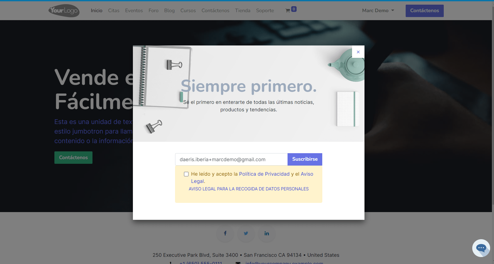

Para agregar una ventana emergente en el Sitio Web con el objetivo de solicitar una subscripción a una lista de
correos, debes navegar a la página de tu sitio web y editarla mediante el botón editar.

Mediante esta acción, accedes al modo diseñador web desde donde debes arrastrar el bloque de tipo Popup Newsletter.

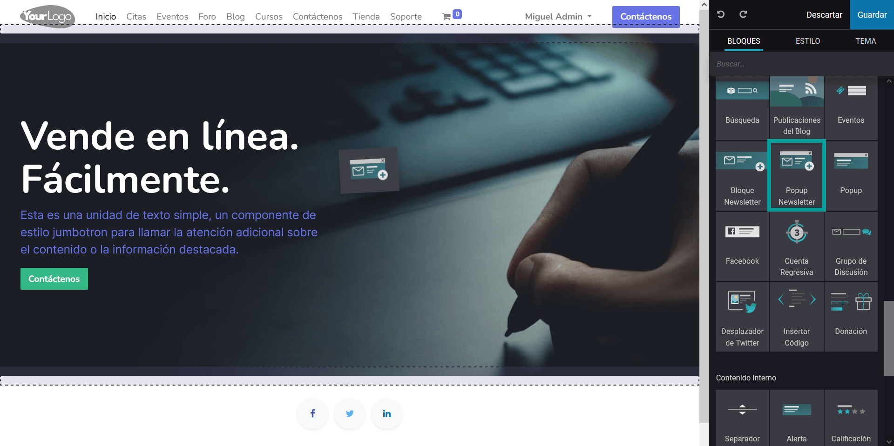

Al soltar el bloque aparece una ventana de suscripción que podemos editar mediante las opciones que nos ofrece
el editor derecho.

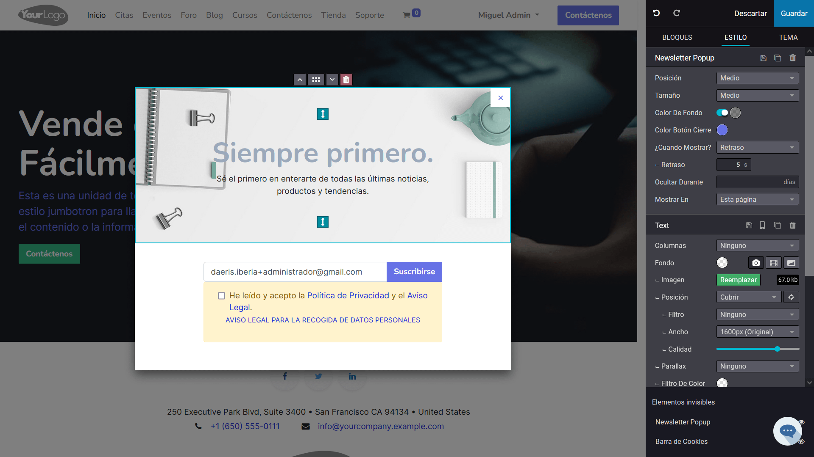

Para identificar el boletín de noticias que desees asociar a la ventana emergente debes hacer clic sobre la sección
que incorpora el cajetín de suscripción.

Sobre el menú derecho, busca la sección **Newsletter Form** y sobre el campo boletín de noticias, selecciona el
boletín deseado.

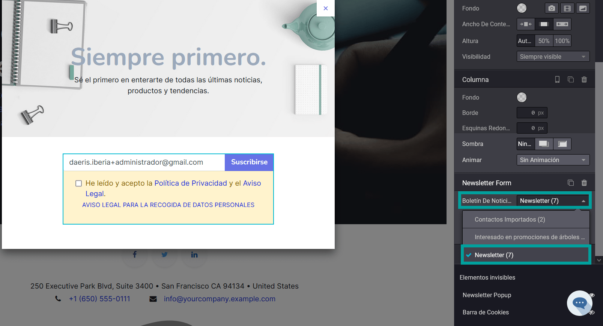

Para modificar el contenido de texto del aviso legal debes hacer clic sobre el texto **AVISO LEGAL PARA LA RECOGIDA DE DATOS PERSONALES**.

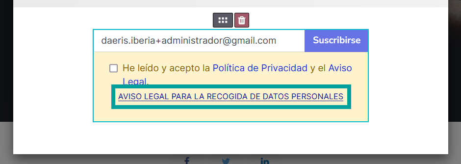

Esta acción abrirá el cajetín de texto del aviso legal, desde donde podrá incorporar el texto legal y de protección
de datos que el usuario debe aceptar para poder suscribirse a la lista de correo.
Inicialmente aparece una propuesta de texto genérica que debes adaptar a las necesidades de tu negocio.

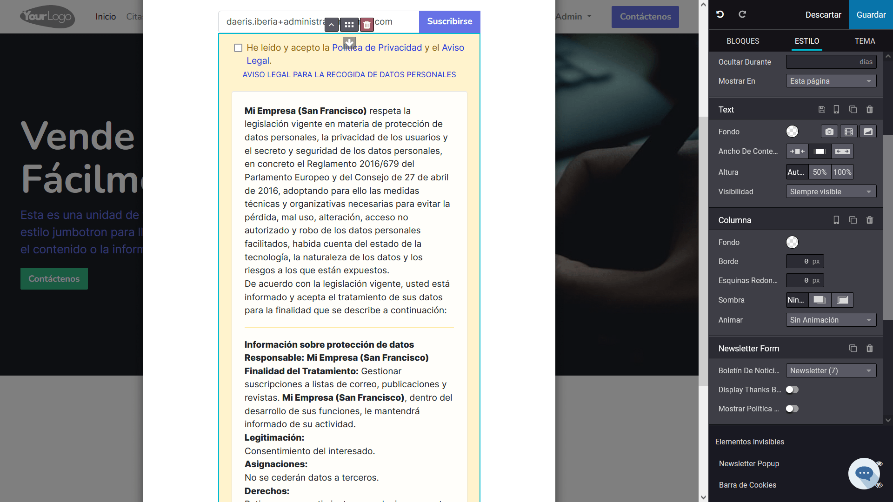

Recuerda, volver a hacer clic sobre el texto **AVISO LEGAL PARA LA RECOGIDA DE DATOS PERSONALES** antes de guardar
el contenido de la página ya que esta se mostrará tal y como la estes editando.

En el supuesto caso de que no quieras mostrar el aviso legal con obligada aceptación por parte de tus visitantes,
puedes eliminarlo, seleccionando la sección posterior al cajetín de introducción de correo y haciendo clic sobre
el icono de papelera. También puedes realizar esta acción accediendo a la sección **Apartado Legal** del menú derecho,
haciendo clic posteriormente sobre el icono de la papelera.

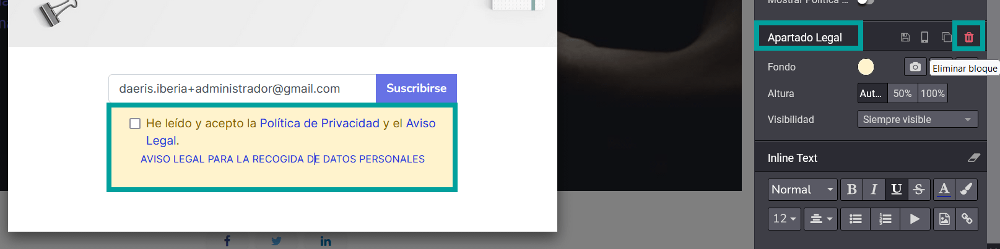

Las opciones de personalización de la ventana emergente son:

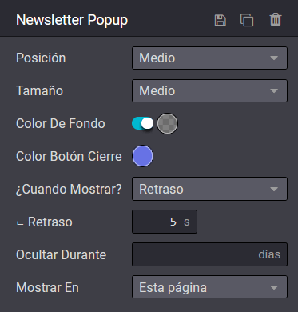

-  **Posición**:

   -  **Arriba**: Se muestra la ventana sobre la parte superior derecha.
   -  **Medio**: Se muestra la ventana en el centro.
   -  **Fondo**: Se muestra la ventana sobre la parte inferior derecha.

-  **Tamaño**: Permite indicar el tamaño de la ventana emergente pudiendo seleccionar entre:

   -  **Pequeño**
   -  **Medio**
   -  **Grande**
   -  **Extra grande**
   -  **Completo**

-  **Color de fondo**: Color que se muestra sobre el contenido que queda debajo de la ventana. Si se usan colores semitransparentes se visualizará el contenido que queda bajo la ventana.
-  **Color del botón de cierre**: Color del aspa de cierre de la ventana.
-  **¿Cuándo mostrar?**: permite selecciona entre:

   -  **Retraso**: Muestra la ventana emergente pasados los segundos indicados desde que el usuario llegó a la página.
   -  **Al salir**: Muestra la ventana cuando el usuario abandona el marco principal de la pantalla.

-  **Ocultar durante**: Una vez el usuario cierra la ventana emergente no se volverá a mostrar en el periodo de días indicado.
-  **Mostrar en**:

   -  **Esta página**: la ventana emergente solo se mostrará en la página que estamos actualizando.
   -  **Todas las páginas**: La ventana emergente se mostrará en todas las paginas de nuestro sitio web.

A nivel del cuadro de texto con imagen, podemos modificar:

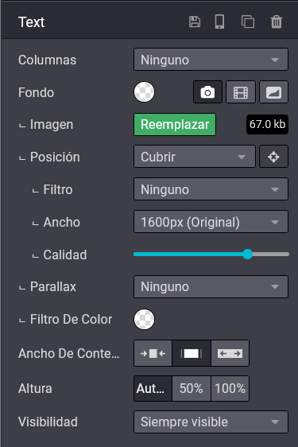

-  **Fondo**: Nos permite seleccionar el tema, así como seleccionar una imagen de fondo, video o forma.

   -  Si seleccionamos **imagen o video** como fondo podemos seleccionar la imagen, la posición, el filtro, el ancho y la calidad de la imagen, así como incorporar el efecto parallax y el filtro de color deseado.
   -  Si seleccionamos **forma**, permite incorporar una forma predefinida que cubrirá parte de la imagen o el video.

-  **Ancho del contenido**, permite indicar el ancho de la ventana emergente.
-  **Altura**: Permite indicar la atura de la ventana emergente.
-  **Visibilidad**:

   .. image:: captacion/ventana09.png
      :align: center
      :alt: Agregar una ventana emergente

   -  **Siempre visible**: La ventana emergente se mostrará sin ninguna restricción
   -  **Condicionalmente**: En este caso la ventana emergente se mostrará en función de las condiciones que hayamos seleccionado. Estas condiciones se basan en:

-  **Campaña UTM**: Se puede mostrar o restringir para una campaña determinada.
-  **Medio**: Se puede mostrar o restringir para un medio determinado.
-  **Fuente**: Se puede mostrar o restringir para una fuente determinada.
-  **Usuarios**: Se puede mostrar para todos los usuarios o cuando el usuario inicia o cierra una sesión.

A nivel de formato de texto, podemos editar diversas opciones del texto usando la barra de edición.

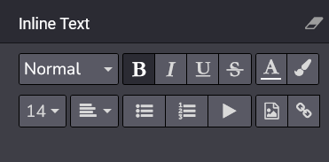

Una vez realizados los cambios, debes hacer clic sobre el botón **guardar**.

Si deseas realizar nuevos cambios debes editar la pagina web mediante el botón **editar**.
Sobre el formulario de edición derecho, navega hasta el fondo donde se encuentra el apartado **elementos invisibles**.
Bajo este apartado se encuentran los elementos que no son visibles por defecto.

Para ver la ventana emergente creada anteriormente, haz clic en el icono que aparenta ser un ojo tachado.
Esta acción te permitirá volver a mostrar la ventana emergente y poder editarla.

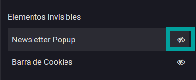

En el caso de que quieras ocultar de nuevo la ventana emergente vuelve a hacer clic sobre el icono del ojo.

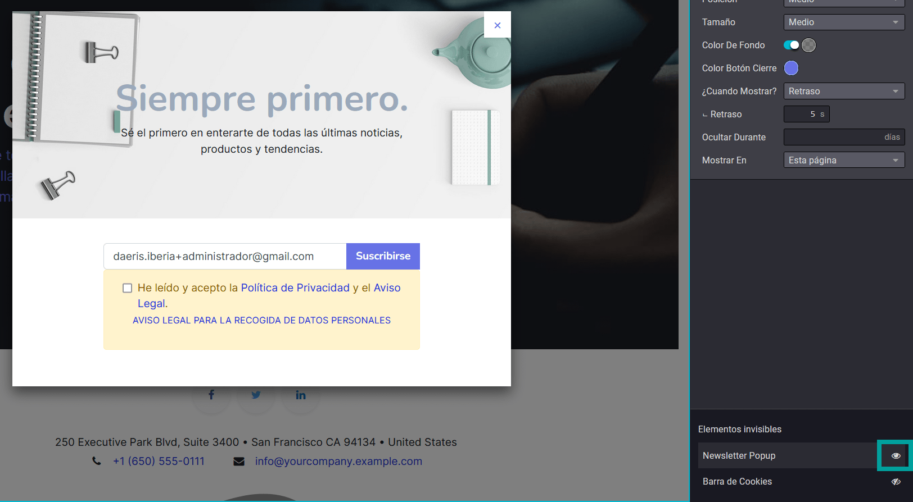

A partir de ese momento, los usuarios que visiten la página web, se les mostrará una ventana emergente invitándoles
a la suscripción de la lista de correo seleccionada.

Agregar un apartado de suscripción en el sitio Web
===================================================

Con el objetivo de ofrecer a los usuarios la posibilidad de incorporarse a una lista de correo determinada,
puedes incorporar una sección sobre tus páginas web.

Para ello, debes navegar a la página de tu sitio web donde quieres que se muestre, editar la página, y añadir el
bloque Newsletter del apartado contenido dinámico.

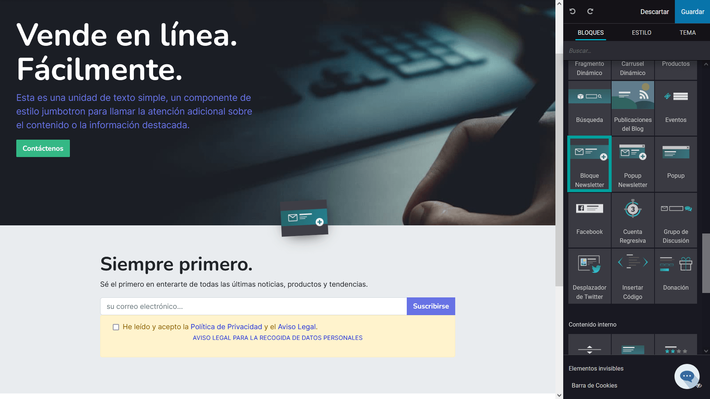

Para identificar el boletín de noticias que deseas asociar al apartado debes hacer clic sobre la sección
que incorpora el cajetín de suscripción.

Sobre el menú derecho, busca la sección **Newsletter Form** y sobre el campo boletín de noticias, selecciona el
boletín deseado.

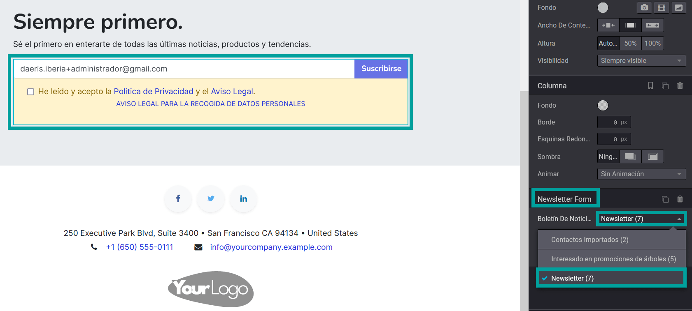

Es posible editar varias propiedades de la sección, como el tipo de fondo, color, ect… mediante el panel lateral
derecho.

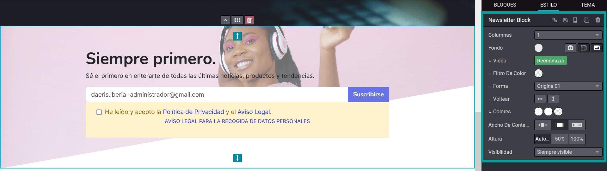

Para modificar el contenido de texto del aviso legal debes hacer clic sobre el texto **AVISO LEGAL PARA LA RECOGIDA DE DATOS PERSONALES**.

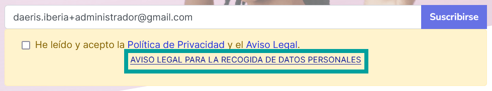

Esta acción abrirá el cajetín de texto del aviso legal, desde donde podrá incorporar el texto legal y de protección
de datos que el usuario debe aceptar para poder suscribirse a la lista de correo.

Inicialmente aparece una propuesta de texto genérica que debes adaptar a las necesidades de tu negocio.

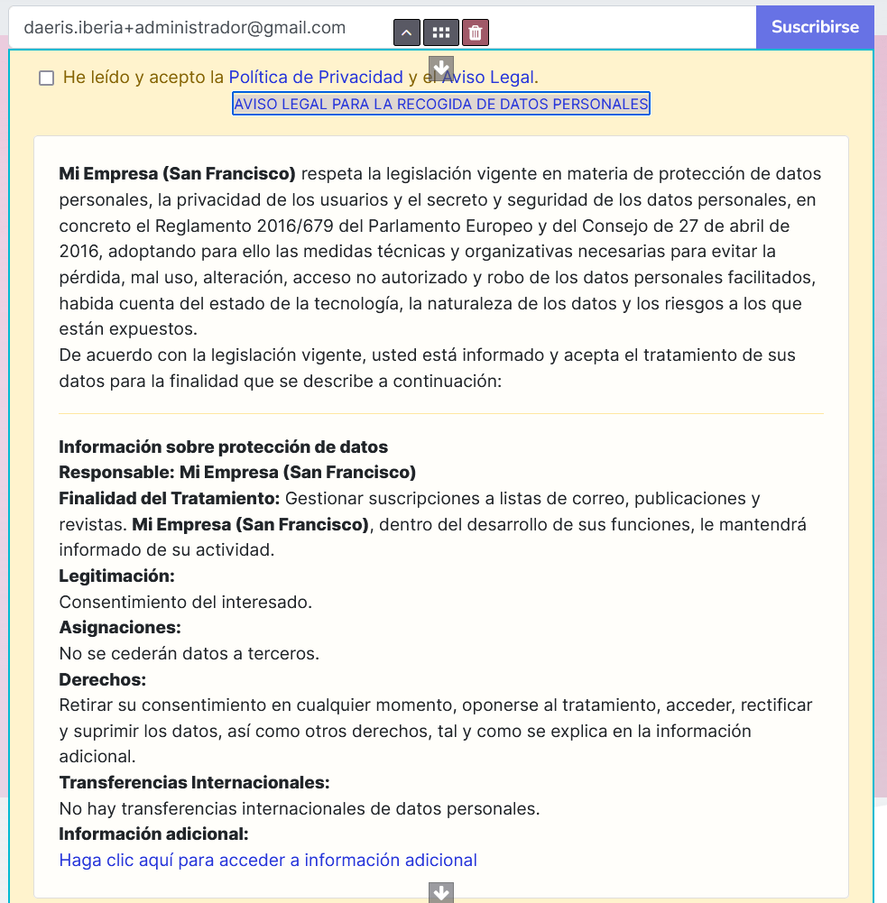

Recuerda, volver a hacer clic sobre el texto **AVISO LEGAL PARA LA RECOGIDA DE DATOS PERSONALES** antes de guardar
el contenido de la página ya que esta se mostrará tal y como la estes editando.

En el supuesto caso de que no quieras mostrar el aviso legal con obligada aceptación por parte de tus visitantes,
puedes eliminarlo, seleccionando la sección posterior al cajetín de introducción de correo y haciendo clic sobre
el icono de papelera.

También puedes realizar esta acción accediendo a la sección **Apartado Legal** del menú derecho, haciendo clic
posteriormente sobre el icono de la papelera.

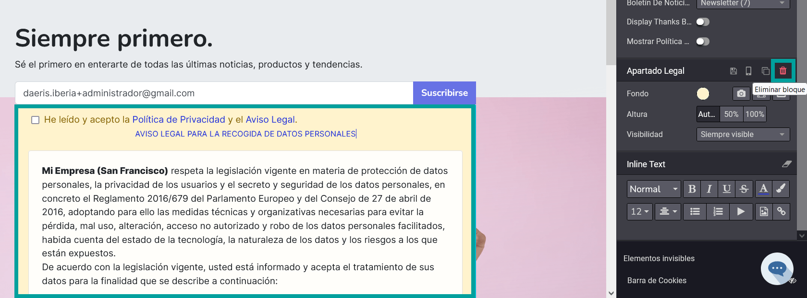

Al pulsar el botón **Continuar**, se incorporará el contenido sobre la página web. Por defecto, todos los usuarios
registrados que accedan a la página visualizarán su email sobre el campo correo, pudiendo suscribirse con tan solo
un clic sobre el botón **suscribirse**.

Los usuarios no registrados deberán incorporar una dirección de correo valida.

Una vez finalizados los cambios, guarda la página mediante el botón **Guardar**.

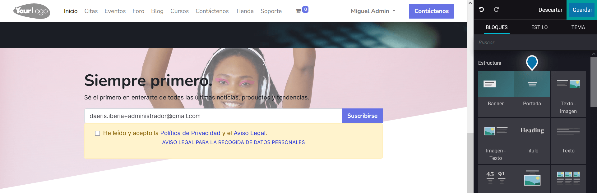