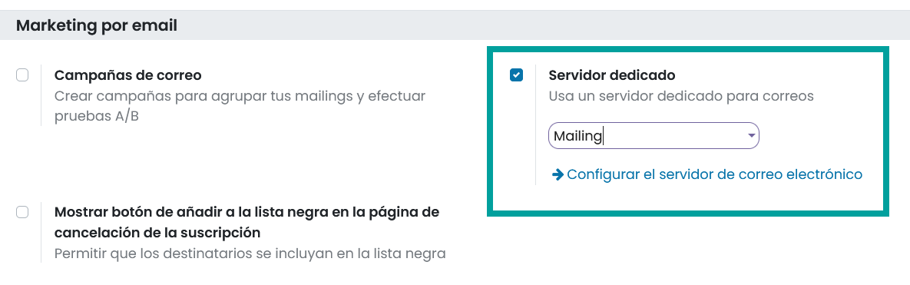

=================
Configuración
=================

.. _marketing/marketing_por_correo/servidor_exclusivo:

Utilizar un servidor de correo exclusivo para el envío de mailing
====================================================================

Para utilizar un servidor de correo dedicado al envío de correo electrónico masivo, debes navegar a la pantalla
:menuselection:`Marketing por email --> Configuración --> Ajustes`, y bajo el apartado **Marketing por email**
debes activar la opción **Servidor dedicado**. Posteriormente debes seleccionar el **servidor** por el que quieres
enviar los correos de marketing.

.. important::
    Solo los usuarios con derecho a los ajustes de la administración de la aplicación pueden realiza esta acción.

Una vez registrados los cambios, debes guardar los ajustes mediante el botón **Guardar**.

A partir de ese momento, los correos de marketing serán enviados a través del servidor especificado en el desplegable.

Si no se marca esta opción, los correos de marketing se envían por el servidor de correo saliente con la prioridad más alta.

En el caso de querer configurar un servidor especifico haz clic sobre el enlace **Configurar el servidor de correo electrónico**.

.. seealso::
   * :doc:`../../varios/correo_electronico/enviar_correos`

.. note::
   Es muy importante usar un servidor de correo sin límite de numero de comunicaciones por hora o con un limite elevado.
   De otro modo, si se supera el límite cuando se envíen los correos de tus campañas, tus correos no serán enviados.
   En este caso y una vez pasado el tiempo necesario para poder volver a enviar comunicaciones, podrás continuar con la ejecución del mailing haciendo clic sobre el botón enviar que se encuentra en el formulario del mailing.
   Recuerda que puedes consultar los límites de las comunicaciones a enviar a tu proveedor de servicios de correo.
