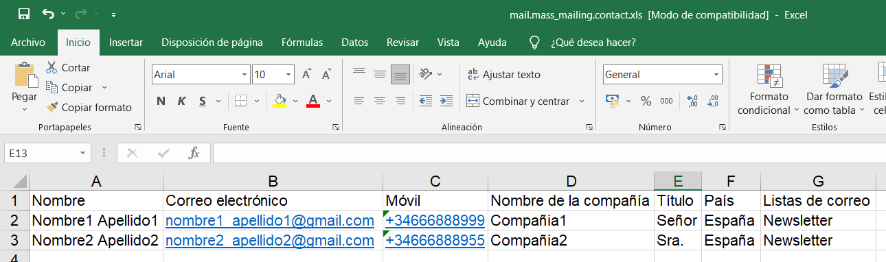
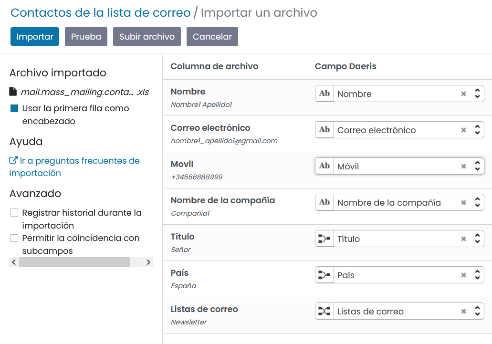
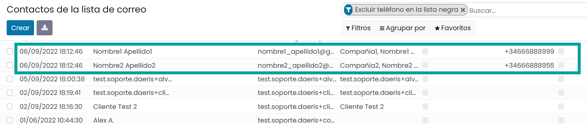
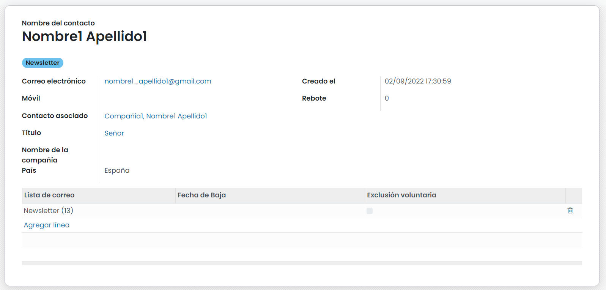
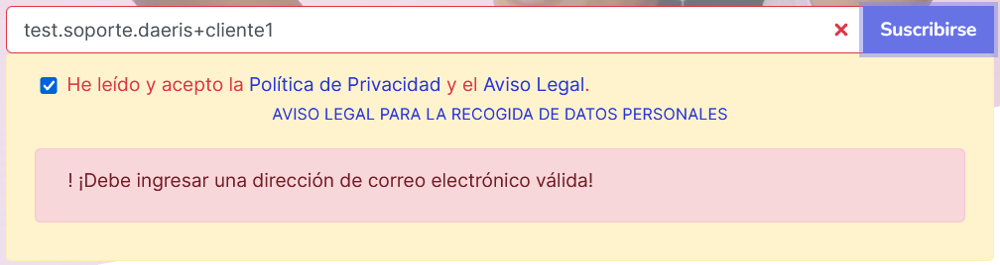

=================
Listas de correo
=================

Crear listas de correo
=======================

Desde la pantalla :menuselection:`Marketing por email --> Listas de correo --> Listas de correo`,
puedes gestionar las listas de correo existentes en la aplicación.

.. image:: listas/lista01.png
   :align: center
   :alt: Crear listas de correo

Puedes crear nuevas listas mediante el botón **Crear**, acción que abre un formulario desde donde poder
introducir los siguientes datos:

-  **Lista de correo**: Nombre de la lista.
-  **Es público**: Al marcar este campo, el destinatario podrá acceder a la lista de correo en la página de cancelación de la suscripción para que pueda actualizar sus preferencias de suscripción.

.. image:: listas/lista02.png
   :align: center
   :alt: Crear listas de correo

Mediante el botón **Crear** registramos los cambios introducidos.

Desde los bloques de la vista Kanban podemos visualizar varios datos y navegar hacia ellos:

-  El número de contactos que dispone la lista.
-  El número de destinatarios de correo electrónico validos
-  El número de destinatarios de SMS validos
-  El número de Mailings
-  La tasa de rebote
-  La tasa de exclusión voluntaria
-  La tasa de lista negra

.. image:: listas/lista03.png
   :align: center
   :alt: Crear listas de correo

Si hacemos clic sobre el **titulo** podemos navegar a la pantalla de tipo formulario donde editar la información del
registro como:

-  **Es público**: El destinatario puede acceder a la página de cancelación de la suscripción a lista de correo y gestionar sus preferencias.

-  **Crear Contacto asociado**: Mediante esta opción, cada vez que se une un contacto a la lista de correos, se revisa si existe como contacto en la aplicación. Si existe, se asocia el contacto de la aplicación al contacto de la lista de correo. Si no existe, se crea un nuevo contacto en la aplicación y se asocia al contacto de la lista de correos.

Desde la pantalla de contactos de la aplicación es posible visualizar si está asociada a un contacto de la lista de correos mediante el botón contacto de listas de correos.

Al hacer clic se visualiza el contacto de la lista de correos.

-  **Etiqueta del contacto asociado**: El uso de este contacto nos permite incorporar una etiqueta al contacto de la aplicación cuando se asocia a una lista de correos.
-  **Deshabilitar baja cruzada**: Cuando un contacto de una lista de correos cursa una baja, se procede a mostrar todas las listas de correos alas que está suscrito, dándole la posibilidad de darse de baja, si así lo decide. Al informar esta opción deshabilitamos la posibilidad de mostrar esta lista de correos cuando un contacto cursa una baja de otra lista de correos a la que este asociado.
-  **Plantilla de bienvenida**: Plantilla de correo electrónico que se usará para dar la bienvenida a la lista de correos a los contactos que se asocien a ella.
-  **Lista Dinámica**: mediante esta opción se permite crear listas de correos de contactos de la aplicación. Al seleccionar esta opción se muestran una serie de campos para configurar la lista dinámica.

.. image:: listas/lista04.png
   :align: center
   :alt: Crear listas de correo

Actualizar el mensaje de bienvenida
=====================================

Cada vez que una nueva cuenta de correo se asocia a una lista de correos, se emite un correo de bienvenida.

Para editar el correo de bienvenida que recibirán las suscripciones debes navegar a la aplicación
Marketing por email > listas de correo y haz clic sobre la lista de correo deseada.

Al hacer clic sobre el botón **editar** puedes incorporar la platilla de bienvenida. Al hacer clic sobre el campo
“Plantilla de bienvenida”, puedes acceder a la plantilla y editarla, adaptándola a tu negocio.

También puedes editar las opciones de envío de correo haciendo clic sobre la pestaña **Ajustes**.
Es muy importante modificar la cuenta disponible en el campo “Responder A”, ya que, si un destinatario decide
responder el correo recibido, esta será la cuenta a la que intentará emitir la comunicación.

Recuerda que este mensaje se emitirá a cada cuenta de correo que se haya suscrito a una lista de correos.

.. error::
   Para que el botón *Anular suscripción** disponga de un enlace válido en los correos de bienvenida a tu lista de suscripción, debe existir como mínimo, un mailing asociado a tu lista de suscripción. Es una buena práctica, crear un mailing de prueba asociándole la nueva lista de correo tras su creación,

Crear contactos
=======================

Desde la pantalla :menuselection:`Marketing por email --> Listas de correo --> Contactos de la lista de correo`
, puedes gestionar los contactos de las listas de correo existentes en la aplicación.

.. image:: listas/contacto01.png
   :align: center
   :alt: Crear contactos

.. warning::
    Has de tener presente la legislación vigente de tu país, al dar de alta contactos sobre listas de correos, ya que
    es posible que solo puedas generarlos en el caso de haber recibido consentimiento expreso del propio contacto.

Para crear un nuevo contacto, puedes hacer clic sobre el botón **Crear**, que te llevará al siguiente formulario
de introducción de datos:

.. image:: listas/contacto02.png
   :align: center
   :alt: Crear contactos

-  **Nombre**: Nombre del contacto.
-  **Correo electrónico**: Email del contacto.
-  **Contacto asociado**: Campo de selección desde donde se puede incorporar el contacto de la aplicación. Este campo no es requerido, pero puedes informarlo si quieres asociar tu contacto de la lista de correos a un contacto de la aplicación. Debes tener en cuenta para evitar correos duplicados que este contacto debería tener el mismo email que el del contacto que estas dando de alta.
-  **Título**: Desplegable con varias opciones.
-  **Nombre de la compañía**: Permite informar la compañía del contacto.
-  **País**: Permite informar el país del contacto.
-  **Rebote**: Campo que se utiliza para almacenar el número de correos rebotados de este contacto.
-  **Lista de correo**: Permite añadir al contacto a las listas de correo existentes.

Importar contactos
=======================

Es posible crear nuevos contactos, importándolos desde un fichero Excel que debe disponer de las columnas
necesarias para informar los detalles de cada registro.

Desde la pantalla :menuselection:`Marketing por email --> Listas de correo --> Contactos de la lista de correo`
, puedes importar contactos sobre las listas de correo existentes en la aplicación.

Para importar un fichero haz clic sobre el menú **favoritos** seleccionando **Importar registros**.

.. image:: listas/contacto04.png
   :align: center
   :alt: Importar contactos

La aplicación navega a la pantalla de importación donde debes hacer clic sobre el botón **subir archivo**.

.. image:: listas/contacto05.png
   :align: center
   :alt: Importar contactos

Selecciona el archivo que dispone de los datos de importación.

Haz clic sobre el botón **abrir**. Esta acción te lleva a la pantalla de importación donde debes indicar la
correspondencia entre la columna de tu archivo y la columna de Daeris.
Al finalizar pulsa el botón **importar**.

Los nuevos contactos se habrán creado y serán visibles desde el listado.

Al posicionarte sobre cualquiera de ellos podrás visualizar los datos importados.

Uso del proceso de suscripción
=====================================

Para permitir a tus visitantes la suscripción a una lista de correos, debes haber incorporado en una o varias de
tus páginas web, la sección de suscripción o la ventana emergente de solicitud de suscripción.

Puedes encontrar más información sobre la incorporación de la sección de suscripción aquí y sobre la ventana emergente suscripción Aquí.

.. seealso::
   * :doc:`../../marketing/marketing_por_correo/captacion`

Para **suscribirte a una lista de correos**, debes incorporar tu dirección de correo electrónico sobre el apartado
**su correo electrónico**, aceptar la política de privacidad si ha sido incluida en la sección y hacer clic sobre
el botón **Suscribirse**.

Si la dirección de correo introducida no cumple con los estándares de formato de las direcciones de correo,
la aplicación mostrará un error al hacer clic sobre el botón **suscribirse**.

Si la sección de suscripción dispone de **políticas de privacidad** y no se confirma la lectura y aceptación,
la aplicación mostrará un error al hacer clic sobre el botón **suscribirse**.

Si la cuenta de correo está bien informada y se han aceptado las políticas de privacidad, la aplicación muestra
un mensaje de confirmación a la suscripción por pantalla.

Automáticamente se envía un **mensaje de bienvenida** por correo electrónico a la cuenta de correo suscrita.

Recuerda que debes actualizar el mensaje de bienvenida, adaptándolo a tu negocio.

.. seealso::
   * :doc:`../../marketing/marketing_por_correo/listas`

Permitir gestionar las suscripciones a clientes
==================================================

Cuando un usuario se suscribe a una lista de correos por primera vez, se le envía un correo de bienvenida,
comunicándole el acceso a las listas de correo. Esta comunicación dispone de un botón el cual permite al
usuario darse de baja de la lista.

Además, cada vez que emitimos un mailing, debemos incorporar el botón o enlace que permite la baja al receptor.
Para esta tarea es posible usar los bloques de pie de página, aunque por defecto, todos los temas disponen de él.

Cuando un contacto hace clic sobre el botón **Anular suscripción**, navega a la página de cancelación de
suscripciones y se le solicita que indique un motivo de baja.

El contacto debe informar el motivo y hacer clic sobre el botón **Darse de baja ahora**, acción que procede a
realizar la baja. El usuario navega a la pantalla de suscripciones de mailing, donde puede actualizar
sus subscripciones.

En esta pantalla aparecen todas las suscripciones a las que esta o ha estado inscrito el contacto alguna vez,
siempre y cuando la lista de correo permita la baja cruzada (la propiedad Deshabilitar baja cruzada está
disponible sobre el formulario de edición de las listas de correos.)

Es posible seleccionar o deseleccionar las listas de correo. Al hacer clic sobre el botón
**Actualizar suscripciones**, estas, quedaran registradas en el sistema.

El contacto puede también añadirse a la lista negra haciendo clic sobre el botón **Agregarme a la lista negra**,
acción que solicitará el ingreso de un motivo.

Si el contacto informa el motivo y vuelve a hacer clic sobre **Agregarme a la lista negra** pasará a formar
parte de la lista negra, no recibirá correos y no podrá gestionar sus subscripciones mientras permanezca en ella.

Configurar los motivos de las bajas
==================================================

Cuando un contacto hace clic sobre el botón **Anular suscripción**, navega a la página de cancelación de
suscripciones y se le solicita que indique un motivo de baja.

La lista de motivos es configurable y puedes adaptarla a las necesidades de tu negocio.

Para ello, navega a la pantalla :menuselection:`Marketing por email --> Configuración --> Motivos de bajas`.

Mediante el botón **Crear** puedes crear un nuevo motivo. Al hacer clic sobre un registro del listado puedes
editarlo desde el formulario donde se encuentran los siguientes campos:

   - **Nombre**: Texto descriptivo del motivo de la baja.
   - **Detalles Obligatorios**: Si se informa, se solicita al contacto que introduzca el detalle del motivo por el cual realiza la baja.
   - **Secuencia**: Orden en el que aparecerá el motivo.

Consultar el registro a las listas de correo
==================================================

Daeris permite consultar los datos de las acciones de registro, bajas y actualizaciones que se realizan sobre las listas de correos.

Para ello, navega a la pantalla :menuselection:`Marketing por email --> Registro`. Sobre el listado es posible ver
cada una de las acciones realizadas.

Al hacer clic sobre un registro del listado, accedemos a su detalle donde podemos obtener información
complementaria de la acción realizada.

