==============
Listas negras
==============

Una dirección de correo electrónico en la lista negra implica que el destinatario no recibirá más correos masivos
de ninguno de los mailings configurados en la aplicación.

Añadir un cuenta de correo a la lista negra
============================================

Para añadir una cuenta de correo a la lista negra, debes navegar a la pantalla
:menuselection:`Marketing por email --> Configuración --> Lista negra`, y pulsar el botón **Crear**.

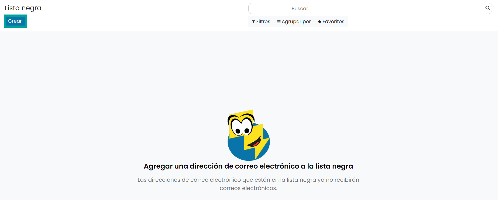

A continuación, se debe añadir la dirección de correo electrónico.

Por último, se deberá pulsar el botón **Guardar**.

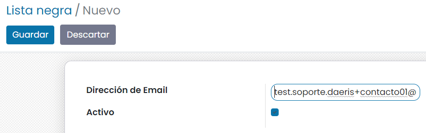

A partir de este momento, la cuenta de correo indicada **no recibirá más correos electrónicos**.

Para visualizar las cuentas de correo asociadas a las listas de correo, debes navegar a la pantalla
:menuselection:`Marketing por email --> Configuración --> Lista negra`. Para mostrar las cuentas
incorporadas a la lista negra, debes eliminar el filtro que incorpora el listado por defecto.

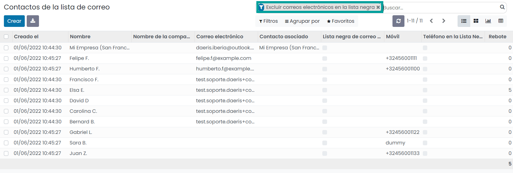

Al hacer clic sobre un registro del listado , accedes al formulario de detalle desde donde puedes ver
la información del contactos y las listas de correo relacionadas.

Junto a la cuenta de correo electrónico, aparece el icono que informa que la cuenta está bloqueada (lista negra).

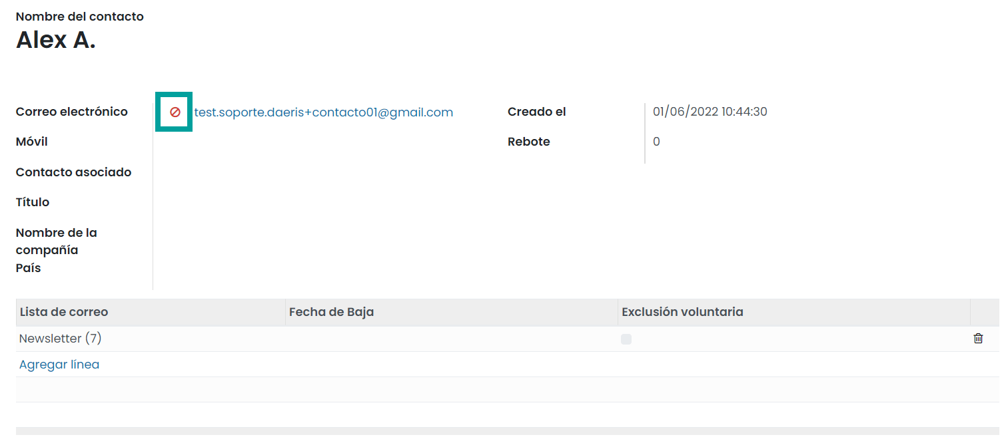

Eliminar una cuenta de correo de la lista negra
================================================

Para eliminar una cuenta de correo de la lista negra, debes navegar a la pantalla
:menuselection:`Marketing por email --> Configuración --> Lista negra`, y hacer clic sobre el registro deseado.

Sobre el formulario de detalle, haz clic sobre el botón **Quitar de la lista negra**.

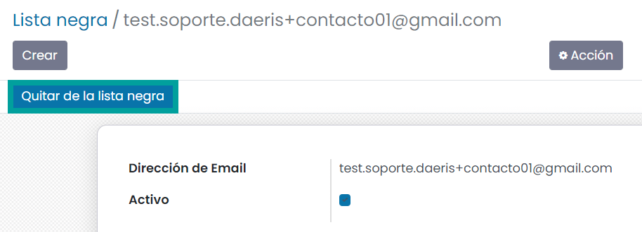

A continuación, la aplicación solita introducir un motivo para realizar la acción.

Introduce un motivo y haz clic sobre el botón **Confirmar**.

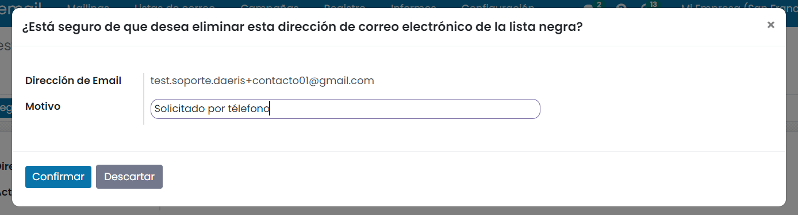

El registro queda archivado y ya no esta incorporado a la lista negra.

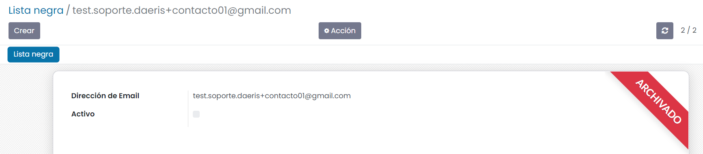

Mostrar botones de lista negra en la página de cancelación de la suscripción
==============================================================================

Para mostrar botones de lista negra en la página de cancelación de suscripción, debes navegar a la pantalla
:menuselection:`Marketing por email --> Configuración --> Ajustes`, y activar la opción correspondiente.

.. important::
    Solo los usuarios con derecho a los ajustes de la administración de la aplicación pueden realiza esta acción.

Una vez marcada la opción, debes guardar los ajustes mediante el botón **Guardar**.

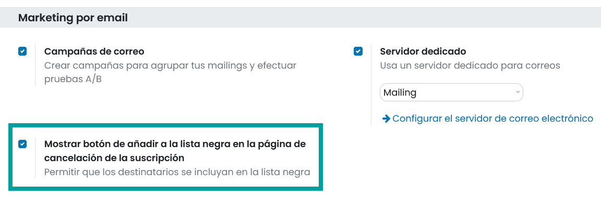

Esta opción, añade un nuevo botón sobre la pantalla final de cancelación de suscripción, que permite a los usuarios añadirse
a la lista negra.

Cuando un usuario hace clic sobre el enlace **Anular suscripción** del correo que ha recibido, navega a la pantalla de
cancelación de la suscripción, donde debe agregar un motivo y hacer clic sobre el botón **Darse de baja ahora**.

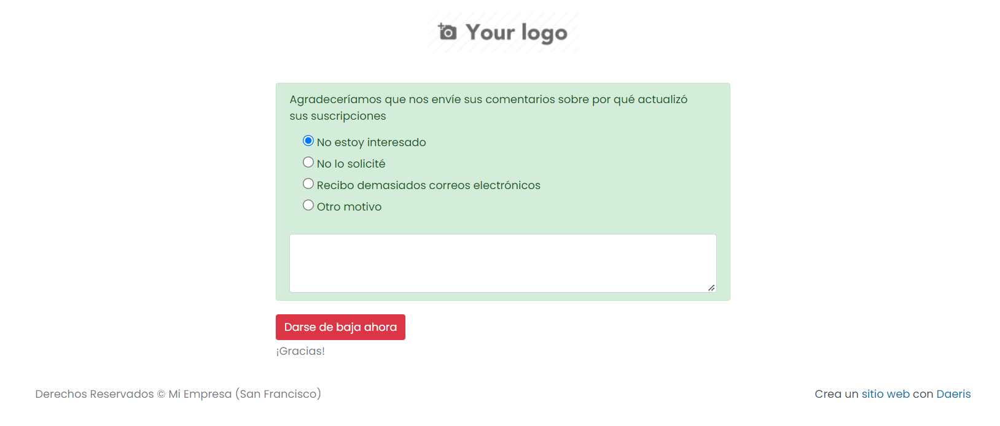

El contacto puede añadirse a la lista negra haciendo clic sobre el botón **Agregarme a la lista negra**,

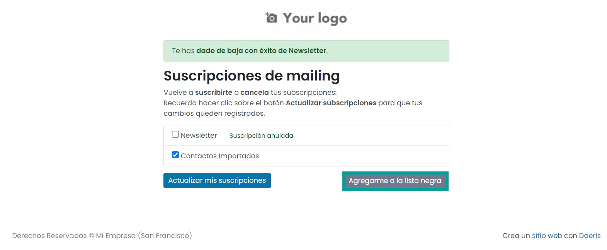

Esta acción solicitará la incorporación de un motivo.

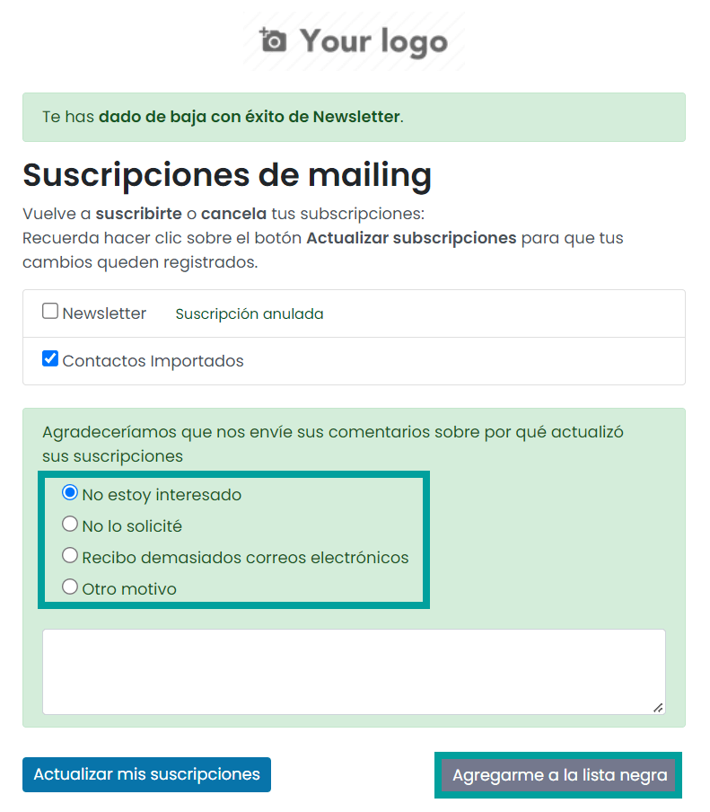

Si el contacto informa el motivo y vuelve a hacer clic sobre **Agregarme a la lista negra** pasará a formar parte
de la lista negra, no recibirá correos y no podrá gestionar sus subscripciones mientras permanezca en ella.

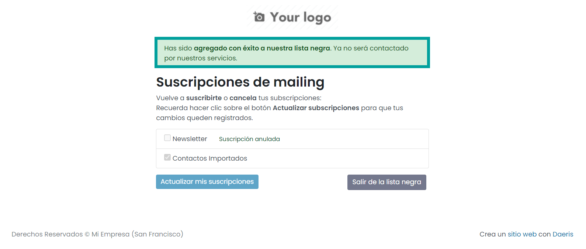

Mediante el botón **Salir de la lista negra**, podrá volver a gestionar sus subscripciones y recibir correos.

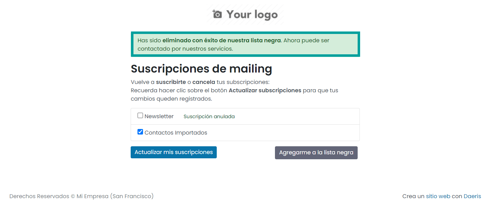