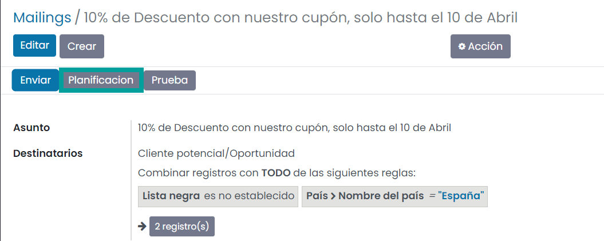
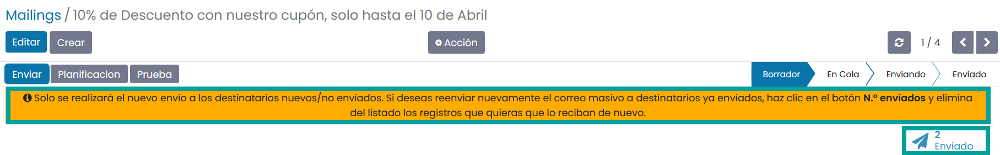
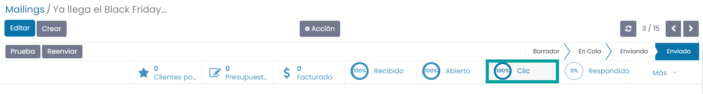
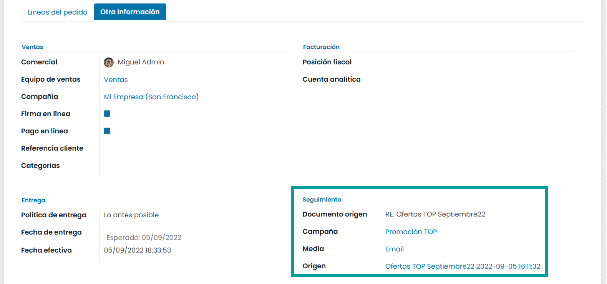
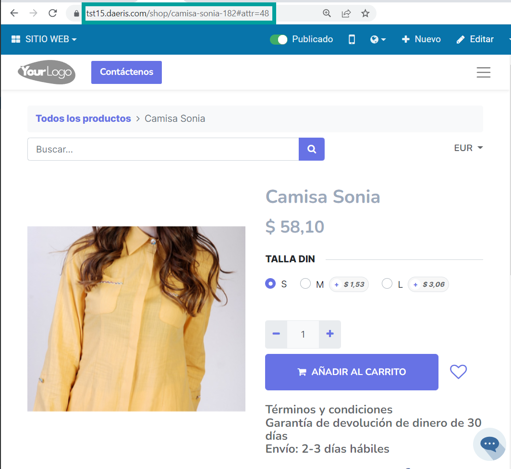
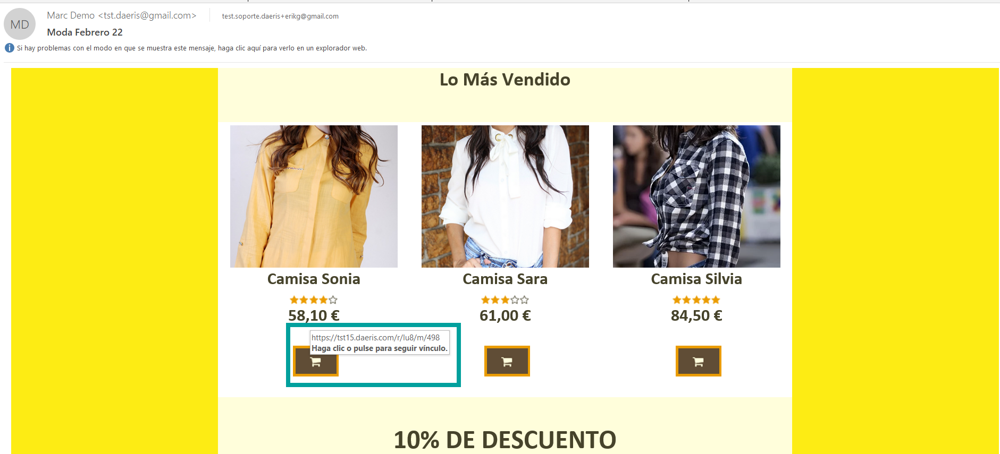
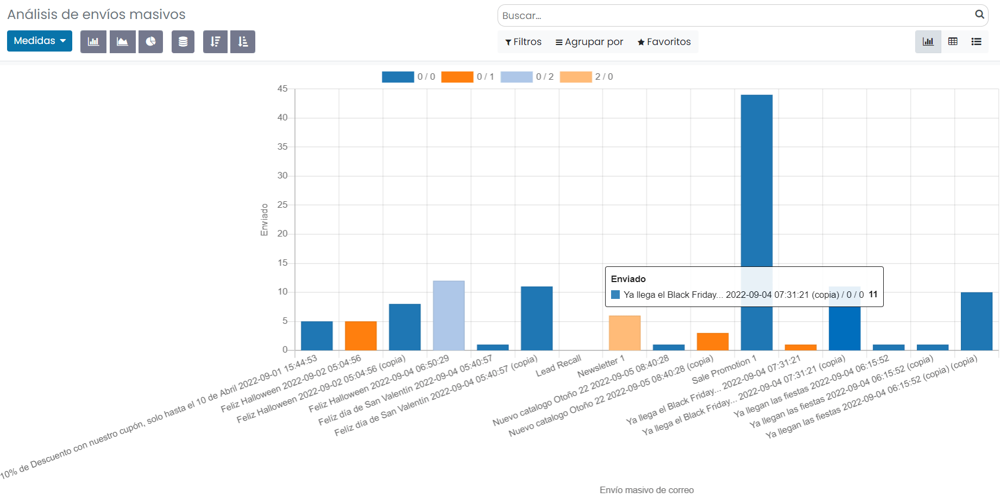

==============
Mailings
==============

El marketing por correo electrónico permite enviar anuncios o cualquier tipo de mensaje comercial a un grupo de
personas, ya sean clientes actuales o potenciales de la compañía, ayudando a persuadir a los clientes potenciales
y a retener a los clientes actuales.

Además, es posible emitir comunicaciones a contactos de listas de correos, candidatos a ofertas de empleo,
personas registradas a un evento o a una sesión de evento y a clientes que han efectuado algún pedido de venta.

La aplicación de **email marketing** de Daeris te permite realizar marketing por correo electrónico orientado a los
objetivos que desees como por ejemplo:

-  **Boletines** de noticias que se envían semanal, quincenal o mensualmente en el que se emiten noticias relacionadas con la temática a la que están suscritos los contactos.
-  **Titulares** de la nueva información publicada en el sitio web, blog, ... con enlaces hacia el articulo completo.
-  **Novedades** de nuevos productos o servicios que oferta la empresa.
-  **Ofertas** de productos de los que interesa reducir el stock.
-  Campañas de ventas en **periodos señalados** como el Black Friday, Rebajas de Navidad, verano, etc...
-  **Cupones** de descuento al realizar un gasto superior a cierta cantidad.
-  **Mejoras** en los servicios contratados por los clientes con el objetivo de fidelizarlos.

Crear un mailing
=================

Para crear un nuevo envío de mail, debes navegar a la pantalla
:menuselection:`Marketing por email --> Mailings`, y hacer clic en el botón **Crear**, lo que te llevará a un
formulario desde donde podrás completar la siguiente información:

-  **Asunto**: Titulo del correo que aparecerá como el apartado del asunto al ser enviado.

-  **Destinatarios**: Puedes elegir entre una de las siguientes opciones:

   -  **Cliente Potencial/Oportunidad**: Permite seleccionar todos los clientes potenciales y oportunidades cargados en la aplicación, o establecer un filtro que limite los registros. Al pulsar el botón **Añadir filtro**, puedes añadir un filtro que limite los registros a los que enviar el correo.

   .. image:: mailings/mailing02.png
      :align: center
      :alt: Ejemplo al crear un nuevo envío con destinatario Cliente Potencial Oportunidad

   Por ejemplo, podrías añadir un filtro para que solo queden seleccionados los clientes potenciales y oportunidades de un país en concreto. De esta manera, puedes segmentar los registros de la base de datos, y enviar el correo a los destinatarios adecuados.

   .. image:: mailings/mailing03.png
      :align: center
      :alt: Ejemplo al crear un nuevo envío con destinatario Cliente Potencial Oportunidad

   -  **Lista de correo**: Permite seleccionar una lista de correo existente, o crear una nueva. Las listas de correo son listas que contienen correos electrónicos e información de los destinatarios.
   -  **Contacto**: Permite seleccionar todos los contactos cargados en la aplicación, o establecer un filtro que limite los registros.
   -  **Contacto de correo**: Permite seleccionar todos los contactos de todas las listas de correos cargados en la aplicación, o establecer un filtro que limite los registros.
   -  **Pedido de venta**: Permite seleccionar entre todas las personas que hayan realizado un pedido de venta, o establecer un filtro que limite los registros.
   -  **Registro de eventos**: Permite seleccionar entre todas las personas que hayan asistido a un evento, o establecer un filtro que limite los registros.
   -  **Sesión del evento**: Permite seleccionar entre todas las personas que hayan realizado una sesión en un evento, o establecer un filtro que limite los registros.
   -  **Candidato**: Permite seleccionar entre todas las personas que se hayan inscrito en una oferta de trabajo, o establecer un filtro que limite los registros.

-  **Cuerpo del correo**: Permite editar el cuerpo del correo a partir de varias plantillas predeterminadas:

   -  **Texto Plano**: Mediante esta plantilla, es posible editar el cuerpo del mensaje con un editor HTML, y sin ningún tipo de asistente ni configurador de secciones. Ideal por si queremos insertar un texto sencillo, o si queremos copiar el texto de otro documento web.

   .. image:: mailings/mailing04.png
      :align: center
      :alt: Cuerpo del correo de tipo Texto Plano

   -  **Resto de plantillas**: Mediante las plantillas de correo responsivas se incorpora un ejemplo de correo en el que basarte ambientado en una temática particular. Existen varias temáticas como:

      - Agencia de viajes
      - Agencia de interiorismo
      - Educación
      - Moda
      - Construcción
      - Distribución de productos
      - Deportes
      - Marca propia
      - Venta
      - Dia de los enamorados
      - Black Friday
      - Navidad
      - Halloween
      - E-commerce: Electro hogar
      - E-commerce: moda
      - Servicios Inmobiliarios
      - Restaurante
      - Servicios Informáticos
      - Clínica
      - Turismo
      - Energías renovables
      - Viajes
      - Taller de automoción
      - Fitness

   .. image:: mailings/mailing05.png
      :align: center
      :alt: Plantillas de mailing

   Una vez seleccionada la plantilla es posible diseñar correos gracias a las funcionalidades de un asistente de edición intuitivo y fácil de utilizar.

   Al abrir el asistente encontrarás el cuerpo del mensaje correspondiente a la plantilla seleccionada, ubicado en la parte izquierda de la pantalla, y las opciones de diseño disponibles ubicadas en la parte derecha de la pantalla.

   .. image:: mailings/mailing06.png
      :align: center
      :alt: Edición de mailing

   Basta con arrastrar cualquier elemento de la parte derecha a la parte izquierda de la pantalla para establecer el elemento en el cuerpo del mensaje.

   .. image:: mailings/mailing07.png
      :align: center
      :alt: Edición de mailing

   Mediante el menú superior derecho de edición dispones de múltiples opciones para incorporar bloques, así como cambiar el estilo y el tema.

   Tienes disponibles los siguientes tipos de bloques:

      - Cabeceras (5):
      - Contenidos (15):
      - Contenido de Marketing (8)
      - Contenido Interno (6)
      - Equipo (4)
      - Producto (3)
      - Imagen (2)
      - Pies de página (2)

-  **Ajustes**: Desde la pestaña de ajustes puedes detallar la siguiente información:

   -  **Vista Previa de texto**: Frase de vista previa que aparece después del asunto en la mayoría de gestores de correo.
   -  **Enviado desde**: Dirección del emisor del correo.
   -  **Responder a**: Dirección a la que responderá el receptor del correo, si lo intenta responder. Es posible indicar un alias válido en Daeris si por ejemplo, quieres que las respuestas entren en Daeris como clientes potenciales/oportunidades. Para ello debes informar en este campo el alias configurado en el módulo de CRM.

   .. seealso::
      * :doc:`../../varios/correo_electronico/recibir_correos`

   -  **Adjuntos**: Permite añadir ficheros adjuntos al mail.
   -  **Campaña**: Campaña de la que forma parte el correo. *(Solo disponible al activar el uso de las campañas de marketing)*.
   -  **Responsable**: Usuario gestor del mailing.

   .. image:: mailings/mailing08.png
      :align: center
      :alt: Edición de mailing

Una vez guardado el contenido del correo, es posible hacer una prueba de envío para comprobar que toda la configuración es correcta.
Para ello debes pulsar el botón **Prueba**, ubicado en el menú.

Esto te permite informar una dirección de correo electrónico en donde recibir el mensaje de prueba.

.. image:: mailings/mailing10.png
   :align: center
   :alt: Edición de mailing

Al pulsar el botón **Enviar**, se enviará un correo de inmediato, y podrás comprobar si la
configuración es correcta.

Es recomendable revisar el correo en distintos gestores de correo como Outlook o Gmail,
así como en distintos tipos de dispositivos como tabletas, móviles, pantallas de portátiles y pantallas de gran tamaño.

Una vez validado el mensaje, podrás planificar el envío del correo para una fecha y hora, de manera que cuando
llegue esa fecha y hora, el correo se envíe de forma automática, sin necesidad de ninguna acción manual.
Para ello, debes pulsar el botón **Planificación**, ubicado en el menú.

Esto te permitirá seleccionar una fecha y hora de envío del correo.

Al seleccionar la fecha correspondiente y tras pulsar el botón Planificación, el correo quedará programado para su envío.

Si, una vez realizada la planificación, por alguna razón, quisieras cancelar el envío, deberías pulsar el botón
**Cancelar**, ubicado en el menú.

Por último, si lo que quieres es realizar el envío de forma inmediata, debes pulsar el botón **Enviar**, ubicado
en el menú.

Una vez realizado el envío del correo, puedes hacer seguimiento de la tasa de recepción, apertura, respuesta, clics
y rebotes, accediendo al detalle del mailing.

Al pulsar sobre cualquiera de esos iconos, puedes consultar el detalle de los destinatarios que han recibido,
abierto, respondido, clicado o rebotado el mensaje.

Reenviar un mailing
====================

Daeris permite el reenvío de mailings ya enviados. El envío de los mensajes solo se realizará a aquellos
destinatarios a los cuales no se les haya enviado un correo en un envío anterior.

Esta acción es interesante ya que puedes disponer de nuevos contactos que cumplan las condiciones para el envío
de correo.

Para reenviar un mailing ya enviado, accede a su detalle y haz clic sobre el botón **reenviar**.

Al reenviar el correo se alerta por pantalla de que no se emitirá comunicación a los remitentes que ya se les ha
enviado el correo. Además, propone que, si deseas reenviar comunicación a remitentes que ya la han recibido,
los elimines del listado al que puedes acceder haciendo clic sobre el botón **Número de enviados**.

El mailing queda en estado **borrador** y es posible **Enviar** o **planificar** un nuevo envío.

Al hacer clic sobre el botón enviar, el sistema solicitará confirmación.

Al confirmar, el estado del mailing se actualizará a **en cola**.

Pasados unos instantes y tras actualizar la página, el estado del mailing será enviado y podremos consultar las estadísticas, que irán variando a medida que los destinatarios interactúen con los correos recibidos.

.. image:: mailings/reenviar04.png
   :align: center
   :alt: Reenviar mailing

Añadir pre encabezados
=======================

Un pre-Encabezado es el texto posterior al asunto cuando previsualizamos un correo.

Es muy importante incorporarlo para incrementar las tasas de apertura de las campañas de Marketing.

Frecuentemente se usa para:

-  **Resumir** el contenido del correo
-  **Animar** a realizar el objetivo del correo (comprar, suscribirse, asistir…)
-  **Informar** el motivo por el que se envía el correo (cambio de condiciones, vencimientos…)
-  **Alertar** sobre la caducidad de una oferta, promoción, cupón de descuento…

Los pre-encabezados funcionan en prácticamente todos los gestores de correo, y en función del dispositivo pueden
mostrar una cantidad de texto u otra.

Para agregar un pre-encabezado en tu email, debes acceder a la pantalla :menuselection:`Marketing por email --> Mailings`
y crea o edita el mailing.

Sobre la sección de **ajustes**, debes informar el campo **vista previa del texto** incorporando el texto deseado.

Puedes realizar una prueba para visualizar el contenido sobre tu cuenta de correo mediante el botón **prueba**.

-  *Resultado visualizado desde Outlook 2019 versión de escritorio*

-  *Resultado visualizado desde Gmail online versión de escritorio*

-  *Resultado visualizado desde Gmail versión móvil en pantalla vertical*

-  *Resultado visualizado desde Gmail versión móvil en pantalla horizontal*

Mostrar iconos de medios sociales
=====================================

Daeris te permite utilizar diversos bloques de cabecera y pie de página que incluyen los iconos de medios sociales
de Facebook, LinkedIn, Twitter e Instagram.

Estos iconos pueden incorporar los enlaces a tus redes sociales si los configuras previamente.

Para incorporar los enlaces de iconos de tus medios sociales en los mailings, debes navegar a la pantalla
:menuselection:`Sitio Web --> Configuración --> Ajustes`, y hacer clic sobre la opción **Medios de comunicación social**.

Esta acción mostrará una serie de campos relacionados con los siguientes medios de comunicación social:

-  **Twitter**
-  **Facebook**
-  **LinkedIn**
-  **Instagram**

.. important::
    Solo los usuarios con derecho a los ajustes de la administración de la aplicación pueden realiza esta acción.

Para que los iconos de medios sociales de tus mailings dispongan de los enlaces correspondientes debes incorporar
sobre estos campos sus correspondientes enlaces. Los campos no informados no dispondrán de enlaces sobre tus mailings. Posteriormente debes hacer clic sobre el botón guardar.

Una vez configurados los medios, deberás añadir sobre tu mailing alguno de los bloques que disponen de los enlaces
a los medios sociales. Estos aparecen en los pies de página y alguna cabecera.

.. important::
   En el proceso de alta de un mailing, solo se incorporarán aquellos medios que hayas configurado previamente.

En el caso de que no quieras que aparezca un medio en tu mailing, puedes borrarlo haciendo clic sobre el botón
de la **papelera** que aparecerá cuando hagas clic sobre él.

Cuando los destinatarios reciban los correos podrán acceder a los medios haciendo clic sobre los iconos.
Los enlaces que disponen no son accesos directos a los medios, si no rastreadores que permiten identificar quien realiza las acciones.

Rastrear enlaces de Mailings
=============================

Los rastreadores de enlaces te permiten llevar el seguimiento de tus campañas de marketing.

Mediante su uso, puedes identificar tus fuentes de mejor tráfico y tomar decisiones informadas sobre la
distribución de tu presupuesto de marketing.

.. seealso::
   * :doc:`../../sitios_web/sitio_web/optimizar/rastreador_enlaces`

Sobre cada mailing que generamos, podemos incorporar multitud de enlaces.

Algunos de ellos, ya vienen configurados, como los enlaces a los medios sociales de nuestra compañía.

Otros los podemos generar nosotros, incorporando enlaces sobre botones o texto.

Cada vez que se procede a enviar un mailing, se remplazan los enlaces de cada correo que se va a enviar a un
destinatario por rastreadores hacia los enlaces. Se crean tantos rastreadores como número de enlaces dispone
el mailing.

Gracias a los enlaces podemos conocer el porcentaje de clics realizados sobre un mailing.
El botón inteligente **% Clic** disponible sobre los mailings, indica este porcentaje.

Al hacer clic sobre el botón **% Clic**, la aplicación navega al listado de rastreadores del mailing.
Este listado muestra la información relevante sobre cada rastreador.

Al hacer clic sobre el enlace **estadísticas** navegamos a la pantalla de estadísticas del rastreador, donde podemos obtener un informe con gráficas de resultados.

Gracias a los enlaces, también es posible identificar el número de **clientes potenciales**, **presupuestos** generados y ventas **facturadas**.

Integrar Marketing por email con Ventas y CRM
==============================================

Daeris permite la integración del Mailing con la gestión del **CRM** con el objetivo de crear
**clientes potenciales, oportunidades y presupuestos** que puedan derivar en nuevas **ventas**.

Una vez se ha enviado un mailing, se puede empezar a medir el número de **clientes potenciales y/o oportunidades**,
**presupuestos** generados, así como el importe total de las **ventas facturadas**.

Las **campañas** también ofrecen estadísticas, contabilizando el total de los mailings y los SMS de Marketing que tienen asociados.

Existen varias formas de integrar tus mailings con el sistema de ventas.

Para obtener **Clientes potenciales**, es posible informar sobre la pestaña **Ajustes**,
el campo **responder a** con el valor del **alias de la cuenta de correo** de un equipo de ventas.

Puedes editar los alias de los equipos de ventas desde la pantalla
:menuselection:`CRM --> Configuración --> Equipos de ventas`

.. seealso::
   * :doc:`../../ventas/ventas/equipos`

Al realizar esta acción, cada vez que un destinatario del mailing responda el correo recibido, esta respuesta se
registrará en el sistema como un nuevo cliente potencial/oportunidad asociada al mailing y a la campaña del mailing,
en el caso de que disponga de una.

En el caso de que el equipo de ventas logre convertir el cliente potencial / oportunidad en un presupuesto,
este quedará asociado al mailing y a la campaña del mailing.

En el caso de que el equipo de ventas logre emitir una factura pagada asociada al presupuesto, esta quedará asociado
al mailing y a la campaña del mailing.

Todas estas asociaciones permiten contabilizar los resultados desde el mailing y desde la campaña de marketing.

Con el objetivo de obtener **Clientes potenciales**, es posible incorporar un enlace hacia un **formulario** de contacto
de creación de clientes potenciales.

Para ello, incorpora sobre tu mailing un enlace hacia la página donde se encuentre el formulario de contacto de tu **Sitio Web**.

Cuando el destinatario del mailing recibe la comunicación, el enlace hacia el formulario ha sido sustituido por
un **enlace rastreable**.

.. image:: mailings/enlaces13.png
   :align: center
   :alt: Integrar Marketing por email con Ventas y CRM

Cuando el destinatario hace clic sobre el enlace, navega a la página del formulario. Esta página dispone
sobre su enlace de información de la campaña y el mailing .

Si el destinatario completa el formulario, se registra un nuevo **cliente potencial** asociado al mailing y a la
campaña.

Al hacer clic sobre el botón **Clientes potenciales** es posible navegar al listado de clientes potenciales asociados
al mailing.

Con el objetivo de obtener **presupuestos** y **facturas**, también es posible incorporar un enlace hacia
la tienda online.

Para ello, navega a la página deseada y copia la dirección que aparece en el navegador.

Al editar tu mailing, incorpora el enlace a tu página sobre un enlace o botón.

Cuando el destinatario del mailing recibe la comunicación, el enlace hacia la página ha sido sustituido por
un **enlace rastreable**.

Cuando el destinatario hace clic sobre el enlace, navega a la página que dispone sobre su enlace de información
de la campaña y el mailing .

Si el destinatario añade el producto al carrito de la compra, se genera un nuevo **presupuesto** asociado al Mailing
y a la campaña.

Si el destinatario completa el proceso de compra, se genera una nueva **factura** asociada al mailing y a la campaña.

Toda esta información se puede consultar desde el mailing.

Realizar Seguimiento
======================

Cada mailing dispone de un usuario responsable al que se le notifica por correo electrónico de los resultados una vez
alcanzada la fecha de planificación, y han sido enviados los correos.

La notificación emitida se divide en los siguientes apartados:

   - Eficacia sobre los correos electrónicos enviados
   - Beneficios comerciales sobre los correos electrónicos enviados
   - Porcentaje de clics sobre los correos electrónicos enviados

.. attention::
   Los correos de notificación se envian una única vez por mailing, a través de una tarea planificada, cada 24 horas.

Analizar resultados
====================

Para analizar los resultados de tus mailings, debes acceder a la pantalla :menuselection:`Marketing por email --> Informes`
desde donde es posible visualizar el número de correos enviados para cada uno de tus mailings sobre una gráfica.

Mediante el panel de medidas es posible seleccionar el tipo de medición a analizar, pudiendo seleccionar entre:

   - Abierto
   - Cancelado
   - Clic
   - Devuelto
   - Entregado
   - Enviado
   - Error
   - Planificado
   - Respondido
   - Cuenta

Mediante el panel de filtrado es posible filtrar los resultados por diversos campos, así como realizar agrupaciones.

Haciendo clic sobre el modo pivote podemos visualizar los datos sobre una tabla pivote.

