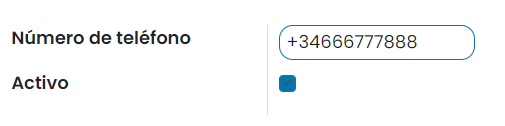

:nosearch:
:show-content:
:hide-page-toc:
:show-toc:

=================
Marketing por SMS
=================

Descripción

Añadir un número de teléfono en la lista negra
==============================================

Es posible que alguno de los destinatarios de mensajes SMS solicite no volver a recibir más mensajes de texto desde
Daeris. Para controlar esto, es posible agregar números de teléfono en la lista negra para que dejen de recibir mensajes
SMS desde campañas de marketing.

Para ello, navega a la pantalla :menuselection:`Ajustes --> SMS --> Lista negra de teléfonos` y pulsa el botón *Crear*.
A continuación, añade el número de teléfono que debes dejar de recibir mensajes SMS:

Una vez informado el número de teléfono, pulsa el botón *Guardar*.