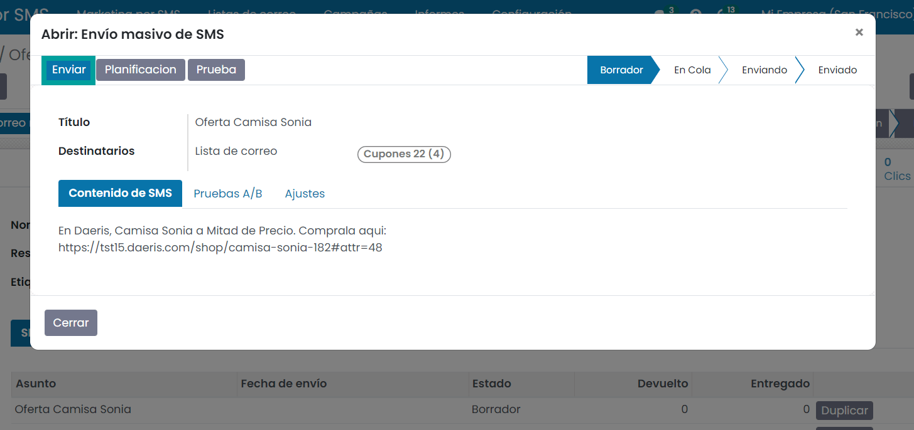
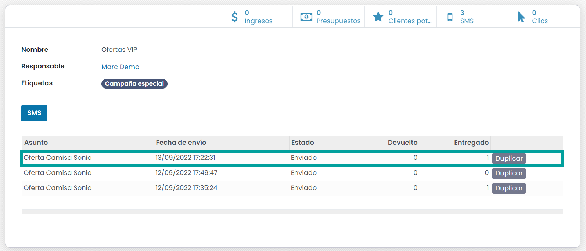

=================
Campañas
=================

Crear etapas
================

Las campañas de marketing permiten agrupar varios mailings y SMS de Marketing dentro de una campaña, además de
gestionar las propias campañas en diferentes etapas, usar pruebas A/B y realizar su seguimiento.

.. seealso::
   * :doc:`../../marketing/marketing_por_correo/campanas`

Crear una campaña
====================

Para activar el uso de las campañas de marketing, debes navegar a la pantalla
:menuselection:`Marketing por email --> Configuración --> Ajustes`, y activar la opción **Campañas de correo**.
Esta opción incluye la posibilidad de realizar campañas usando los **SMS de Marketing**.

Para crear una nueva campaña debes navegar a la pantalla :menuselection:`Marketing por SMS --> Campañas`, y pulsar el botón **Crear**.

El sistema despliega un formulario desde donde poder introducir el nombre, el responsable y las etiquetas de la campaña.

Si pulsamos el botón **añadir**, la información será registrada. Si pulsamos el botón **editar**, pasaremos a
visualizar la campaña en modo formulario.

Crear mailings de SMS asociados a campañas
============================================

Para gestionar una campaña debes navegar a la pantalla :menuselection:`Marketing por SMS --> Campañas`, y hacer clic sobre la campaña deseada.

Desde la propia campaña es posible generar un nuevo SMS de Marketing mediante el botón **enviar SMS**.

Esta acción, te permite navegar a la pantalla de edición del nuevo **SMS de Marketing**.

Desde este apartado debes informar el título, la lista de destinatarios y el contenido del SMS.

.. image:: campanas/campana08.png
   :align: center
   :alt: Crear campañas de marketing por SMS

Sobre la pestaña **Pruebas A/B** *NO debemos informar* el campo **Permitir pruebas A/B**, ya que estamos realizando
un SMS de Marketing simple sobre una campaña. *En el siguiente apartado se muestra el uso de las pruebas A/B*.

.. image:: campanas/campana10.png
   :align: center
   :alt: Crear campañas de marketing por SMS

Sobre la pestaña **Ajustes** podemos observar bajo el apartado **seguimiento**, como la campaña queda asociada
al nuevo SMS de Marketing.

El campo **Incluir enlace de exclusión** permite incorporar al final del mensaje del SMS el texto **DETENER SMS** además de un enlace hacia la web desde donde el usuario puede darse de baja de la lista.

.. warning::
   En el caso de usar la opción de **incluir enlace de exclusión** debes tener en cuenta que se incluirá al final del mensaje el texto **DETENER SMS https://tudominio.com/sms/XXXX/XXX**.

   Esto hará crecer el número de caracteres de tu mensaje (35 + el número de caracteres de tu dominio). Esta suma del conjunto de caracteres **no se ve reflejado a la hora de contabilizar el número de SMS que se enviarán** , pero si afectará en el resultado final.

   Has de tener muy presente este punto al realizar tus campañas de marketing para evitar costes inesperados ya que pueden llegar a enviarse mas SMS por destinatario de los que la plataforma indica.

   Ten presente que el realizar una prueba mediante el botón **Prueba** no incluye el enlace de excusión sobre la prueba.

   .. image:: sms_mailing/sms03f.png
      :align: center
      :alt:  Crear un SMS de Marketing por SMS

Una vez completado el SMS de Marketing, es posible enviarlo a sus destinatarios de forma inmediata mediante el botón
**Enviar** o planificar el envío mediante el botón **Planificación**.

Si ejecutas el botón **Enviar** la aplicación solicita confirmación, ya que los correos se enviarán de forma inmediata.

Al aceptar el mensaje, se programa el SMS para ser enviado en unos minutos, y se actualiza el estado del SMS de Marketing
a el valor “Finalizado”.

.. image:: campanas/campana12b.png
   :align: center
   :alt: Crear campañas de marketing por SMS

.. attention::
   El **envío masivo de SMS** deja las comunicaciones en una **cola de envío**. Dicha cola se procesa en intervalos de una hora, con lo que tus mensajes pueden tardar **hasta una hora en enviarse**.

Pasados unos minutos (puede tardar hasta una hora en realizarse el envío), debemos actualizar la página para validar que los SMS han sido enviados.

Sobre la parte superior podremos ver un mensaje indicando el numero de SMS rechazados y enviados.

Al hacer clic sobre cada numero es posible navegar al detalle de la información.

Sobre la parte superior derecha podremos ver un conjunto de iconos que nos muestra:

-  **Porcentaje de correos recibidos**: Volumen de correos que han sido recibidos por sus destinatarios con éxito.
-  **Porcentaje de correos clics**: Volumen de correos cuyo destinatario ha hecho clic sobre algún enlace
-  **Porcentaje de correos devueltos**: Volumen de correos devueltos por el servidor.

.. attention::
    Si el SMS de marketing aparece como enviado y no se muestran los iconos de porcentajes es posible que sea debido a que
    tu SMS de Marketing no ha podido ser enviado a ningún destinatario. Consulta el estado de los destinatarios de tu lista
    de mailings.

Con el paso del tiempo puedes ver como las estadísticas van cambiando en función de las acciones que realicen los
destinatarios de la lista.

Si navegamos a la pantalla de campañas podemos visualizar desde la vista Kanban el estado de nuestra campaña así
como la siguiente información relevante:

-  Nombre de la campaña y etiquetas
-  Numero de mailings que dispone
-  Porcentaje de clics
-  Número de clientes potenciales
-  Ingresos
-  Numero de presupuestos

.. image:: campanas/campana15.png
   :align: center
   :alt: Crear campañas de marketing por SMS

En el caso de que quieras cambiar la campaña de etapa, puedes arrástrala hacia la etapa deseada.

También puedes editarla haciendo clic sobre el registro.

En el formulario de detalle de la campaña podemos visualizar sobre la parte superior derecha, varios iconos que
muestran la siguiente información:

-  Ingresos
-  Numero de presupuestos
-  Número de clientes potenciales
-  Numero de SMS de marketing que dispone
-  Número de clics

Sobre la pestaña **SMS** disponemos de una lista con los datos de todos los SMS de Marketing relacionados con la campaña.

Crear SMS de marketing usando Pruebas A/B
==============================================

Para gestionar una campaña debes navegar a la pantalla :menuselection:`Marketing por SMS --> Campañas`, y hacer clic sobre la campaña deseada.

Desde la propia campaña es posible generar un nuevo SMS de Marketing mediante el botón **enviar SMS**.

Esta acción, te permite navegar a la pantalla de edición del nuevo SMS de Marketing.

Desde este apartado debes informar el título, la lista de destinatarios y el contenido del SMS, adaptandolo a tus necesidades.

Con el objetivo de indicar que vamos a proceder a realizar pruebas con un volumen determinado de destinatarios
antes de realizar el envío completo, se debe informar sobre la pestaña **Pruebas A/B** el campo **Permitir pruebas A/B**.

Esta acción habilita el porcentaje de destinatarios a enviar, la forma de obtener el SMS ganador de entre todas las
versiones que realices y la fecha en la que finalizará el test y se procederá a evaluar el ganador con el correspondiente
envio a todos los destinatarios que no hayan recibido el SMS o una de sus versiones de prueba.

Mediante el botón **Crear una versión alternativa** es posible generar una versión del SMS, aunque en este caso crearemos
la versión una vez hayamos finalizado la edición de esta primera versión.

Sobre la pestaña **Ajustes** podemos observar bajo el apartado **seguimiento**, como la campaña queda asociada
al nuevo SMS de Marketing.

El campo **Incluir enlace de exclusión** permite incorporar al final del mensaje del SMS el texto **DETENER SMS** además de un enlace hacia la web desde donde el usuario puede darse de baja de la lista.

.. warning::
   En el caso de usar la opción de **incluir enlace de exclusión** debes tener en cuenta que se incluirá al final del mensaje el texto **DETENER SMS https://tudominio.com/sms/XXXX/XXX**.

   Esto hará crecer el número de caracteres de tu mensaje (35 + el número de caracteres de tu dominio). Esta suma del conjunto de caracteres **no se ve reflejado a la hora de contabilizar el número de SMS que se enviarán** , pero si afectará en el resultado final.

   Has de tener muy presente este punto al realizar tus campañas de marketing para evitar costes inesperados ya que pueden llegar a enviarse mas SMS por destinatario de los que la plataforma indica.

   Ten presente que el realizar una prueba mediante el botón **Prueba** no incluye el enlace de excusión sobre la prueba.

   .. image:: sms_mailing/sms03f.png
      :align: center
      :alt:  Crear un SMS de Marketing por SMS

Para finalizar la edición de esta versión, haz clic sobre el botón **Guardar**.

Posiciónate sobre la pestaña **Pruebas A/B** y haz clic sobre el botón **Crear una versión Alternativa** para generar una versión del SMS de marketing.

Esta acción, te permite navegar a la pantalla de edición del nuevo SMS de marketing, desde donde puedes editar el
el texto del SMS para establecer las diferencias con la primera versión.

Sobre la pestaña **Pruebas A/B** pues incorporar el porcentaje de correos de prueba y la fecha de envío definitva.

Para finalizar la edición de esta versión, haz clic sobre el botón **Guardar** y posiciónate sobre la campaña
haciendo clic sobre el enlace que dispone el nombre de la campaña.

.. image:: campanas/pruebas10.png
   :align: center
   :alt: Crear campañas de marketing

Una vez disponemos de las versiones en borrador sobre la campaña, podemos realizar el envío con el objetivo
de medir su efectividad.

Para enviar una versión, haz clic sobre su registro sobre la pestaña SMS. Esta acción, abrira una ventana
con los detalles de la versión. Para realizar el envio de la versión se ha de hacer clic sobre el botón
**Enviar**.

.. note::
    En el caso de que no quieras enviar la prueba A/B en este preciso instante, planifica el envío mediante el botón **planificar** e incorpora la fecha de planificación deseada.

Al hacer clic sobre el botón **Enviar**, el sistema solicita confirmación. Haz clic sobre el botón **Aceptar**.

Una vez planificado el envío, puedes salir de la ventana emergente haciendo clic sobre el botón **Cerrar**.

Actualiza la información de la campa mediante el botón **Actualizar**.

Sobre la campaña, puedes repetir la acción de **Enviar** una versión, haciendo clic sobre el registro en
estado borrador de la pestaña **SMS**.

Sobre la nueva ventana, haz clic sobre el botón **Emviar** y acepta el mensaje de confirmación..

Una vez realizado el envío, puedes salir de la ventana emergente haciendo clic sobre el botón **Cerrar**.

Actualiza la información de la campa mediante el botón **Actualizar**.

Cada vez que accedas a la campaña de marketing podrás observar los resultados de ambas versiones.

.. image:: campanas/pruebas18.png
   :align: center
   :alt: Crear campañas de marketing

Si navegas al detalle de una de las versiones y te posicionas sobre la pestaña **Pruebas A/B** puedes
**Crear una versión alternativa** con nuevas modificaciones, para que compita con las versiones existentes.

   .. image:: campanas/pruebas19.png
      :align: center
      :alt: Crear campañas de marketing

En el momento que llegue la **fecha definitiva**, se generará una **nueva versión de la versión ganadora**
que será enviada al resto de destinatarios que no hayan recibido ninguna de las versiones de pruebas.

