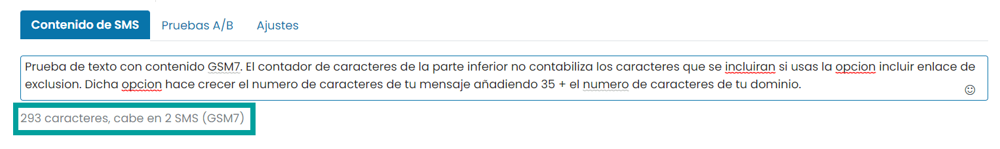
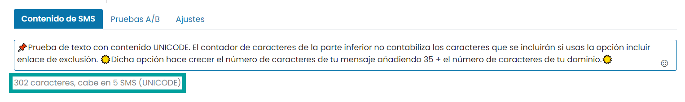
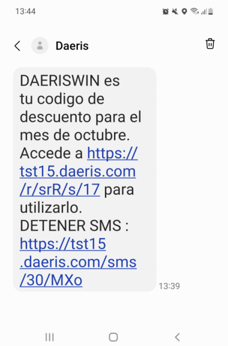

=================
Consideraciones
=================

Activar el envío de SMS
===========================

Para poder realizar los envíos por SMS, es necesario contratar los servicios de un proveedor externo de telefonía que realice dichos envíos.

`OVH <https://www.ovh.es/sms/>`_ permite enviar SMS por Internet mediante la conexión a su API integrada con Daeris.

La integración de la función de envío de SMS con OVH requiere que se realice configuración tanto en OVH como en Daeris.

.. seealso::
   * :doc:`../../varios/sms`

.. _marketing/marketing_por_sms/configuración/alfabeto_sms:

Alfabeto GSM y Unicode
===========================

El envío de SMS puede usar el alfabeto **GSM** o el alfabeto **Unicode**.

El alfabeto **GSM** tiene un límite de **160 caracteres por SMS** y **no incluye muchos caracteres especiales** como,
por ejemplo, algunos acentos.

El límite se reduce a 153 caracteres por SMS en el caso de utilizar SMS concatenados (Contenido que ocupa más de un SMS).

.. list-table:: Alfabeto GSM
   :widths: 10 10 10 10 10 10 10 10 10 10 10 10 10 10 10 10
   :header-rows: 0

   * - @
     - £
     - $
     - ¥
     - è
     - é
     - ù
     - ì
     - ò
     - Ç
     - å
     - Ø
     - ø
     - Å
     - ¡
     - ENTER
   * - Δ
     - _
     - Φ
     - Γ
     - Λ
     - Ω
     - Π
     - Ψ
     - Σ
     - Θ
     - Ξ
     - Æ
     - æ
     - ß
     - É
     - SPACE
   * - !
     - \"
     - #
     - ¤
     - %
     - &
     - '
     - (
     - )
     - \*
     - \+
     - ,
     - \-
     - .
     - /
     - NEWLINE
   * - 0
     - 1
     - 2
     - 3
     - 4
     - 5
     - 6
     - 7
     - 8
     - 9
     - :
     - ;
     - <
     - =
     - >
     - ?
   * - A
     - B
     - C
     - D
     - E
     - F
     - G
     - H
     - I
     - J
     - K
     - L
     - M
     - N
     - O
     - P
   * - Q
     - R
     - S
     - T
     - U
     - V
     - W
     - X
     - Y
     - Z
     - Ä
     - Ö
     - Ñ
     - Ü
     - §
     - ¿
   * - a
     - b
     - c
     - d
     - e
     - f
     - g
     - h
     - i
     - j
     - k
     - l
     - m
     - n
     - o
     - p
   * - q
     - r
     - s
     - t
     - u
     - v
     - w
     - x
     - y
     - z
     - ä
     - ö
     - ñ
     - ü
     - à
     - \\

El volumen de caracteres del alfabeto **GSM** lo hace la mejor opción a la hora de enviar SMS, debido a que
permite emitir mayor numero de caracteres por SMS, reduciendo el impacto económico de los envíos.

El alfabeto **Unicode** tiene un limite de **70 caracteres por SMS** y **permite incluir gran cantidad de caracteres
especiales**.

El límite se reduce a 67 caracteres por SMS en el caso de utilizar SMS concatenados (Contenido que ocupa más de un SMS).

En el caso de enviar SMS con contenido reducido (menos de 70 caracteres), es aconsejable usar el alfabeto Unicode, e
incluir prácticamente todos los formatos y caracteres que existen en la actualidad e incluso añadir emojis.

El editor de SMS de Daeris, dispone de un contador de caracteres que detecta automáticamente el **número de caracteres**
que ocupa el texto redactado, así como el **alfabeto** que debe usarse y el **número de SMS** que ocupa, dando prioridad
al uso del alfabeto GSM.

Al redactar un texto que incluya exclusivamente caracteres del alfabeto GSM, el **contador establecerá el uso del
alfabeto GSM** y contabilizará el número de SMS a enviar en base a ello.

Al redactar un texto que incluya caracteres no soportados sobre el alfabeto GSM, el **contador establecerá el uso del
alfabeto UNICODE** y contabilizará el número de SMS a enviar en base a ello.

Al usar SMS de marketing, es posible incorporar la opción de **incluir enlace de exclusión**. Debes tener en cuenta que,
al usar esta opción, se incluirá al final del mensaje el texto **DETENER SMS https://tudominio.com/sms/XXXX/XXX**.

Esto hará **crecer el número de caracteres de tu mensaje** (35 + el número de caracteres de tu dominio).

Esta suma del conjunto de caracteres **no se ve reflejado a la hora de contabilizar el número de SMS que se enviarán**, pero si
afectará en el resultado final.

Has de tener muy presente este punto al realizar tus campañas de marketing para **evitar costes inesperados** ya
que pueden llegar a enviarse **más SMS por destinatario** de los que la plataforma indica.

