=================
Listas de correo
=================

Las listas de correo son agrupadoras de contactos que disponen de una **cuenta de correo** y/o **número de teléfono móvil**.
Sirven para establecer comunicaciones a través de **mailings** o **SMS de marketing**.

Crear listas de correo
=======================

Es posible gestionar las listas de correo existentes en la aplicación
desde la pantalla :menuselection:`Marketing por SMS --> Listas de correo --> Listas de correo`,
o desde la pantalla :menuselection:`Marketing por email --> Listas de correo --> Listas de correo`.

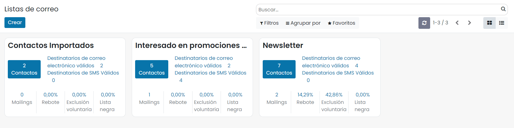

Puedes crear nuevas listas mediante el botón **Crear**, acción que abre un formulario desde donde poder
introducir los siguientes datos:

-  **Lista de correo**: Nombre de la lista.
-  **Es público**: Al marcar este campo, el destinatario podrá acceder a la lista de correo en la página de cancelación de la suscripción para que pueda actualizar sus preferencias de suscripción.

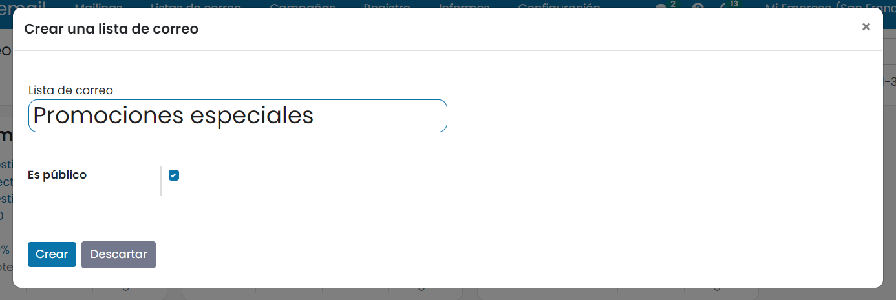

Mediante el botón **Crear** registramos los cambios introducidos.

Desde los bloques de la vista Kanban podemos visualizar varios datos y navegar hacia ellos:

-  El número de contactos que dispone la lista.
-  El número de destinatarios de correo electrónico validos
-  El número de destinatarios de SMS validos
-  El número de Mailings
-  La tasa de rebote
-  La tasa de exclusión voluntaria
-  La tasa de lista negra

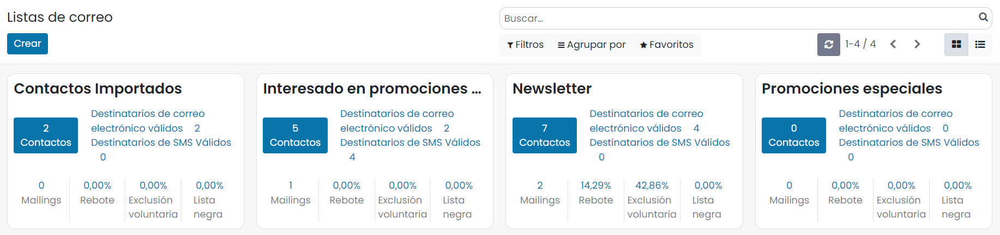

Si hacemos clic sobre el **titulo** podemos navegar a la pantalla de tipo formulario donde editar la información del
registro como:

-  **Es público**: El destinatario puede acceder a la página de cancelación de la suscripción a lista de correo y gestionar sus preferencias.

-  **Crear Contacto asociado**: Mediante esta opción, cada vez que se une un contacto a la lista de correos, se revisa si existe como contacto en la aplicación a partir del número de teléfono y/p móvil. Si existe, se asocia el contacto de la aplicación al contacto de la lista de correo. Si no existe, se crea un nuevo contacto en la aplicación y se asocia al contacto de la lista de correos.

Desde la pantalla de contactos de la aplicación, es posible visualizar si un contacto está asociado a un contacto de la lista de correos mediante el botón contacto de listas de correos.

Al hacer clic se visualiza el contacto de la lista de correos.

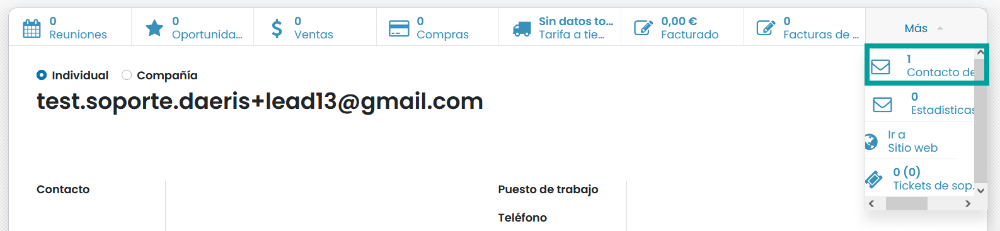

-  **Etiqueta del contacto asociado**: El uso de este contacto nos permite incorporar una etiqueta al contacto de la aplicación cuando se asocia a una lista de correos.
-  **Deshabilitar baja cruzada**: Cuando un contacto de una lista de correos cursa una baja, se procede a mostrar todas las listas de correos alas que está suscrito, dándole la posibilidad de darse de baja, si así lo decide. Al informar esta opción deshabilitamos la posibilidad de mostrar esta lista de correos cuando un contacto cursa una baja de otra lista de correos a la que este asociado.
-  **Plantilla de bienvenida**: Plantilla de correo electrónico que se usará para dar la bienvenida a la lista de correos a los contactos que se asocien a ella a través de un apartado de suscripción del sitio web o de una ventana emergente de suscripción.
-  **Lista Dinámica**: mediante esta opción se permite crear listas de correos de contactos de la aplicación. Al seleccionar esta opción se muestran una serie de campos para configurar la lista dinámica.

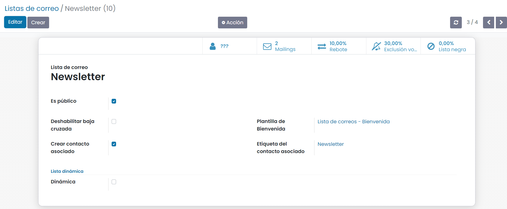

Crear contactos
=======================

Desde la pantalla :menuselection:`Marketing por SMS --> Listas de correo --> Contactos de la lista de correo`,
o desde la pantalla :menuselection:`Marketing por email --> Listas de correo --> Contactos de la lista de correo`,
puedes gestionar los contactos de las listas de correo existentes en la aplicación.

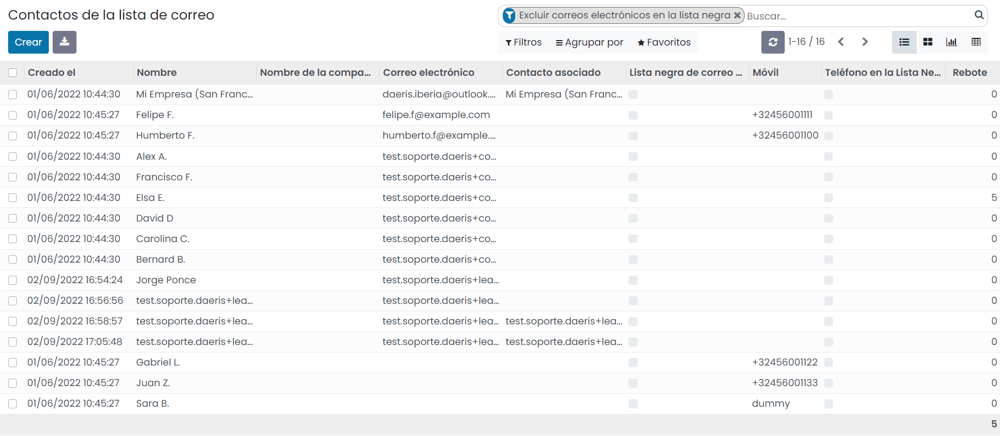

.. warning::
    Has de tener presente la legislación vigente de tu país, al dar de alta contactos sobre listas de correos, ya que
    es posible que solo puedas generarlos en el caso de haber recibido consentimiento expreso del propio contacto.

Para crear un nuevo contacto, puedes hacer clic sobre el botón **Crear**, que te llevará al siguiente formulario
de introducción de datos:

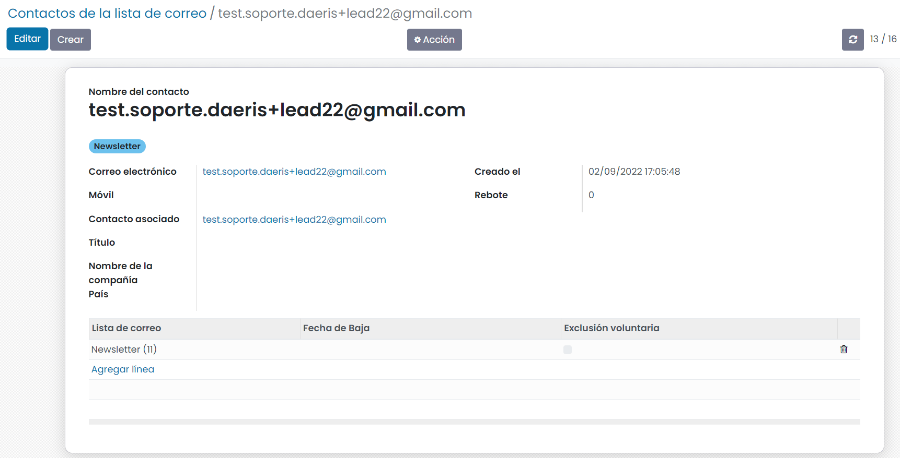

-  **Nombre**: Nombre del contacto.
-  **Etiquetas**: Etiquetas asociadas al contacto.
-  **Correo electrónico**: Email del contacto.
-  **Móvil**: Teléfono movil del contacto.
-  **Contacto asociado**: Campo de selección desde donde se puede incorporar el contacto de la aplicación. Este campo no es requerido, pero puedes informarlo si quieres asociar tu contacto de la lista de correos a un contacto de la aplicación. Debes tener en cuenta para evitar correos duplicados que este contacto debería tener el mismo email que el del contacto que estas dando de alta.
-  **Título**: Desplegable con varias opciones.
-  **Nombre de la compañía**: Permite informar la compañía del contacto.
-  **País**: Permite informar el país del contacto.
-  **Rebote**: Campo que se utiliza para almacenar el número de correos rebotados de este contacto.
-  **Lista de correo**: Permite añadir al contacto a las listas de correo existentes.

Al finalizar la edición recuerda hacer clic sobre el botón **Guardar**.

.. attention::
    Todos los contactos creados manualmente no recibirán correo de bienvenida.

Importar contactos
=======================

Es posible crear nuevos contactos, importándolos desde un fichero Excel que debe disponer de las columnas
necesarias para informar los detalles de cada registro.

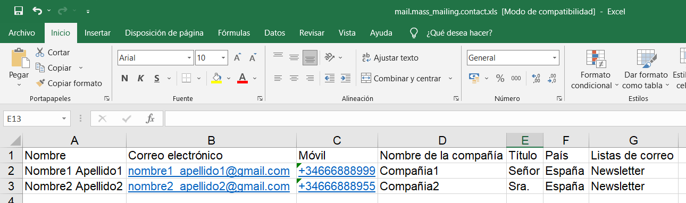

Desde la pantalla :menuselection:`Marketing por email --> Listas de correo --> Contactos de la lista de correo`
, puedes importar contactos sobre las listas de correo existentes en la aplicación.

Para importar un fichero haz clic sobre el menú **favoritos** seleccionando **Importar registros**.

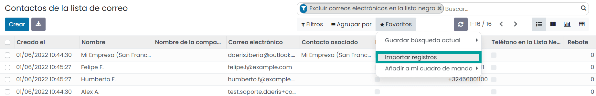

La aplicación navega a la pantalla de importación donde debes hacer clic sobre el botón **subir archivo**.

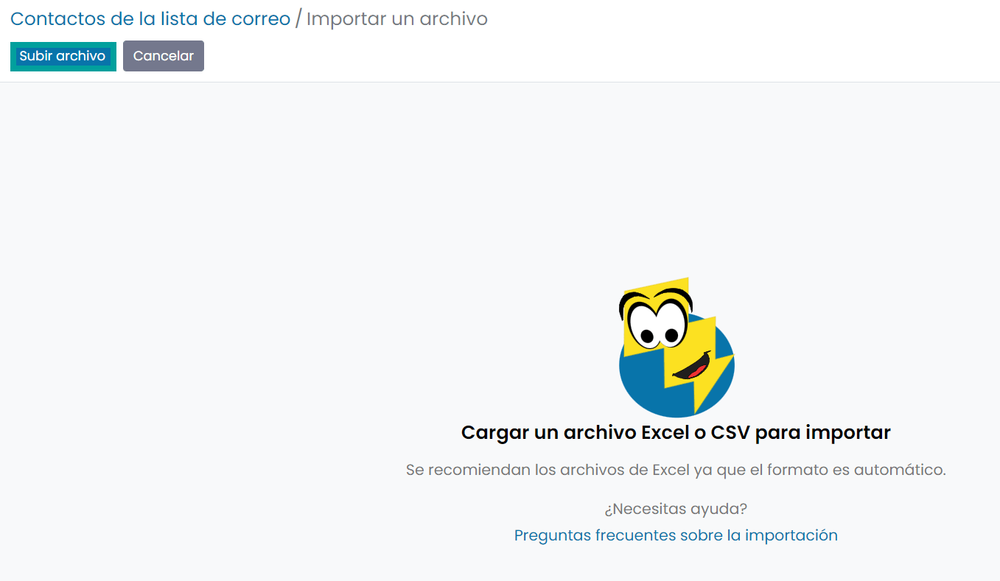

Selecciona el archivo que dispone de los datos de importación.

Haz clic sobre el botón **abrir**. Esta acción te lleva a la pantalla de importación donde debes indicar la
correspondencia entre la columna de tu archivo y la columna de Daeris.
Al finalizar pulsa el botón **importar**.

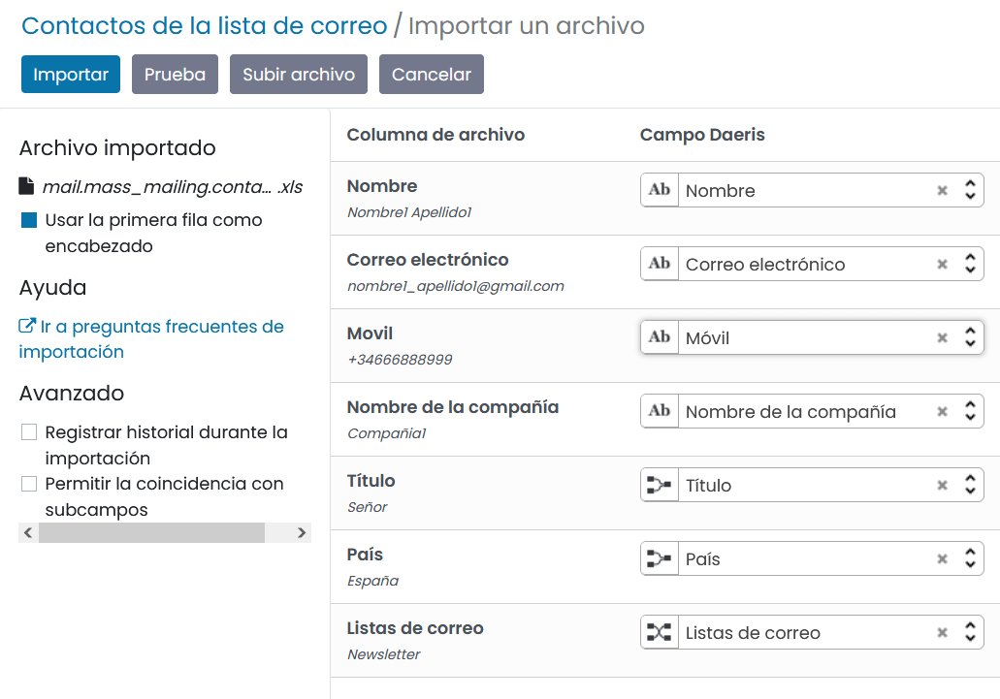

Los nuevos contactos se habrán creado y serán visibles desde el listado.

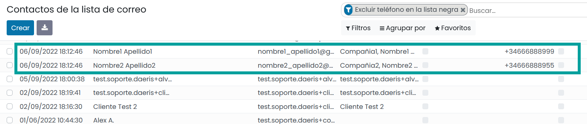

Al posicionarte sobre cualquiera de ellos podrás visualizar los datos importados.

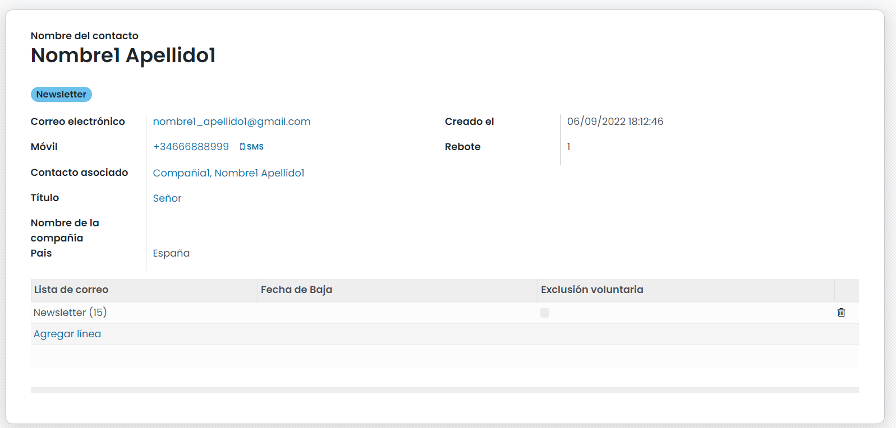

.. attention::
    Todos los contactos importados no recibirán correo de bienvenida.

Permitir gestionar las bajas de las suscripciones
==================================================

Cada vez que emitimos un SMS de Marketing, podemos incorporar el enlace que le permite tramitar su baja.
Para esta tarea se debe informar el campo **Incluir enlace de exclusión** disponible sobre la pestaña **Ajustes**.

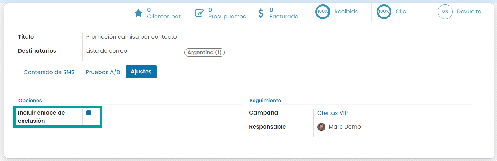

Mediante esta opción, se incorpora en enlace **DETENER SMS** en la parte final del texto.

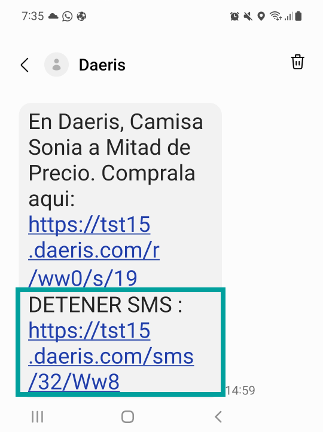

Cuando un contacto hace clic sobre el enlace **DETENER SMS**, navega a la página de cancelación de la
suscripciones y se le solicita que introduca el número de teléfono.

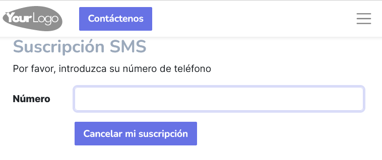

El contacto debe informar el teléfono y hacer clic sobre el botón **Cancelar mi suscripción**, acción que procede a
realizar la baja.

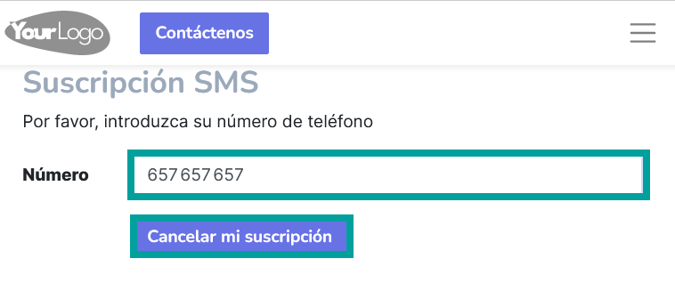

El sistema, muestra por pantalla un mensaje de confirmación indicando la lista sobre la que se ha dado
de baja.

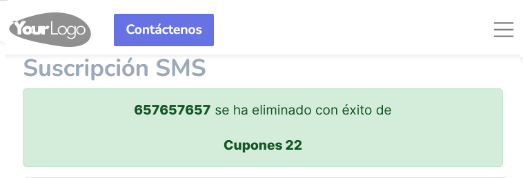

Para consultar los contactos que se han dado de baja de una lista de correos, debes navegar a la pantalla
:menuselection:`Marketing por SMS --> Listas de correo --> Contactos de las listas de correos`.

El campo **Esclusión voluntaria** indica que el contacto se ha dado de baja.

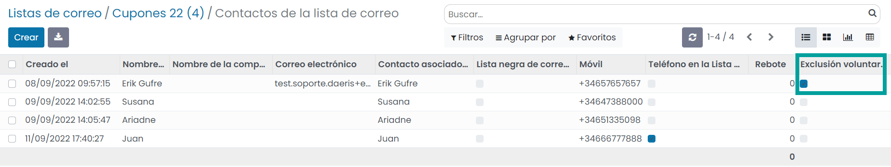
