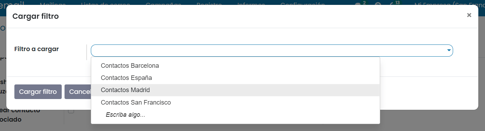
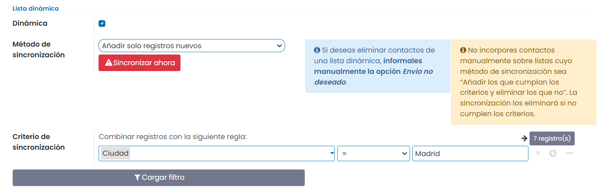

==================================
Listas de correo dinámicas
==================================

Una lista de correos dinámica es un listado que se genera a partir de los contactos disponibles en pantalla de
contactos, filtrado por los criterios deseados.

Este listado se actualiza de forma automática a diario, revisando si existen nuevos contactos que cumplen con los
criterios establecidos.

Crear listas de correo dinámicas
=================================

Las listas de correo dinámicas se crean desde la misma pantalla que las listas de correo.

Para editar o dar de alta una nueva lista, debes navegar a la pantalla
:menuselection:`Marketing por SMS --> Listas de correo --> Listas de correo`.

.. image:: listas_dinamicas/dinamica01.png
   :align: center
   :alt: Crear listas de correo dinámicas

Al crear una nueva lista se muestra un asistente por pantalla, desde donde podemos informar el **nombre** de la lista,
así como si queremos que los visitantes puedan darse de alta y baja mediante el campo **es público**.
Una vez informados los campos, pulsa el botón **guardar**.

Para convertir una lista de correo en dinámica, debes informar el campo **Dinámica** del apartado **lista dinámica**.

Al informar el campo **Dinámica** aparecen una serie de nuevas opciones para definir la lista dinámica:

-  **Método de sincronización**: Este campo indica si al sincronizar la lista a diario se procede a incorporar los contactos que cumplan los criterios y no están asociados o a incorporarlos y dar de baja a aquellos que han dejado de cumplirlos.
-  **Criterio de sincronización**: Permite mediante un panel editable, incorporar las condiciones de la búsqueda de los contactos. Es posible indicar que se han de cumplir todas las condiciones para incorporar al contacto mediante la opción **Todo** o que con que se cumpla una de las condiciones es suficiente para incorpóralo mediante la opción **Cualquiera**.

.. attention::
   Sobre **criterio de sincronización** se incorporan por defecto las condiciones que indican que el contacto no está en la lista negra y que dispone de un correo electrónico al cual emitir el correo.
   Estas condiciones pueden eliminarse, pero esta acción solo tendrá efecto sobre el filtro que hace referéncia al correo electrónico, ya que impedir la introducción de contactos de la lista negra es un criterio fijado a la hora de sincronizar los contactos.

Es posible incorporar nuevas condiciones sobre el criterio de sincronización. Para ello haz clic sobre el botón **+**. Posteriormente busca el campo sobre el que quieras indicar la condición y añádele la condición de búsqueda.

Mediante el botón **Cargar filtros** es posible incorporar como criterios de búsqueda, los mismos criterios que
disponen los filtros de las búsquedas en **favoritos** del listado de **contactos**, en el caso de disponer de alguno.

Al ejecutar el botón, aparece un desplegable desde donde debes indicar el **filtro** a cargar.
Una vez informado el filtro debes pulsar el botón **Cargar filtro**.

Al cargar los filtros, se borran las condiciones anteriores y se incorporan las del filtro seleccionado.

.. attention::
   Es importante añadir la condicion inicial que hace referencia a que el usuario **no está en la lista negra**.
   No añadirla implica que pueden existir diferencias entre el número de resultados indicado en el criterio de sincronización y el número de contactos disponible tras la sincronización.
   Esto es debido a que el criterio inicial que hace referencia a la lista negra aplica **SIEMPRE**, incluso cuando se ha eliminado del criterio de sincronización.

Una vez informados los criterios de búsqueda, debes hacer clic sobre el botón **Sincronizar ahora** para que se
incorporen los contactos a la lista. Hasta que no se realice esta acción el valor del indicador de número de
destinatarios será igual a **???**.

Al sincronizar la lista se actualiza el número de destinatarios.

Es posible que el proceso de sincronización falle si dispones de contactos duplicados en el campo **email**.

En el caso de tener duplicados, puedes **fusionarlos** mediante la opción **Combinar contactos** disponible sobre
el listado de contactos de la aplicación Contactos.

.. seealso::
   * :doc:`../../ventas/contactos`

Si haces clic sobre el número de destinatarios, puedes acceder al listado de destinatarios filtrado por aquellos que
no disponen de la marca **envío no deseado**.

Desde este listado puedes incorporar nuevos destinatarios, pero recuerda que, si como método de sincronización has
informado **Añadir los que cumplan los criterios y eliminar los que no**, estos nuevos destinatarios serán borrados
cuando se sincronice la lista.

Al hacer clic sobre un registro del listado navegas al formulario de detalle del destinatario. Desde el apartado de
listas de correo asociadas puedes informar si el destinatario no quiere recibir las comunicaciones de la lista de
correo mediante el campo **Exclusión voluntaria**.

Criterios de segmentación
=================================

Daeris permite segmentar las listas de correo dinámicas aplicando filtros para obtener un nivel granular en tus
resultados.

Al utilizar el asistente de filtros se muestran los campos relacionados con el contacto. Varios de estos campos
muestran una flecha en el lado derecho. Esta flecha es un indicador de que el campo dispone de campos relacionados
con él, que pueden ser usados en la búsqueda.

El criterio de sincronización está compuesto por **nodos**. Un nodo es un filtro de primer nivel el cual dispone de una expresión de búsqueda.

Es posible configurar el criterio de sincronización para indicar que los resultados se han de obtener aplicando
**Todos** los filtros de todos los nodos o aplicando **cualquier** filtro de todos los nodos:

   - Si se aplican todos los filtros, los resultados serán los que cumplan todos los criterios.
   - Si se aplica cualquier filtro, los resultados serán los que cumplan como mínimo uno de los criterios.

Las **ramas** son filtros de segundo nivel asociados a los **nodos** las cuales disponen de una expresión de
búsqueda que se complementa con la del nodo.

Es posible configurar el criterio de sincronización para indicar que los resultados se han de obtener aplicando
**cualquier** filtro de todas las ramas del nodo más el filtro del nodo. Si se aplican **Todos los filtros** de todas las ramas del nodo estos
se convierten en nodos.

   - Si se aplican todos los filtros, estos se convierten en nodos. Los resultados serán los que cumplan todos los criterios.
   - Si se aplica cualquier filtro, los resultados serán los que cumplan como mínimo uno de los criterios de las ramas más el filtro del nodo.

