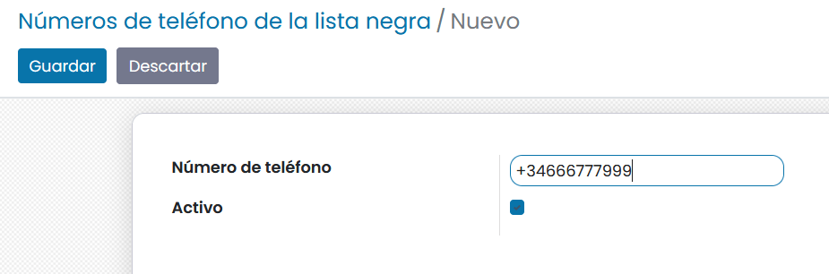
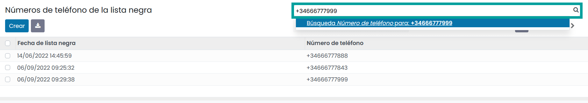
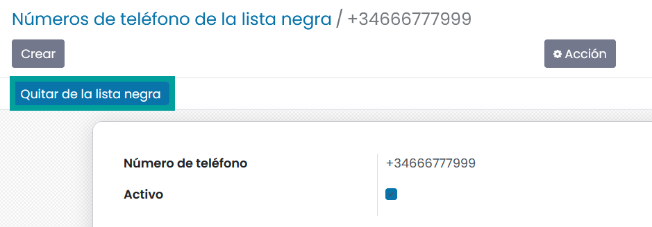
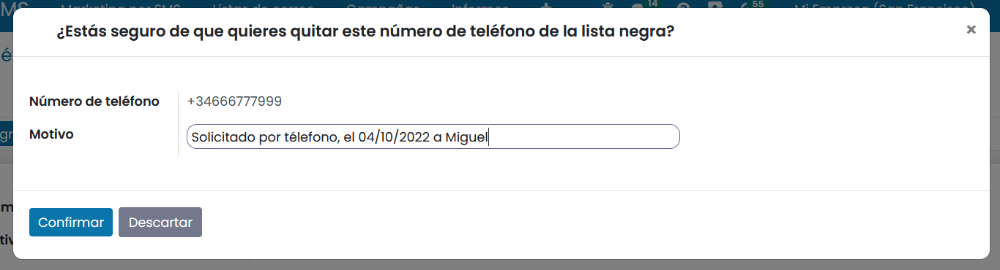
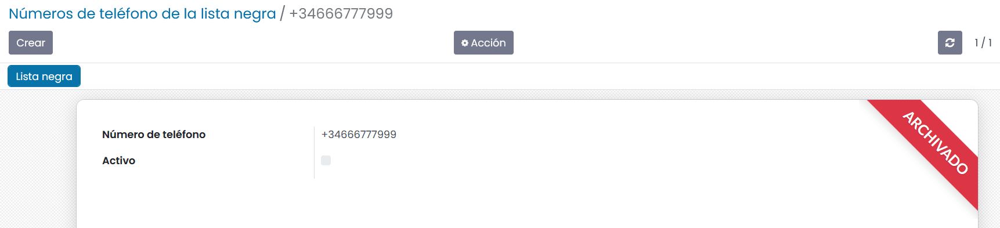

===============
Listas negras
===============

Un número de teléfono en la lista negra implica que el destinatario no recibirá más SMS
de ninguno de los SMS de marketing configurados en la aplicación.

Añadir un número de teléfono en la lista negra
==============================================

Es posible que alguno de los destinatarios de mensajes SMS solicite no volver a recibir más mensajes de texto desde
Daeris. Para controlar esto, es posible agregar números de teléfono en la lista negra para que dejen de recibir mensajes
SMS desde campañas de marketing.

Para ello, navega a la pantalla :menuselection:`Marketing por SMS --> Configuración --> Números de teléfono de la lista negra` y pulsa el botón *Crear*.
A continuación, haz clic sobre el botón **Crear** y añade el número de teléfono que debe dejar de recibir mensajes SMS.

Una vez informado el número de teléfono, pulsa el botón *Guardar*.

.. note::
   El número de teléfono debe disponer del código internacional del país, como por ejemplo **+34** 678678678.

Eliminar una número de teléfono de la lista negra
==================================================

En el caso de que necesites eliminar un  número de teléfono de la lista negra navega a la
pantalla :menuselection:`Marketing por SMS --> Configuración --> Números de teléfono de la lista negra`
, incorpora sobre el cajetín de búsqueda el número que quieres eliminar de la lista y pulsa la tecla **Intro**.

Una vez encontrado el registro, haz clic sobre él. Desde el formulario haz clic sobre el botón **Quitar de la lista negra**.

Al hacer clic sobre el botón, aparece una ventana desde donde debes introducir el motivo por el que se elimina de la lista negra.
Introduce el motivo y haz clic sobre el botón **Confirmar**.

Al confirmar, el número de teléfono queda archivado y ya no está asociado a la lista negra.

