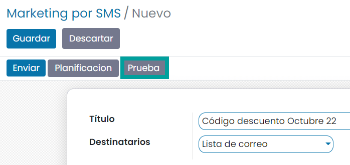
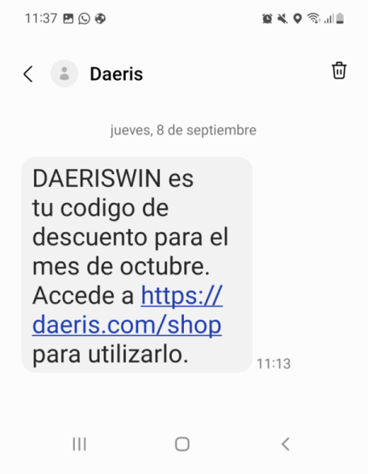
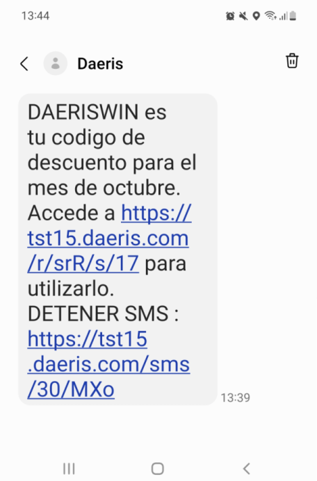
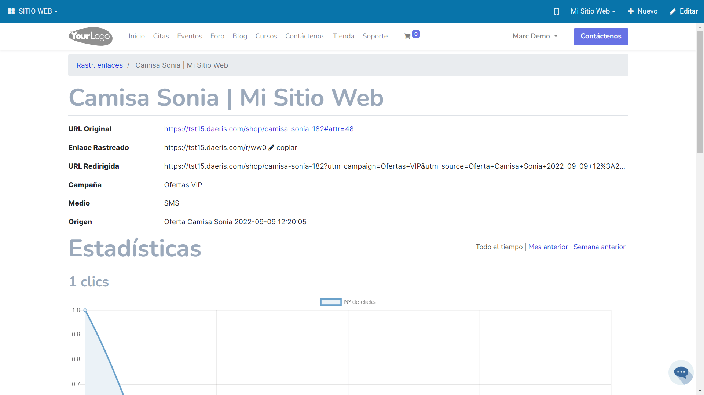
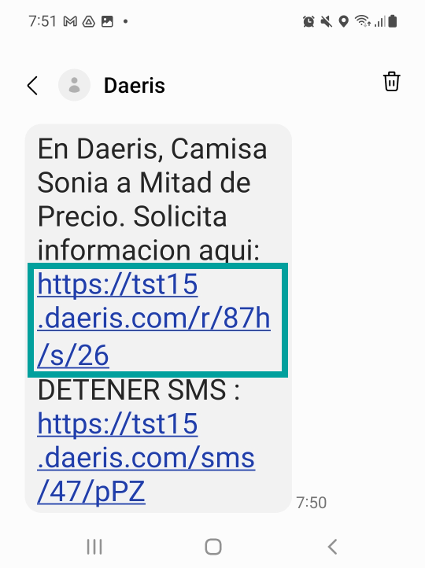

=================
SMS de Marketing
=================

El marketing por SMS permite enviar anuncios o cualquier tipo de mensaje comercial a un grupo de personas,
ya sean clientes actuales o potenciales de la compañía, ayudando a persuadir a los clientes potenciales y a retener a
los clientes actuales.

Además, es posible emitir comunicaciones a contactos de listas de correos, candidatos a ofertas de empleo, personas
registradas a un evento o a una sesión de evento y a clientes que han efectuado algún pedido de venta.

La tasa de apertura de una campaña de marketing por SMS se estima en un **98%** por lo que se considera el medio
más eficiente a la hora de realizar marketing.

La aplicación de **Marketing por SMS** de Daeris, te permite realizar marketing por SMS orientado a los objetivos que desees
como, por ejemplo:

-  **Boletines de noticias** que se envían semanal, quincenal o mensualmente en el que se emiten noticias relacionadas con la temática a la que están suscritos los contactos.
-  **Titulares** de la nueva información publicada en el sitio web, blog, … con enlaces hacia el articulo completo.
-  **Novedades** de nuevos productos o servicios que oferta la empresa.
-  **Ofertas** de productos de los que interesa reducir el stock.
-  **Campañas de ventas** en periodos señalados como el Black Friday, Rebajas de Navidad, verano, etc.…
-  **Cupones de descuento** al realizar un gasto superior a cierta cantidad.
-  **Mejoras** en los servicios contratados por los clientes con el objetivo de retenerlos.

Crear un SMS de Marketing
===========================

Para crear un nuevo envío de SMS de marketing, debes navegar a la pantalla
:menuselection:`Marketing por SMS --> Marketing por SMS`, y hacer clic en el botón **Crear**, lo que te llevará
a un formulario desde donde podrás completar la siguiente información:

-  **Título**: Nombre del SMS para uso interno. Este texto no será enviado.
-  **Destinatarios**: Puedes elegir entre una de las siguientes opciones:

   -  **Cliente Potencial/Oportunidad**: Permite seleccionar todos los clientes potenciales y oportunidades cargados en la aplicación, o establecer un filtro que limite los registros. Al pulsar el botón **Añadir filtro**, puedes añadir un filtro que limite los registros a los que enviar el SMS.

   .. image:: sms_mailing/sms02.png
      :align: center
      :alt:  Crear un SMS de Marketing

   Por ejemplo, podrías añadir un filtro para que solo queden seleccionados los clientes potenciales y oportunidades de un país en concreto. De esta manera, puedes segmentar los registros de la base de datos, y enviar el SMS a los destinatarios adecuados.

   .. image:: sms_mailing/sms03.png
      :align: center
      :alt:  Crear un SMS de Marketing

   -  **Lista de correo**: Permite seleccionar una lista de correo existente, o crear una nueva. Las listas de correo son listas que contienen números de teléfono móvil e información de los destinatarios.
   -  **Contacto**: Permite seleccionar todos los contactos cargados en la aplicación, o establecer un filtro que limite los registros.
   -  **Contacto de correo**: Permite seleccionar todos los contactos de todas las listas de correos cargados en la aplicación, o establecer un filtro que limite los registros.
   -  **Pedido de venta**: Permite seleccionar entre todas las personas que hayan realizado un pedido de venta, o establecer un filtro que limite los registros.
   -  **Registro de eventos**: Permite seleccionar entre todas las personas que hayan asistido a un evento, o establecer un filtro que limite los registros.
   -  **Sesión del evento**: Permite seleccionar entre todas las personas que hayan realizado una sesión en un evento, o establecer un filtro que limite los registros.
   -  **Candidato**: Permite seleccionar entre todas las personas que se hayan inscrito en una oferta de trabajo, o establecer un filtro que limite los registros.

-  **Contenido de SMS**: Permite editar el texto del SMS hasta un **máximo de 160 caracteres** (GSM7) o **70 caracteres** (Unicode).

   -  El sistema informa en tiempo real sobre el alfabeto que usará en el envío a partir de los caracteres introducidos sobre el texto, así como el número de SMS.

.. warning::
   En el caso de usar la opción de **incluir enlace de exclusión** debes tener en cuenta que se incluirá al final del mensaje el texto **DETENER SMS https://tudominio.com/sms/XXXX/XXX**.

   Esto hará crecer el número de caracteres de tu mensaje (35 + el número de caracteres de tu dominio). Esta suma del conjunto de caracteres **no se ve reflejado a la hora de contabilizar el número de SMS que se enviarán**, pero si afectará en el resultado final.

   Has de tener muy presente este punto al realizar tus campañas de marketing para evitar costes inesperados ya que pueden llegar a enviarse más SMS por destinatario de los que la plataforma indica.

   Ten presente que el realizar una prueba mediante el botón **Prueba** no incluye el enlace de excusión sobre la prueba.

   .. image:: sms_mailing/sms03f.png
      :align: center
      :alt:  Crear un SMS de Marketing

.. seealso::
   * :ref:`marketing/marketing_por_sms/configuración/alfabeto_sms`

Desde la pestaña de **Ajustes** puedes detallar la siguiente información:

-  **Incluir enlace de exclusión**: Introduce al final del texto del mensaje el texto **DETENER SMS** además de un enlace hacia la web desde donde el usuario puede darse de baja de la lista.
-  **Campaña**: Campaña de la que forma parte el SMS. (*Solo disponible al activar el uso de las campañas de marketing*).
-  **Responsable**: Usuario gestor del SMS de marketing.

   .. image:: sms_mailing/sms03c.png
      :align: center
      :alt:  Crear un SMS de Marketing

Una vez guardado el contenido del SMS, es posible hacer una prueba de envío para comprobar que la configuración
es correcta. Para ello debes pulsar el botón **Prueba**.

Esto te permite informar el número de teléfono móvil con formato internacional sobre el cual recibir el mensaje de prueba.

.. important::
   Al probar un mensaje que dispone de la opción **Incluir enlace de exclusión**, el enlace **NO se incluye** en la prueba.

Al pulsar el botón **Enviar** de la ventana de prueba, se enviará un SMS, y podrás comprobar si la configuración es correcta.

Es recomendable revisar el SMS antes de un envío masivo para verificar la correcta recepción y número de caracteres
utilizado.

Una vez validado el mensaje, podrás planificar el envío del SMS para una fecha y hora, de manera que cuando
llegue esa fecha y hora, el SMS se envíe de forma automática, sin necesidad de ninguna acción manual.
Para ello, debes pulsar el botón **Planificación**.

Esto te permitirá seleccionar una **fecha y hora** de envío del SMS de marketing.

Al seleccionar la fecha correspondiente y tras pulsar el botón **Planificación**, el SMS quedará programado para su envío.

Si, una vez realizada la planificación, por alguna razón, quisieras cancelar el envío, deberías pulsar el botón **Cancelar**.

Por último, si lo que quieres es realizar el envío de forma inmediata, debes pulsar el botón **Enviar**.

Al realizar el envío, los SMS quedan en estado **En cola**.

.. important::
   El **envío masivo de SMS** deja las comunicaciones en una **cola de envío**. Dicha cola se procesa en intervalos de una hora, con lo que tus mensajes pueden tardar **hasta una hora en enviarse**.

En el caso de que uno o varios SMS no hayan podido ser enviados por cualquier motivo (por ejemplo, la falta de créditos en la cuenta de OVH), podrás volver a realizar el envío mediante el botón **Reintentar**.

Al realizar el envío, los SMS llegan a sus destinatarios.

Una vez realizado el envío del SMS, puedes hacer seguimiento de la tasa de recepción, apertura, respuesta,
clics y rebotes, accediendo al detalle del SMS de marketing.

Al pulsar sobre cualquiera de esos iconos, puedes consultar el detalle de los destinatarios que han recibido,
abierto, respondido, clicado o rebotado el mensaje.

Reenviar un SMS de Marketing
=============================

Daeris permite el reenvío de SMS de Marketing ya enviados. El envío de los mensajes solo se realizará a aquellos
destinatarios a los cuales no se les haya enviado un SMS en un envío anterior.

Esta acción es interesante ya que puedes disponer de nuevos contactos que cumplan las condiciones para el envío
de SMS.

Para reenviar un SMS de Marketing ya enviado, accede a su detalle y haz clic sobre el botón **reenviar**.

.. image:: sms_mailing/reenviar01.png
   :align: center
   :alt: Reenviar mailing

Al reenviar el SMS, se alerta por pantalla de que no se emitirá comunicación a los remitentes que ya se les ha
enviado el SMS. Además, propone que, si deseas reenviar comunicación a remitentes que ya la han recibido,
los elimines del listado al que puedes acceder haciendo clic sobre el enlace que indica el **Número de enviados**.

El SMS de Marketing queda en estado **borrador** y es posible **Enviar** o **planificar** un nuevo envío.

Al hacer clic sobre el botón **enviar**, el sistema solicitará confirmación.

Al confirmar, el estado del SMS de Marketing se actualizará a **en cola**.

Pasados unos instantes y tras actualizar la página, el estado del SMS de marketing será **enviado**
y podremos consultar las estadísticas, que irán variando a medida que los destinatarios interactúen con los
SMS recibidos.

.. image:: sms_mailing/reenviar04.png
   :align: center
   :alt: Reenviar mailing

Rastrear enlaces de SMS de marketing
=====================================

Los rastreadores de enlaces te permiten llevar el seguimiento de tus campañas de marketing.

Mediante su uso, puedes identificar tus fuentes de mejor tráfico y tomar decisiones informadas sobre la
distribución de tu presupuesto de marketing.

.. seealso::
   * :doc:`../../sitios_web/sitio_web/optimizar/rastreador_enlaces`

Sobre cada SMS de Marketing que generamos, podemos incorporar enlaces.

Cada vez que se procede a enviar un SMS de Marketing, se remplazan los enlaces de cada SMS de marketing
por rastreadores hacia los enlaces. Se crean tantos rastreadores como número de enlaces dispone
el SMS de Marketing.

Gracias a los enlaces, podemos conocer el porcentaje de clics realizados sobre un SMS de Marketing.
El botón inteligente **% Clic** disponible sobre los SMS de Marketing, indica este porcentaje.

Al hacer clic sobre el botón **% Clic**, la aplicación navega al listado de rastreadores del SMS de Marketing.
Este listado muestra la información relevante sobre cada rastreador.

Al hacer clic sobre el enlace **estadísticas** navegamos a la pantalla de estadísticas del rastreador, donde podemos obtener un informe con gráficas de resultados.

Gracias a los enlaces, también es posible identificar el número de **clientes potenciales**, **presupuestos** generados y ventas **facturadas**.

Integrar Marketing por SMS con Ventas y CRM
==============================================

Daeris permite la integración del SMS de Marketing con la gestión del **CRM** con el objetivo de crear
**clientes potenciales, oportunidades y presupuestos** que puedan derivar en nuevas **ventas**.

Una vez se ha enviado un SMS de Marketing, se puede empezar a medir el número de **clientes potenciales y/o oportunidades**,
**presupuestos** generados, así como el importe total de las **ventas facturadas**.

Las **campañas** también ofrecen estadísticas, contabilizando el total de los mailings y SMS de Marketing que tienen asociados.

Existen varias formas de integrar tus SMS de Marketing con el sistema de ventas.

Con el objetivo de obtener **Clientes potenciales**, es posible incorporar un enlace hacia un **formulario** de contacto
de creación de clientes potenciales.

Para ello, incorpora sobre tu SMS de Marketing un enlace hacia la página donde se encuentre el formulario de contacto de tu **Sitio Web**.

Cuando el destinatario del SMS de Marketing recibe la comunicación, el enlace hacia el formulario ha sido sustituido por
un **enlace rastreable**.

Cuando el destinatario hace clic sobre el enlace, navega a la página del formulario. Esta página dispone
sobre su enlace de información de la campaña y el mailing .

Si el destinatario completa el formulario, se registra un nuevo **cliente potencial** asociado al SMS de Marketing y a la
campaña.

Al hacer clic sobre el botón **Clientes potenciales** es posible navegar al listado de clientes potenciales asociados
al SMS de Marketing.

Con el objetivo de obtener **presupuestos** y **facturas**, también es posible incorporar un enlace hacia
la tienda online.

Para ello, navega a la página deseada y copia la dirección que aparece en el navegador.

Al editar tu SMS de Marketing, incorpora el enlace a tu página.

Cuando el destinatario del SMS de Marketing recibe la comunicación, el enlace hacia la página ha sido sustituido por
un **enlace rastreable**.

Cuando el destinatario hace clic sobre el enlace, navega a la página que dispone sobre su enlace de información
de la campaña y el mailing.

Si el destinatario añade el producto al carrito de la compra, se genera un nuevo **presupuesto**
asociado al SMS de Marketing y a la campaña.

Si el destinatario completa el proceso de compra, se genera una nueva **factura** asociada al SMS de Marketing y a la campaña.

Toda esta información se puede consultar desde el SMS de Marketing.

Realizar seguimiento
===========================

Cada SMS de Marketing dispone de un usuario responsable al que se le notifica por correo electrónico de los resultados
una vez alcanzada la fecha de planificación, y han sido enviados los SMS.

La notificación emitida se divide en los siguientes apartados:

   - Eficacia sobre los mensajes de texto SMS enviados
   - Beneficios comerciales sobre los mensajes de texto SMS enviados
   - Porcentaje de clics sobre los mensajes de texto SMS

.. attention::
   Los correos de notificación se envían una única vez por SMS de Marketing, a través de una tarea planificada, cada 24 horas.

Analizar resultados
===========================

Para analizar los resultados de tus SMS de Marketing, debes acceder a la pantalla :menuselection:`Marketing por SMS --> Informes`,
desde donde es posible visualizar el número de correos enviados para cada uno de tus SMS de Marketing, sobre una gráfica.

Mediante el panel de medidas, es posible seleccionar el tipo de medición a analizar, pudiendo seleccionar entre:

   - Abierto
   - Cancelado
   - Clic
   - Devuelto
   - Entregado
   - Enviado
   - Error
   - Planificado
   - Cuenta

Mediante el panel de filtrado es posible filtrar los resultados por diversos campos, así como realizar agrupaciones.

Haciendo clic sobre el modo pivote podemos visualizar los datos sobre una tabla pivote.

