:show-content:

===============
Conocimiento
===============
La aplicación de conocimiento de Daeris te permite registrar el conocimiento de tu empresa de forma organizada y
colaborativa para que tus empleados puedan acceder o registrar un artículo de forma ágil.

Daeris, permite crear páginas de conocimiento mediante su editor de texto avanzado. Cada página se asocia a una
categoría de conocimiento que permite agrupar la información por diferentes temáticas.

Las categorías se pueden agrupar en otras categorías y establecer un orden jerárquico sobre tu modelo de conocimiento.
Es posible añadir permisos de visibilidad sobre las categorías de conocimiento para limitar el acceso al grupo que desees.
También es posible añadir permisos de validación sobre las categorías, lo que te permite incorporar un grupo validador
de cambios en los documentos.

Puedes consultar el historial de versiones de las páginas, así como crear accesos sobre los menús de tus
aplicaciones hacia tus páginas y categorías.

Configuración
==============

Gestión de acceso al conocimiento
-----------------------------------
Para permitir el acceso al conocimiento de los usuarios de tu organización, navega a la pantalla
:menuselection:`Ajustes --> Usuarios y compañías --> Usuarios` y haz clic sobre el usuario que desees configurar.

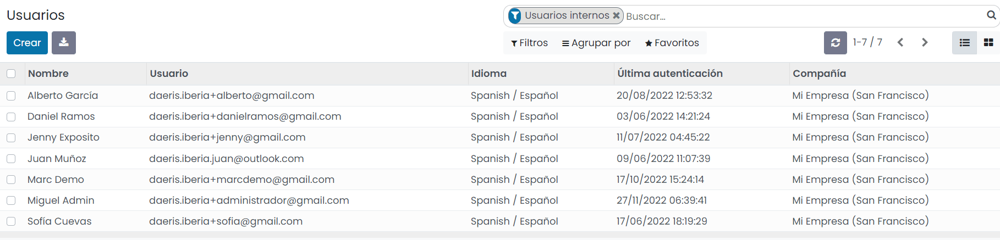

Sobre el apartado **Administración** informa el campo **Conocimiento** con uno de los siguientes posibles valores:

   - **Conocimiento de usuario**: Puede visualizar los contenidos del conocimiento.
   - **Editor**: Puede editar páginas y categorías de conocimiento.
   - **Aprobador**: Puede editar y autorizar cambios en las páginas y categorías de conocimiento.
   - **Administrador**: Dispone de control total sobre todo el conocimiento.

Posteriormente, haz clic sobre el botón **Guardar**.

Acceso a documentos adjuntos
-----------------------------
Para incorporar un acceso hacia los documentos adjuntos que disponen las páginas de conocimiento
sobre el menú de la aplicación de conocimientos navega a
:menuselection:`Conocimiento --> Configuración --> Ajustes` e informa el campo **Acceso central a los documentos**.

Posteriormente, haz clic sobre el botón **Guardar**.

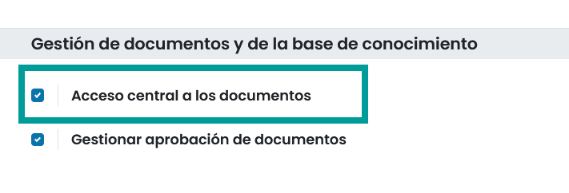

Control de publicaciones
-----------------------------
En el caso en el que desees incorporar una opción que permita gestionar la publicación de documentos otorgando
privilegios a grupos autorizados, navega a :menuselection:`Conocimiento --> Configuración --> Ajustes` e
informa la opción **Gestionar aprobación de documentos**.

Posteriormente, haz clic sobre el botón **Guardar**.

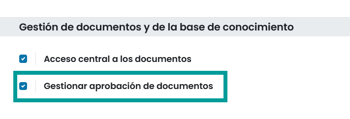

Etiquetas
----------
Las etiquetas son atributos que puedes asociar a las páginas de conocimiento. Puedes crear etiquetas
y asociarles un color representativo que aparecerá sobre la pantalla de páginas de conocimiento.

Para crear una etiqueta, navega a la pantalla :menuselection:`Conocimiento --> Configuración --> Etiquetas`.
Desde el listado puedes crear un nuevo registro mediante el botón **Crear**.

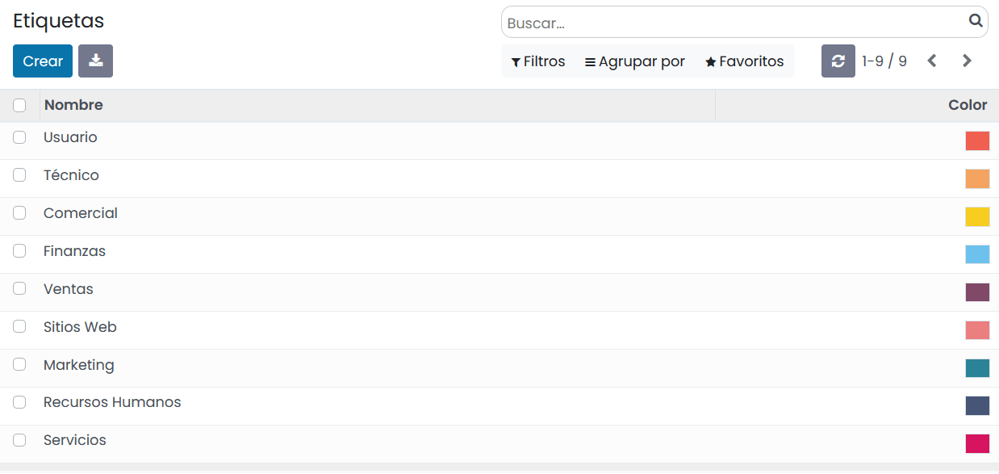

Al crear un registro puedes informar un nombre y seleccionar un color de entre los colores disponibles.

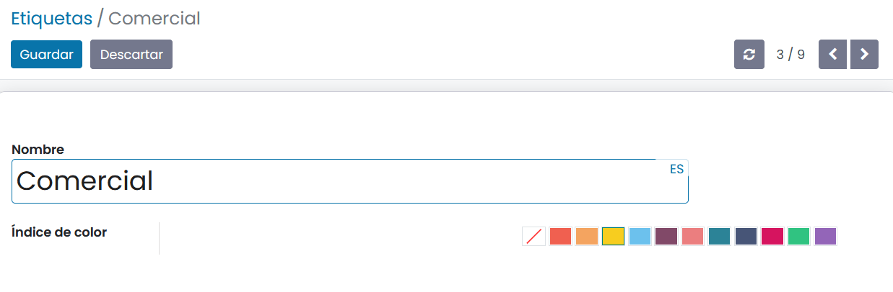

Una vez configurada la etiqueta, es posible asociarla a una página sobre el formulario de detalle de la misma,
accesible desde la pantalla :menuselection:`Conocimiento --> Páginas --> Páginas`.

Al asociar una etiqueta a una página, se podrá visualizar y filtrar desde la pantalla principal de páginas de
conocimiento.

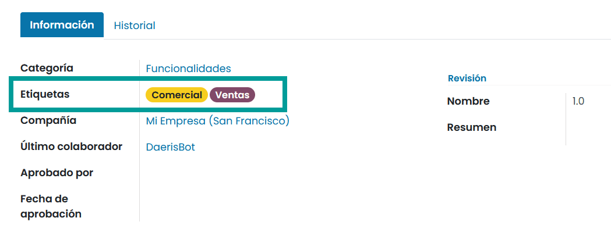

Categorías de conocimiento
=================================
Las categorías de conocimiento, permiten agrupar las páginas de conocimiento. Esta opción es muy útil para organizar
las páginas por áreas de la misma temática. También permiten incorporar un texto que sirve como patrón de edición
de las páginas asociadas a la categoría.

Para crear una categoría, navega a la pantalla :menuselection:`Conocimiento --> Páginas --> Categorías`
y haz clic sobre el botón **Crear**.

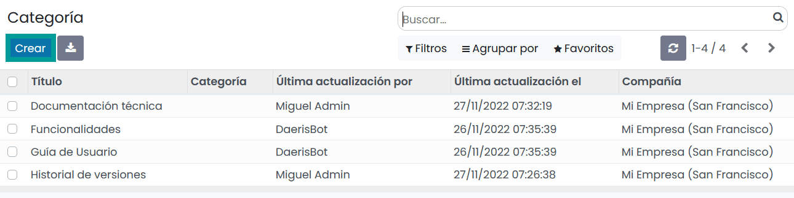

Sobre el formulario de detalle de la categoría es posible informar los siguientes campos:

   - **Nombre**: Se recomienda incorporar un texto corto y descriptivo de la categoría.
   - **Categoría**: Categoría superior que permite establecer una relación jerárquica (Padre / Hija).
   - **Visible para**: Permite establecer grupos a los que otorgar visibilidad sobre la categoría y sus páginas asociadas. Si no se informa, todos los usuarios disponen de visibilidad.
   - **Requiere aprobación**: Si se informa, cualquier cambio sobre las páginas asociadas a la categoría requerirán de aprobación por los integrantes del grupo indicado como **Grupo aprobador**, para que los cambios sean visibles.
   - **Compañía**: Si se informa, la página solo estará dispone para los usuarios asociados a la compañía indicada.

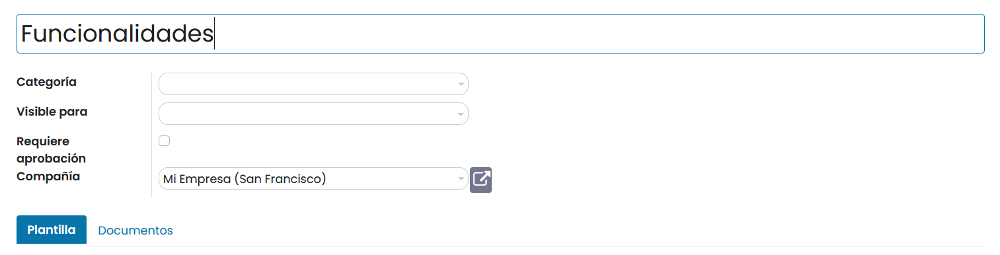

Sobre la pestaña **Plantillas** es posible informar un texto que sirva como patrón para editar las páginas asociadas.

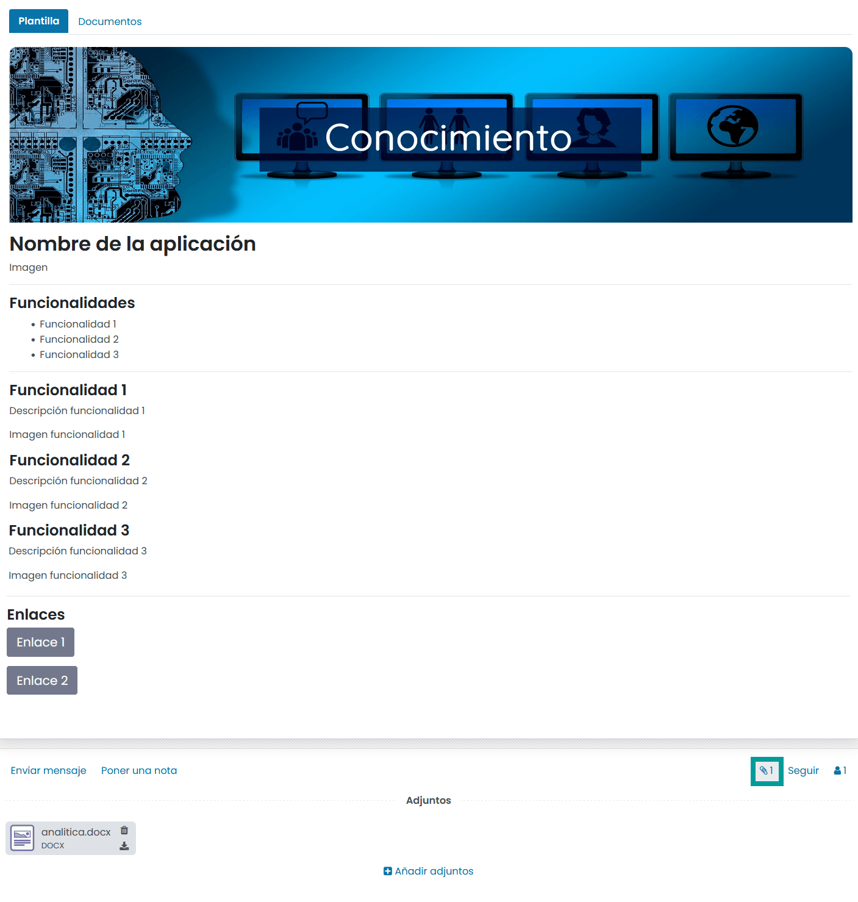

Sobre la pestaña **Documentos** es posible visualizar un mapa de sitio que se calcula de forma autónoma y que
dispone de todas las páginas y categorías relacionadas con la categoría. Este mapa del sitio es el mismo que
aparecerá si se establece un punto de menú de la categoría.

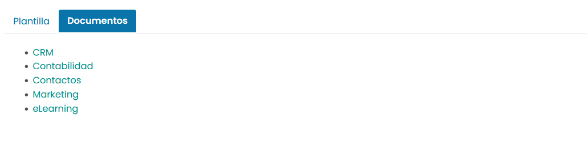

Mediante el botón **Adjuntos** situado en la parte inferior derecha, es posible añadir documentos relacionados con
la categoría. Estos documentos pueden ser consultados desde la pantalla :menuselection:`Conocimiento --> Documentos --> Documentos`.

Una vez completado el registro, pulsa el botón **Guardar**.

Páginas de conocimiento
===============================
Las páginas de conocimiento permiten publicar contenidos de cualquier área y dar acceso a los usuarios de tu
organización.

Es posible limitar la visualización de las páginas a partir de la visibilidad asociada a la categoría,
así como controlar los cambios mediante el grupo de aprobación asociado a la categoría.

Para crear una página, navega a la pantalla :menuselection:`Conocimiento --> Páginas --> Páginas`
y haz clic sobre el botón **Crear**.

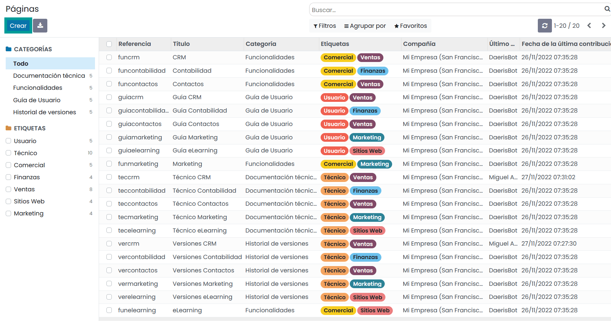

Sobre el formulario de detalle de la página es posible informar los siguientes campos:

   - **Referencia interna**: Se debe informar con un texto corto y único que sirva de referencia al documento. Se usa para construir el enlace hacia la página con lo que no puede disponer de caracteres especiales. Tan solo puede disponer de letras, números y el carácter _.
   - **Nombre**: Se recomienda incorporar un texto corto y descriptivo de la categoría.
   - **Texto**: Información que dispondrá la página. Por defecto se informa con el texto de la **plantilla de la categoría** (si está informada). Dispone de un editor de texto avanzado el cual permite introducir distintos formatos al incorporar el carácter **/**, como, por ejemplo:

      - Encabezado1
      - Encabezado2
      - Encabezado3
      - Lista
      - Lista numerada
      - Selector
      - Separador
      - Tabla
      - Cambio de dirección del texto
      - Citas
      - Código
      - Enlace
      - Botón
      - Imagen

   Mediante el botón **<>**, es posible cambiar el editor de texto por el editor de lenguaje HTML el cual permite incorporar texto en formato web. El editor no permite incorporar controles web avanzados y realiza una purga de los elementos no válidos al guardar el documento.

   .. image:: conocimiento/paginas02.png
      :align: center
      :alt: Páginas de conocimiento

Sobre la pestaña **Información** es posible incorporar:

   - **Categoría**: Categoría que permite establecer una relación jerárquica entre la categoría y la página (Padre / Hija).
   - **Etiquetas**: Atributos para enriquecer y filtrar la página.
   - **Compañía**: Si se informa, la página solo es visible por los usuarios de esta organización

Sobre el apartado **Revisión** es posible informar:

   - **Nombre**:  Texto corto para controlar los cambios realizados, como, por ejemplo, Revisión3.
   - **Resumen**: Descripción breve del documento o resumen de los cambios realizados, si se trata de una nueva versión.

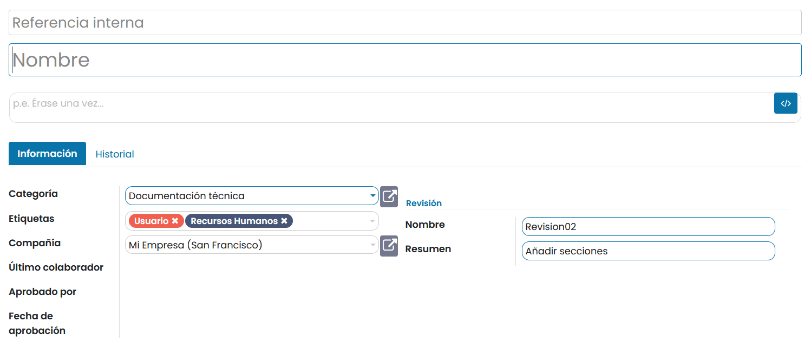

Una vez completado el registro, pulsa el botón **Guardar**.

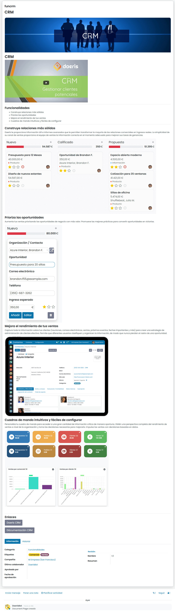

Crear Menús de acceso al conocimiento
======================================

Menú de acceso a una página
-----------------------------

Para crear un acceso hacia una de tus páginas sobre el menú de una de tus aplicaciones,
, navega a la pantalla :menuselection:`Conocimiento --> Páginas --> Páginas`
y haz clic sobre la página.

Sobre el formulario de detalle de la página, haz clic sobre el botón :menuselection:`Acción --> Crear menú`.

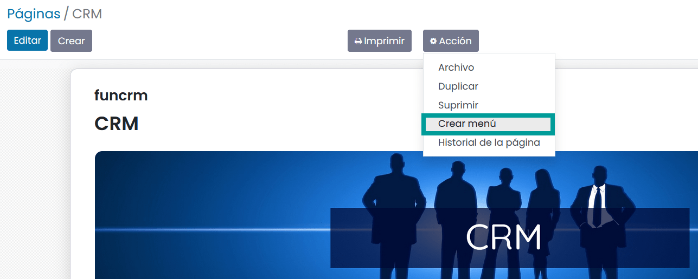

Sobre el formulario, informa el **nombre del menú**, con un texto corto y descriptivo y selecciona el
**menú superior** bajo el que se incorporará tu nuevo punto de menú.

Una vez informados los campos haz clic sobre el botón **Crear Menú**.

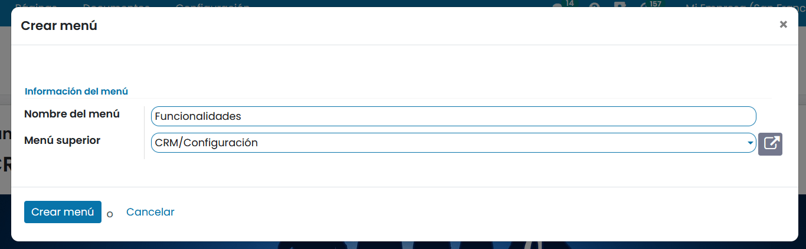

A continuación, **Actualiza / Refresca** el contenido de tu navegador y navega a la aplicación sobre la que has creado el nuevo punto de menú.

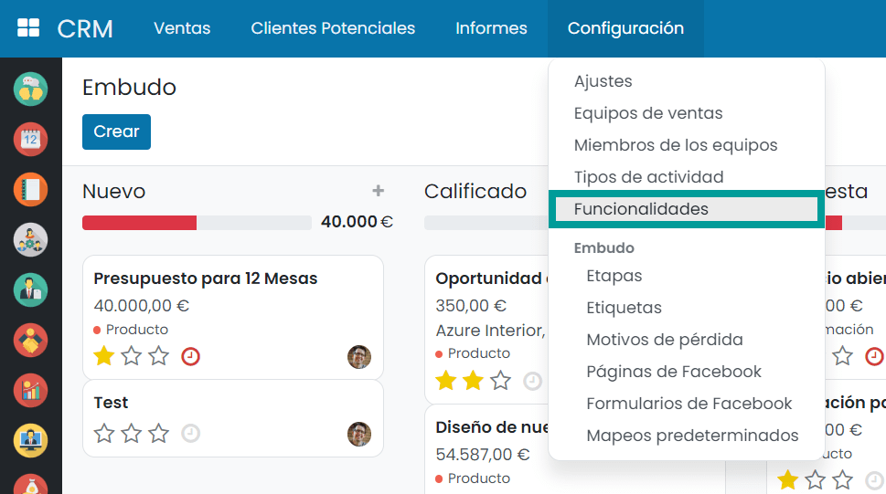

Al hacer clic sobre el nuevo punto de menú, la aplicación muestra el contenido de la página de conocimiento.

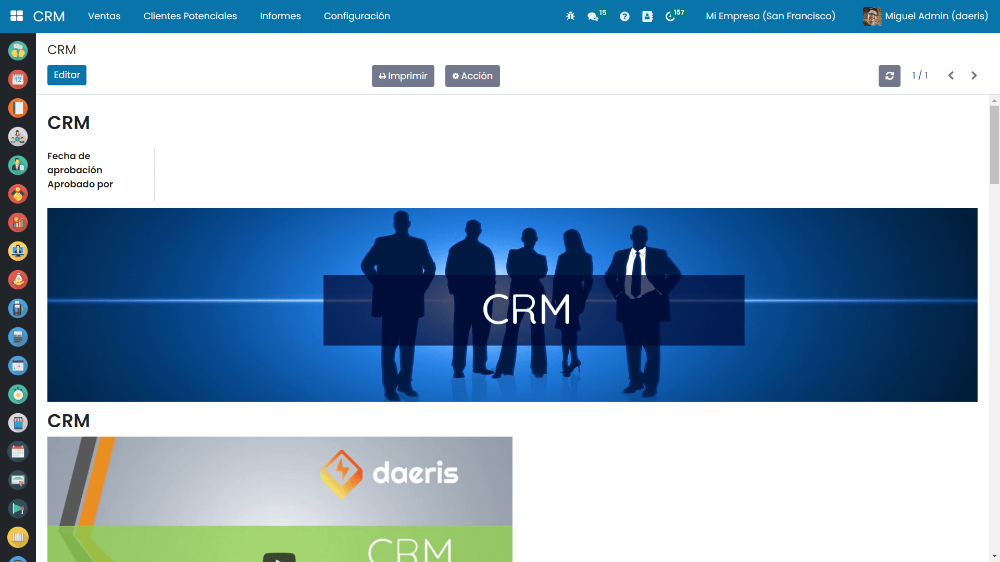

Es posible consultar el menú asociado a la página de conocimiento desde el formulario de detalle de la página sobre el campo **Menú**.

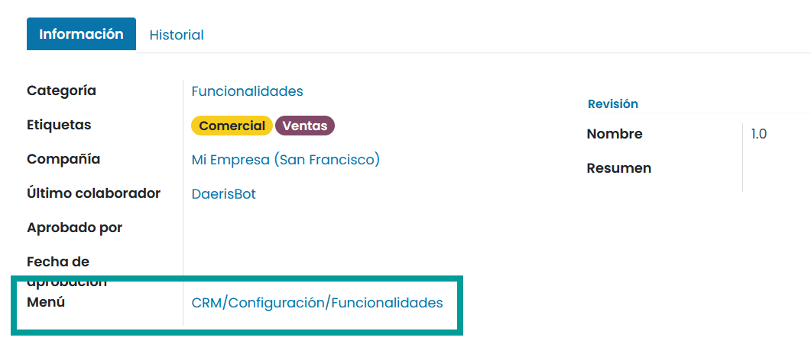

.. attention::
   Una vez se ha generado un menú, no es posible modificarlo. Solo es posible darlo de baja si se elimina la página a la que hace referencia.

Menú de acceso a una categoría
------------------------------
Para crear un acceso hacia el contenido de una de tus categorías sobre el menú de una de tus aplicaciones,
, navega a la pantalla :menuselection:`Conocimiento --> Páginas --> Categorías` y haz clic sobre la categoría deseada.

Sobre el formulario de detalle de la categoría, haz clic sobre el botón :menuselection:`Acción --> Crear menú`.

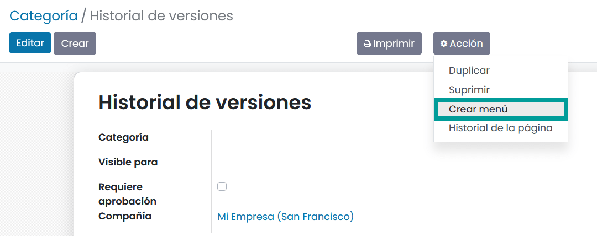

Sobre el formulario, informa el **nombre del menú**, con un texto corto y descriptivo y selecciona el
**menú superior** bajo el que se incorporará tu nuevo punto de menú.

Una vez informados los campos haz clic sobre el botón **Crear Menú**.

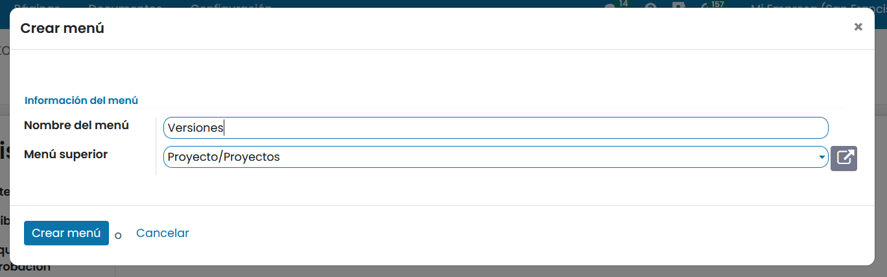

A continuación, **Actualiza / Refresca** el contenido de tu navegador y navega a la aplicación sobre la que has creado el nuevo punto de menú.

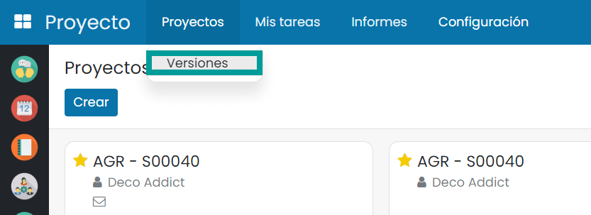

Al hacer clic sobre el nuevo punto de menú, la aplicación muestra un mapa de enlaces hacia las páginas de conocimiento de la categoría.

Cada enlace disponible, es un enlace que navega a la página de conocimiento asociada a la categoría a la que hace referencia el menú.

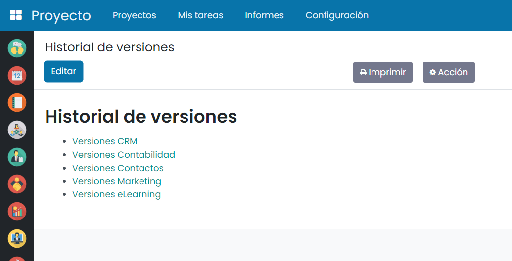

.. attention::
   Una vez se ha generado un menú, no es posible modificarlo. Solo es posible darlo de baja si se elimina la categoría a la que hace referencia.

Es posible visualizar el conjunto de enlaces de la categoría desde el formulario de detalle de la categoría sobre la pestaña **Documento**.

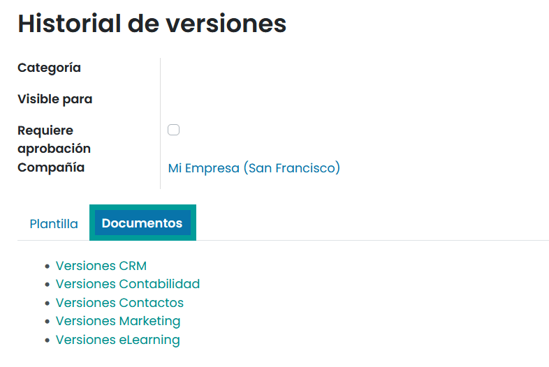

Control de versiones de páginas
================================

Daeris permite controlar la gestión de versiones de páginas relacionadas con una categoría particular, ofreciendo la posibilidad de disponer de usuarios que
autoricen los cambios realizados por los editores, antes de que sean visibles por los usuarios de conocimiento.

Para activar esta opción, navega a :menuselection:`Conocimiento --> Configuración --> Ajustes` e
informa la opción **Gestionar aprobación de documentos**.

Posteriormente, haz clic sobre el botón **Guardar**.

Para incorporar el control de versiones sobre una categoría, navega a la pantalla :menuselection:`Conocimiento --> Páginas --> Categorías`
y sobre el detalle de una categoría, informa el campo **Requiere aprobación**. Una vez activada la opción, informa el
campo **Grupo aprobador** con el valor del grupo que se convertirá en autorizador de los cambios realizados por
los editores de la página y haz clic sobre el botón **Guardar**.

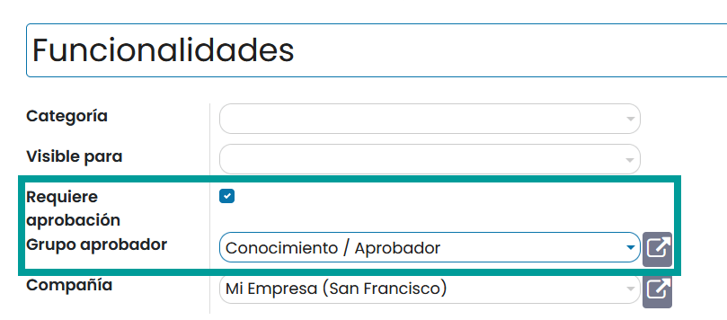

Un usuario con permisos de editor sobre la aplicación de conocimientos, puede editar una página. Para hacerlo, navega a
:menuselection:`Conocimiento --> Páginas --> Páginas` y haz clic sobre la página a editar.

Sobre el formulario de detalle, haz clic sobre el botón **Editar**.

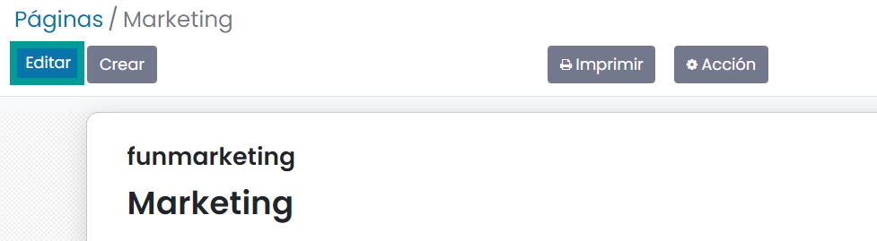

Al hacer clic sobre el botón **Editar** aparecer un texto alertando que la edición del documento generará una **solicitud de cambio** la cual requiere **Aprobación**.

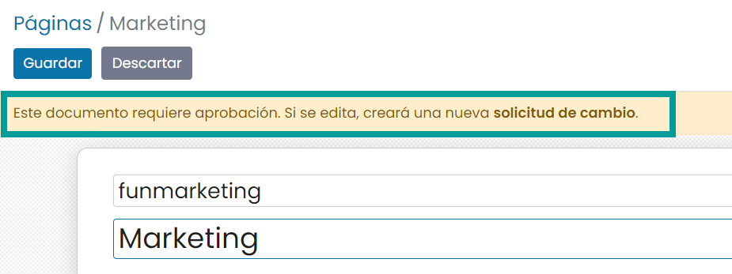

Al hacer clic sobre el botón **Guardar** aparecer un texto alertando que el documento dispone de cambios los cuales
requieren aprobación, y que la versión que se visualiza actualmente, es la última versión aprobada.

El editor puede visualizar la solicitud de cambio, haciendo clic sobre el botón inteligente **Solicitudes de cambio**.

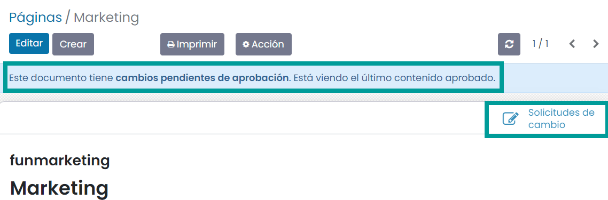

Al hacer clic sobre el botón **Solicitudes de cambio**, el usuario navega al listado de solicitudes de cambio de
la página que está editando y aparece su registro de cambio en estado **Pendiente de Aprobación**.

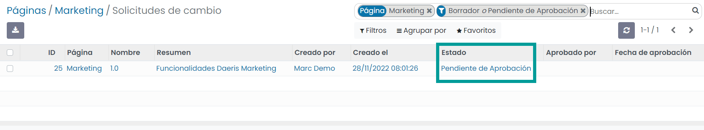

Desde el formulario de solicitud de cambio, el editor puede convertir la solicitud en un **Borrador**, si desea realizar más cambios sobre la página, antes de que sea autorizada.
Para ello, deberá **Cancelar**, **Convertir a borrador**, editar la página y **Enviar a revisión**.

Al hacer clic sobre la pestaña cambios, puede comparar la versión publicada y su versión.

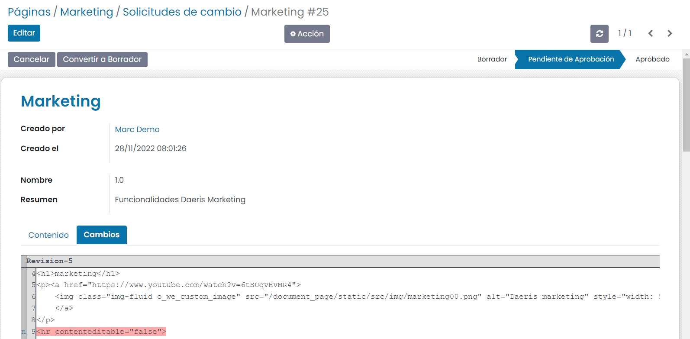

Para que un usuario con permisos de aprobación, pueda autorizar los cambios de los editores, debe acceder a la
pantalla que dispone de las solicitudes de cambio.

Para hacerlo, navega a :menuselection:`Conocimiento --> Páginas --> Solicitudes de cambio`.

Al hacer clic sobre una solicitud, se accede a su detalle desde donde es posible **Aprobar**, **Cancelar** o **Convertir a borrador**.

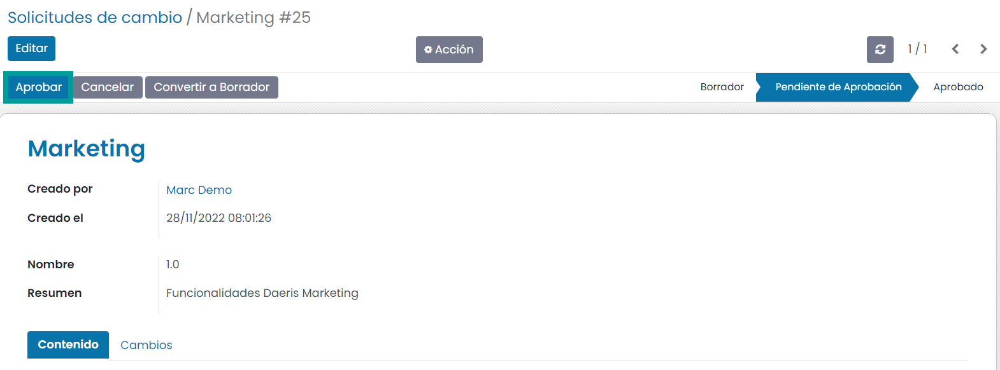

Si el usuario autoriza la solicitud mediante el botón **Aprobar**, el estado de la solicitud cambia a **Aprobado** y
se informan los campos, **Aprobado por** y **Fecha de aprobación**.

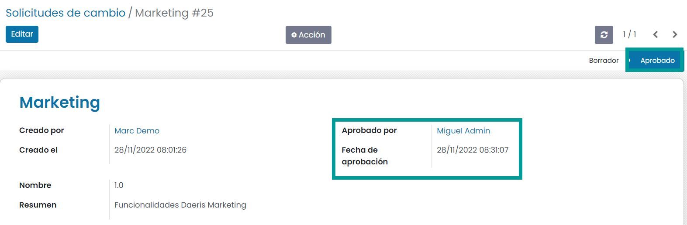

Los nuevos cambios, se publican en la página, y sobre la pestaña **Historial** del formulario de detalle de la página,
es posible consultar el histórico de versiones de la página.

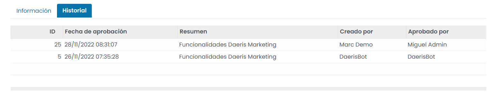