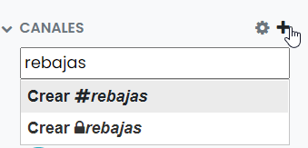
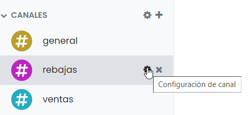
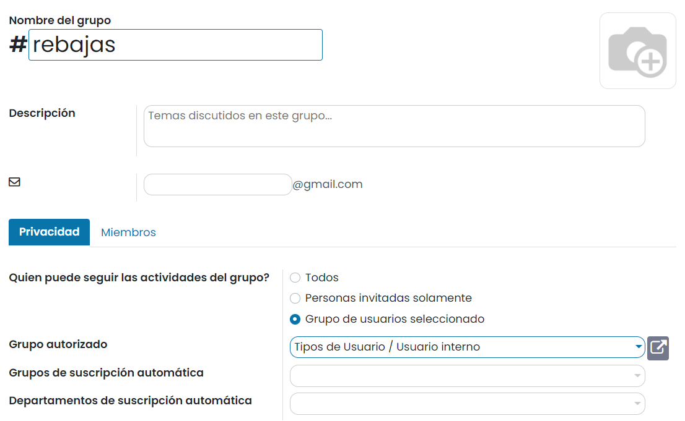
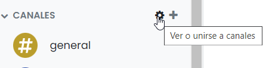
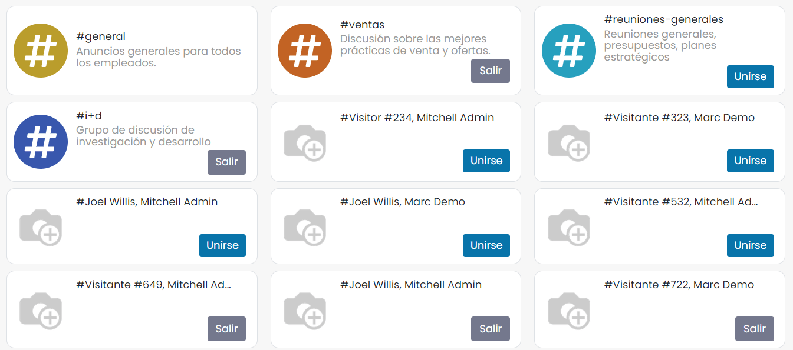

:show-content:

=======
Canales
=======

Puedes usar canales para organizar conversaciones entre equipos individuales, departamentos, proyectos o cualquier otro
grupo que requiera comunicación regular. Al tener conversaciones que todos en el canal pueden ver, es fácil mantener a
todo el equipo al tanto de las últimas novedades.

Existen dos tipos de canales:

-  **Públicos**: Un canal público solo puede ser creado por un administrador con privilegios de escritura y puede ser
   visto por todos los miembros de la organización. Un canal público se utiliza mejor cuando muchos empleados necesitan
   acceder a información (como comunicaciones interdepartamentales o anuncios de la compañía).

-  **Privados**: Cualquier usuario puede crear un canal privado y, de forma predeterminada, solo es visible para los
   usuarios que han sido invitados a este canal. Se debe utilizar un canal privado siempre que la información se limite
   a usuarios / empleados específicos (como información específica del departamento o información confidencial).

Crear un canal de conversaciones
================================

Para crear un canal, debes hacer clic en el símbolo **+** ubicado al lado de la sección de canales. A continuación,
escribe el nombre del nuevo canal y selecciona la opción *Crear*. La primera opción creará un canal público, mientras
que la opción con el icono de candado, creará un canal privado:

Una vez creado, puedes realizar los ajustes necesarios desde el icono de *Configuración de canal*:

Desde la página de configuración del canal, dispones de la siguiente información:

-  **Nombre**: Nombre del canal.

-  **Imagen**: Permite seleccionar una imagen para el canal.

-  **Descripción**: Descripción detallada del canal.

-  **Alias de correo**: Este campo permite crear de forma automática un alias de correo electrónico que sirva para
   asociar a este canal los mensajes de correo electrónico enviados a este alias.

-  **Privacidad**: Puedes hacer que un canal sea visible para todos los usuarios, solo para usuarios invitados o para
   usuarios dentro de un grupo de usuarios seleccionado. Los miembros que pertenezcan a los grupos o departamentos de
   suscripción automática seleccionados, se añadirán automáticamente como seguidores del canal.

-  **Miembros**: Desde la pestaña de miembros se pueden consultar los usuarios añadidos al canal, añadir nuevos usuarios
   o eliminar usuarios existentes.

Ver o unirse a canales
======================

Para ver la lista completa de canales, haz clic en el icono de *Ver o unirse a canales*:

El sistema navega a una pantalla donde poder explorar la lista de canales públicos, y unirse o salir de ellos mediante
los botones incorporados en cada uno de los canales:

