:show-content:

=======
Chatter
=======

*Chatter* proporciona una funcionalidad, accesible desde varios módulos y entidades, que permite adjuntar mensajes,
notas y actividades sobre diferentes tipos de elementos de la aplicación.

.. youtube:: xJjVhd0gysc
    :align: right
    :width: 700
    :height: 394

Enviar mensajes en Chatter
==========================

Los mensajes enviados a través de *chatter* enviarán un mensaje a la bandeja de entrada de todos los seguidores del
elemento. Puedes mencionar a un usuario en *chatter* escribiendo @nombre-de-usuario. Mencionar a un usuario en *chatter*
lo establecerá como seguidor del elemento (si aún no lo es) y enviará un mensaje a su bandeja de entrada:

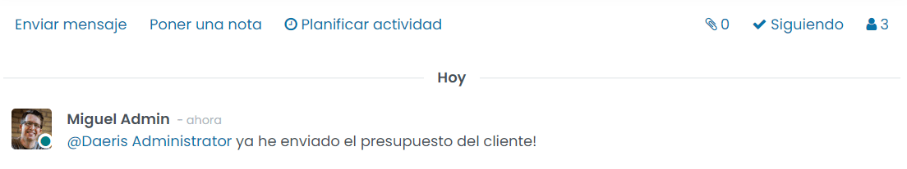

.. note::
   Para que las notificaciones aparezcan en tu bandeja de entrada, debes tener activada la opción **Manejar en Daeris**,
   en la sección de notificación de las preferencias de tu usuario. Si tienes marcada la opción **Manejar por correos electrónicos**,
   las notificaciones serán enviadas al correo electrónico asociado a tu usuario.

Por otro lado, si escribes #nombre-canal en un mensaje de *chatter*, se proporcionará un enlace al canal mencionado:

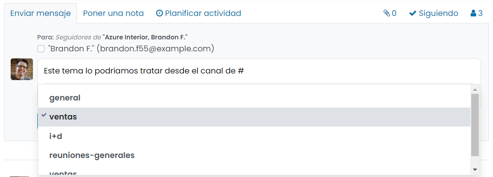

Enviar notas en Chatter
=======================

Las notas tienen una funcionalidad muy similar a la de los mensajes, con la diferencia principal que, al registrar una
nota, los seguidores del elemento no serán notificados en sus correspondientes bandejas de entrada:

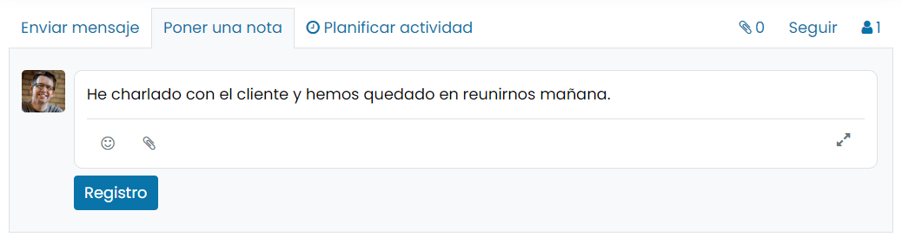

Planificar actividades en Chatter
=================================

Planificar actividades es la manera perfecta de mantenerse al día con tu trabajo. Recuérdate lo que debes hacer y
programa las próximas actividades a realizar.

Tus actividades están disponibles donde quiera que estés en Daeris, desde el icono de actividades ubicado en la parte
superior de la pantalla:

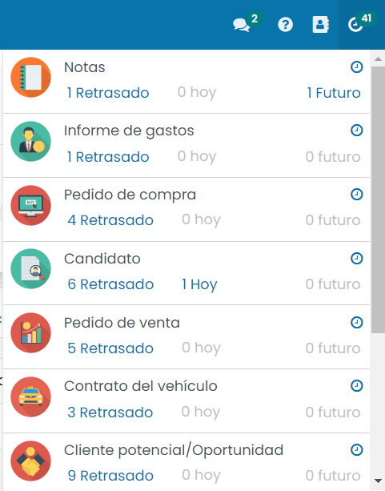

Las actividades se pueden planificar y gestionar desde *chatter*, desde el enlace *Planificar actividad*:

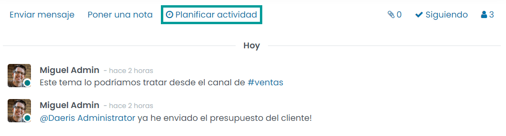

Al planificar una actividad es posible informar el tipo de actividad, la fecha de vencimiento, un resumen, la persona
asignada y una descripción. Una vez completados todos los campos, pulsa el botón **Planificación**:

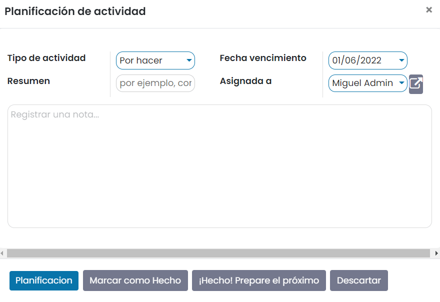

La actividad se mostrará en *chatter*, desde donde será posible expandir la información de la misma mediante el icono
de *Información*:

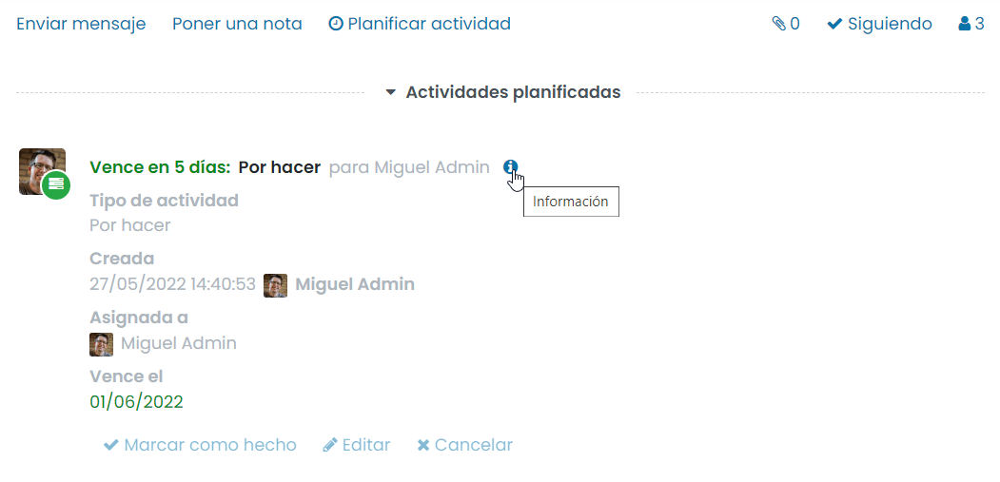

Una vez completada la tarea, se debe marcar como hecha pulsando en el enlace *Marcar como hecho*:

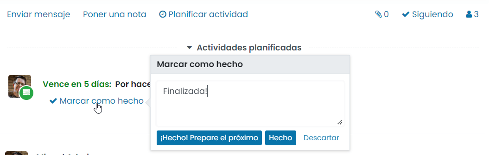

Seguir objetos en Chatter
=========================

Puedes realizar un seguimiento de prácticamente cualquier objeto de Daeris (una oportunidad, un contrato, una tarea,
etc.), siguiéndolo:

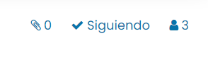

Puedes elegir los tipos de eventos sobre los que deseas recibir notificaciones. Para ello, debes mostrar los seguidores
de un registro, y editar la suscripción de tu usuario:

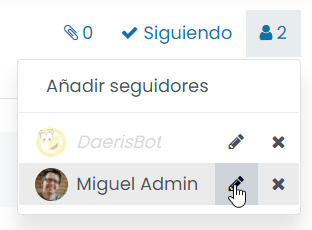

El siguiente ejemplo muestra las opciones disponibles al seguir una oportunidad en el módulo de CRM:

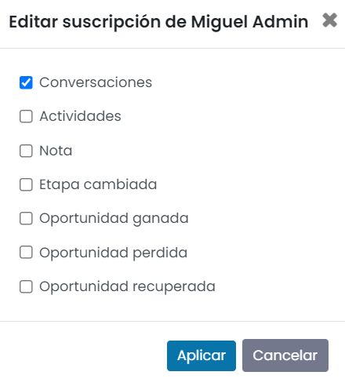

Puedes invitar a otros usuarios a seguir un registro mediante la opción de *Añadir seguidores*:

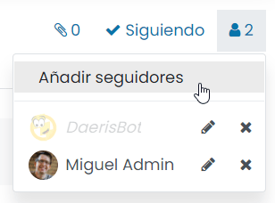

El sistema mostrará un formulario en donde seleccionar los usuarios a invitar:

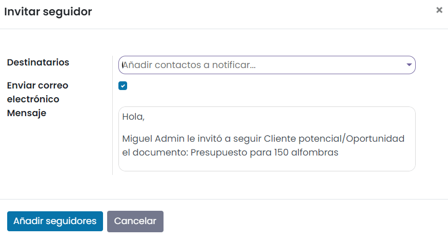

Tú te estableces automáticamente como seguidor predeterminado de cualquier elemento que crees. En algunas aplicaciones
como CRM y Proyecto, puedes ser un seguidor predeterminado de cualquier nuevo registro creado para recibir notificaciones
de eventos específicos (por ejemplo, una nueva tarea creada, una oportunidad ganada).

Para hacerlo, comienza a seguir el objeto principal (por ejemplo, el canal de ventas en CRM, el proyecto en Proyecto).
Luego, elige los eventos de los que quieras estar informado:

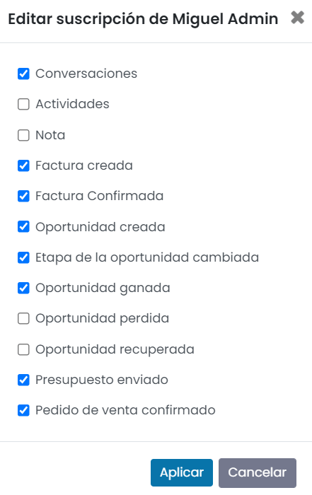

Añadir ficheros adjuntos en Chatter
===================================

Para adjuntar un fichero en *chatter*, pulsa el icono de adjuntos disponible en la parte superior derecha del panel de
*chatter*:

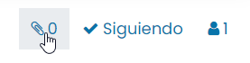

A continuación, pulsa el enlace de *Añadir adjuntos*, que te permitirá seleccionar los ficheros a adjuntar al objeto:

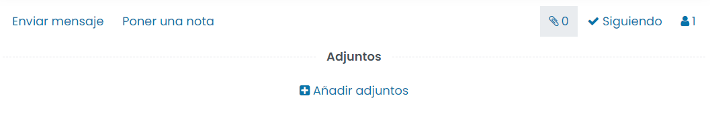

Una vez seleccionado el fichero, quedará anexo al registro. En el caso de ficheros en formato PDF, pueden ser
previsualizados desde la propia aplicación pulsando sobre el icono del fichero:

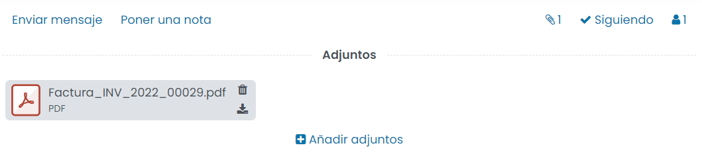

Haciendo esto, el sistema desplegará un visor de PDF en el que se podrá previsualizar el fichero:

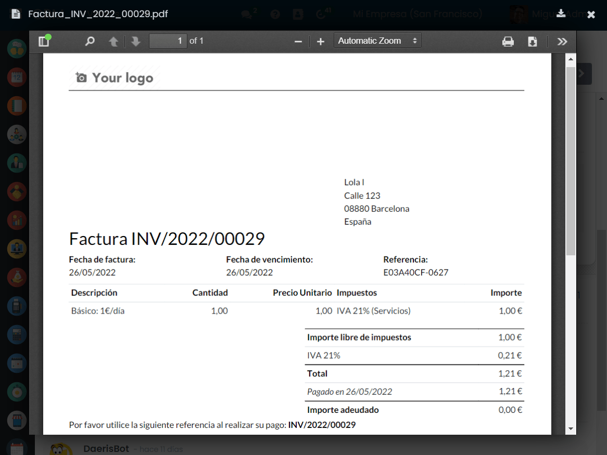

Por último, el fichero adjunto, también puede ser descargado o eliminado mediante los iconos correspondientes:

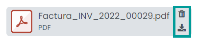