:show-content:

===================
Información general
===================

El módulo de **Conversaciones** de Daeris te permite unir todas las comunicaciones de tu empresa a través de mensajes,
notas y chat. Comparte información, proyectos, archivos, prioriza tareas y permanece conectado con colegas y socios en
todas las aplicaciones. Establece mejores relaciones, aumenta la productividad y la transparencia al promover una forma
conveniente de comunicarse.

Seleccionar la preferencia de notificaciones
============================================

Los usuarios pueden seleccionar la manera en que reciben las notificaciones de la aplicación. Para ello, deben navegar
a las preferencias de su usuario desde el menú ubicado en la parte superior derecha de la pantalla:

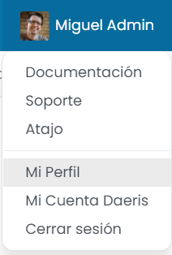

En la sección de notificación, disponen de las siguientes opciones:

-  **Manejar por correos electrónicos**: Las notificaciones serán enviadas por correo electrónico a la dirección de
   correo del usuario.

.. note::
   Para que se puedan enviar correos electrónicos desde la aplicación, es necesario haber configurado un servidor de correo
   saliente, tal y como se detalla :doc:`aquí <../../varios/correo_electronico>`.

-  **Manejar en Daeris**: Las notificaciones serán enviadas a la bandeja de entrada del usuario dentro de la propia aplicación.

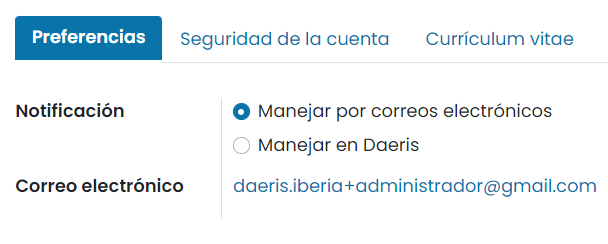

Una vez seleccionado el método de gestión de las notificaciones, pulsa el botón *Guardar* para que se apliquen los cambios.
A partir de ese momento, el usuario empezará a recibir las notificaciones siguiendo el método seleccionado.

Habilitar las notificaciones de escritorio
==========================================

Puedes elegir ver las notificaciones de escritorio cuando recibas un nuevo mensaje directo. La notificación le muestra al
remitente una breve vista previa del contenido del mensaje. Estas notificaciones pueden habilitarse al conectarse por
primera vez a Daeris, desde el área de notificaciones:

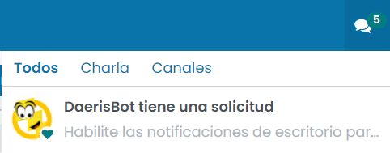

.. tip::
   Para dejar de recibir notificaciones de escritorio, restablece la configuración de notificaciones de tu navegador.

Utilizar la Bandeja de entrada
==============================

Al acceder al módulo de conversaciones aparece por defecto la bandeja de entrada. Usa la bandeja de entrada para controlar
las actualizaciones y el progreso de todo lo que haces en Daeris. Las notificaciones y mensajes de todo lo que sigues o
en las que se te menciona, aparecen en tu bandeja de entrada.

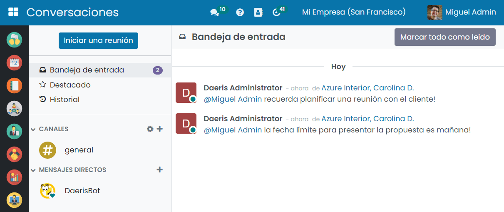

.. note::
   Para que las notificaciones aparezcan en tu bandeja de entrada, debes tener activada la opción **Manejar en Daeris**,
   en la sección de notificación de las preferencias de tu usuario. Si tienes marcada la opción **Manejar por correos electrónicos**,
   las notificaciones serán enviadas al correo electrónico asociado a tu usuario.

También es posible controlar la bandeja de entrada desde cualquier pantalla, revisando el icono de conversaciones que
aparece en la parte superior:

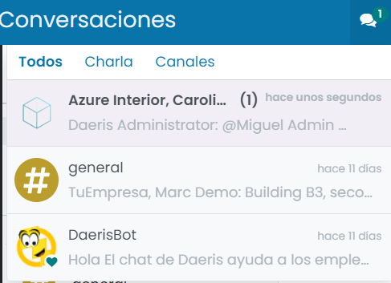

Marcar un mensaje con la marca de verificación actualiza el mensaje como leído y lo elimina de tu bandeja de entrada:

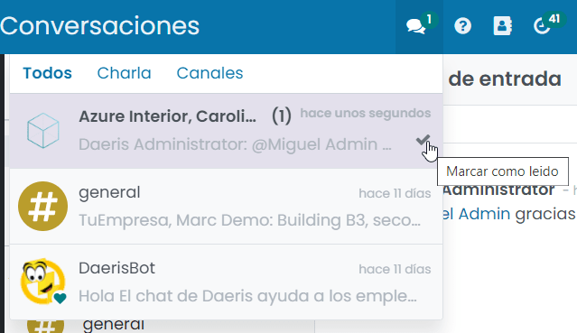

También puedes reaccionar a un mensaje añadiendo un emoticono:

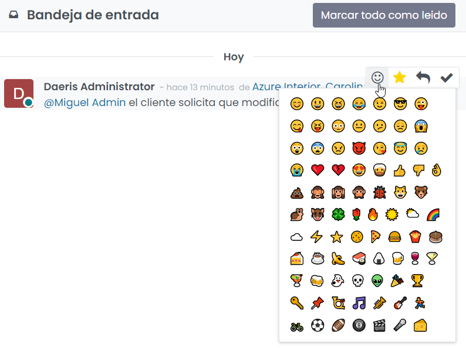

Si lo que quieres es responder al mensaje, pulsa el icono de *Responder* y escribe tu respuesta:

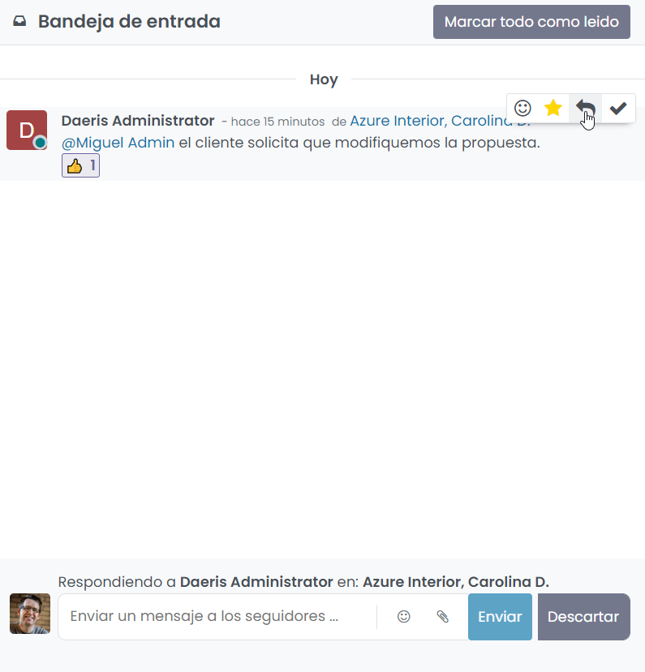

Si deseas guardar un mensaje para una futura referencia o acción, márcalo con una estrella para agregarlo al cuadro
*Destacado*:

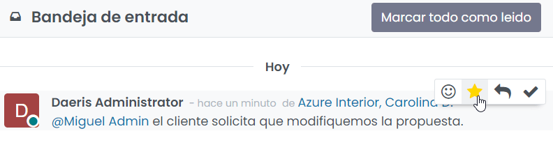

Los mensajes marcados con tareas por realizar, serán visibles desde la bandeja de mensajes destacados:

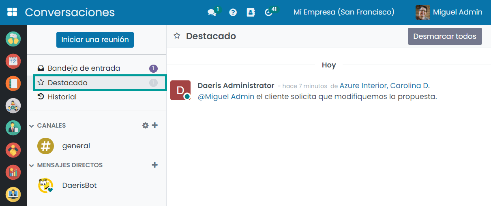

Por último, es posible consultar el historial de mensajes recibidos en la bandeja de entrada desde el historial:

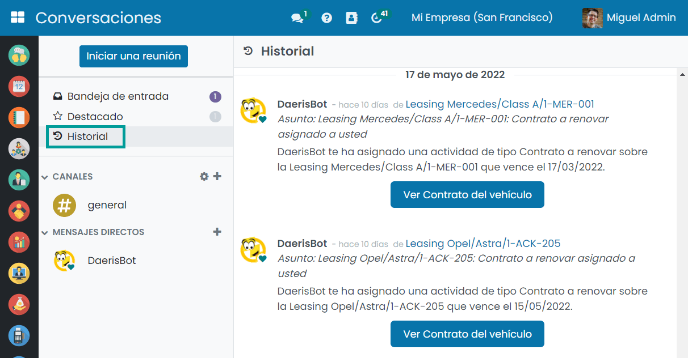

Enviar mensajes directos
========================

Los mensajes directos son mensajes privados que solo pueden ver el remitente y el destinatario. Puedes enviar mensajes
directos a otros usuarios desde el módulo de conversaciones creando una nueva conversación o seleccionando una existente
en la barra lateral:

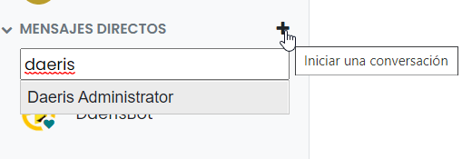

Los mensajes directos también se pueden enviar desde cualquier lugar en Daeris utilizando el icono de conversaciones en
la barra superior:

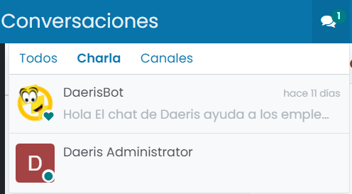

El estado en línea de otros usuarios se muestra a la izquierda de su nombre. Un punto verde indica que un usuario está
en línea, un punto naranja que está inactivo y un punto gris que está desconectado:

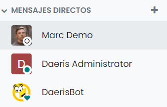

Mencionar a un usuario o a un canal
===================================

Puedes mencionar a un usuario en un canal o en *chatter* escribiendo @nombre-de-usuario. Mencionar a un usuario en
*chatter* lo establecerá como seguidor del elemento (si aún no lo es) y enviará un mensaje a su bandeja de entrada:

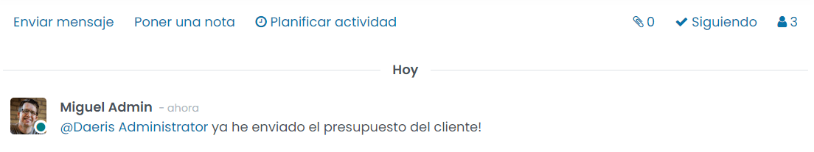

Mencionar a un usuario en un canal enviará un mensaje a su bandeja de entrada. No puedes mencionar a un usuario en un
canal al que no se encuentre suscrito:

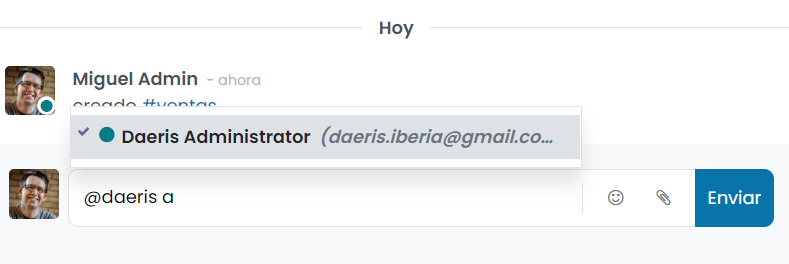

.. note::
   Para que las notificaciones aparezcan en tu bandeja de entrada, debes tener activada la opción **Manejar en Daeris**,
   en la sección de notificación de las preferencias de tu usuario. Si tienes marcada la opción **Manejar por correos electrónicos**,
   las notificaciones serán enviadas al correo electrónico asociado a tu usuario.

Por último, si escribes #nombre-canal en un *chatter* o en otro canal, se proporcionará un enlace al canal mencionado:

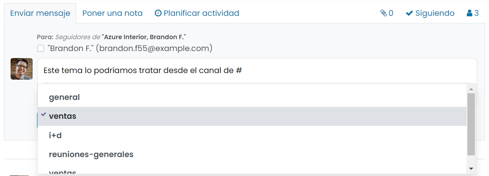

Utilizar la barra de búsqueda rápida
====================================

Una vez que se anclan al menos 20 canales, mensajes directos y conversaciones de chat en vivo en la barra lateral,
se muestra una barra de **Búsqueda rápida**. Es una forma inteligente de filtrar conversaciones y encontrar rápidamente
la que necesitas:

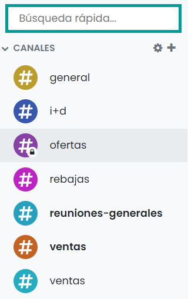