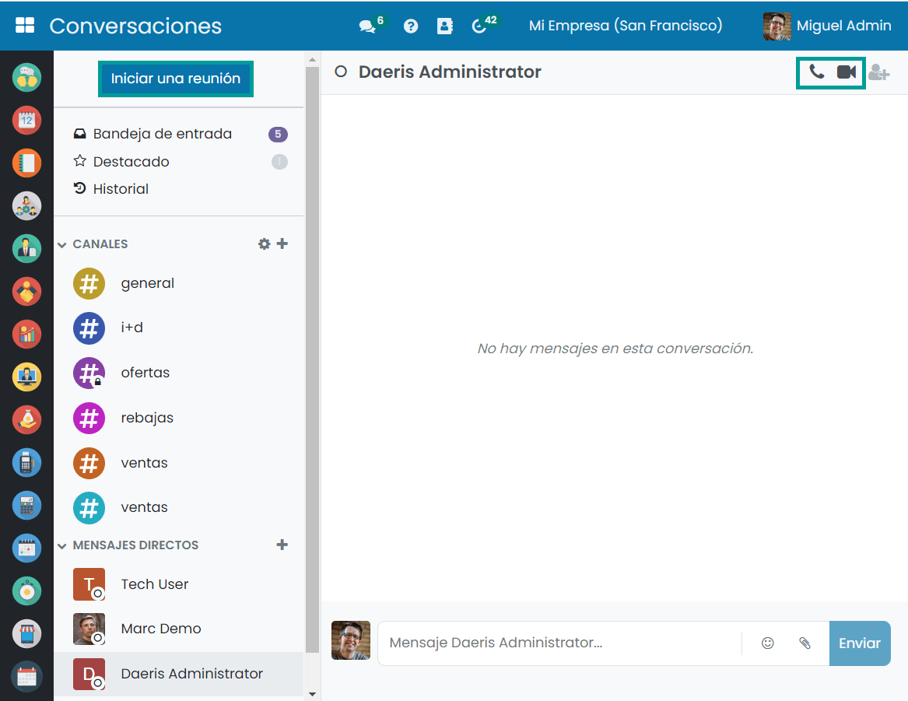
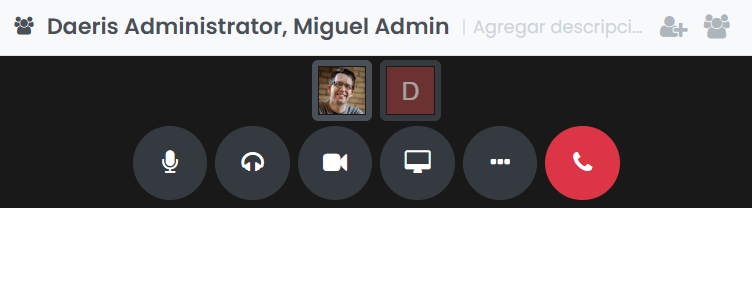
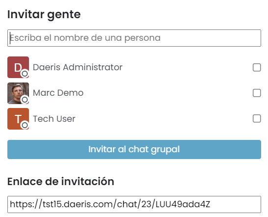
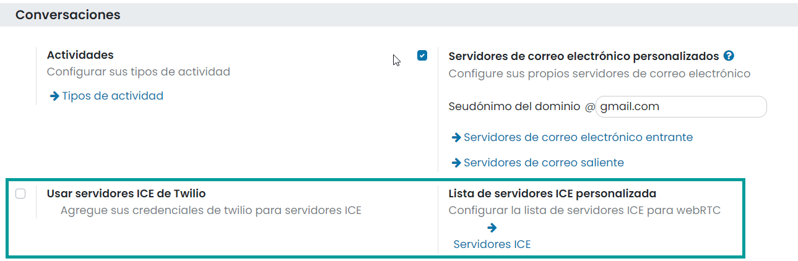

:show-content:

=========
Reuniones
=========

Daeris permite a los usuarios de la aplicación comunicarse en tiempo real mediante videollamadas y llamadas de voz
incluidas dentro del módulo de **Conversaciones**. Para ello, se utiliza la API de WebRTC (*Web real-time communications*
o comunicaciones web en tiempo real) que permite a aplicaciones y sitios web capturar y opcionalmente retransmitir
audio/vídeo, así como intercambiar datos arbitrarios entre navegadores sin necesidad de un intermediario.

Iniciar una reunión (videollamada, llamada de voz y compartir pantalla)
=======================================================================

Para iniciar una reunión navega al módulo de **Conversaciones** y pulsa el botón de *Iniciar una reunión*. Opcionalmente,
dentro de una conversación ya abierta, también es posible iniciar una llamada o videollamada mediante los iconos ubicados
en la parte superior derecha de la pantalla:

Al iniciar una llamada de voz, el sistema desplegará un apartado para controlar todos los aspectos de la llamada, desde
donde podrás:

-  Silenciar el micrófono

-  Ensordecer los auriculares

-  Encender la cámara para que la llamada pase a ser una videollamada

-  Compartir la pantalla

-  Cambiar el diseño de cómo se muestran los participantes

-  Cambiar a pantalla completa

-  Realizar ajustes de los dispositivos

-  Desconectar de la llamada

Al iniciar la reunión desde el botón de *Iniciar una reunión*, tendrás la posibilidad de invitar a gente a la reunión
mediante el buscador, e invitarla directamente, o bien, copiar el enlace de invitación y enviarlo a las personas que
quieras que participen en la reunión:

Configurar los servidores ICE (Interactive Connectivity Establishment)
======================================================================

*Interactive Connectivity Establishment* (ICE) es un marco para permitir que tu navegador web se conecte con tus
compañeros. Hay muchas razones por las que una conexión directa de un par a otro simplemente no funcionará. Debes evitar
los firewalls que evitarían abrir conexiones, darle una dirección única si, como en la mayoría de las situaciones, tu
dispositivo no tiene una dirección IP pública y transmitir datos a través de un servidor si tu enrutador no te permite
conectarte directamente con tus pares.

Para todos esos casos en que no funcione la conexión directa al iniciar una reunión, es posible configurar servidores ICE.
Los servidores ICE se configuran desde la pantalla :menuselection:`Ajustes --> Opciones Generales`, dentro del apartado
de *Conversaciones*. Disponemos de dos opciones:

-  **Usar servidores ICE de Twilio**: Si activamos esta opción, será necesario incluir un identificador de la cuenta de
   Twilio, así como un Token, para poder conectar a los servidores ICE de Twilio. Puedes encontrar más información
   acerca de cómo crear una cuenta en Twilio `aquí <https://www.twilio.com/stun-turn>`_.

-  **Lista de servidores ICE personalizada**: Si dispones de un servidor ICE propio, puedes hacer clic en el enlace de
   *Servidores ICE*, y configurar los datos de tus servidores STUN/TURN.

Una vez configurados los servidores ICE, al iniciar una reunión de audio o vídeo, el sistema validará si existen
servidores de Twilio o personalizados configurados en el sistema, y en caso de ser así, utilizará dichos servidores para
establecer la conexión.

En caso de no haber configurado servidores de Twilio ni servidores personalizados, el sistema utilizará los servidores
STUN por defecto de Google:

-  stun:stun1.l.google.com:19302

-  stun:stun2.l.google.com:19302