:show-content:

============
Google Drive
============

Las empresas suelen tener documentos que se encuentran fuera del sistema de gestión empresarial. En Daeris, los usuarios
pueden almacenar y administrar dichos documentos con la ayuda de **Google Drive**.

Google Drive es una de las mejores aplicaciones de almacenamiento en la nube disponibles y ofrece un sistema de
gestión de documentos eficiente. La integración de Daeris con Google Drive permite a los usuarios gestionar los archivos
y documentos relacionados con el negocio de forma estructurada. Lo que significa que el usuario puede agregar muchos
datos adicionales específicos de la industria sin incorporar modelos y campos adicionales en Daeris.

Configuración
=============

.. _productividad/google_drive/habilitar_google_drive:

Habilitar Google Drive
~~~~~~~~~~~~~~~~~~~~~~

Para integrar Daeris con Google Drive, navega a la pantalla :menuselection:`Ajustes --> Opciones Generales`, y dentro del
apartado de integraciones, activa la opción de **Google Drive**:

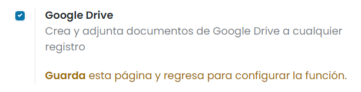

Una vez hecho esto, pulsa el botón *Guardar* de la pantalla de Ajustes.

A continuación, vuelve al apartado de integraciones para terminar de configurar la funcionalidad. Para ello, pulsa el
enlace para establecer el token de Google Drive:

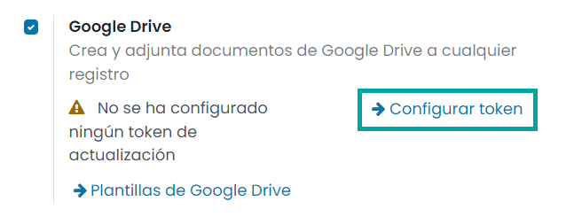

Esto abrirá la siguiente ventana:

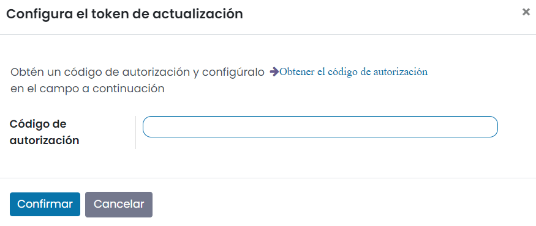

Para configurar el token, deberás pulsar el enlace **Obtener el código de autorización**, que abrirá una nueva ventana
en donde podrás acceder a tu cuenta de Google Drive:

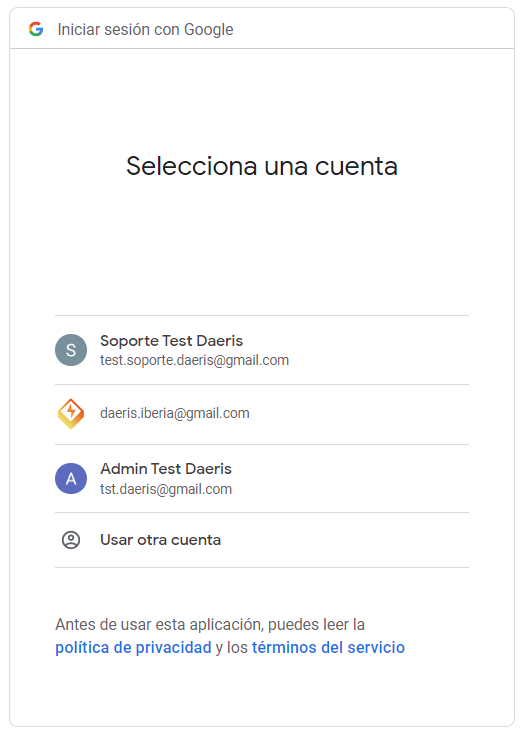

Una vez seleccionada la cuenta, el sistema solicitará permisos para acceder a tu cuenta de Google Drive. Pulsa el botón
*Permitir*:

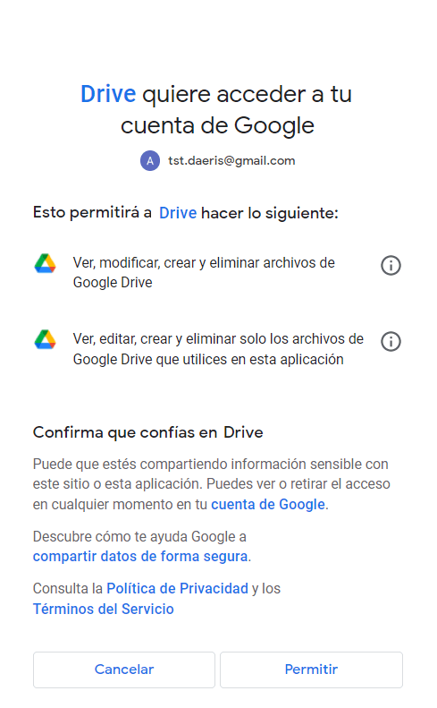

Por último, el sistema mostrará un token que tendrás que copiar:

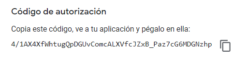

A continuación, introduce el token copiado en Daeris, y pulsa el botón *Confirmar*:

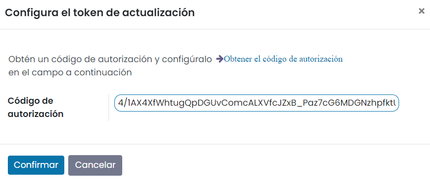

Configurar plantillas de Google Drive
~~~~~~~~~~~~~~~~~~~~~~~~~~~~~~~~~~~~~

El siguiente paso consiste en configurar las plantillas de Google Drive. Para ello, pulsa el enlace *Plantillas de Google Drive*:

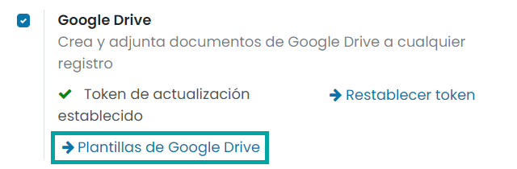

El sistema navegará a la pantalla de plantillas donde deberás crear una nueva plantilla mediante el botón *Crear*. A
continuación, informa los siguientes campos:

-  **Nombre de la plantilla**: Otorga un nombre específico para la plantilla.

-  **Modelo**: Modelo al que se ve afectada la plantilla. En este ejemplo crearemos una plantilla para el modelo *Proyecto*.

-  **Filtro**: Filtros personalizados para la plantilla.

-  **URL de la plantilla**: URL de un documento en la unidad de Google Drive a la que se deben adjuntar los documentos.
   Este documento servirá como plantilla a la hora de generar documentos para el modelo afectado.

-  **Patrón de nombres de Google Drive**: Es el patrón de nombre del documento. Por ejemplo, al informar `Proyecto: %(name)s`,
   el documento de Google Drive se guardará con el literal *Proyecto* más el nombre del proyecto seleccionado.

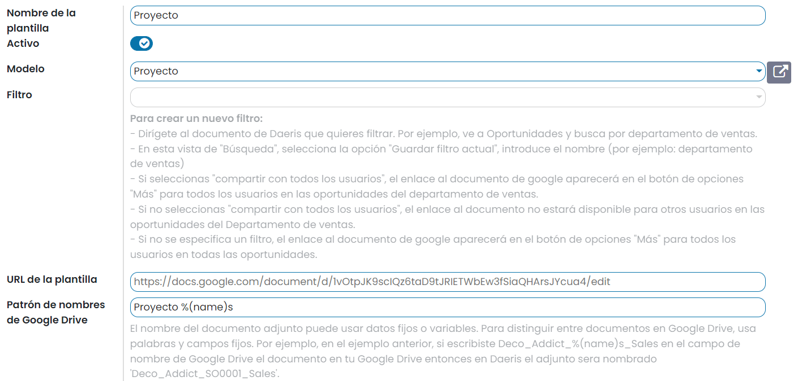

Una vez creada la plantilla, pulsa el botón *Guardar*.

Crear y adjuntar documentos de Google Drive a cualquier registro
================================================================

Siguiendo el ejemplo de la plantilla creada en el paso anterior, navega a la pantalla :menuselection:`Proyecto --> Configuración --> Proyectos`,
y accede al detalle de un proyecto. Desde el menú acción, selecciona la acción con nombre **Proyecto**:

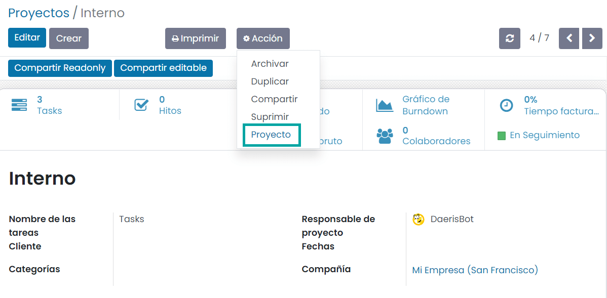

El sistema abrirá una nueva ventana que permitirá editar un nuevo documento en Google Drive, tomando como base la
plantilla especificada:

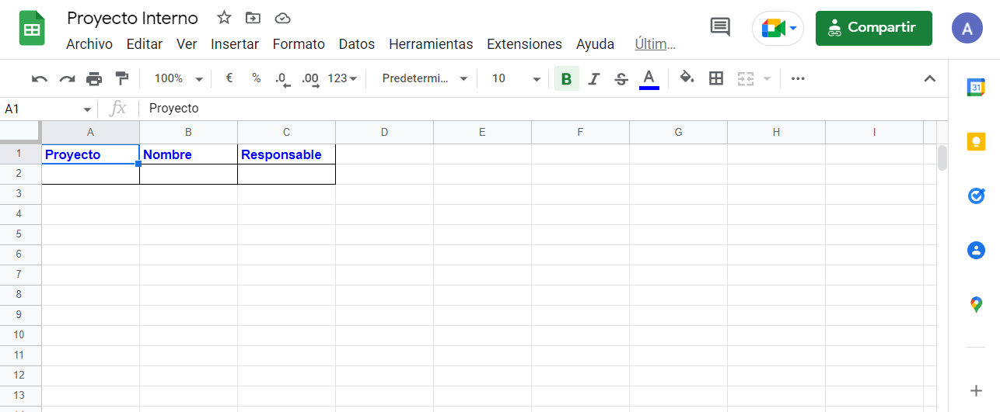

Uno de los beneficios de la integración con Google Drive es que evita la necesidad de disponer de múltiples campos de
datos para varios registros dentro de Daeris.

De esta manera, la integración de Google Drive te permitirá organizar la información asociada con los registros de
Daeris sin una gran personalización.
