:show-content:

==========================
Hojas de cálculo de Google
==========================

Mediante la funcionalidad de **hojas de cálculo de Google**, es posible crear informes personalizados que recuperen datos
directamente de Daeris utilizando fórmulas dentro de la hoja de cálculo. Dichas fórmulas están escritas en Python pero
no requieren conocimientos de programación.

Configuración
=============

Habilitar Google Drive
~~~~~~~~~~~~~~~~~~~~~~

Para configurar las hojas de cálculo de Google en Daeris, es necesario :ref:`habilitar la integración con Google Drive <productividad/google_drive/habilitar_google_drive>`.

Habilitar hojas de cálculo de Google
~~~~~~~~~~~~~~~~~~~~~~~~~~~~~~~~~~~~

Una vez habilitada la integración con Google Drive, para activar la funcionalidad de hojas de cálculo de Google, navega
a la pantalla :menuselection:`Ajustes > Opciones Generales`, y activa la opción de **Hojas de Cálculo de Google**:

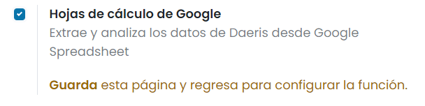

Una vez hecho esto, pulsa el botón *Guardar* de la pantalla de Ajustes.

Crear una nueva hoja de cálculo de Google en Daeris
===================================================

Añadir consulta a la hoja de cálculo de Google
~~~~~~~~~~~~~~~~~~~~~~~~~~~~~~~~~~~~~~~~~~~~~~

Para crear una nueva hoja de cálculo, navega a cualquier listado y desde el menú de *Favoritos* selecciona la opción
**Añadir a la hoja de cálculo de Google**. En este caso, a modo de ejemplo, lo haremos desde la pantalla de *Contactos*:

.. image:: google_spreadsheet/anadir-hoja-calculo-google.png
   :align: center
   :alt: Añadir a la hoja de cálculo de Google

Esto creará automáticamente una hoja de cálculo en tu Google Drive:

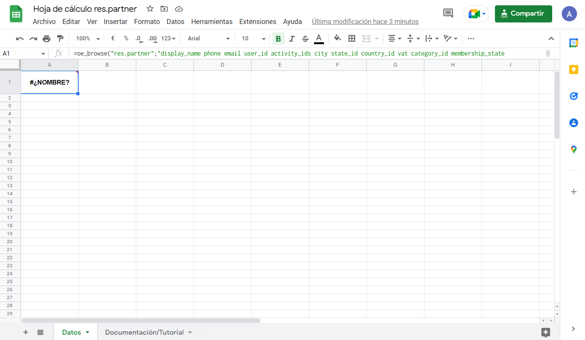

.. note::
   En algunos casos es posible que se muestre un mensaje indicando que ha habido un problema con la generación del token.
   En esos casos, vuelve a restablecer el token de Google Drive desde la pantalla de :menuselection:`Ajustes > Opciones Generales`.

Al abrir este nuevo archivo, Daeris crea automáticamente una segunda hoja con un tutorial/documentación sobre cómo usar
la integración con hojas de cálculo de Google:

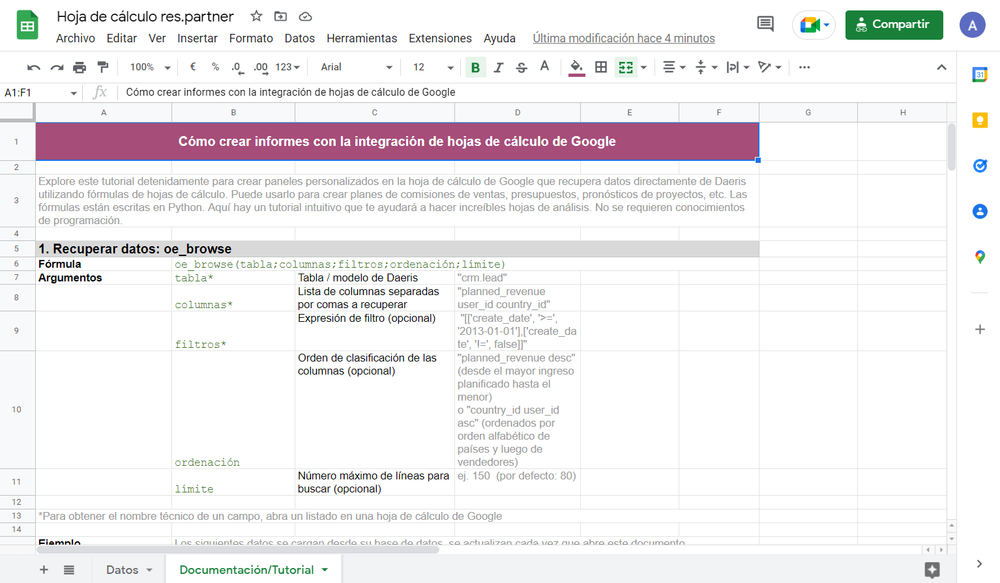

Configurar ajustes de la hoja de cálculo de Google
~~~~~~~~~~~~~~~~~~~~~~~~~~~~~~~~~~~~~~~~~~~~~~~~~~

El primer paso será vincular la hoja de cálculo recién creada con tu entorno de Daeris. Para ello, pulsa sobre la opción
de menú superior :menuselection:`Daeris --> Ajustes`:

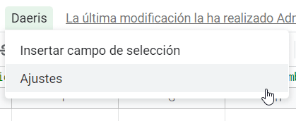

Google solicitará autorización para ejecutar la secuencia de comandos de la hoja:

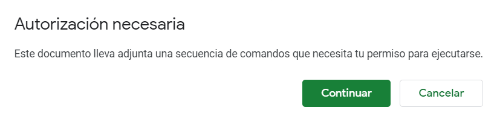

Al pulsar el botón *Continuar*, deberás seleccionar tu cuenta de Google:

Sobre configuración avanzada, seleccionar la opción de **Ir a Plantilla Daeris**:

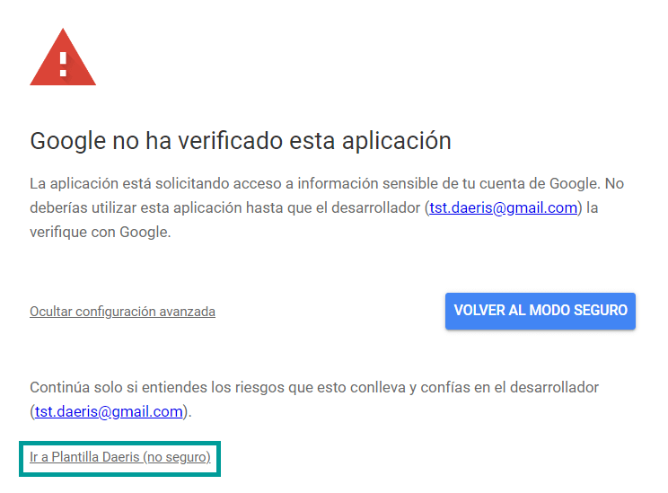

Por último, pulsa el botón *Permitir*:

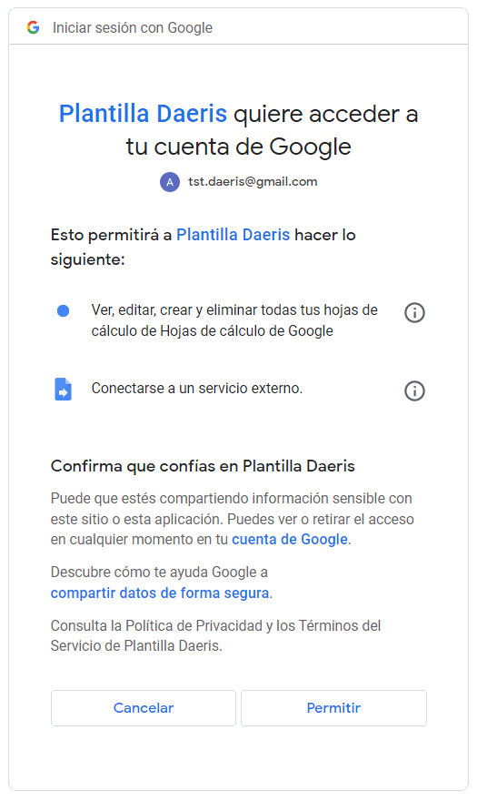

Ahora ya puedes configurar los ajustes pulsando de nuevo la opción de menú :menuselection:`Daeris --> Ajustes`. En primer
lugar, introduce la URL de tu instancia Daeris:

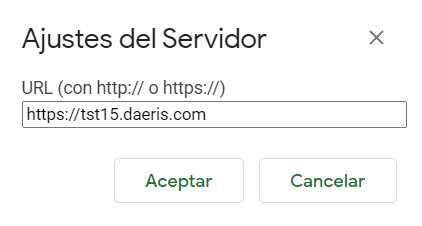

.. important::
   La URL de tu instancia Daeris no debe incluir el carácter `/` al final. Un ejemplo válido sería `https://miempresa.daeris.com`
   mientras que un ejemplo inválido sería `https://miempresa.daeris.com/`.

A continuación, el nombre de la base de datos, en donde debes introducir `daeris`:

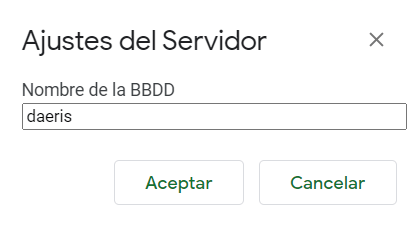

También debes introducir el usuario con el que te conectas a la aplicación:

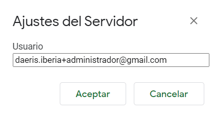

Además, introduce la contraseña del usuario:

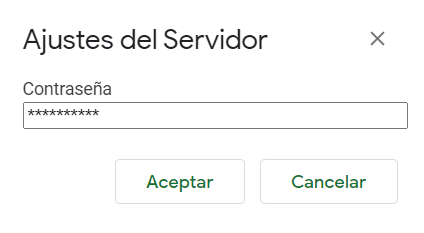

Refrescar datos de la hoja de cálculo de Google
~~~~~~~~~~~~~~~~~~~~~~~~~~~~~~~~~~~~~~~~~~~~~~~

Una vez configurados los ajustes del servidor, si quieres que la fórmula se refresque con los datos de la aplicación
Daeris, tienes dos opciones:

#. Cierra la hoja y vuelve a abrirla después de unos minutos.

#. Agrega una celda de activación como argumento al final de la fórmula, o cambia manualmente el contenido de la fórmula,
   para volverla a dejar como estaba justo después.

Una vez refrescada la fórmula de la hoja de datos, Google realizará la consulta contra la base de datos de Daeris y
mostrará la información:

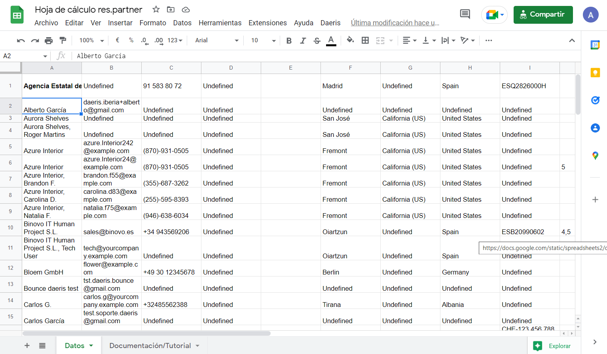