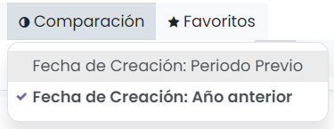
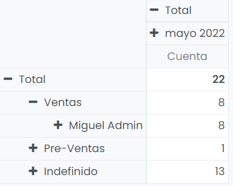
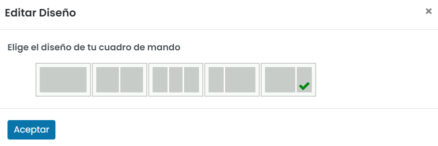
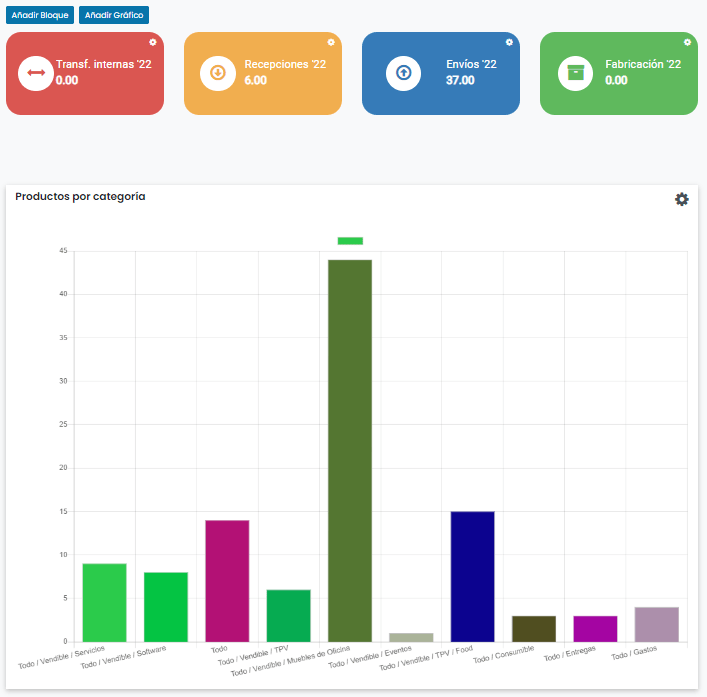
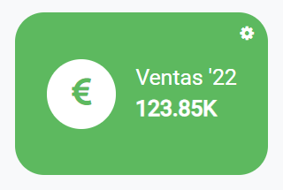

:show-content:

========
Informes
========

Daeris ofrece una serie de herramientas de creación de informes de gran utilidad, que funcionan conjuntamente para ayudarte
a analizar tus datos, y realizar acciones en base a la información.

Estos informes proporcionan información conveniente para que las personas responsables comprendan el crecimiento de su negocio,
las ganancias, los defectos comerciales, las diversas actividades realizadas y muchos más aspectos relacionados con las operaciones
de su organización.

.. youtube:: EcmYJqzeWmM
    :align: right
    :width: 786
    :height: 442

.. _productividad/informes/analizar_datos:

Analizar datos de la aplicación con informes
============================================

En varios de los módulos de Daeris, existe una sección en el menú llamada *Informes*, que contiene herramientas de análisis
realmente útiles para inspeccionar los datos de forma sencilla:

Los informes gráficos son aquellos que utilizan la vista de tipo gráfico, y permiten visualizar la información con un
gráfico de barras, con un gráfico de líneas o con un gráfico circular:

Al cambiar el tipo de gráfico, el informe se refresca de forma automática, pasando a mostrar la misma información con el
nuevo formato:

Mediante el desplegable de *Medidas*, es posible seleccionar la medida a analizar en el informe. Por ejemplo, al seleccionar
la *Cuenta* en el informe de clientes potenciales, el informe analiza el número de clientes potenciales:

Siguiendo el mismo ejemplo, al seleccionar el *Ingreso esperado* como medida, el informe analiza el ingreso esperado de los
clientes potenciales:

Es posible filtrar los datos del informe mediante el desplegable de *Filtros*. Por ejemplo, al seleccionar el filtro de
*Oportunidad* en el informe de clientes potenciales, el informe tiene en cuenta solamente aquellos clientes potenciales
que se han convertido en una oportunidad:

Por otro lado, también es posible agrupar los datos del informe por diferentes campos relacionados con la entidad analizada,
mediante el desplegable *Agrupar por*. Por ejemplo, al seleccionar la agrupación por *Etapa* en el informe de clientes
potenciales, el informe agrupa la información por cada una de las etapas en las que se encuentra el cliente potencial,
en lugar de agrupar los datos por mes:

Además, utilizando el desplegable de *Comparación*, es posible realizar comparaciones de datos entre distintos periodos.
Por ejemplo, para comparar los datos de clientes potenciales creados el año anterior con los datos de clientes potenciales
creados este año, se puede seleccionar la opción *Fecha de Creación: Año anterior*:

Por último, una vez hayas elaborado un informe que cumple con tus necesidades de análisis, lo puedes guardar mediante el
desplegable de *Favoritos*, seleccionando la opción de *Guardar búsqueda actual*. Proporciona un nombre para el informe,
indica si lo quieres usar por defecto y si lo quieres compartir con todos los usuarios de la aplicación:

Una vez guardado, al acceder al informe, podrás seleccionar tus búsquedas desde el desplegable de favoritos, y eliminarlas
en caso que alguna de ellas haya quedado obsoleta:

Además de informes de tipo gráfico, Daeris dispone de tablas dinámicas, que son aquellas que utilizan la vista de tipo pivote:

Las tablas dinámicas contienen las mismas opciones de medidas, filtros y agrupaciones que los informes gráficos. Pero, además,
disponen de una serie de opciones adicionales.

Mediante el icono de *Invertir ejes*, la tabla dinámica invierte los ejes de datos. Por ejemplo, en el informe de clientes
potenciales, al invertir los ejes, los meses pasan a estar ubicados en las columnas, y los equipos de ventas pasan a estar
ubicados en las filas:

También es posible añadir más campos a la tabla dinámica pulsando el icono +, situado al lado de la fila o columna. Por ejemplo,
en el informe de clientes potenciales, se puede añadir la información sobre el *Comercial*:

Esto resultará en la agregación de nuevas filas al informe, una por cada comercial que haya creado clientes potenciales en
el equipo de ventas:

Por otro lado, partiendo de un informe con alguna fila o columna oculta, al pulsar el icono *Expandir todo*, se expandirá
la información, mostrando los datos ocultos:

Por último, es posible descargar un fichero Excel con los datos contenidos en la tabla dinámica. Para ello, pulsa el
icono *Descargar xls*. El sistema, descargará un fichero Excel con la información contenida en la tabla dinámica:

Configurar tu cuadro de mando personal
======================================

Desde la pantalla :menuselection:`Cuadros de Mando --> Mi Cuadro de Mando` puedes navegar a tu cuadro de mando personal,
que muestra el cuadro de mando configurado para el usuario conectado:

Para añadir informes al cuadro de mando, debes navegar a uno de los módulos de Daeris, cambiar a la vista de lista o gráfica,
y hacer clic en *Añadir al cuadro de mando* en las opciones avanzadas. Es posible filtrar y agrupar datos antes de insertarlos
en el cuadro de mando usando las opciones de búsqueda.

Por ejemplo, para añadir un informe de ausencias de empleados en el cuadro de mando, debes navegar al módulo de *Ausencias*, y
en la vista de :menuselection:`Informes --> por empleado`, hacer clic en la opción del menú
:menuselection:`Favoritos --> Añadir a mi cuadro de mando --> Añadir`:

Una vez hecho esto, es necesario refrescar el navegador para que los cambios tengan efecto.

Al navegar a la pantalla :menuselection:`Cuadros de Mando --> Mi Cuadro de Mando`, puedes observar cómo el informe ha sido
añadido al cuadro de mando del usuario conectado:

Si añades otro informe al cuadro de mando, de forma automática, queda ubicado encima del informe actual:

Mediante el botón ubicado en la parte superior derecha del cuadro de mando, puedes *Cambiar el diseño*, de modo que los
diferentes informes ubicados en el mismo se adapten al diseño escogido:

Por otro lado, si posicionas el ratón encima de uno de los informes del cuadro de mando, puedes moverlos en las diferentes
ubicaciones disponibles, de modo que la ubicación de los informes sea la que más se ajuste a tus necesidades:

Por último, dispones de dos opciones ubicadas en la parte superior derecha del informe:

-  **Minimizar/maximizar**: Te permite ocultar o volver a mostrar el informe.

-  **Eliminar**: Te permite eliminar el informe del cuadro de mando.

Configurar un cuadro de mando integral con indicadores (KPI)
============================================================

Un cuadro de mando integral es una herramienta que te permite conocer la situación global de la empresa. Este cuadro de
mando se presenta en forma de panel visual, y en él se plasman los ámbitos más relevantes de tu negocio y se incluyen los
indicadores clave (KPIs) para cada uno de ellos.

Para configurar un cuadro de mando navega a la pantalla :menuselection:`Cuadros de Mando --> Cuadros de Mando Dinámicos`. Por
defecto, dispones de los siguientes cuadros de mando preconfigurados y listos para su uso:

-  **Cuadro de Mando de Ventas (año actual)**: Incluye indicadores relacionados con el área de ventas, tales como los
   presupuestos, pedidos y clientes.

-  **Cuadro de Mando de CRM (año actual)**: Incluye indicadores relacionados con el área de CRM, tales como clientes
   potenciales y oportunidades de venta.

-  **Cuadro de Mando de Inventario (año actual)**: Incluye indicadores relacionados con el área de inventario, tales como
   productos y transferencias de productos.

-  **Cuadro de Mando de Contabilidad (año actual)**: Incluye indicadores relacionados con el área de contabilidad, tales
   como facturas de cliente y proveedor.

-  **Cuadro de Mando de Atención al Cliente (año actual)**: Incluye indicadores relacionados con el área de atención al
   cliente, tales como tickets, clientes y satisfacción de los clientes.

Para añadir un nuevo bloque en un cuadro de mando dinámico, pulsa el botón *Añadir Bloque*:

El sistema añadirá un nuevo bloque al cuadro de mando, que puedes configurar mediante el icono de configuración:

En el formulario de detalle del bloque, puedes informar los siguientes campos:

-  **Nombre**: Nombre del bloque mostrado en el cuadro de mando.

-  **Modelo**: Nombre del modelo a analizar en el bloque, de entre la lista de modelos disponibles: Asiento contable,
   Cliente potencial/Oportunidad, Contacto, Entregas, Pedido de compra, Pedido de venta, Plantilla de producto y Ticket
   de soporte.

-  **Operación**: Indicar si se debe realizar la suma, promedio o contador del campo analizado.

-  **Campo Analizado**: Campo numérico relacionado con el modelo seleccionado que se analizará en el bloque.

-  **Filtro**: En este campo es posible especificar un filtro para que solamente se tengan en cuenta los registros que cumplan
   las condiciones del mismo.

-  **Tipo**: Los bloques son del tipo *Recuadro*, mientras que los gráficos son del tipo *Gráfico*.

-  **Icono**: Seleccionar un icono de la librería Font Awesome. Por ejemplo, para insertar el icono *fa-eur* se deberá informar
   en este campo *fa fa-eur*, donde *fa* hace referencia a la librería Font Awesome y *fa-eur* hace referencia al nombre del
   icono.

-  **Color del Recuadro**: Seleccionar un color para el bloque.

-  **Color del Texto**: Seleccionar un color para el texto del bloque.

Una vez completados todos los campos, pulsa el botón *Guardar*. Una vez hecho esto, es necesario refrescar el navegador para
que los cambios tengan efecto.

A partir de ese momento, el nuevo bloque se mostrará en el cuadro de mando:

Por otro lado, para añadir un nuevo gráfico en un cuadro de mando dinámico, pulsa el botón *Añadir Gráfico*:

.. image:: informes/anadir-grafico.png
   :align: center
   :alt: Añadir gráfico al cuadro de mando

El sistema añadirá un nuevo gráfico al cuadro de mando, que puedes configurar mediante el icono de configuración:

En el formulario de detalle del gráfico, puedes informar los siguientes campos:

-  **Nombre**: Nombre del gráfico mostrado en el cuadro de mando.

-  **Modelo**: Nombre del modelo a analizar en el gráfico, de entre la lista de modelos disponibles: Asiento contable,
   Cliente potencial/Oportunidad, Contacto, Entregas, Pedido de compra, Pedido de venta, Plantilla de producto y Ticket
   de soporte.

-  **Operación**: Indicar si se debe realizar la suma, promedio o contador del campo analizado.

-  **Campo Analizado**: Campo numérico relacionado con el modelo seleccionado que se analizará en el gráfico.

-  **Filtro**: En este campo es posible especificar un filtro para que solamente se tengan en cuenta los registros que cumplan
   las condiciones del mismo.

-  **Tipo**: Los bloques son del tipo *Recuadro*, mientras que los gráficos son del tipo *Gráfico*.

-  **Tipo de Gráfico**: Seleccionar entre un gráfico de barras, radar, tarta, línea o donut.

-  **Tamaño del Gráfico**: Seleccionar si se trata de un gráfico pequeño, medio o grande.

-  **Agrupar por (Eje Y)**: En este campo se deberá seleccionar el campo por el cuál se desea agrupar la información. Por ejemplo,
   para mostrar el total de ventas por comercial, se deberá agrupar la información por el campo *Comercial*.

Una vez completados todos los campos, pulsa el botón *Guardar*. Una vez hecho esto, es necesario refrescar el navegador para
que los cambios tengan efecto.

A partir de ese momento, el nuevo gráfico se mostrará en el cuadro de mando:

.. image:: informes/grafico-del-cuadro-de-mando.png
   :align: center
   :alt: Gráfico del cuadro de mando

Todos los bloques y gráficos creados en cualquiera de los cuadros de mando, están disponibles en la pantalla
:menuselection:`Cuadros de Mando --> Configuración --> Bloque del Cuadro de Mandos`:

Desde esta pantalla será posible consultar todos los bloques y gráficos en modo listado, y acceder al detalle de
los mismos para realizar las consultas o modificaciones necesarias.