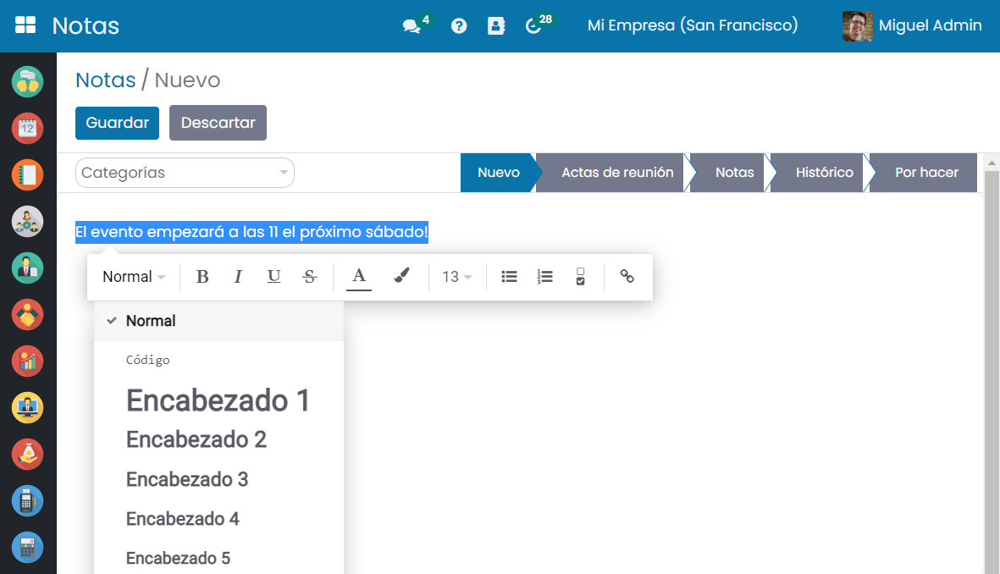

:show-content:

=====
Notas
=====

Uno de los aspectos vitales de la administración de las oficinas son las **Notas**. Las personas olvidan muchas cosas
en el ajetreado mundo, y la aplicación de Notas actúa como un recordatorio para captar detalles fácilmente.
Existe un práctico módulo de Notas en la aplicación Daeris para que los usuarios creen notas, actas de una reunión
y varias operaciones en la empresa. Puedes compartir notas con otros empleados y clientes a través de este módulo, y
ayudar a los usuarios a tomar notas en la vista Kanban y Lista.

Crear una nota
==============

Desde la pantalla :menuselection:`Notas > Notas` puedes visualizar la lista Kanban de todas las notas:

Para crear una nota debes pulsar el botón *Crear*, que navegará a la pantalla de edición, donde podrás
informar los siguientes campos:

-  **Etapa/Tipo**: Para informar el tipo debes hacer clic sobre una de las etapas que aparecen en pantalla:
   Nuevo, Actas de reunión, etc. Estos valores pueden variar en función de las etapas definidas en tu sistema.

-  **Categorías**: Mediante este campo puedes incorporar categorías asociadas a la nota.

-  **Texto de la nota**: Mediante este campo puedes incorporar el texto asociado a la nota. Al teclear el carácter "/"
   aparecen una série de bloques HTML disponibles para incorporar en el texto (cabeceras, listas, enlaces, etc.). También
   puedes seleccionar el texto y aplicarle el formato más adecuado, como la fuente o el color del texto.

Una vez informados los campos necesarios, debes pulsar el botón *Guardar*.

Sobre cada nota creada, puedes asignar un color, en función de tus necesidades, haciendo clic en el menú
desplegable ubicado en la propia nota de la pantalla Kanban de notas:

Crear una etapa o tipo de nota
==============================

Desde la pantalla :menuselection:`Notas > Notas` puedes visualizar la lista Kanban de todas las notas:

Cada nota está ubicada en su correspondiente columna en base a su etapa (tipo). Para incorporar un nuevo
tipo debes hacer clic sobre el icono *Agregar una columna*:

A continuación, debes introducir el nombre de la nueva etapa en el campo habilitado para ello:

Una vez añadida la nueva etapa, aparecerá como una nueva columna en la pantalla de notas:

Para cambiar la ubicación de la nueva etapa, puedes arrastrar la columna sobre la posición deseada:

Si quieres que la etapa aparezca replegada por defecto, lo puedes hacer desde el icono de *Configuración*,
pulsando la opción *Editar Etapa*. En el formulario, es necesario marcar el campo **Replegado por defecto**:

Al hacer esto, la etapa aparecerá replegada en la pantalla Kanban de todas las notas:

Programar una actividad asociada a una nota
===========================================

Para programar una actividad asociada a una nota, navega a la pantalla Kanban de todas las notas en :menuselection:`Notas > Notas`.

Es posible programar actividades para cada Nota pulsando el icono del Reloj:

.. image:: notas/programar-actividad.png
   :align: center
   :alt: Programar actividad asociada a una nota

Al planificar una actividad es posible informar el tipo de actividad, la fecha de vencimiento, un resumen, la persona asignada
y una descripción. Una vez completados todos los campos, pulsa el botón **Planificación**:

A partir de ese momento, la actividad estará disponible en la nota. Es posible ver la actividad planificada haciendo clic en
el icono del Reloj. El color verde muestra que la fecha de vencimiento está próxima:

.. image:: notas/actividad-planificada.png
   :align: center
   :alt: Actividad planificada en una nota

También es posible programar una actividad a través de la pantalla de actividades visible desde el lado derecho del tablero de
Notas:

Utilizar pads colaborativos en notas
====================================

Es esencial proporcionar una plataforma colaborativa en tiempo real para trabajar en grupo. Los usuarios que contribuyan
a un mismo contenido se beneficiarán en gran medida a través de este tipo de opción.

Para que los usuarios puedan editar la descripción de las notas de forma colaborativa en tiempo real, navega a la pantalla
:menuselection:`Ajustes > Opciones Generales`, y marca la opción de **Pads colaborativos**:

Una vez marcada esta opción, pulsa el botón *Guardar* de la pantalla de Ajustes.

A continuación, se habilitarán dos nuevos campos:

-  **Servidor Pad**: Es el servidor en el que está instalada la instancia de Etherpad.

-  **Clave API Pad**: En este campo se debe informar la clave API de la instancia Etherpad para que sea posible realizar
   la conexión. Dicha clave API se encuentra en el fichero APIKEY.txt de la ruta base en donde se encuentra instalado Etherpad.

A partir de este momento, al crear una nueva nota o editar una nota existente, el campo descripción estará sincronizado
con Etherpad, de manera que todos los que vean esta página verán el mismo texto. Esto permite colaborar sin problemas en
documentos compartidos:

Ahora puedes establecer tu propio color y nombre. Después de configurar el color deseado, todo lo que escribas se mostrará
en ese color elegido, lo que facilitará que otros usuarios comprendan su autoría:

Para compartir este Pad y la fecha de creación en el Pad, Daeris ofrece una opción llamada compartir e incrustar. El enlace
y la URL para insertar se mostrarán de forma predeterminada. La opción de solo lectura restringe el Pad compartido de
cualquier tipo de edición:

Mediante el icono de configuración del Pad es posible configurar aspectos tales como la tipografía, el idioma, etc.:

El icono de línea de tiempo se usa para convertir la escritura en un vídeo. Tiene dos botones para reproducir y pausar el vídeo:

Por otro lado, el icono de importar y exportar se utiliza para importar y exportar los datos en el Pad colaborativo:

Por último, en caso de haber varios usuarios colaborando en el mismo Pad, es posible chatear con ellos mediante
el chat incorporado:

