===============
Plugin de Gmail
===============

Configurar el plugin de Gmail
=============================

El :doc:`Plugin de Correo <../plugins_de_correo>` de Gmail se debe configurar tanto en Daeris como en Gmail.

Habilitar el plugin de correo
-----------------------------

Para habilitar el plugin de correo, navega a la pantalla :menuselection:`Ajustes --> Opciones Generales`, y en el apartado de
*Integraciones*, activa la opción de **Plugin de correo**:

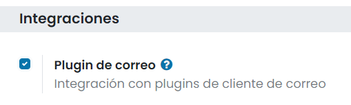

Una vez activada la opción, pulsa el botón *Guardar* de la página de ajustes.

Instalar el plugin de Gmail
---------------------------

A continuación, abre el proyecto de `Apps Script del plugin de Gmail
<https://script.google.com/d/1U4a7wK_C_2qvu6La3obcPrr-F3bSXIO5xTjAUZ06EwJ4HiLpiv9Tr0Fj/edit?usp=sharing>`_.

.. important::
   Verifica que iniciaste sesión en la cuenta de Google en la que deseas instalar el plugin.
   Cierra sesión en el resto de cuentas, en caso de tener iniciada sesión en varias cuentas de Google.

Asegúrate de usar el editor clásico, de otra forma la función *Desplegar desde el manifiesto* puede no estar disponible:

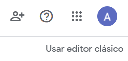

Haz clic en *Publicar* y luego en *Desplegar desde el manifiesto…*:

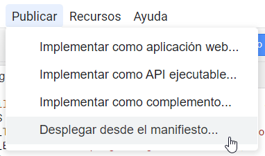

Haz clic en *Instalar complemento*:

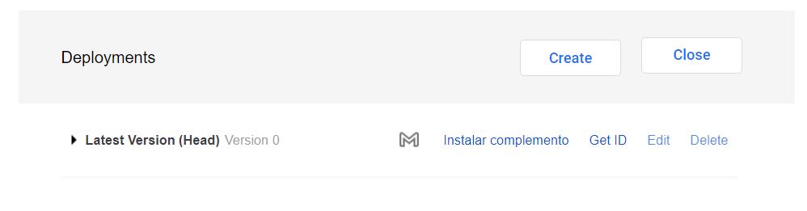

Debe aparecer una notificación que diga *Se ha instalado el despliegue*. Luego, haz clic en *Cerrar*:

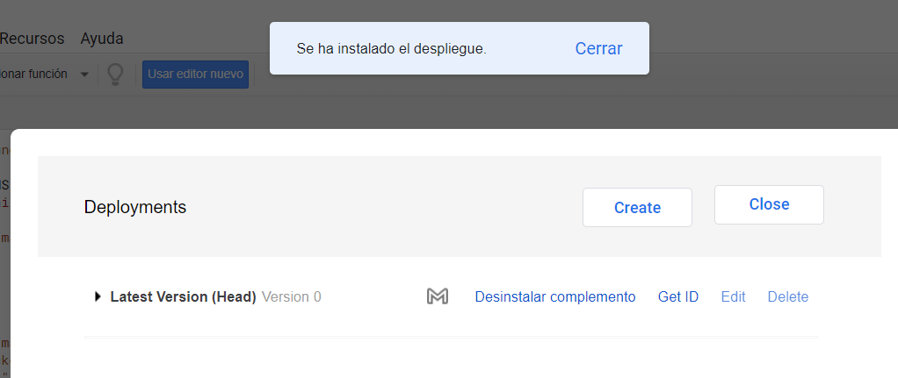

Abre tu bandeja de entrada de `Gmail <https://www.google.com/intl/es/gmail/about/>`_, y selecciona cualquier correo
electrónico. En el panel ubicado a la derecha, haz clic en el icono de Daeris y luego en *Autorizar el acceso*:

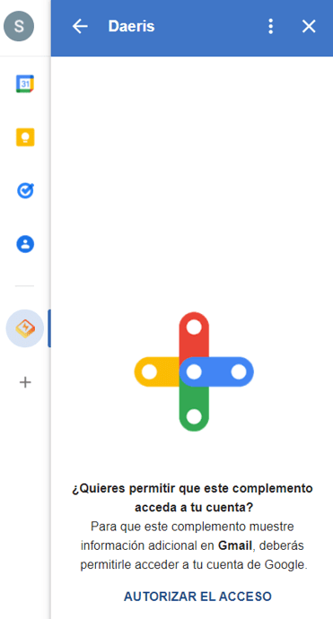

Elije la cuenta de Gmail correcta:

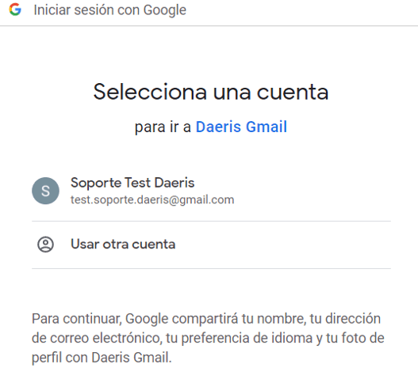

En configuración avanzada, pulsa la opción de *Ir a Daeris Gmail*:

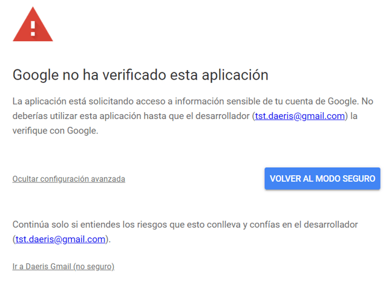

Permite que el plugin de Gmail tenga acceso a algunos de tus datos:

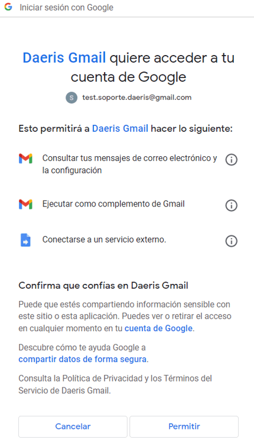

Conectar tu base de datos
-------------------------

En el panel ubicado a la derecha ahora aparece un apartado con el *Resumen de la empresa*. Al final de la página, haz
clic en *Iniciar sesión*. Introduce la URL de tu entorno exclusivo de Daeris y haz clic en *Iniciar sesión*:

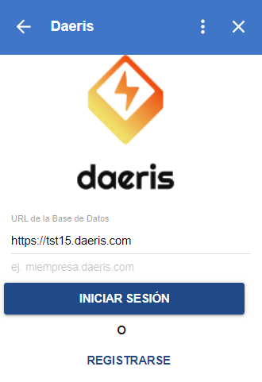

Aparecerá una nueva ventana donde deberás introducir tu usuario y contraseña de tu entorno exclusivo de Daeris:

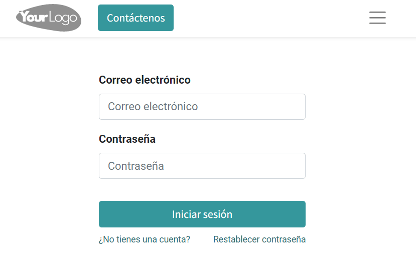

Una vez iniciada la sesión, deberás permitir a Gmail el acceso a tu base de datos de Daeris mediante el enlace *Permitir*:

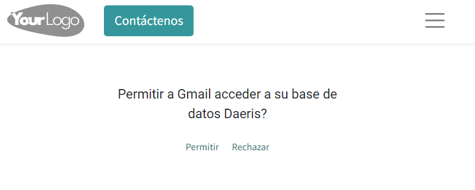

Si todo ha ido bien, se mostrará una ventana como la siguiente. Cierra la ventana para continuar:

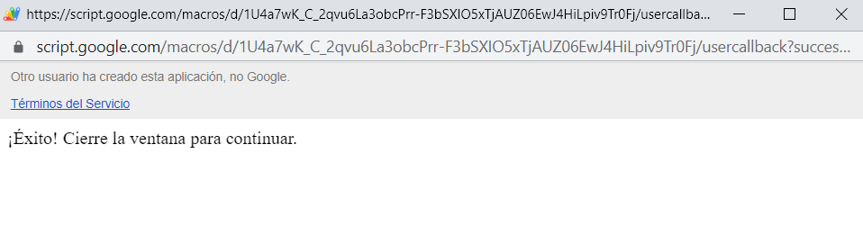

A partir de ese momento, ya dispondrás del plugin de Gmail conectado contra la base de datos de tu instancia de Daeris:

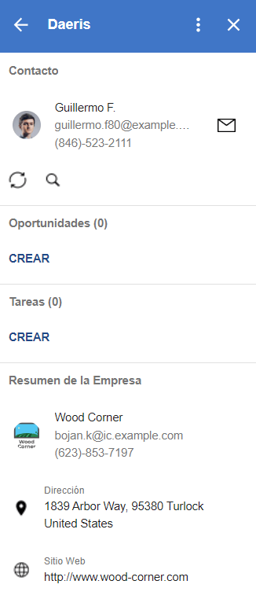

Utilizar el plugin de correo de Gmail
=====================================

Una vez hayas configurado el plugin de Gmail, tras iniciar sesión, ya dispondrás del plugin conectado contra la base
de datos de tu instancia de Daeris:

El panel de control muestra los detalles del contacto asociado al remitente del correo seleccionado en Gmail. Si no
existe ningún contacto en Daeris con esa dirección de correo electrónico, podremos crear uno mediante el icono de
*Guardar en Daeris*:

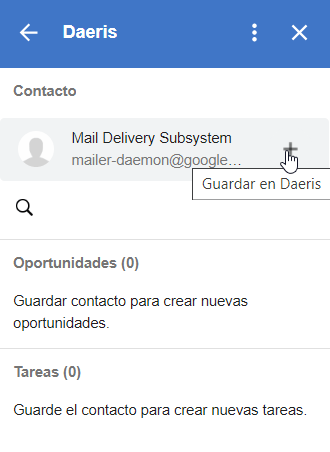

Una vez añadido el contacto a la base de datos de Daeris, ya será posible asociar el correo seleccionado en Gmail
al nuevo contacto creado, mediante el icono de correo que aparece al lado del contacto:

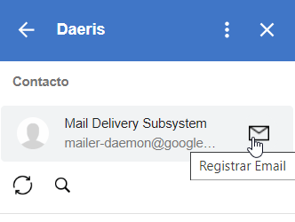

Si navegamos a la aplicación Daeris, desde la pantalla de **Contactos**, podremos observar cómo se ha creado un contacto
y se ha añadido el correo electrónico al mismo desde el apartado de conversaciones:

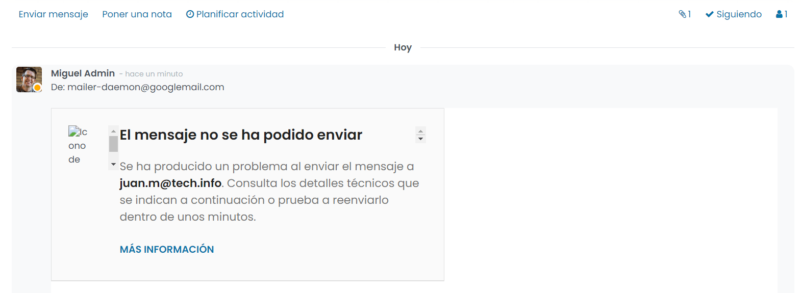

Volviendo al panel de Gmail, será posible crear una oportunidad para el contacto mediante el icono ubicado en la sección
de oportunidades:

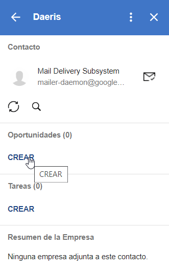

Al crear la oportunidad, se abrirá una nueva ventana en donde aparecerá la oportunidad recién creada en modo edición:

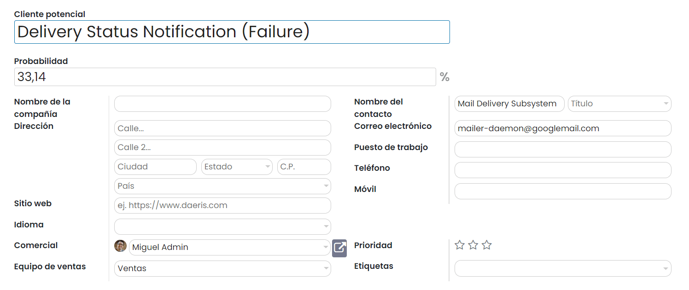

Si actualizamos el panel de Gmail, la oportunidad aparecerá asociada al contacto:

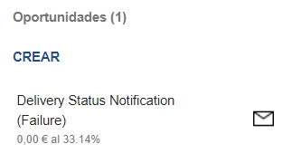

Por otro lado, es posible crear una tarea asociada al contacto desde el propio panel de Daeris para Gmail. Para ello,
pulsa el botón ubicado en el apartado de tareas. El sistema permitirá seleccionar un proyecto al cuál asociar la tarea o
crear un nuevo proyecto:

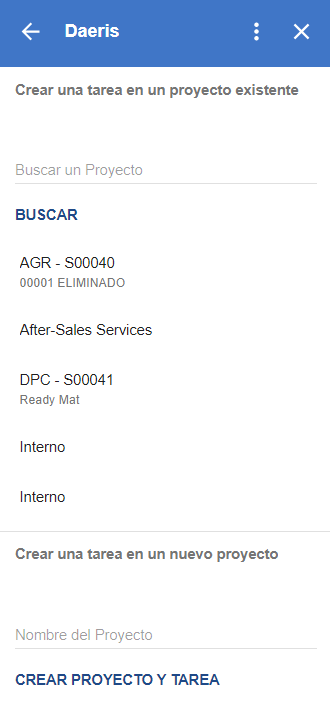

Al crear la tarea, se abrirá una nueva ventana en donde aparecerá la tarea recién creada en modo edición:

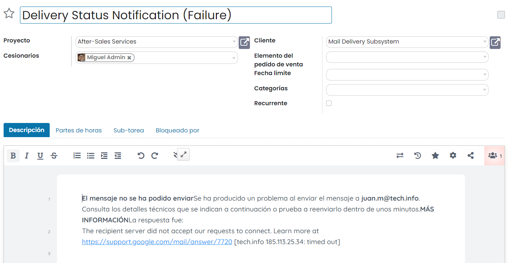

Si actualizamos el panel de Gmail, la tarea aparecerá asociada al contacto:

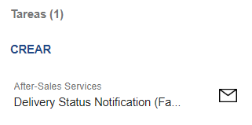

Por último, también es posible buscar un contacto en la base de datos al cuál poder asociar el correo seleccionado en
Gmail. Para buscar un contacto, pulsa el icono de lupa del panel de Daeris para Gmail, escribe el nombre del contacto,
y ejecuta la búsqueda mediante el icono correspondiente:

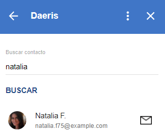

Desde el listado de contactos encontrados, podrás añadir el correo al contacto mediante el icono de correo, o también
podrás seleccionar al contacto con el que quieras trabajar en el panel, pulsando sobre el nombre del contacto. Al hacer
esto, el panel de Daeris para Gmail mostrará la información del contacto, y de todas sus oportunidades, tareas y
empresas asociadas:

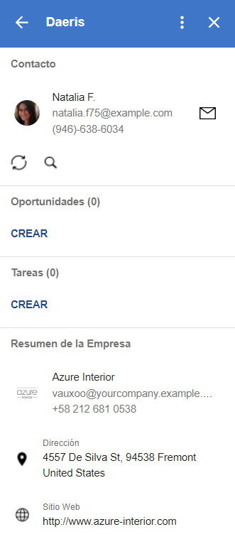

Si el contacto tiene empresa asociada, podremos consultar el resumen de la empresa:

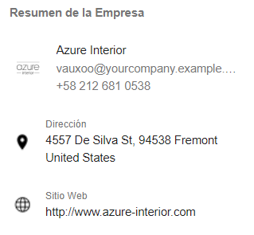

Al pulsar sobre el nombre de la empresa, se abrirá una nueva ventana en Daeris accediendo al detalle de la empresa en
cuestión:

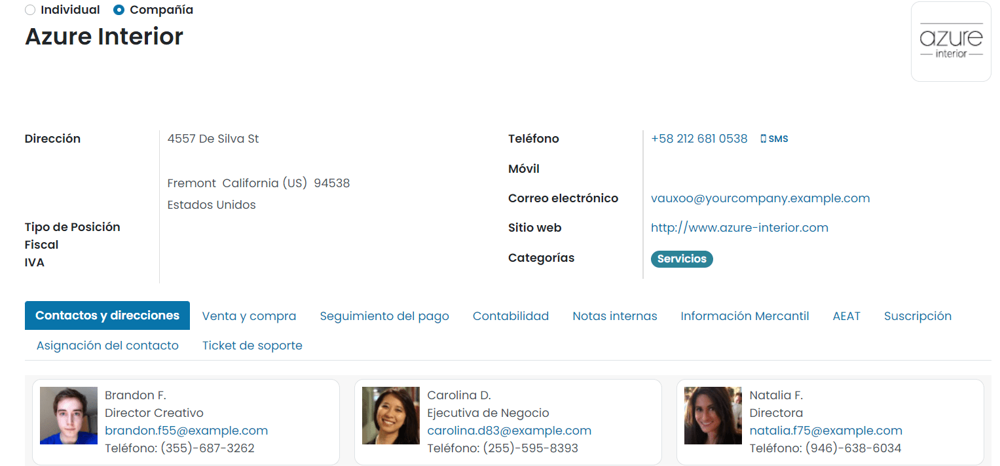

Por último, al pulsar sobre la dirección de la empresa en el panel de Daeris para Gmail, se abrirá una nueva ventana
de Google Maps posicionándose sobre la dirección de la empresa:

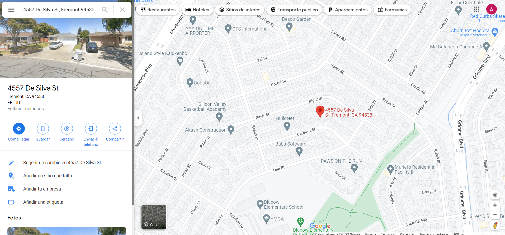

Al pulsar sobre el sitio web de la empresa, se abrirá una nueva ventana del navegador accediendo a la URL especificada.

Una vez finalizadas todas las acciones, se recomienda cerrar sesión del panel de Daeris para Gmail mediante el enlace
ubicado en la parte superior del panel.

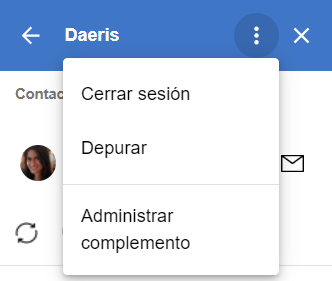