=================
Plugin de Outlook
=================

Configurar el plugin de Outlook
===============================

El :doc:`Plugin de Correo <../plugins_de_correo>` de Outlook se debe configurar tanto en Daeris como en Outlook.

Habilitar el plugin de correo
-----------------------------

Para habilitar el plugin de correo, navega a la pantalla :menuselection:`Ajustes --> Opciones Generales`, y en el apartado de
*Integraciones*, activa la opción de **Plugin de correo**:

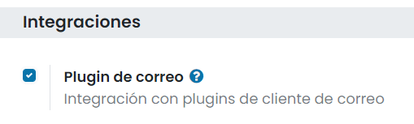

Una vez activada la opción, pulsa el botón *Guardar* de la página de ajustes.

Instalar el plugin de Outlook
-----------------------------

A continuación, abre tu bandeja de entrada de `Outlook Web <https://outlook.live.com/owa/>`_, y selecciona cualquier correo
electrónico. Haz clic en el botón de *Más acciones*:

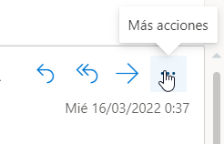

Selecciona *Obtener complementos*:

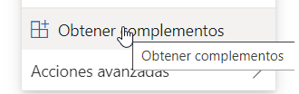

Accede a la pestaña de *Mis complementos*:

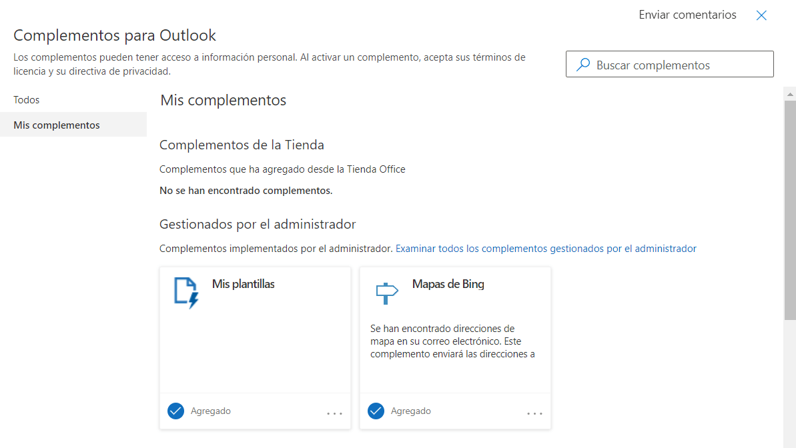

En *Complementos personalizados*, haz clic en *+ Agregar un complemento personalizado* y luego en *Agregar desde dirección URL…*:

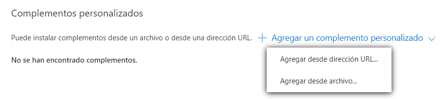

Introduce la siguiente URL `https://download.daeris.com/plugins/v15/outlook/manifest.xml` y haz clic en *Aceptar*:

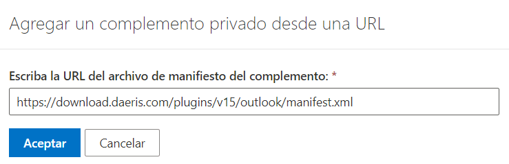

Lee la advertencia y haz clic en *Instalar*:

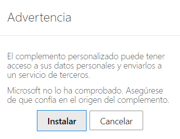

A partir de ese momento, el complemento ya queda instalado en Outlook y listo para su uso.

Conectar tu base de datos
-------------------------

Para conectar tu base de datos de Daeris, abre cualquier correo en tu bandeja de entrada de Outlook, pulsa el botón de
*Más acciones* y selecciona *Daeris para Outlook*:

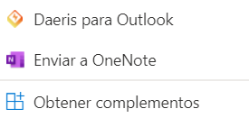

En el panel ubicado a la derecha ahora aparece un apartado con el *Resumen de la empresa*. Al final de la página, haz clic
en *Iniciar sesión*:

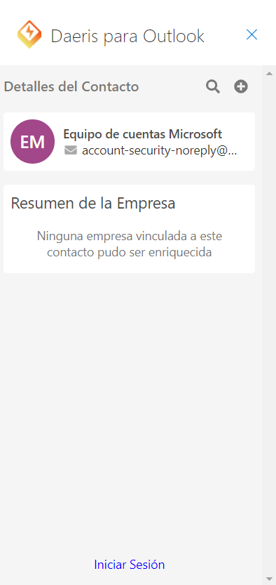

Introduce la URL de tu entorno exclusivo de Daeris y haz clic en *Iniciar sesión*:

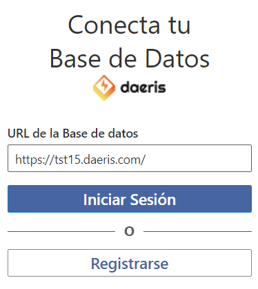

Permite que Daeris muestre una nueva ventana con el botón *Permitir*:

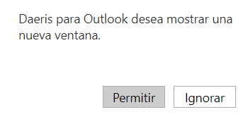

Aparecerá una nueva ventana donde deberás introducir tu usuario y contraseña de tu entorno exclusivo de Daeris:

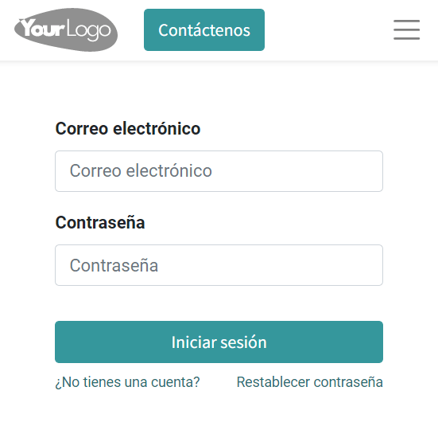

Una vez iniciada la sesión, deberás permitir a Outlook el acceso a tu base de datos de Daeris mediante el enlace *Permitir*:

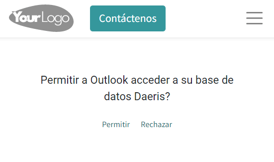

A partir de ese momento, ya dispondrás del plugin de Outlook conectado contra la base de datos de tu instancia de Daeris:

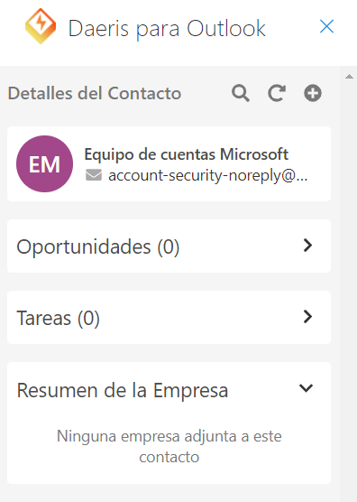

Agregar un atajo al plugin
--------------------------

Por defecto, el complemento de Outlook se puede abrir desde el menú *Más acciones*. Sin embargo, para ahorrar tiempo, es
posible agregarlo junto a las otras acciones predeterminadas.

Para ello, en tu bandeja de entrada de Outlook, navega a *Ajustes* y luego a *Ver toda la configuración de Outlook*:

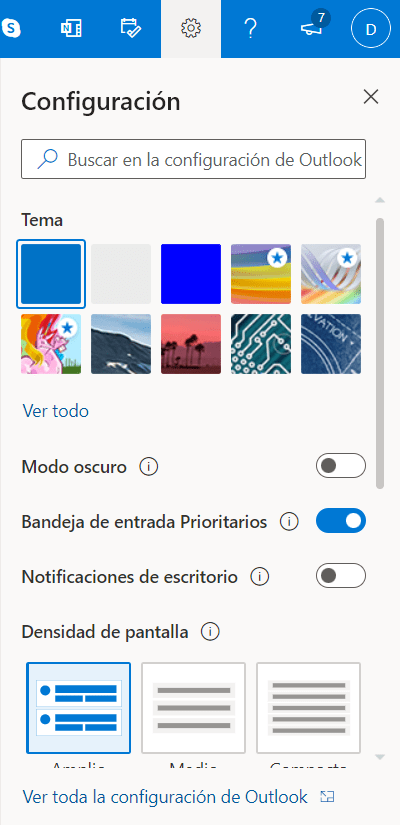

Selecciona *Personalizar acciones* en *Correo*, haz clic en *Daeris para Outlook* y luego en *Guardar*:

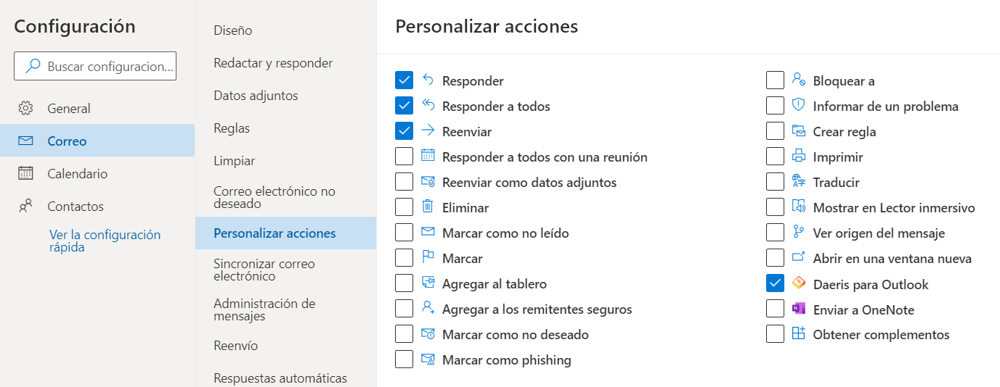

Abre cualquier correo electrónico; se debe mostrar el acceso directo:

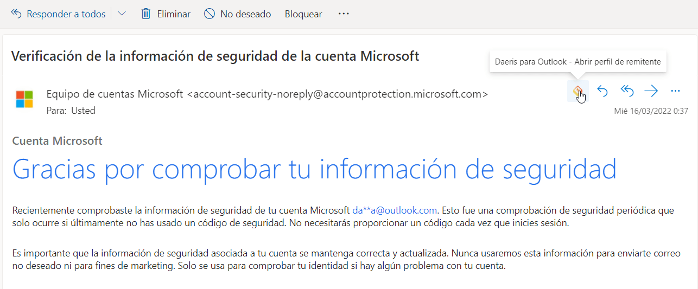

Utilizar el plugin de correo de Outlook
=======================================

Una vez hayas configurado el plugin de Outlook, tras iniciar sesión, ya dispondrás del plugin conectado contra la base
de datos de tu instancia de Daeris:

El panel de control muestra los detalles del contacto asociado al remitente del correo seleccionado en Outlook. Si no
existe ningún contacto en Daeris con esa dirección de correo electrónico, podremos crear uno mediante el icono de
*Añadir Contacto a la Base de Datos*:

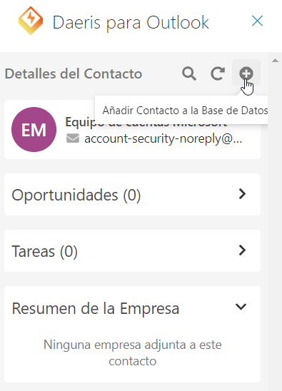

Una vez añadido el contacto a la base de datos de Daeris, ya será posible asociar el correo seleccionado en Outlook
al nuevo contacto creado, mediante el icono de correo que aparece al lado del contacto:

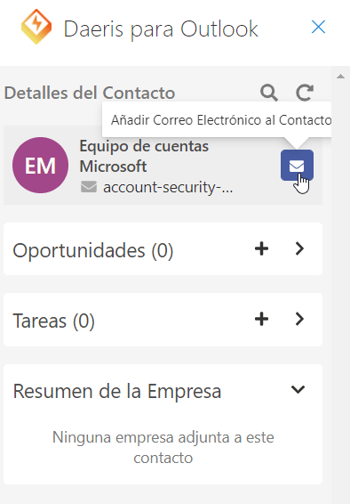

Si navegamos a la aplicación Daeris, desde la pantalla de **Contactos**, podremos observar cómo se ha creado un contacto
y se ha añadido el correo electrónico al mismo desde el apartado de conversaciones:

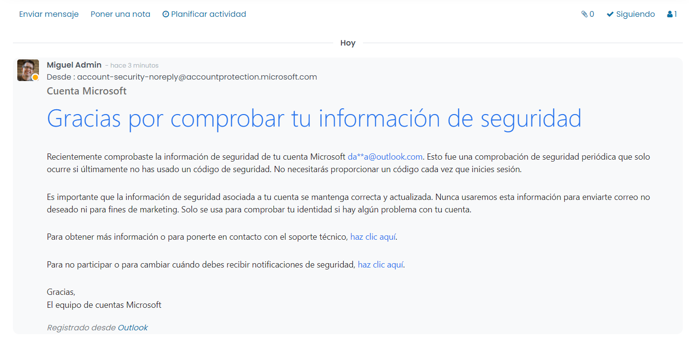

Volviendo al panel de Outlook, será posible crear una oportunidad para el contacto mediante el icono ubicado en la sección
de oportunidades:

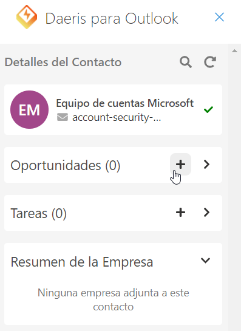

Al crear la oportunidad, se abrirá una nueva ventana en donde aparecerá la oportunidad recién creada en modo edición:

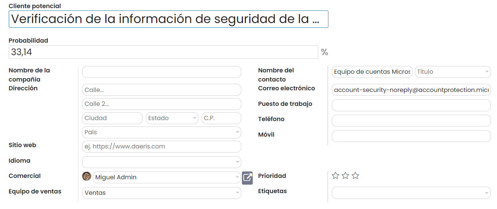

Si actualizamos el panel de Outlook, la oportunidad aparecerá asociada al contacto:

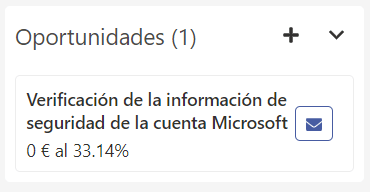

Por otro lado, es posible crear una tarea asociada al contacto desde el propio panel de Daeris para Outlook. Para ello,
pulsa el botón ubicado en el apartado de tareas. El sistema permitirá seleccionar un proyecto al cuál asociar la tarea o
crear un nuevo proyecto:

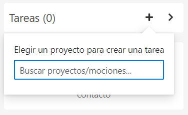

Al crear la tarea, se abrirá una nueva ventana en donde aparecerá la tarea recién creada en modo edición:

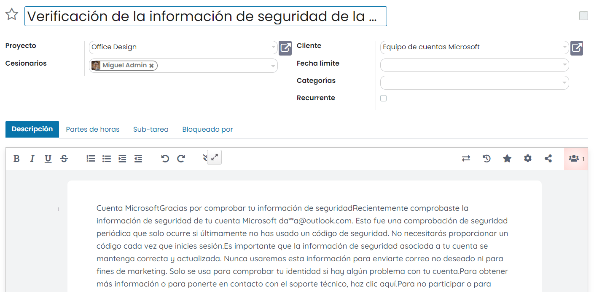

Si actualizamos el panel de Outlook, la tarea aparecerá asociada al contacto:

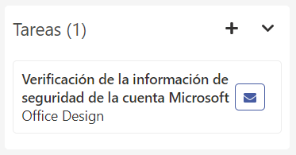

Por último, también es posible buscar un contacto en la base de datos al cuál poder asociar el correo seleccionado en
Outlook. Para buscar un contacto, pulsa el icono de lupa del panel de Daeris para Outlook, escribe el nombre del contacto,
y ejecuta la búsqueda mediante el icono correspondiente:

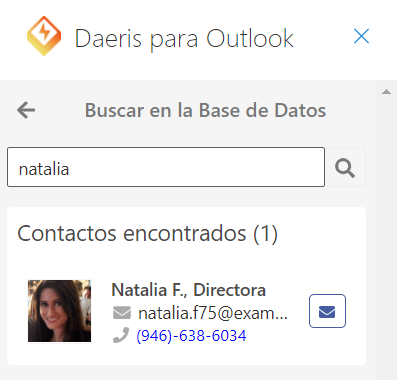

Desde el listado de contactos encontrados, podrás añadir el correo al contacto mediante el icono de correo, o también
podrás seleccionar al contacto con el que quieras trabajar en el panel, pulsando sobre el nombre del contacto. Al hacer
esto, el panel de Daeris para Outlook mostrará la información del contacto, y de todas sus oportunidades, tareas y
empresas asociadas:

.. image:: outlook/detalle-contacto.png
   :align: center
   :alt: Detalle del contacto en el panel de Outlook

Si el contacto tiene empresa asociada, podremos consultar el resumen de la empresa:

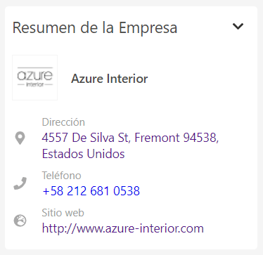

Al pulsar sobre el nombre de la empresa, se abrirá una nueva ventana en Daeris accediendo al detalle de la empresa en
cuestión:

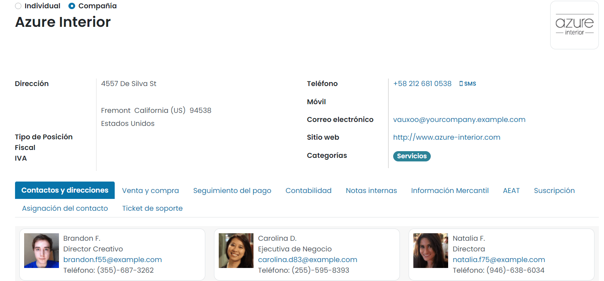

Por último, al pulsar sobre la dirección de la empresa en el panel de Daeris para Outlook, se abrirá una nueva ventana
de Google Maps posicionándose sobre la dirección de la empresa:

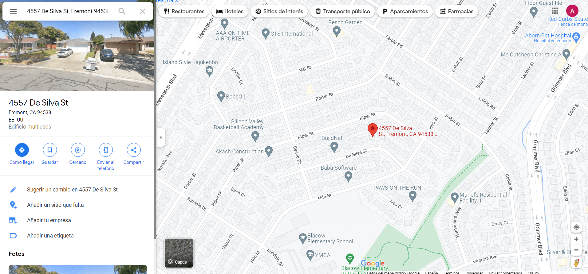

Al pulsar sobre el teléfono, el sistema intentará realizar una llamada al teléfono de la empresa a través de alguna
aplicación que permita hacer llamadas, como por ejemplo, Skype. Y al pulsar sobre el sitio web de la empresa, se
abrirá una nueva ventana del navegador accediendo a la URL especificada.

Una vez finalizadas todas las acciones, se recomienda cerrar sesión del panel de Daeris para Outlook mediante el enlace
ubicado en la parte inferior del panel.