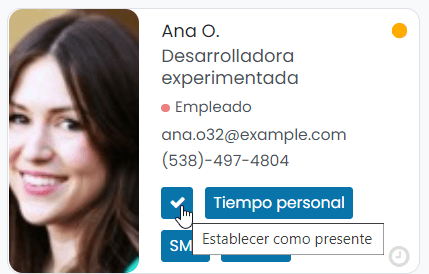
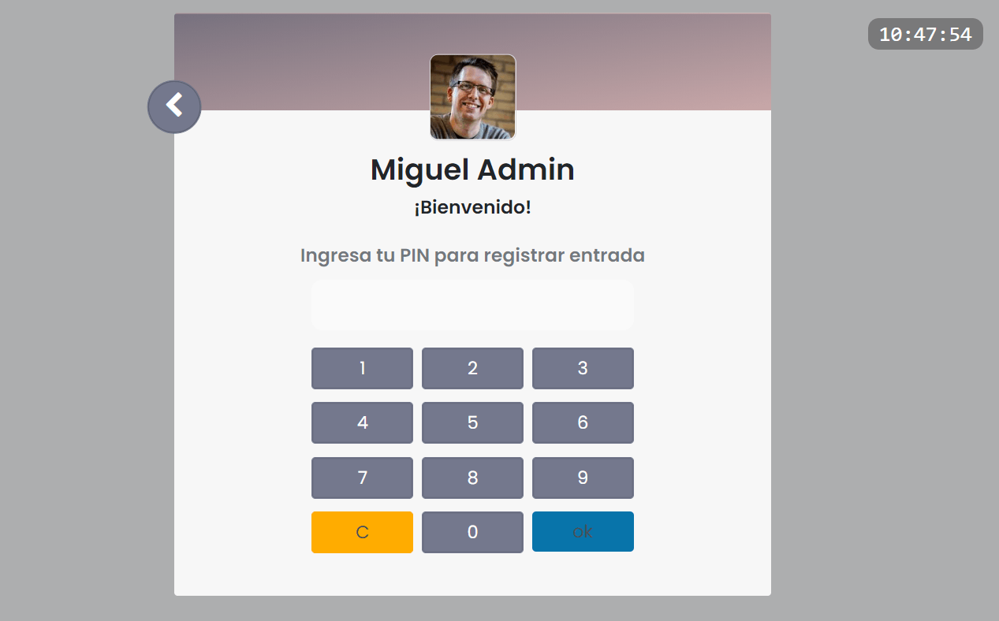

:show-content:

==========
Asistencia
==========

La gestión de la asistencia de los empleados es una parte integral de las actividades de gestión de recursos humanos,
incluso si se trata de una pequeña o mediana empresa. Es muy importante realizar un seguimiento y registrar la asistencia
y las horas de trabajo de los empleados para poder pagarles correctamente. El método tradicional de seguimiento manual de
la asistencia no es conveniente para el mundo empresarial actual porque las posibilidades de errores de registro son
altas. Por lo tanto, necesitamos un sistema transparente de gestión de asistencia que sea conveniente tanto para los
empleados como para las compañías. El registro preciso de la asistencia también eliminará los errores manuales en las
actividades de nómina.

El módulo de asistencia de Daeris registrará todos los detalles relacionados con la asistencia de los empleados que
iniciaron sesión en el sistema. Puedes utilizar esta plataforma para gestionar la asistencia de los empleados de forma
diaria, semanal, mensual y anual.

Configuración
=============

Configurar el control de presencia de los empleados
---------------------------------------------------

La opción de control de presencia te permite definir los detalles de asistencia del empleado que se pueden establecer en
función de las asistencias o en función del estado del usuario en el sistema, o ambos. La opción de control de presencia
avanzado puede basarse en la cantidad de correos electrónicos enviados (debes proporcionar la cantidad mínima de correos
electrónicos a enviar) o en función de la dirección IP, o ambos.

Para configurar estas funciones, navega a la pantalla :menuselection:`Empleados --> Configuración --> Ajustes`:

.. image:: asistencia/control-presencia.png
   :align: center
   :alt: Control de presencia de los empleados

Una vez informados los campos, pulsa el botón *Guardar* de la pantalla de ajustes.

Al activar la función de control de presencia avanzado, se habilitará una nueva pantalla bajo
:menuselection:`Empleados --> Informes --> Presencia del empleado`:

Esta pantalla mostrará todos los detalles de los empleados para los que necesitas definir la presencia. Puedes hacer clic
en la marca de verificación para establecer el empleado como presente:

Además, dispones de los siguientes botones:

-  **Tiempo personal**: Crea una nueva ausencia para el empleado.

-  **SMS**: Envía un SMS al empleado indicando que no está trabajando y que no hay solicitud de tiempo libre por
   su parte.

-  **Correo**: Envía un correo al empleado indicando que no está trabajando y que no hay solicitud de tiempo libre por
   su parte.

Al usar esta pantalla, puedes visualizar fácilmente los empleados ausentes y presentes. La pantalla también te permite
ver los empleados *Ausentes*, empleados *Presentes* y empleados *Por definir*:

Activar el recuento de horas extra de los empleados
---------------------------------------------------

Para activar el recuento de horas extra de los empleados navega a la pantalla :menuselection:`Asistencias --> Configuración`:

La habilitación de esta opción te ayudará a contabilizar las horas extras de asistencia. Eso significa que el sistema
compara la asistencia marcada con las horas de trabajo establecidas en los empleados. Aquí debes configurar una fecha de
inicio y el recuento de horas extra se considera a partir de esta fecha.

Con esta característica, Daeris brinda beneficios tanto en términos de empleado como de empresa. El tiempo de tolerancia a
favor de la empresa permitirá definir una cantidad específica de tiempo (en minutos) donde el tiempo extra no se contará
en beneficio de la empresa. Además, Daeris también admite el tiempo de tolerancia a favor del empleado, y esto permitirá
definir una cantidad específica de tiempo (en minutos) en el que no se deducirá el tiempo extra en los beneficios del
empleado.

Una vez informados los campos, pulsa el botón *Guardar* de la pantalla de ajustes.

Registrar la asistencia de los empleados
========================================

Asistencia manual
-----------------

Los empleados pueden registrar su jornada laboral desde la pantalla :menuselection:`Asistencias --> Entrada / Salida`:

Al pulsar en el icono de registrar entrada, el sistema muestra un mensaje de bienvenida con la hora de entrada del empleado:

A continuación, al pulsar OK, el sistema muestra una pantalla que permitirá registrar la salida:

En el momento en el que el usuario actual quiera registrar su salida del puesto de trabajo, solo tiene que pulsar el
botón de registrar salida. Al hacerlo, el sistema muestra una pantalla de despedida, informando de la hora de la salida:

Modo quiosco
------------

Desde la pantalla :menuselection:`Asistencias --> Modo Quiosco`, puedes acceder al modo quiosco de asistencias, que
permite a los empleados, registrar su entrada o salida del puesto de trabajo:

Mediante la opción **Escanea tu identificación**, es posible escanear la identificación del empleado, obtenida desde la
opción de :ref:`imprimir identificación <recursos_humanos/empleados/imprimir_identificacion>` de la ficha del empleado.

.. note::
   Para esto sería necesario disponer de un escáner con lector de códigos de barra, que permita leer el número de
   identificación del empleado. Al realizar el escaneo, quedaría registrada la entrada o salida del empleado.

Desde la opción **Identificar manualmente**, se permite seleccionar el empleado que quiere registrar la entrada:

A continuación, el sistema pedirá que el usuario confirme el registro de entrada:

Una vez confirmado, quedará registrada la entrada del empleado:

Para registrar la salida del usuario, se debe realizar el mismo procedimiento, seleccionando el usuario en cuestión:

Una vez confirmado, quedará registrada la salida del usuario:

.. image:: asistencia/identificar-manualmente-5.png
   :align: center
   :alt: Identificar manualmente en el modo quiosco de asistencias (5)

Utilizar códigos PIN
~~~~~~~~~~~~~~~~~~~~

Desde la pantalla :menuselection:`Asistencias --> Configuración`, puedes activar la opción **PIN del empleado**, para que
los empleados deban utilizar códigos PIN a la hora de registrar la asistencia en el modo quiosco:

Una vez activada la opción, debes pulsar el botón *Guardar* para que se apliquen los cambios.

El PIN del empleado se puede informar desde la pantalla :menuselection:`Empleados --> Empleados --> Empleados`, en la
pestaña **Configuración RRHH** del detalle de los empleados:

Una vez hecho esto, ya puedes acceder al modo quiosco desde la pantalla :menuselection:`Asistencias --> Modo Quiosco`:

Desde la opción **Identificar manualmente**, se permite seleccionar el empleado que quiere registrar la entrada:

A continuación, el sistema pedirá el PIN del empleado:

Una vez introducido el PIN, quedará registrada la entrada del empleado:

.. image:: asistencia/introducir-pin-modo-quiosco-2.png
   :align: center
   :alt: Introducir PIN en modo quiosco (2)

Para registrar la salida del usuario, debes realizar el mismo procedimiento, seleccionando el usuario en cuestión,
e introduciendo el PIN. Una vez introducido el PIN, quedará registrada la salida del empleado.

Gestionar las asistencias de los empleados
==========================================

Desde la pantalla :menuselection:`Asistencias --> Asistencias`, puedes consultar un listado de todas las asistencias
registradas por los empleados en la aplicación. Por cada asistencia, puedes consultar el empleado, la fecha/hora de entrada
y la fecha/hora de salida:

Mediante el panel de formato de vista disponible en la parte superior derecha puedes cambiar el tipo de vista (Lista / Kanban).
Si haces clic sobre el tipo de vista Kanban, puedes acceder a la pantalla de todas las asistencias en formato Kanban,
donde puedes consultar las asistencias de los empleados de un modo más visual:

Analizar las asistencias de los empleados
=========================================

La pestaña **Informes** del módulo de Asistencias de Daeris te ayudará a generar informes de asistencia de cada empleado
por mes, semana y año. La representación gráfica de la ventana de análisis de asistencia se muestra a continuación:

En este análisis de gráfico de barras que se muestra arriba, puedes ver el registro de empleados en comparación con sus
horas trabajadas. También puedes ver los informes en gráficos lineales y circulares. Este informe de análisis de asistencia
se puede filtrar por año, mes y trimestre. También se puede agrupar según el empleado, el año de entrada, el mes, el
trimestre, la semana o el día. Además, la ventana de informes te permite generar informes sobre la asistencia con horas
de trabajo extra de cada empleado. Puede crear este informe seleccionando la opción *Horas extra* disponible en el
desplegable de *Medidas*.

Además de la representación gráfica de informes, Daeris también admite la generación de informes en formato tabla. Para
ver esto, puedes hacer clic en el tipo de vista *Pivote* al que se puede acceder desde la parte superior derecha de la pantalla:

En la representación de pivote, Daeris representará tus informes de análisis de asistencia en forma tabular. Esta ventana
te ayuda a analizar las horas trabajadas y las horas extras de cada empleado.