:show-content:

=========
Ausencias
=========

Un sistema de gestión de ausencias bien definido es una herramienta esencial para cualquier organización o institución
empresarial. A menos que las ausencias se manejen adecuadamente, la gestión de empresas o instituciones siempre es
complicada. La implementación de un sistema de gestión de ausencias ayudará a los empleados y al departamento de recursos
humanos de tu organización a administrar las solicitudes de ausencia de una manera mejor y más rápida.

.. youtube:: Qi4ni9H3XPM
    :align: right
    :width: 700
    :height: 394

Configuración
=============

.. _recursos_humanos/ausencias/configurar_tipos:

Configurar los tipos de ausencias
---------------------------------

Desde la pantalla :menuselection:`Ausencias --> Configuración --> Tipos de ausencia`, puedes administrar los distintos
tipos de ausencias disponibles para los empleados:

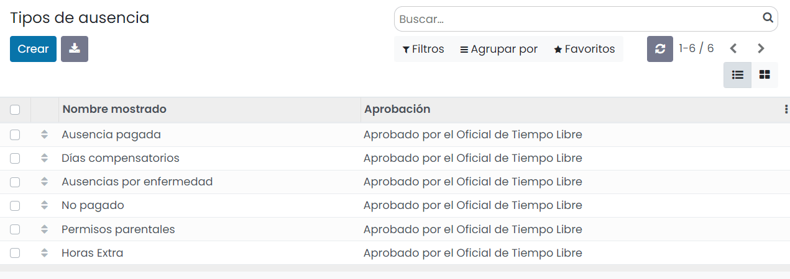

Por defecto, hay configuradas las siguientes tipologías de ausencias:

-  **Ausencia pagada**: Los empleados pueden ausentarse por varios motivos y periodos de tiempo en función de la
   legislación de cada país. Contraer matrimonio, nacimiento de un hijo o mudanza serían ejemplos de ausencias pagadas.

-  **Días compensatorios**: Horas de compensación que se asignan a un empleado por haber realizado un sobreesfuerzo con
   anterioridad.

-  **Ausencias por enfermedad**: Empleados que no se encuentran disponibles para trabajar por necesitar asistencia médica
   debido a enfermedad o accidente.

-  **No pagado**: Estas ausencias deben ser solicitadas por el empleado y aprobadas por el empresario.

-  **Permisos parentales**: Permisos por maternidad o paternidad definidos en función de la legislación de cada país.

-  **Horas extra**: Cómputo de horas extra realizadas por los empleados.

Al acceder al detalle de un tipo de ausencia, tienes disponibles los siguientes campos:

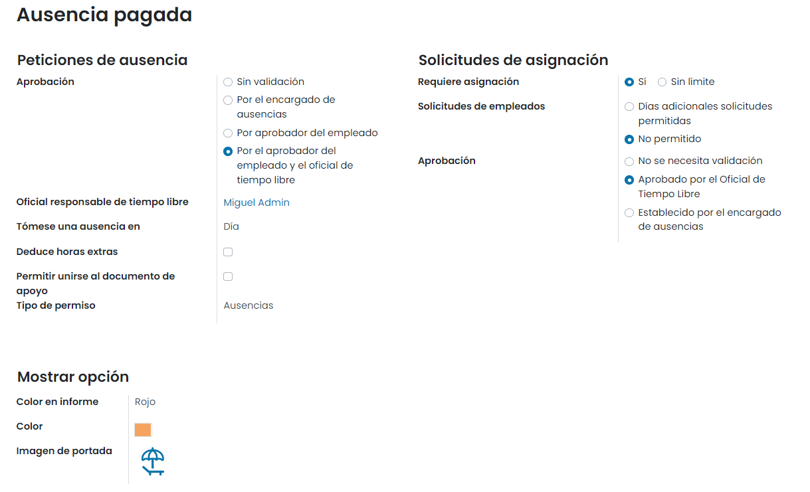

Inicialmente, puedes proporcionar un nombre para el tipo de ausencia. En la sección de **Peticiones de ausencia**, debes
seleccionar el campo **Aprobación**. Aquí Daeris te da las siguientes opciones:

-  Sin validación

-  Por el encargado de ausencias

-  Por aprobador del empleado

-  Por el aprobador del empleado y el oficial de tiempo libre

El campo **Oficial responsable de tiempo libre** te permite especificar quién es responsable de aprobar los permisos. Si
se necesita aprobación, se debe especificar un oficial de tiempo libre responsable.

A continuación, se debe informar el campo **Tómese una ausencia en**. Las opciones disponibles son *Día*, *Medio día* u *Horas*.
Luego, puedes habilitar el campo **Deduce horas extras** para deducir las horas extra en el módulo de asistencias. Y además,
podrás activar o desactivar la opción **Permitir unirse al documento de apoyo**. También se puede asignar el nombre de
la empresa.

Cuando vayas a la sección **Solicitudes de asignación**, encontrarás más campos si estableces el campo **Requiere asignación**
como *Sí*. Las **Solicitudes de empleados** se pueden elegir como *Días adicionales solicitudes permitidas* o *No permitido*.
De manera similar, la **Aprobación** se puede seleccionar entre opciones como *No se necesita validación*,
*Aprobado por el oficial de tiempo libre* o *Establecido por el encargado de ausencias*.

Finalmente, en la sección **Mostrar opción** se permite elegir un color para el informe de ausencias de empleado, un color
y una imagen de portada para mostrar con el tipo de ausencia.

.. _recursos_humanos/ausencias/plan_acumulacion:

Configurar planes de acumulación
--------------------------------

Los planes de acumulación harán posible que los empleados acumulen tiempo libre retribuido. La plataforma Daeris te
permitirá definir varios planes de acumulación y configurarlos de acuerdo con las políticas y reglas de tu empresa. Puedes
ver los planes de acumulación existentes y también puedes configurar nuevos planes de acumulación navegando a la pantalla
:menuselection:`Ausencias --> Configuración --> Planes de acumulación`:

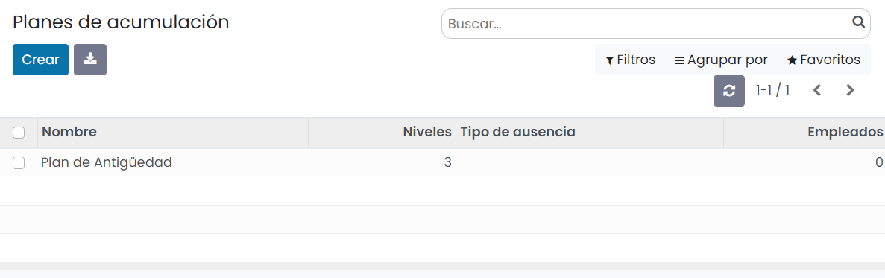

En esta pantalla aparecerá, junto con el nombre de los planes de acumulación, el nivel, el tipo de ausencia y los empleados.
También es posible seleccionar cada uno de estos planes de acumulación creados para verlo en detalle. El botón *Crear*
disponible en la ventana se puede utilizar para crear un nuevo plan de acumulación:

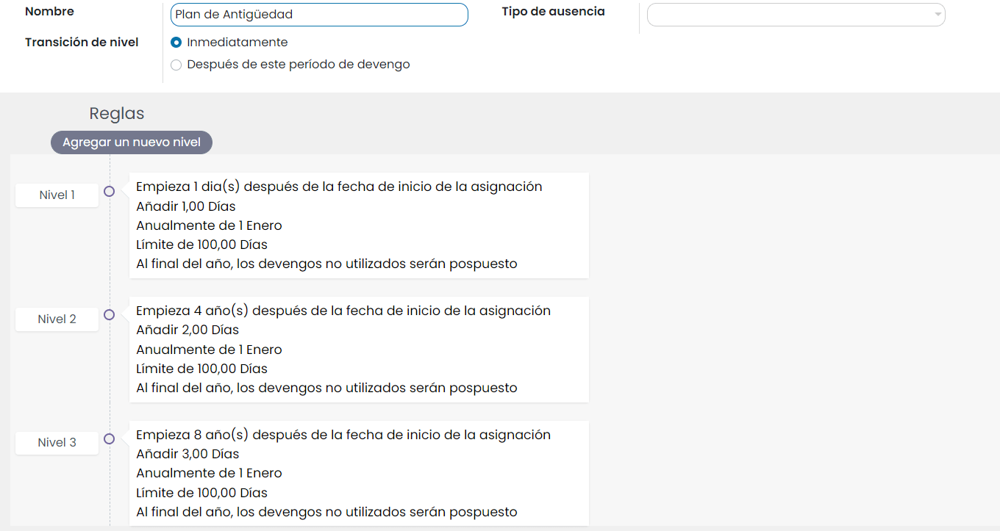

En esta ventana de creación de planes de acumulación, puedes asignar un nombre para el plan y elegir la transición de
nivel de entre las opciones *Inmediatamente* o *Después de este período de devengo*. Si seleccionas *Inmediatamente*,
cuando la fecha corresponda al nuevo nivel, tu acumulación se computará y otorgará automáticamente. Entonces cambiarás
automáticamente a un nuevo nivel. Si estás aplicando la opción *Después de este período de devengo*, el devengo se
otorga cuando se completa el periodo (una semana o un mes), y pasas al siguiente nivel si la fecha de asignación
corresponde.

Además, también puedes especificar el tipo de ausencia si este plan de acumulación solo se puede usar con este tipo. También
puedes dejar este campo vacío si este plan de acumulación se puede usar con cualquier tipo de ausencia.

A continuación, puedes establecer niveles para tus planes de acumulación. Esto se puede hacer haciendo clic en el botón
**Agregar un nuevo nivel** disponible en la sección de **Reglas**. Al hacer clic, aparecerá una ventana emergente como
se muestra a continuación:

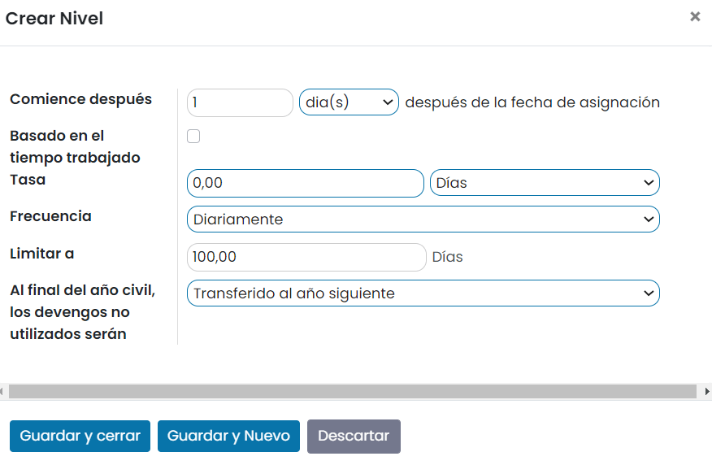

En el campo **Comience después**, puedes establecer cuántos días, meses o años después de la asignación deseas iniciar
este plan de acumulación. Por lo tanto, el plan de acumulación comenzará después de un período de tiempo definido a partir
de la fecha de inicio del empleado. Luego puedes habilitar o deshabilitar el campo **Basado en el tiempo trabajado**. Si
habilitas este campo, el plan de acumulación solo se acumula por el tiempo trabajado por el empleado.

Además, la cantidad de días u horas que se incrementarán en el tipo de ausencia especificado para cada período, se puede
asignar en el campo **Tasa**. Por otro lado, la **Frecuencia** dispone de las siguientes opciones: *Diariamente*, *Semanalmente*,
*Dos veces al mes*, *Mensual*, *Dos veces al año* y *Anualmente*. También puedes establecer un límite para la acumulación
en el campo **Limitar a**. Finalmente, puedes especificar si las acumulaciones no utilizadas pueden transferirse o no.
Esto se puede asignar en el campo **Al final del año civil, los devengos no utilizados serán**.

Una vez completados todos los campos, guarda el plan de acumulación.

.. _recursos_humanos/ausencias/dias_festivos:

Configurar los días festivos de la compañía
-------------------------------------------

Para configurar los días festivos de la compañía, navega a la pantalla :menuselection:`Ausencias --> Configuración --> Festivos`:

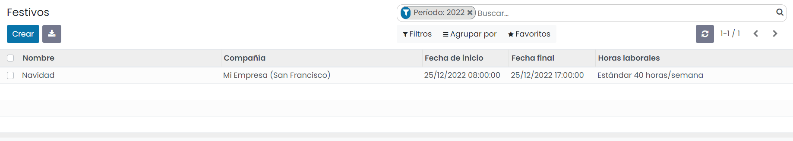

Esta ventana mostrará todos los días festivos que configuraste en la plataforma junto con detalles como el nombre, la
empresa, la fecha de inicio, la fecha de finalización, y el calendario de trabajo. Es posible crear un nuevo registro
haciendo clic en el botón *Crear* disponible en la esquina superior izquierda. Al crear un nuevo registro, se mostrará
una nueva línea para agregar un nuevo registro donde puedes proporcionar todos estos detalles y luego hacer clic en el
botón *Guardar* para guardar los detalles.

Gestión de ausencias
====================

Crear una solicitud de ausencia
-------------------------------

Para crear una solicitud de ausencia, debes navegar a la pantalla de :menuselection:`Ausencias --> Mis ausencias --> Tablero`,
donde aparece un calendario con todas las ausencias solicitadas por ti:

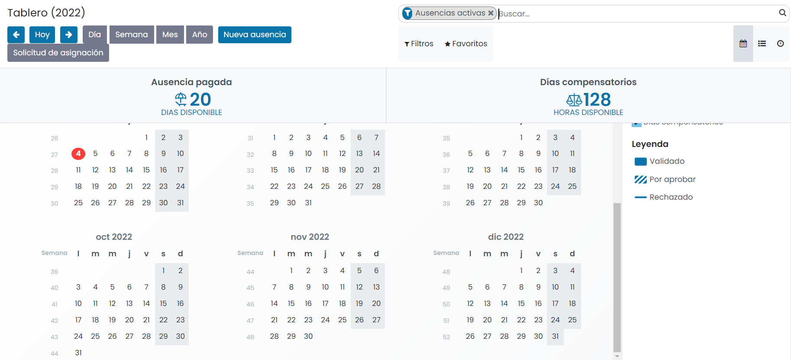

Para crear una nueva solicitud de ausencia, debes seleccionar el día de inicio de la ausencia, y de forma automática,
se desplegará un nuevo formulario para introducir los detalles de la ausencia:

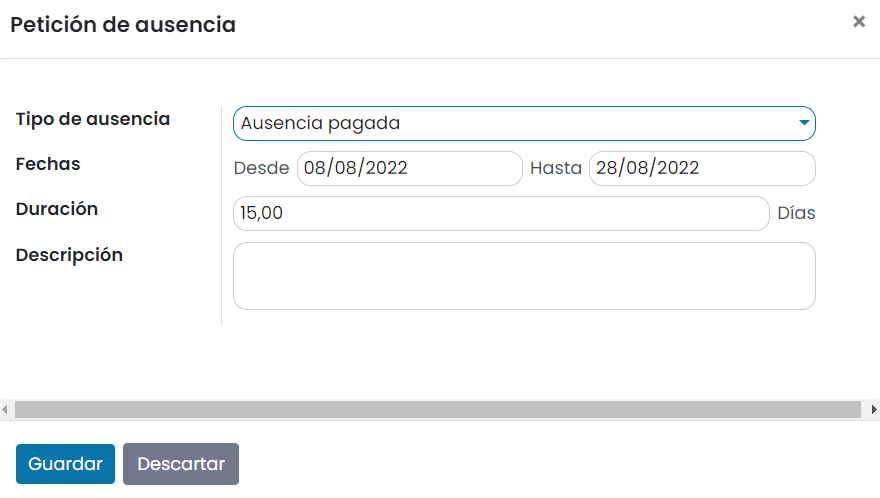

-  **Tipo de ausencia**: Se debe seleccionar entre los diferentes tipos de ausencia disponibles.

-  **Fechas**: Fechas de inicio y fin de la ausencia.

-  **Duración**: Cálculo de días u horas en función de la fecha de inicio y fin.

-  **Descripción**: Descripción de la ausencia.

Una vez completados los campos, y guardado el registro, el sistema crea de forma automática una actividad de aprobación
de ausencia asignada al usuario responsable del usuario que solicita la ausencia, en función de la estructura jerárquica
de la empresa. Esta actividad de aprobación de ausencia se puede consultar desde el apartado de *chatter* de la solicitud
de ausencia:

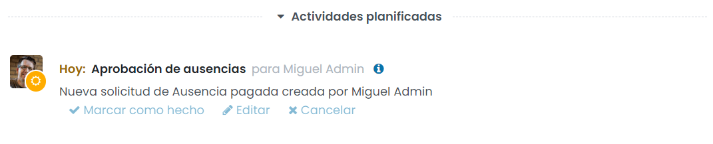

.. note::
   El responsable de un empleado se define en el formulario de detalle de los empleados, desde la pantalla
   :menuselection:`Empleados --> Empleados --> Empleados`, accediendo al detalle del empleado en cuestión.

Desde ese instante, la solicitud de ausencia queda pendiente de aprobación por el usuario responsable.

Aprobar o rechazar una solicitud de ausencia
--------------------------------------------

Como usuario responsable puedes aprobar o rechazar ausencias desde la pantalla :menuselection:`Ausencias --> Aprobaciones --> Ausencias`.
Desde esta vista, tienes disponible un listado con todas las ausencias pendientes de aprobar de los empleados de tu equipo:

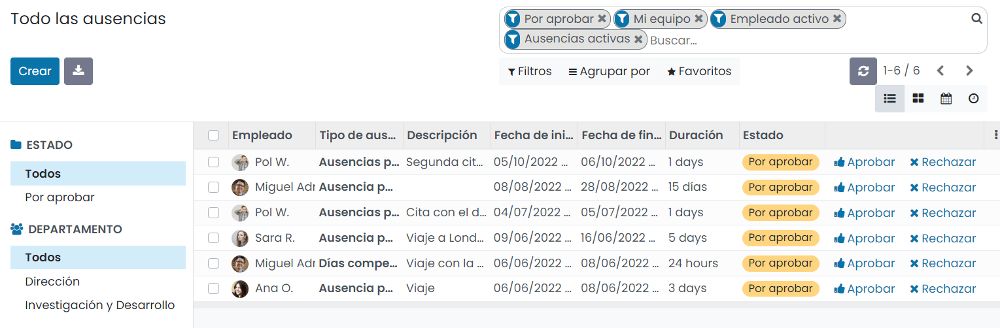

Para aprobar o rechazar una ausencia puedes hacerlo directamente desde los enlaces ubicados en el propio listado.
También puedes aprobar o rechazar una ausencia desde el detalle de la ausencia, mediante los botones ubicados en la
cabecera:

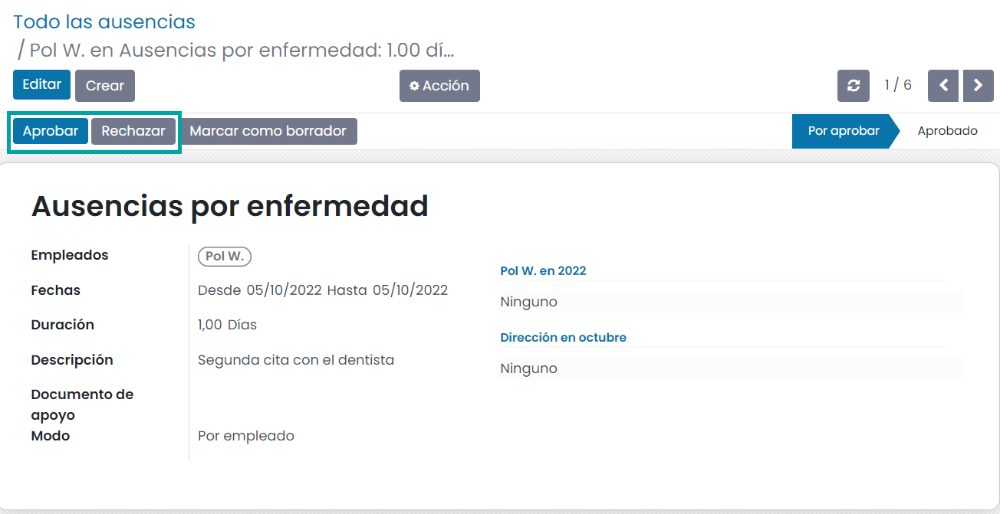

Si apruebas la ausencia, el estado de la misma cambia a estado *Aprobado*, y es posible consultarlo desde el detalle de
la propia ausencia, mediante el flujo de estados ubicado en la parte superior derecha:

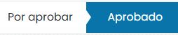

Consultar el resumen de mis ausencias
-------------------------------------

Desde la vista :menuselection:`Ausencias --> Mis ausencias --> Mis ausencias`, puedes consultar un resumen de tus
ausencias. Por defecto, se muestra la pantalla en formato listado:

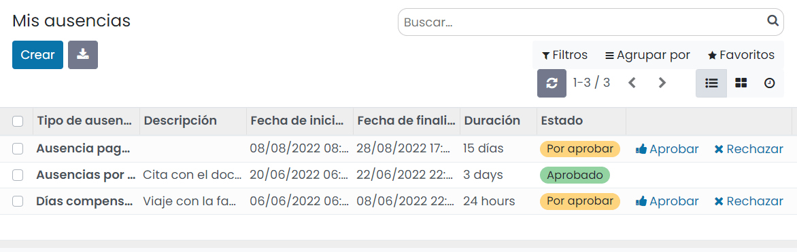

Si cambias el tipo de vista a Kanban, puedes visualizar el resumen de ausencias en un formato más visual:

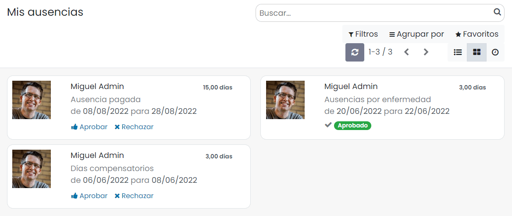

Gestión de solicitudes de asignación de ausencias
=================================================

Crear una solicitud de asignación de ausencia
---------------------------------------------

Hay algunos tipos de ausencias en las que los propios empleados pueden realizar sus solicitudes de asignaciones, para
que el responsable pueda aprobar dicha solicitud y los días u horas de ausencia queden asignados al empleado para el tipo
correspondiente de ausencia.

Para crear una solicitud de asignación, debes navegar a la pantalla :menuselection:`Ausencias --> Mis ausencias --> Mis asignaciones`,
y pulsar el botón *Crear*, donde podrás informar los siguientes campos:

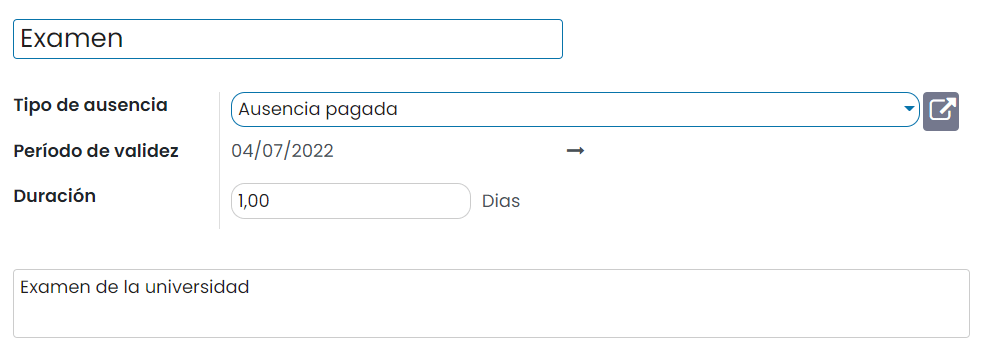

Los campos a completar son los siguientes:

-  **Descripción**: Título de la asignación a realizar.

-  **Tipo de ausencia**: Debes seleccionar el tipo de ausencia correspondiente.

-  **Duración**: Duración de la ausencia.

Una vez completados los campos, confirma la solicitud mediante el botón *Confirmar*. El sistema crea de forma automática
una actividad de aprobación de asignación asignada al usuario responsable del usuario que solicita la asignación, en
función de la estructura jerárquica de la empresa. Esta actividad de aprobación de asignación se puede consultar desde
el apartado de *chatter* de la solicitud de asignación:

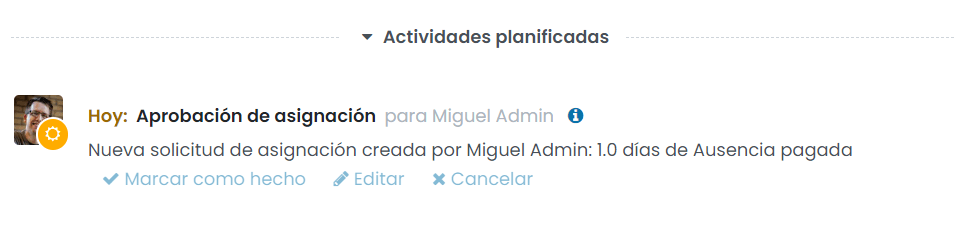

.. note::
   El responsable de un empleado se define en el formulario de detalle de los empleados, desde la pantalla
   :menuselection:`Empleados --> Empleados --> Empleados`, accediendo al detalle del empleado en cuestión.

Desde ese instante, la solicitud de asignación queda pendiente de aprobación, por el usuario responsable.

Aprobar o rechazar una solicitud de asignación de ausencia
----------------------------------------------------------

Como usuario responsable puedes aprobar o rechazar solicitudes de asignación de ausencias desde la pantalla
:menuselection:`Ausencias --> Aprobaciones --> Asignaciones`. Desde esta vista, tienes disponible un listado con todas
las asignaciones pendientes de aprobar de los empleados de tu equipo:

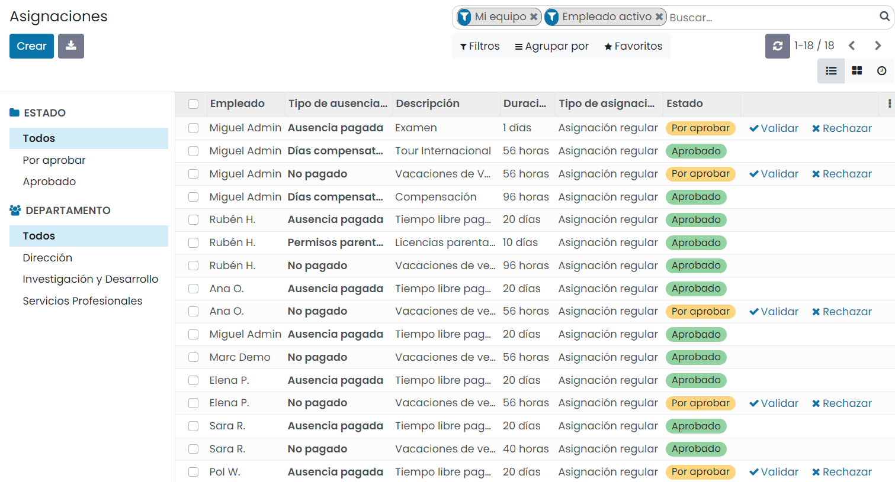

Para aprobar o rechazar una asignación de ausencia puedes hacerlo directamente desde los enlaces ubicados en el propio
listado. También puedes aprobar o rechazar una asignación de ausencia desde el detalle de la asignación, mediante los
botones ubicados en la cabecera:

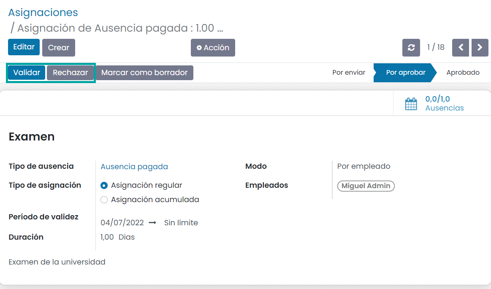

Si apruebas la asignación de ausencia, el estado de la misma cambia a estado *Aprobado*, y es posible consultarlo desde
el detalle de la propia asignación, mediante el flujo de estados ubicado en la parte superior derecha:

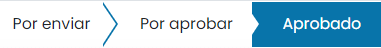

Asignar días de vacaciones anuales a los empleados
--------------------------------------------------

Existen algunos tipos de ausencias en que las que el equipo de RRHH realiza las asignaciones de ausencias correspondientes,
como, por ejemplo, en las ausencias por vacaciones, en las que asigna a cada empleado o a todos los empleados de una empresa,
un número de días de vacaciones.

Para ello, debes navegar a la vista :menuselection:`Ausencias --> Aprobaciones --> Asignaciones`, y pulsar el botón *Crear*,
que desplegará el siguiente formulario:

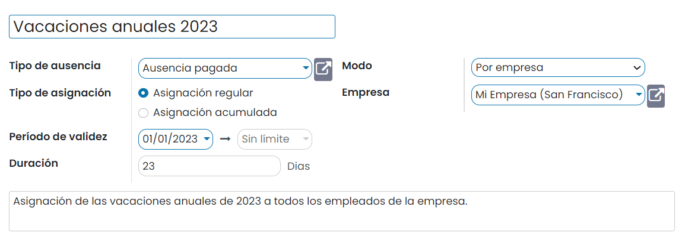

Los campos a completar son los siguientes:

-  **Descripción**: Título de la asignación a realizar.

-  **Tipo de ausencia**: Para asignar vacaciones a los empleados se debe seleccionar el tipo de ausencia correspondiente.

-  **Tipo de asignación**: En el caso de las vacaciones, seleccionar *Asignación regular*.

-  **Periodo de validez**: Periodo de validez para las ausencias solicitadas.

-  **Duración**: Número de días de vacaciones a otorgar.

-  **Modo**: Es posible asignar las vacaciones por empleado, a todos los empleados de la compañía, a un departamento
   específico de la compañía, o a todos los empleados que tengan asignada una etiqueta específica.

Una vez completados los campos, confirma la solicitud mediante el botón *Confirmar*. El sistema crea de forma automática
una actividad de aprobación de asignación asignada al usuario responsable del usuario que solicita la asignación, en
función de la estructura jerárquica de la empresa. Esta actividad de aprobación de asignación se puede consultar desde
el apartado de *chatter* de la solicitud de asignación:

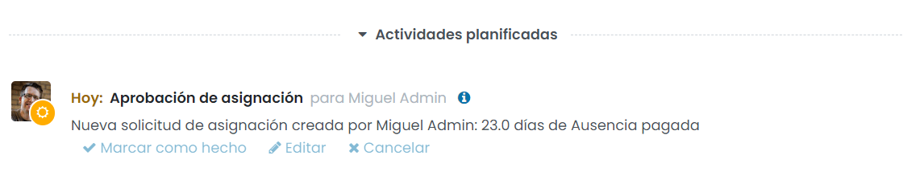

Una vez aprobada la solicitud por el responsable, los días de vacaciones ya estarán disponibles para los empleados
seleccionados.

Análisis de ausencias
=====================

Generar un informe de ausencias por empleado
--------------------------------------------

Para generar un informe de ausencias por empleado navega a la pantalla :menuselection:`Ausencias --> Informes --> por empleado`:

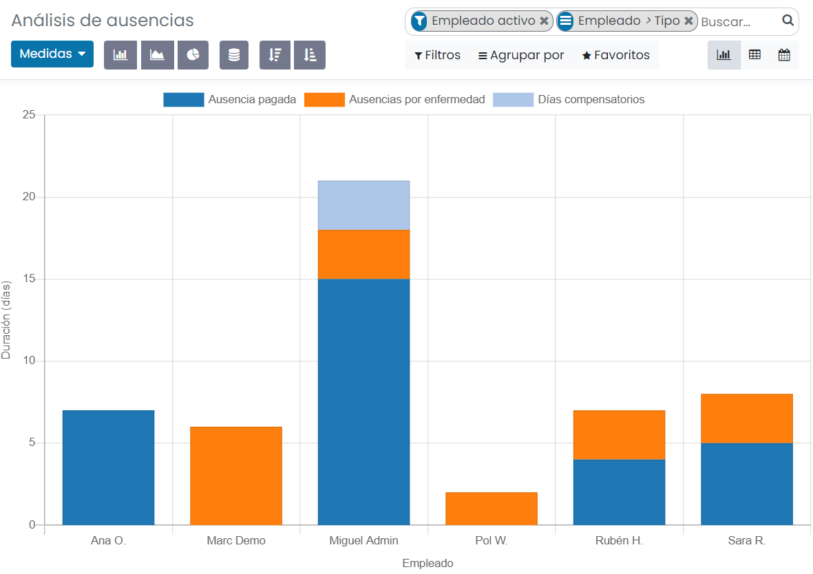

Esta pantalla te permitirá tener un análisis de las ausencias de tus empleados. Por lo tanto, será beneficioso examinar
a tu empleado individualmente en función de sus ausencias.

Desde la ficha de un empleado también es posible generar un informe de ausencias para un empleado en concreto. Para ello,
debes navegar a la ficha de un empleado desde la pantalla :menuselection:`Empleados --> Empleados --> Empleados`, y
seleccionar la opción del menú :menuselection:`Imprimir --> Resumen de ausencias`:

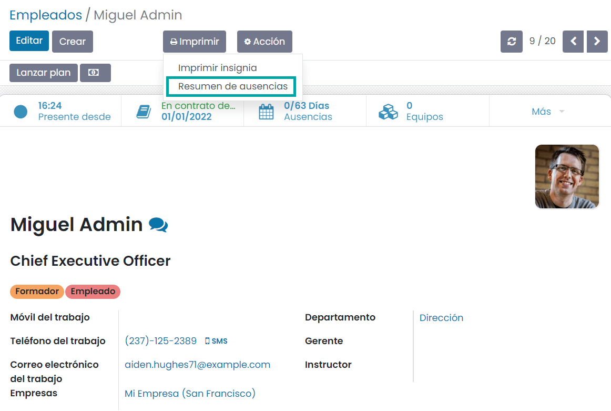

El sistema desplegará un formulario en donde debes informar lo siguiente:

-  **Desde**: Fecha de inicio de las ausencias que quieres consultar.

-  **Tipo de ausencia**: Puedes seleccionar entre ausencias aprobadas, confirmadas o aprobadas y confirmadas.

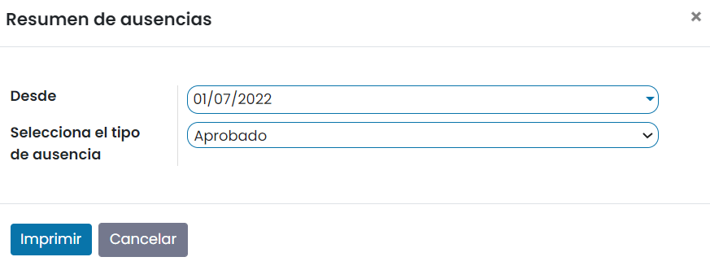

Una vez informados los campos necesarios, debes pulsar el botón *Imprimir*, que genera el PDF y lo descarga en tu máquina,
en el directorio de descargas que tengas configurado en tu navegador.

Generar un informe de ausencias por tipo
----------------------------------------

Para generar un informe de ausencias por tipo navega a la pantalla :menuselection:`Ausencias --> Informes --> por tipo`:

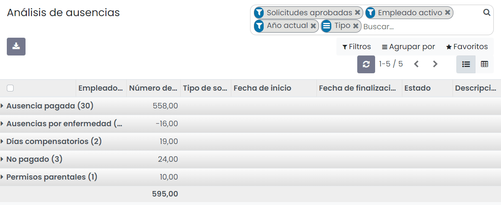

Esta ventana de análisis de ausencias mostrará cada tipo de ausencia junto con detalles como el empleado, el número de días,
el tipo de solicitud, la fecha de inicio, la fecha de finalización, el estado y la descripción.