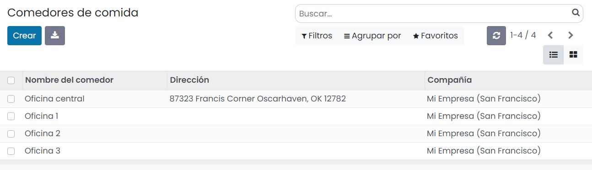

:show-content:

=======
Comidas
=======

Disponer de un comedor de empresa con servicio de pedidos centralizado puede ser muy ventajoso tanto para los empleados
como para la propia empresa.

En el caso de los empleados los beneficios más importantes son:

-  Ahorro económico, ya que la empresa negocia importantes descuentos con los proveedores al realizar pedidos constantes
   y de gran volumen.

-  Ahorro de tiempo y estrés que supone el salir del centro de trabajo con hora de retorno fijada, en busca de un bar o
   restaurante donde poder comer o en desplazarse hasta su domicilio.

-  Mejoras en temas de salud en el caso de disponer de productos sanos y equilibrados dentro de la oferta de productos.

-  Disponer de un espacio de encuentro entre empleados donde desconectar, descansar y hacer amistades. Según varios
   estudios, los comedores de trabajo mejoran las relaciones entre los empleados, consiguiendo aumentar el compañerismo
   y la unión de equipos.

En el caso de la empresa, las mayores ventajas son:

-  Reduce el estrés del personal impactando directamente en la productividad.

-  Aumenta el compañerismo y fidelización a la empresa.

-  Evita retrasos a la hora de volver al puesto de trabajo.

-  Disminuye la rotación del personal.

-  En función de la legislación de cada territorio es posible obtener deducciones fiscales.

Gracias a la aplicación de comidas de Daeris, es posible gestionar las peticiones de comida de los empleados y llevar un
control de costes de cada uno de ellos. La aplicación puede ser usada por todos los empleados para solicitar los platos
que previamente se han incluido en el sistema detallando ingredientes y costes pactados con los proveedores (bares y
restaurantes de la zona). Los administradores de la aplicación de comidas son los encargados de gestionar los pedidos a
diario y administrar el saldo de los empleados.

Configuración
=============

Configurar el saldo máximo negativo de los empleados
----------------------------------------------------

En ocasiones, puede darse el caso que un empleado se encuentre sin saldo disponible en su cuenta. Para permitir que un
empleado pueda solicitar pedidos sin disponer de saldo se puede incorporar la opción de atribuir un saldo máximo negativo,
de modo que cualquier empleado puede llegar a solicitar pedidos hasta que su cuenta llegue al saldo negativo máximo permitido.

Para indicar el saldo negativo máximo permitido, navega a la pantalla :menuselection:`Comidas --> Configuración --> Ajustes`,
desde donde puedes informar el importe sobre el campo saldo negativo:

Una vez informado el campo, pulsa el botón *Guardar* para que se apliquen tus cambios.

Configurar los proveedores de comida
------------------------------------

Para poder obtener servicios de catering de comida, debes ponerte en contacto con bares y restaurantes de tu zona y pactar
con ellos los platos que pueden ofrecer, los días de la semana que dan servicio, si disponen de servicio de entrega, el
tipo de comunicación para solicitar el pedido (teléfono o correo electrónico) y la hora máxima para solicitar los pedidos.

Para gestionar los proveedores, navega a la pantalla :menuselection:`Comidas --> Configuración --> Proveedores`, desde
donde puedes visualizar en formato Kanban los proveedores disponibles:

Para crear un nuevo proveedor haz clic sobre el botón *Crear*. La aplicación navega a la pantalla de detalle desde donde
puedes informar los siguientes campos:

-  **Nombre del proveedor**: Se informa automáticamente al seleccionar el proveedor.

-  **Proveedor**: Seleccionar el proveedor (bar, restaurante…) si ya se encuentra dado de alta como contacto en el sistema.
   Si no está dado de alta, escribe su nombre y haz clic sobre el botón *Crear* que aparecerá en el desplegable.

-  **Dirección**: Datos de la ubicación del proveedor.

-  **Correo electrónico**: La dirección de email acordada con el proveedor a la cuál se enviarán los pedidos.

-  **Teléfono**: El teléfono acordado con el proveedor al cuál se llamará para tramitar los pedidos.

-  **Compañía**: Empresa asociada al proveedor.

.. image:: comidas/detalle-proveedores-comida.png
   :align: center
   :alt: Formulario de detalle de proveedores de comida

Bajo el apartado de **Disponibilidad** es posible informar los días que ofrecen sus servicios (lunes a domingo).

Bajo el apartado de **Pedidos** es posible informar:

-  **Entrega**: Se puede seleccionar el valor *Entrega*, en el caso de que el proveedor realice el envío de sus productos
   al realizar el pedido o *No hay entrega* en el caso de que sea el empleado o un responsable quien deba desplazarse a
   recoger los productos de los pedidos.

-  **Comedor**: Indica la ubicación a la que el proveedor puede enviar sus productos. Los empleados solo pueden seleccionar
   aquellos productos de proveedores que dispongan de acceso al comedor del empleado.

-  **Enviar pedido por**: Se puede seleccionar *Teléfono* o *Correo electrónico* y se usa como canal de contacto para
   emitir el pedido.

-  **Hora de pedido**: En caso de seleccionar *Correo electrónico* en el campo anterior, se mostrará este campo, donde se
   podrá informar la hora en la que se emitirá la comunicación del pedido al proveedor. Este correo se enviará siempre
   que algún empleado haya seleccionado algún producto del proveedor en su pedido.

Sobre el mismo formulario de proveedores se pueden indicar hasta tres agrupaciones de productos extras, que un empleado
puede seleccionar al escoger un producto del proveedor.

Sobre cada agrupación se puede indicar el nombre de la etiqueta, así como el intervalo de cantidades. Sobre el listado
de la agrupación se pueden indicar los productos y su precio.

Una vez informados todos los campos necesarios, pulsa el botón *Guardar*.

Configurar los comedores
------------------------

Para configurar los comedores, navega a la pantalla :menuselection:`Comidas --> Configuración --> Comedores` desde donde
puedes visualizar los comedores disponibles.

Para dar de alta un nuevo comedor haz clic sobre el botón *Crear* e informa el nombre y la dirección del comedor. Una
vez informados los campos, pulsa el botón *Guardar*.

Configurar productos y categorías de productos
----------------------------------------------

Para disponer de un catálogo de productos es necesario crear los platos de comida que serán seleccionados por los empleados
al realizar su pedido. Estos platos se agrupan en categorías y se asocian a proveedores (bares o restaurantes que ofrecen
sus servicios).

Para ver las categorías de productos, navega a la pantalla :menuselection:`Comidas --> Configuración --> Categorías de productos`:

Para crear una nueva categoría de productos haz clic sobre el botón *Crear*. Esto te llevará a la pantalla de detalle de
la categoría desde donde puedes informar el nombre de la categoría y añadirle una imagen descriptiva (por defecto,
aparecerá la imagen de cuchillo y tenedor):

Una vez informados los campos, pulsa el botón *Guardar*.

Una vez cerrado un acuerdo con un proveedor, es necesario registrar los productos. Para ello, navega a la
pantalla :menuselection:`Comidas --> Configuración --> Productos`, desde donde puedes ver un listado con todos los
productos disponibles y una sección sobre el lateral izquierdo de la página para filtrar categorías de producto y por
proveedor:

Para crear un nuevo producto haz clic sobre el botón *Crear*. Esto te lleva a la pantalla de detalle desde donde puedes
informar los siguientes campos:

-  **Nombre**: Nombre del producto / plato.

-  **Imagen**: Imagen del producto / plato.

-  **Categoría de producto**: Categoría asociada al producto.

-  **Proveedor**: Bar o restaurante que ofrece el producto.

-  **Precio**: Precio del plato.

-  **Descripción**: Es posible indicar los ingredientes del plato.

-  **Nuevo hasta**: Si informas este campo con el valor de una fecha futura aparecerá sobre el producto una etiqueta con
   el texto *Nuevo* hasta el día que llegue la fecha informada.

Una vez informados los campos, pulsa el botón *Guardar*.

.. note::
   Es importante que el proveedor proporcione la mayor información posible sobre cada plato para que los empleados no
   tengan dudas al seleccionarlos.

Configurar alertas de comidas
-----------------------------

Con el objetivo de recordar a los empleados la gestión de sus pedidos, se pueden generar alertas en el sistema.

Para ello, navega a la pantalla :menuselection:`Comidas --> Configuración --> Alertas`, desde donde puedes ver un listado
con las alertas disponibles.

Para crear una nueva alerta haz clic sobre el botón *Crear*. Esto te lleva a la pantalla de detalle desde donde puedes
informar los siguientes campos:

-  **Nombre de la alerta**

-  **Mostrar en pantalla**: Indica la forma de mostrar la alerta.

   -  **Alerta en la aplicación**: Mediante este tipo de alertas se muestra una notificación en la pantalla de pedidos
      del empleado.

   -  **Notificación en el chat**: Mediante este tipo de alertas se muestra un mensaje recordatorio en el chat del empleado.

-  **Destinatarios**: Siempre y cuando se haya seleccionado la opción *Notificación en el chat*, aparecerá este campo,
   mediante el cuál es posible seleccionar entre *Todos*, *Empleado que ordenó la semana pasada*, *Empleado que ordenó el mes pasado*
   y *Empleado que ordenó el año pasado*.

-  **Comedor**: Ubicación sobre la que es efectiva la alerta.

-  **Mostrar hasta**: Fecha de vencimiento de la alerta.

-  **Activo**: Indica si la alerta está activa.

-  **Mensaje**: Mensaje que mostrará la alerta.

-  **Hora de Notificación**: Días de la semana en que la alerta se mostrará a los destinatarios. Siempre y cuando se
   haya seleccionado la opción *Notificación en el chat*, aparecerá un campo para informar la hora a la que se notificará
   a los empleados por chat.

Una vez informados los campos, pulsa el botón *Guardar*.

A partir de ese momento, si se trata de una alerta en la aplicación, aparecerá en un recuadro sombreado sobre el apartado
superior cuando el empleado se disponga a realizar el pedido, siempre que la alerta esté asociada al comedor del empleado:

Por otro lado, si se trata de una notificación en el chat, la alerta será mostrada en la bandeja de entrada de la
aplicación de conversaciones:

Gestión básica
==============

Registrar un pedido
-------------------

Para registrar un nuevo pedido de comida, navega a la pantalla :menuselection:`Comidas --> Mi comida --> Nuevo pedido`,
desde donde es posible visualizar el listado de productos disponibles. Sobre el panel lateral izquierdo es posible
filtrar el listado por categorías de productos y proveedores.

Desde el panel superior es posible seleccionar el empleado (en el caso de ser un administrador que pueda representar a
un empleado), el comedor, así como visualizar el saldo disponible del empleado seleccionado:

Al hacer clic sobre un producto se muestra un desplegable con los detalles, permitiendo seleccionar los productos extras
proporcionados por el proveedor, así como indicar notas relacionadas con el pedido:

Una vez informados los detalles es necesario pulsar el botón *Añadir al carrito* para incorporar el producto a tu pedido.

En el caso de querer introducir mas productos, es necesario repetir la misma operación, seleccionando el producto deseado
y añadiéndolo al carrito.

Para completar el pedido es necesario hacer clic sobre el botón *Pídelo Ahora*:

Una vez tramitado, aparecerá la etiqueta *Pedido* junto al texto *Tu pedido*:

Consultar el historial de pedidos y costes
------------------------------------------

Para consultar el historial de productos solicitados, navega a la pantalla :menuselection:`Comidas --> Mi comida --> Mi historial de pedidos`,
desde donde es posible visualizar el listado de productos solicitados agrupados por fecha:

Mediante las opciones que ofrece el listado es posible filtrar y agrupar por diversos campos, así como exportar los datos
a Excel.

También es posible visualizar los datos en formato kanban o tabla:

Para consultar el historial de costes, navega a la pantalla :menuselection:`Comidas --> Mi comida --> Mi historial de cuenta`,
desde donde es posible visualizar el listado de ingresos introducidos en la cuenta del empleado y gastos relacionados con
los pedidos solicitados.

La línea final del listado muestra el saldo actual del empleado tras restar los gastos a los ingresos:

Mediante las opciones que ofrece el listado es posible filtrar y agrupar por diversos campos, así como exportar los
datos a Excel.

Gestión del responsable
=======================

Gestionar los pedidos telefónicos del día
-----------------------------------------

Una vez emitidos los pedidos del día por los empleados y siempre que el canal de contacto con el proveedor sea telefónico,
será necesario llamarlo, indicar los productos solicitados y confirmar el encargo sobre la aplicación. Para ello, el
responsable debe acceder a la :menuselection:`Comidas --> Responsable --> Pedidos de hoy`. La aplicación navega al listado
de pedidos para hoy agrupados por proveedor. Mediante los botones *Confirmar* y *Cancelar* de cada línea del listado, el
responsable debe confirmar si el producto ha sido emitido al proveedor:

Cada vez que se confirma un registro este pasa a estado *Recibido*. Si se cancela, el estado pasa a ser *Cancelado* y el
producto desaparece de la línea de productos adquiridos por el empleado en su historial de pedidos y de cuentas:

.. note::
   Esta acción no es necesaria para los pedidos de proveedores cuyo canal de comunicación es el correo electrónico, debido
   a que se le envía un correo con el detalle de todos los productos solicitados a la hora configurada en el formulario de
   proveedor. Una vez enviado el correo se actualiza el estado de los pedidos a *Recibido*.

Consultar el historial de compras realizadas a los proveedores
--------------------------------------------------------------

Para consultar el historial de compras a los proveedores, navega a la pantalla :menuselection:`Comidas --> Responsable --> Control de proveedores`,
desde donde es posible visualizar el listado de todos los productos adquiridos por los empleados agrupados por proveedor.
La línea final del listado muestra el importe total de compras realizadas al proveedor:

Mediante las opciones que ofrece el listado es posible filtrar y agrupar por diversos campos, así como exportar los
datos a Excel.

También es posible visualizar los datos en formato kanban o tabla:

Consultar el historial de cuentas de los empleados
--------------------------------------------------

Los responsables de la aplicación de comidas, pueden consultar el historial de cuentas de los empleados. Para ello,
navega a la pantalla :menuselection:`Comidas --> Responsable --> Control de cuentas`. La aplicación navega al listado de
ingresos introducidos en las cuentas de los empleados y los gastos relacionados con los pedidos solicitados. El listado
esta agrupado por empleado:

Mediante las opciones que ofrece el listado es posible filtrar y agrupar por diversos campos, así como exportar los
datos a Excel.

También es posible visualizar los datos en formato kanban:

Gestionar movimientos de efectivo
---------------------------------

Para que los empleados puedan efectuar el pago de sus pedidos de comida, estos deben disponer de saldo disponible en su
cuenta de comidas. En ocasiones es la empresa la que acuerda con los empleados el pago mensual de cierta cantidad de dinero
para gastos de comida ya que, en algunos países, esta forma de proceder tiene grandes beneficios fiscales para la empresa
y el propio empleado. Otras empresas introducen un saldo acordado con el empleado que es descontado de la nómina a final
de mes en concepto de anticipo. También existe la posibilidad de que sea el propio empleado el que abone periódicamente
la cantidad que desee en concepto de saldo en su cuenta de comida.

Independientemente del acuerdo con los trabajadores, la forma de incorporar saldo de la cuenta de comida del empleado no
varía. Para ello, navega a la pantalla :menuselection:`Comidas --> Responsable --> Movimientos de efectivo`, desde donde
es posible visualizar el listado de incorporación de saldo de todos los empleados:

Para incorporar saldo a un empleado haz clic sobre el botón *Crear* y sobre el formulario, selecciona el usuario y el
importe a añadir. Es importante incorporar una descripción que indique el motivo a modo de registro. Por último, recuerda
guardar los cambios mediante el botón *Guardar*:

Una vez incorporado el saldo, este se sumará al saldo disponible de la cuenta del empleado que podrá visualizar desde
la aplicación de comidas:

