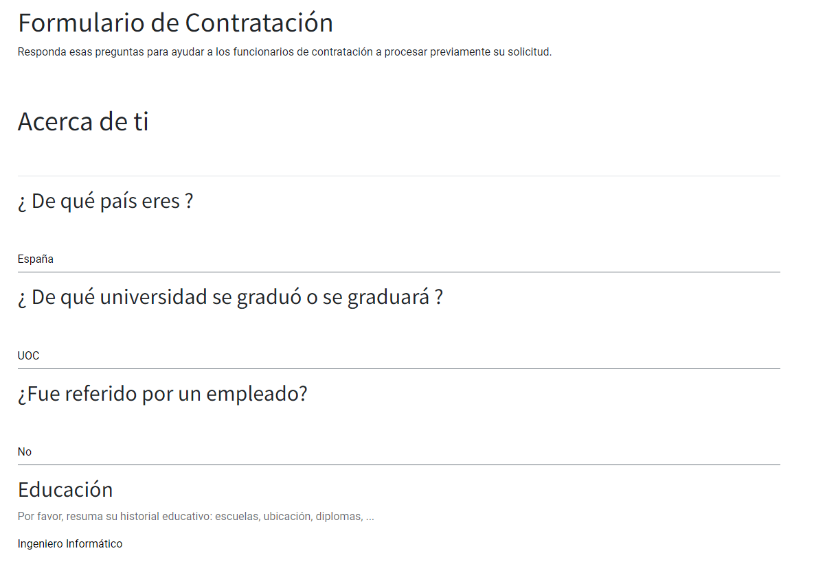

:show-content:

============
Contratación
============

La contratación se considera como el primer paso de las acciones del sistema de gestión de recursos humanos. En Daeris,
puedes encontrar un módulo separado para administrar todos los procedimientos de contratación dentro de una empresa. Con
esta plataforma, puedes identificar puestos de trabajo vacantes en tu organización, publicar ofertas de trabajo, invitar
a solicitantes y administrar el proceso de contratación. Los procedimientos de reclutamiento para cualquier puesto de
trabajo deben llevarse a cabo con sumo cuidado y atención porque solo los candidatos hábiles y adecuados pueden ayudar
a que tu organización crezca. Elegir al candidato adecuado se puede hacer fácilmente con la ayuda del módulo de
proceso de selección de Daeris.

Configuración
=============

Activar la publicación de ofertas de trabajo en el sitio web
------------------------------------------------------------

Para activar la publicación de ofertas de trabajo en el sitio web, navega a la pantalla
:menuselection:`Contratación --> Configuración --> Ajustes` y marca la opción **Publicación en línea**:

.. image:: contratacion/publicacion-en-linea.png
   :align: center
   :alt: Activar la publicación de ofertas de trabajo en el sitio web

Una vez informado el campo, pulsa el botón *Guardar* para que se apliquen tus cambios.

A partir de ese momento es posible acceder a una nueva página del sitio web llamada `/jobs`. Sobre esta nueva página se
publican las ofertas de empleo creadas:

.. tip::
   Si lo necesitas, puedes crear un nuevo elemento del menú en el sitio web para que los visitantes puedan acceder con
   facilidad a la página de empleos del sitio web.

Crear formularios de entrevista en el sitio web
-----------------------------------------------

Los formularios de entrevista ayudan a los responsables de contratación en las entrevistas a los candidatos, proporcionando
las preguntas a realizar a los mismos. Para crear dichos formularios, en primer lugar, activa los formularios de entrevista
desde la pantalla :menuselection:`Contratación --> Configuración --> Ajustes`:

Una vez informado el campo, pulsa el botón *Guardar* para que se apliquen tus cambios.

Al pulsar sobre el enlace *Encuesta de entrevistas*, el sistema navega a la pantalla de encuestas:

En la pantalla de encuestas se muestran todas las encuestas en formato kanban:

A partir de ese momento, puedes crear una encuesta, probarla y publicarla. Al completar las encuestas, los solicitantes
de empleo proporcionan una información muy valiosa que puede ser revisada por tu departamento de recursos humanos con el
objetivo de seleccionar a los mejores candidatos.

.. seealso::
   * :doc:`../marketing/encuestas`

Una vez creado el formulario de entrevista, se puede asociar a una oferta de puesto de trabajo desde la pantalla
:menuselection:`Contratación --> Configuración --> Puestos de trabajo`, accediendo al detalle de un puesto de trabajo, e
informando el campo *Formulario de entrevista* de la pestaña *Contratación*:

Este formulario de entrevista servirá como guión para las entrevistas que los miembros de tu departamento de recursos
humanos realicen a los solicitantes de empleo.

Configurar los puestos de trabajo
---------------------------------

En la pantalla :menuselection:`Contratación --> Configuración --> Puestos de trabajo` es posible configurar varios puestos
de trabajo:

En esta ventana, puedes ver todos los puestos de trabajo predefinidos junto con detalles como el puesto de trabajo, el
departamento, el sitio web, el número actual de empleados, los nuevos empleados esperados, el total de empleados previstos,
los empleados contratados, el estado, publicado y la empresa. Tienes la opción de ver y editar cada uno de estos puestos
de trabajo configurados en detalle haciendo clic en el puesto de trabajo correspondiente.

Puedes configurar nuevos puestos de trabajo utilizando el botón *Crear*. El sistema navegará al formulario de creación de
puesto de trabajo:

En esta ventana de creación de puestos de trabajo, puedes proporcionar el nombre del puesto de trabajo. Luego, en la
pestaña **Descripción del trabajo**, puedes informar una descripción del trabajo personalizada. Además, la pestaña
**Contratación** te permite introducir información relacionada con el proceso de selección para ese puesto de trabajo:

En la pestaña de contratación, puedes encontrar los siguientes campos:

-  **Empresas**: Empresas asociadas al puesto de trabajo.

-  **Sitio web**: Sitio web en el que aparecerá publicada la oferta de trabajo. Si no se selecciona nada, este puesto de
   trabajo aparecerá en todos los sitios web.

-  **Departamento**: Nombre del departamento relacionado con el puesto de trabajo.

-  **Lugar de trabajo**: Ubicación donde el candidato desempeñará sus funciones.

-  **Alias de correo electrónico**: Alias de correo asociado a la oferta de empleo.

   .. note::
      Si informas un alias de correo electrónico, debes disponer de, al menos, un
      :doc:`servidor de correo entrante <../varios/correo_electronico/recibir_correos>`.

-  **Nuevos empleados esperados**: Número de vacantes.

-  **Está publicado**: Estado de publicación del puesto de trabajo.

-  **Formulario de entrevista**: Seleccionable donde escoger el formulario que deberá completar el candidato.

-  **Reclutador**: Empleado que se encargará de gestionar las solicitudes.

Una vez que completes todos los campos, puedes hacer clic en el botón *Guardar* para guardar los detalles.

A continuación, pulsa el botón *Ir a Sitio web*, para navegar a la pantalla de edición web de la oferta de trabajo:

Sobre la pagina web de la oferta de trabajo aparecen una serie de textos que es posible editar para describir los
detalles de la oferta. Para ello, pulsa el botón *Editar*:

En el momento que quieras publicar la oferta en el sitio web para que sea accesible por los solicitantes de empleo, pulsa
el botón *No publicado* que cambiará el estado a *Publicado*:

Configurar las razones de rechazo
---------------------------------

Para configurar las razones de rechazo de las solicitudes de empleo, navega a la pantalla
:menuselection:`Contratación --> Configuración --> Razones de rechazo`:

En esta ventana puedes ver todos los motivos de rechazo descritos en la plataforma junto con la descripción y la plantilla
de correo electrónico. Si deseas crear un nuevo motivo de rechazo, Daeris te permite hacerlo en la misma ventana. Para ello,
puedes hacer clic en el botón *Crear*. El sistema mostrará una nueva fila en la que podrás proporcionar la descripción y
la plantilla de correo electrónico.

Puedes utilizar esta función para el rechazo de una solicitud. Si no estás satisfecho con el desempeño del solicitante o
las calificaciones del solicitante no son suficientes para los requisitos de tu trabajo, tienes la opción de rechazar la
solicitud de empleo. Puedes realizar esto haciendo clic en el botón *Rechazar* del formulario de detalle de una solicitud:

Cuando hagas clic en el botón *Rechazar*, aparecerá una ventana emergente en la que puedes proporcionar el motivo de
rechazo configurado mediante el menú desplegable. También puedes indicar si quieres que se envíe un correo electrónico
al candidato, así como la plantilla de correo utilizada, que por defecto, será la plantilla definida al configurar el
motivo de rechazo:

Después de asignar el motivo de rechazo, puedes hacer clic en el botón *Enviar*. Ahora la solicitud se marcará como
*Rechazada*, como se muestra en la imagen a continuación:

.. image:: contratacion/solicitud-rechazada.png
   :align: center
   :alt: Solicitud de empleo rechazada

Configurar las etapas del proceso de selección
----------------------------------------------

Un proceso de selección puede disponer de varias etapas por las que los candidatos se van moviendo en función del
criterio de los responsables de recursos humanos. Daeris dispone de un sistema de etapas inicial, que puede ser
alterado en base a las necesidades de cada negocio. El sistema se basa en las siguientes etapas:

-  **Calificación inicial**: Es la primera etapa del proceso, y se llega cuando se crea la solicitud. Si la solicitud,
   proviene de correo o formulario se intenta enviar un correo al candidato indicándole que se ha recibido su solicitud.

-  **Primera entrevista**: Etapa a la que deberá llegar la solicitud, cuando, como responsable del proceso de selección,
   creas que el candidato es apto para una entrevista. Al llegar a esta etapa se enviará un correo al candidato indicándole
   la situación. El responsable de selección deberá contactar con el candidato para concretar una entrevista. Es
   recomendable usar la funcionalidad de reuniones que aparece sobre el formulario de detalle del solicitante o la opción
   de planificar entrevista del menú Kanban de la solicitud.

-  **Segunda entrevista**: Etapa a la que deberá llegar la solicitud, cuando, como responsable del proceso de selección,
   creas que el candidato requiere de una segunda entrevista. No realiza ninguna comunicación.

-  **Propuesta de contrato**: Etapa a la que deberá llegar la solicitud, cuando, como responsable del proceso de selección,
   creas oportuno realizar una propuesta de contrato. No realiza ninguna comunicación.

-  **Contrato firmado**: Etapa a la que deberá llegar la solicitud, cuando el candidato haya firmado el contrato propuesto.
   No realiza ninguna comunicación.

Las etapas pueden conllevar el envío de un email automático, si así se configuran. Además, como en el resto de pantallas
de tipo Kanban, es posible cambiar la etapa de una solicitud arrastrando y soltando la solicitud sobre la etapa deseada
en la pantalla :menuselection:`Contratación --> Solicitudes --> Todas las solicitudes`:

También es posible seleccionar la etapa deseada desde el formulario de detalle de la solicitud:

Para editar una etapa, pulsa sobre el icono de configuración de la etapa, y selecciona la opción correspondiente:

Al editar una etapa, dispones de los siguientes campos:

-  **Nombre de la etapa**: Nombre asociado a la etapa.

-  **Plantilla de correo electrónico**: Plantilla de comunicación que se envía al candidato cuando se llega a esta etapa.

   .. note::
      Para que se realicen envíos de correos electrónicos desde la aplicación, debes configurar un :doc:`servidor de correo saliente <../varios/correo_electronico/enviar_correos>`.

-  **Doblado en Kanban**: Al informar este campo, la etapa aparecerá replegada en las vistas Kanban.

-  **Etapa contratado**: Indica si se trata de una etapa final, en la que el empleado ya ha sido contratado.

-  **Trabajo especifico**: Es posible informar un puesto de trabajo particular, en el caso de que esta etapa se use de
   forma exclusiva en un puesto de trabajo determinado.

-  **Información sobre herramientas**: Etiquetas que se mostrarán en la vista Kanban.

-  **Requisitos**: Texto descriptivo para hacer referencia a los requerimientos que han de suceder para llegar a esta
   etapa. Es posible visualizarlos en la vista Kanban al posicionar el ratón sobre el nombre de la etapa.

Una vez informados todos los campos necesarios, pulsa el botón *Guardar*.

Solicitudes de empleo
=====================

Solicitar empleo desde el sitio web
-----------------------------------

En el momento que se hace pública una oferta de empleo en el sitio web, cualquier visitante puede acceder a ella desde
la página `/jobs` o desde el menú correspondiente del sitio web. Desde esa página aparecen todas las ofertas de empleo
activas:

Al acceder al detalle de una oferta, se visualizan los detalles de la misma y se muestra un botón que permite presentar
una solicitud:

Al pulsar el botón **¡Solicitar ahora!** aparece un formulario donde los candidatos pueden informar los siguientes campos:

-  Nombre

-  Correo electrónico

-  Teléfono

-  Breve introducción

-  Curriculum Vitae

Tras completar los campos y enviar el formulario, el sistema muestra un mensaje de agradecimiento:

A partir de ese momento, el responsable de la contratación podrá continuar con el proceso de gestión de la solicitud de
empleo.

Solicitar empleo a través de correo electrónico
-----------------------------------------------

Para solicitar empleo a través de correo electrónico, se debe enviar un correo al alias de correo asociado a la oferta de
puesto de trabajo. Este alias se puede consultar desde el detalle del puesto de trabajo en la pantalla
:menuselection:`Contratación --> Configuración --> Puestos de trabajo`:

.. note::
   Si informas un alias de correo electrónico, debes disponer de, al menos, un
   :doc:`servidor de correo entrante <../varios/correo_electronico/recibir_correos>`.

Una vez configurado el alias de correo electrónico, los solicitantes de empleo pueden enviar sus correos a la dirección
correspondiente, informando un asunto, una descripción e incluyendo como anexo el currículum y/o carta de presentación.
Pasados unos minutos Daeris procesará el correo generando la nueva solicitud, que será posible encontrar sobre el listado
de solicitudes de la pantalla :menuselection:`Contratación --> Solicitudes --> Todas las solicitudes`:

A partir de ese momento, el responsable de la contratación podrá continuar con el proceso de gestión de la solicitud de
empleo.

Gestionar una solicitud de empleo
---------------------------------

Cuando se crea una nueva solicitud de empleo, el empleado responsable de gestionarla recibe una notificación. Desde la
pantalla :menuselection:`Contratación --> Solicitudes --> Todas las solicitudes`, puedes encontrar las nuevas solicitudes
de empleo en estado *Calificación inicial*:

.. tip::
   Utiliza la vista de tipo kanban para ver las solicitudes agrupadas por etapa.

Si la solicitud dispone de documentos anexos como currículos o cartas de presentación, encontrarás un icono de un clip
con un número, que indica el número de documentos disponibles:

Al pulsar sobre los anexos, el sistema navega al listado de adjuntos de la solicitud:

Al pulsar sobre el anexo, el sistema navega al detalle del mismo, el cual puedes descargar haciendo clic sobre el enlace
del contenido del archivo:

Volviendo a la pantalla de todas las solicitudes, es posible acceder al detalle de una solicitud haciendo clic sobre la
propia solicitud. Sobre el formulario de detalle de la solicitud, es posible informar contenido relevante que puede
haberse incorporado como adjunto sobre el currículum vitae:

Los campos mostrados en el detalle de la solicitud son los siguientes:

-  **Asunto**: Asunto del correo electrónico para las solicitudes enviadas por correo.

-  **Nombre del candidato**

-  **Correo electrónico**: Email del candidato.

-  **Teléfono**: Teléfono fijo del candidato.

-  **Móvil**: Teléfono móvil del candidato.

-  **Título**: Desplegable de selección que muestra el grado de titulación del candidato.

-  **Etiquetas**: Etiquetas asociadas al candidato.

-  **Reclutador**: Empleado que gestiona al candidato.

-  **Apreciación**: Valoración otorgada al candidato.

-  **Origen**: Desplegable de selección que muestra fuentes de origen del candidato.

-  **Trabajo solicitado**: Puesto de trabajo solicitado por el candidato.

-  **Departamento**: Departamento asociado al puesto de trabajo.

-  **Empresa**: Compañía asociada al candidato.

-  **Salario esperado**: Salario esperado por el candidato.

-  **Salario propuesto**: Salario propuesto al candidato.

-  **Disponibilidad**: Disponibilidad del candidato para incorporarse al puesto de trabajo.

-  **Resumen de la solicitud**: Breve introducción proporcionada por el candidato.

Enviar entrevista a un solicitante de empleo
--------------------------------------------

Una vez gestionada una solicitud de empleo, es posible enviar la entrevista al candidato desde la pantalla
:menuselection:`Contratación --> Solicitudes --> Todas las solicitudes`, accediendo al detalle de una solicitud y
haciendo clic sobre el botón *Enviar entrevista*:

.. image:: contratacion/enviar-entrevista.png
   :align: center
   :alt: Enviar entrevista a un candidato

.. note::
   Si el candidato no tiene un contacto asociado, el sistema solicitará crear un contacto, para poder realizar el envío
   de la entrevista.

A continuación, se abrirá una ventana en donde se mostrará la plantilla utilizada para realizar el envío de la entrevista
al candidato. Pulsa el botón *Enviar*:

Pasados unos minutos, el candidato recibirá la entrevista por correo electrónico, y podrá completar el formulario
pulsando el botón *Iniciar entrevista*:

Al iniciar la entrevista, el sistema navegará a la página de cuestionario asociado a la oferta de empleo:

Al hacer clic sobre el botón **Iniciar encuesta**, el sistema navegará al detalle del cuestionario:

Una vez completadas todas las preguntas y enviados los resultados, el sistema mostrará un mensaje de agradecimiento:

A partir de ese momento, la información de la encuesta quedará disponible a nivel del solicitante de empleo para que
sea analizada por los responsables de recursos humanos de la empresa.

Visualizar los datos de la entrevista de un solicitante de empleo
-----------------------------------------------------------------

Para visualizar los datos de la entrevista de un solicitante de empleo, navega al detalle de un solicitante desde
la pantalla :menuselection:`Contratación --> Solicitudes --> Todas las solicitudes`, y pulsa el botón **Consultar Entrevista**:

El sistema navegará hasta la página de detalle del cuestionario, donde se podrán visualizar todas las respuestas
proporcionadas por el candidato en la entrevista:

Crear un empleado desde una solicitud de empleo
-----------------------------------------------

En el momento en que el responsable de recursos humanos de la empresa decida dar de alta a un candidato como nuevo
empleado de la empresa, deberá crear el empleado en la aplicación. Para ello, navega a la pantalla
:menuselection:`Contratación --> Solicitudes --> Todas las solicitudes`, accede al detalle del solicitante de empleo y
pulsa el botón **Crear empleado**:

Mediante esta acción se procederá a crear el empleado y el sistema se posicionará sobre el detalle del mismo, permitiendo
al responsable editar los datos que considere oportunos:

Una vez completados los campos necesarios, pulsa el botón *Guardar*. A partir de ese momento, el empleado quedará dado de
alta en la aplicación.

.. seealso::
   * :ref:`recursos_humanos/empleados/crear_empleado`

Finalizar un proceso de selección
---------------------------------

Para dar por finalizado un proceso de selección navega a la pantalla :menuselection:`Contratación --> Solicitudes --> Por puestos de trabajo`
y haz clic sobre la opción del menú *Contratación finalizada*, que marcará el puesto de trabajo como finalizado:

En el caso de querer volver a buscar candidatos sobre ese puesto de trabajo, tan solo se deberá hacer clic sobre el botón
*Comenzar contratación*:

Rastrear el origen de las solicitudes
-------------------------------------

Mediante una URL
~~~~~~~~~~~~~~~~

Para poder rastrear el origen de una solicitud de empleo publicada en una web externa, será necesario crear un enlace
particular. Para ello, puedes navegar al formulario de detalle del puesto de trabajo, desde la pantalla
:menuselection:`Contratación --> Solicitudes --> Por puestos de trabajo`, y hacer clic sobre el botón *Rastreadores*:

El sistema navegará al listado de fuentes de empleos asociados al puesto de trabajo. Para dar de alta una nueva fuente,
pulsa el botón *Crear*:

Si, por ejemplo, el origen de la fuente es *Facebook*, selecciona como origen *Facebook*. El sistema generará de forma
automática la URL que dispondrá del origen correspondiente:

.. image:: contratacion/crear-fuente-puesto-trabajo-2.png
   :align: center
   :alt: Crear fuente de un puesto de trabajo (2)

Esta es la URL que será necesario usar, por ejemplo, en Facebook, para redireccionar a los candidatos hacia tu sitio web
para que puedan cumplimentar el formulario. Al hacer clic sobre la URL se navega al detalle de la oferta:

.. image:: contratacion/crear-fuente-puesto-trabajo-3.png
   :align: center
   :alt: Crear fuente de un puesto de trabajo (3)

Al presentar la solicitud, se navegará al detalle de la solicitud, que el candidato deberá cumplimentar:

Al enviar la solicitud, se generará un registro con el detalle de la solicitud en la pantalla
:menuselection:`Contratación --> Solicitudes --> Todas las solicitudes`, y al acceder al detalle de la misma, sobre el
campo **Origen**, se habrá establecido la fuente correspondiente:

Mediante un alias de correo
~~~~~~~~~~~~~~~~~~~~~~~~~~~

Para poder rastrear el origen de una solicitud de empleo publicada en una web externa, será necesario crear un alias de
correo particular. Para ello, puedes navegar al formulario de detalle del puesto de trabajo, desde la pantalla
:menuselection:`Contratación --> Solicitudes --> Por puestos de trabajo`, y hacer clic sobre el botón *Rastreadores*:

El sistema navegará al listado de fuentes de empleos asociados al puesto de trabajo. Para dar de alta una nueva fuente,
pulsa el botón *Crear*:

Si, por ejemplo, el origen de la fuente es *Facebook*, selecciona como origen *Facebook*. El sistema generará de forma
automática la URL que dispondrá del origen correspondiente:

.. image:: contratacion/crear-fuente-puesto-trabajo-2.png
   :align: center
   :alt: Crear fuente de un puesto de trabajo (2)

Al hacer clic sobre el botón **Generar correo electrónico**, se creará un alias de correo electrónico que incorporará
sobre el alias el origen *Facebook*:

.. image:: contratacion/crear-fuente-puesto-trabajo-email.png
   :align: center
   :alt: Crear fuente de un puesto de trabajo por email

La dirección de correo generada, es la que se deberá usar en Facebook como fuente de contacto por correo electrónico
para enlazar Facebook con la solicitud de trabajo ofertada:

.. note::
   Si utilizas el alias de correo electrónico, debes disponer de, al menos, un
   :doc:`servidor de correo entrante <../varios/correo_electronico/recibir_correos>`.
   En función del tipo de servidores de correo que utilices, recuerda generar el alias correspondiente para que los
   correos enviados a esa dirección sean procesados por Daeris.

Al enviar la solicitud por correo electrónico al alias configurado, se generará un registro con el detalle de la
solicitud en la pantalla :menuselection:`Contratación --> Solicitudes --> Todas las solicitudes`, y al acceder al
detalle de la misma, sobre el campo **Origen**, se habrá establecido la fuente correspondiente:

