:show-content:

=========
Empleados
=========

El sistema de gestión de Recursos Humanos en la aplicación Daeris te permite gestionar perfectamente a tus empleados. Puedes
acceder a un módulo separado para administrar la información de tus empleados. Este módulo es la mejor herramienta para
crear y administrar los detalles y perfiles de los empleados de tu empresa.

Gestión de empleados
====================

Configuración
-------------

Enriquecer los perfiles de los empleados con habilidades y currículums
~~~~~~~~~~~~~~~~~~~~~~~~~~~~~~~~~~~~~~~~~~~~~~~~~~~~~~~~~~~~~~~~~~~~~~

Es posible enriquecer los perfiles de los empleados con información acerca de sus habilidades, así como su experiencia
laboral y formación. Para ello, navega a la pantalla :menuselection:`Empleados --> Configuración --> Ajustes` y activa
la opción *Gestión de habilidades*:

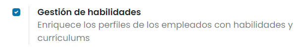

Una vez activada la opción, pulsa el botón *Guardar* de la pantalla de ajustes.

A partir de ese momento, al navegar al detalle de un empleado desde la pantalla :menuselection:`Empleados --> Empleados --> Empleados`
aparece una nueva pestaña llamada *Currículum vitae* donde se puede incluir toda la experiencia, formación y habilidades
del empleado:

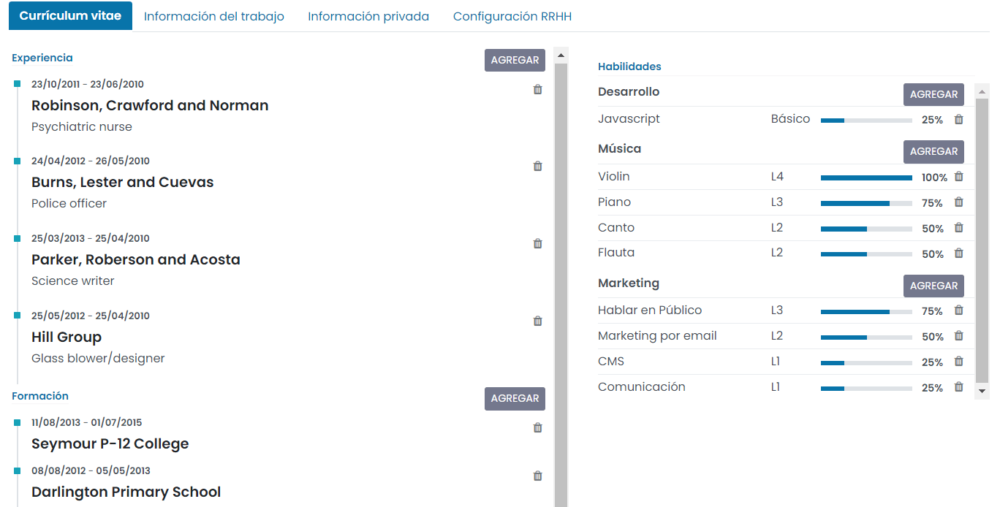

Establecer el calendario por defecto de los empleados
~~~~~~~~~~~~~~~~~~~~~~~~~~~~~~~~~~~~~~~~~~~~~~~~~~~~~

Para establecer el calendario por defecto de los empleados, navega a la pantalla :menuselection:`Empleados --> Configuración --> Ajustes`,
e informa el campo *Horas laborales de la empresa*:

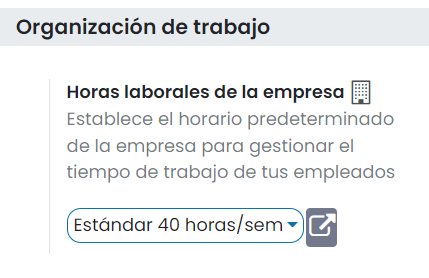

Una vez informado el calendario, pulsa el botón *Guardar* de la pantalla de ajustes.

El calendario seleccionado será utilizado para calcular el tiempo asignado a las ausencias, partes de horas, etc.

Permitir a los empleados actualizar sus propios datos
~~~~~~~~~~~~~~~~~~~~~~~~~~~~~~~~~~~~~~~~~~~~~~~~~~~~~

Por defecto, si un usuario no tiene permisos en el módulo de recursos humanos, al tratar de actualizar información
sobre su empleado en el sistema, recibirá el siguiente mensaje de error:
*Solo se le permite actualizar sus preferencias. Comuníquese con un oficial de recursos humanos para actualizar otra información*.

Es posible habilitar la opción de edición de empleados para permitir que los empleados actualicen sus propios datos e
información en Daeris. Para ello, navega a la pantalla :menuselection:`Empleados --> Configuración --> Ajustes`,
y activa la opción de *Edición de empleados*:

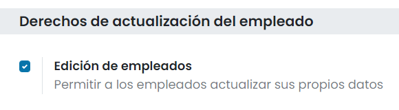

Una vez activada la opción, pulsa el botón *Guardar* de la pantalla de ajustes.

A partir de ese momento, los usuarios podrán actualizar sus propios datos de empleado, además de sus preferencias de usuario.

Configurar los lugares de trabajo de los empleados
~~~~~~~~~~~~~~~~~~~~~~~~~~~~~~~~~~~~~~~~~~~~~~~~~~

Es posible configurar los lugares de trabajo de los empleados desde la pantalla :menuselection:`Empleados --> Configuración --> Lugares de trabajo`.
Aquí puedes ver y acceder a cada lugar de trabajo descrito en la plataforma junto con su ubicación, su dirección y la
empresa asociada:

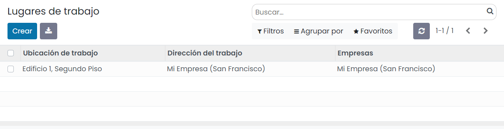

Al crear un nuevo lugar de trabajo, el sistema navegará a la pantalla de detalle, donde, además de la ubicación, la dirección
y la empresa, dispones del número de la ubicación:

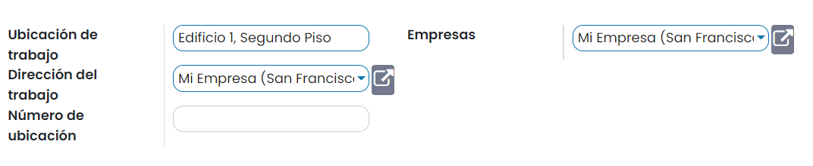

.. _recursos_humanos/empleados/crear_empleado:

Crear un empleado de la compañía
--------------------------------

Para crear un nuevo empleado, navega a la pantalla :menuselection:`Empleados --> Empleados --> Empleados`. En esta
pantalla puedes visualizar todos los empleados dados de alta en la aplicación:

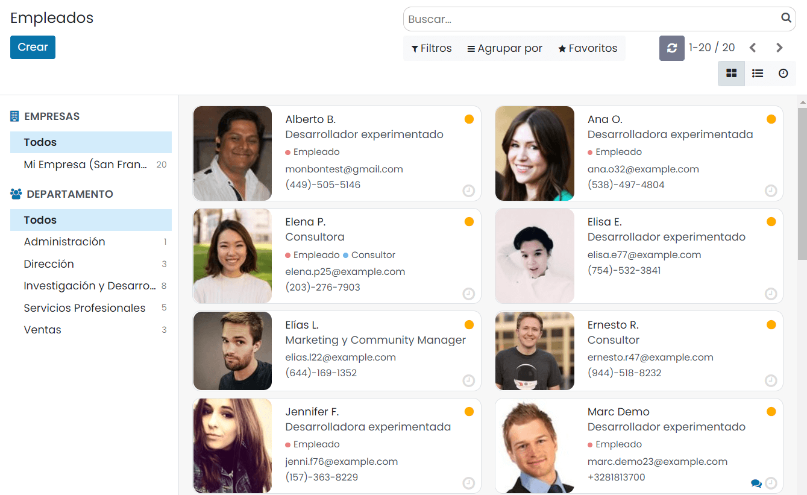

Cada uno de los empleados muestra, además del nombre, información acerca de su cargo y su disponibilidad actual
(un círculo verde indica que el empleado se encuentra disponible):

Desde la pantalla de empleados puedes crear un nuevo empleado haciendo clic en el botón *Crear*. Esto te lleva a la
pantalla de detalle del empleado, donde puedes proporcionar información detallada del empleado, como el nombre del empleado,
el puesto de trabajo, las etiquetas, el número de teléfono móvil del trabajo, el número de teléfono del trabajo y el correo
electrónico del trabajo. También podrás asignar la empresa y el departamento asociado con este empleado junto con los
detalles del gerente e instructor. Además, también puedes adjuntar una fotografía del empleado en el espacio indicado.

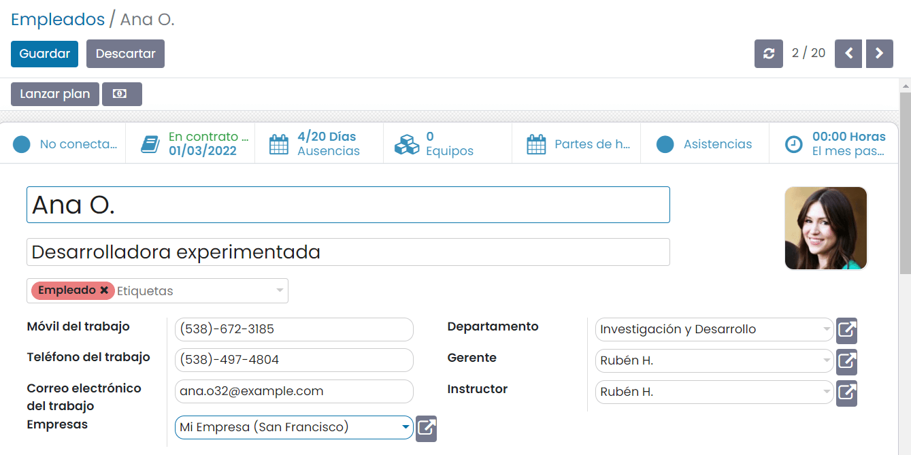

Desde la pestaña de **Información del trabajo** puedes definir la información relacionada con el trabajo, como la ubicación,
los aprobadores, o la información de calendario. Al asignar la ubicación de trabajo, la dirección de trabajo se asignará
automáticamente. Además, es posible asignar los aprobadores necesarios para que el empleado respectivo apruebe sus
asuencias y sus informes de gasto. Por último, se pueden definir los detalles del horario de trabajo, así como la zona
horaria.

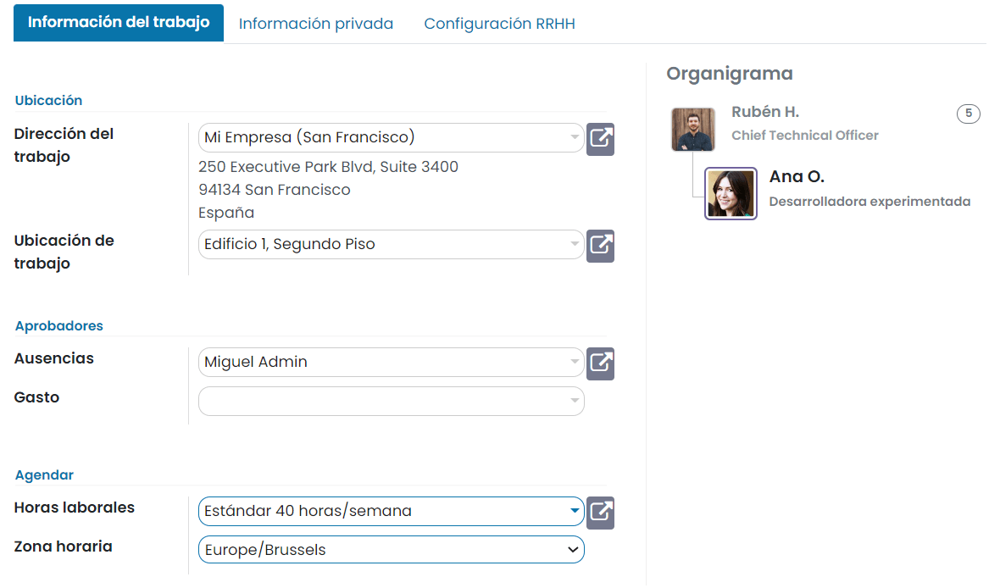

En la pestaña **Información Privada** se pueden definir los datos personales del empleado. Aquí puedes proporcionar los
detalles de contacto privado, como la dirección, el correo electrónico, el número de teléfono, el idioma y la distancia
entre el hogar y el trabajo en kilómetros. La dirección aquí mencionada es la dirección privada del empleado y no es la
que está vinculada a su empresa. Además, el estado civil y el número de dependientes se pueden definir junto con los
detalles del contacto de emergencia y el número de teléfono de emergencia. Luego, puedes describir los detalles educativos,
como el nivel de certificado, el campo de estudio y la escuela. Debajo de ciudadanía, puedes informar la nacionalidad,
número de identificación, número de pasaporte, género, fecha de nacimiento, lugar de nacimiento y país de nacimiento.
Del mismo modo, se pueden definir los detalles del permiso de trabajo, como el número de visa, el número de permiso de
trabajo, la fecha de vencimiento de la visa y la fecha de vencimiento del permiso de trabajo.

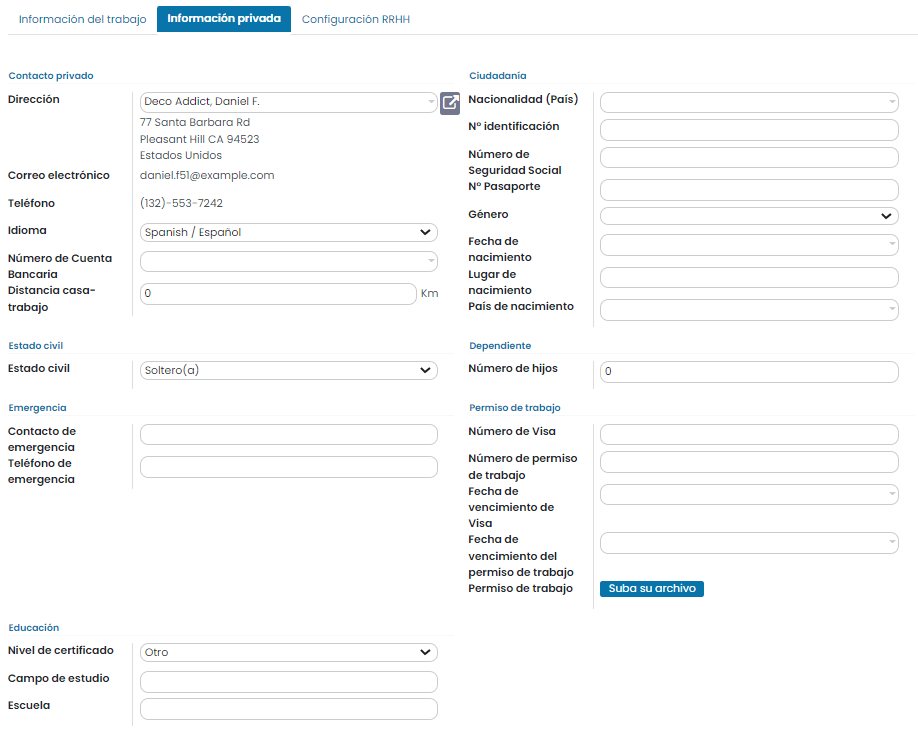

En la pestaña **Configuración RRHH** de la ventana de creación de empleados, debes completar los detalles que son datos
requeridos para el departamento de recursos humanos de tu empresa. De modo que puedas describir los detalles del tipo de
empleado, lo que será muy útil para categorizar a los empleados y también para ayudar a mantener el historial de contratos.
Luego, se puede asignar el nombre de usuario relacionado para que el recurso administre su acceso. Se pueden describir
los aspectos gerenciales e identificación de empleados para el registro de empleados, asistencia y operaciones de flota.
En las descripciones de las hojas de horas, se puede definir la remuneración de los empleados basada en los aspectos
horarios del funcionamiento del empleado. Además, se pueden asignar detalles de la sección de nómina, como contrato actual,
puesto de trabajo, número de registro del empleado.

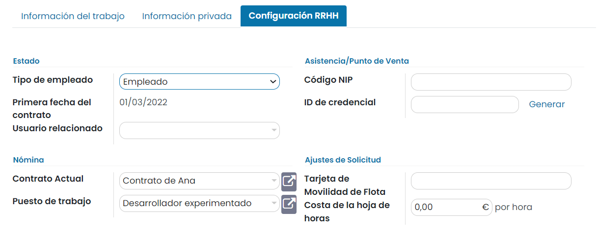

Además de estas pestañas descritas, también puedes ver varios botones en la parte superior de la ventana, como se
destaca en la imagen a continuación:

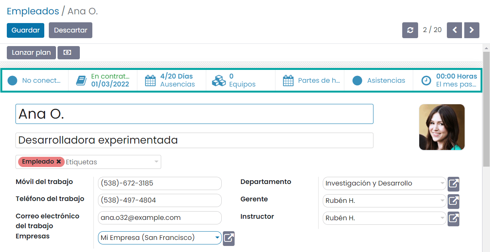

-  **Estado**: Estado de conexión del usuario.

-  **Contratos**: Muestra los contratos del empleado, y al hacer clic, la aplicación navega a la pantalla de Contratos
   del empleado.

-  **Ausencias restantes**: Muestra el número de días de vacaciones restantes del empleado, y al hacer clic, la aplicación
   navega a la pantalla de ausencias del empleado.

-  **Equipos**: Muestra el número de equipos o dispositivos del empleado y al hacer clic, la aplicación navega a la pantalla de
   equipos del empleado.

-  **Partes de Horas**: Al hacer clic, la aplicación navega a los partes de horas informados por el empleado.

-  **Asistencias**: Indica si el empleado se encuentra disponible o no, y al hacer clic, la aplicación navega a la
   pantalla de Asistencias del empleado.

-  **Horas trabajadas**: Indica las horas trabajadas el mes pasado, y al hacer clic, la aplicación navega a la pantalla
   de asistencias del empleado del mes pasado.

Una vez completados los campos necesarios, pulsa el botón *Guardar*. De esta manera, el nuevo empleado quedará dado de
alta en la aplicación.

.. _recursos_humanos/empleados/imprimir_identificacion:

Imprimir la identificación de un empleado
-----------------------------------------

Para imprimir la identificación de un empleado, navega a la pantalla :menuselection:`Empleados --> Empleados --> Empleados`,
y accede al detalle del empleado. Asegúrate de que el empleado tiene informado el número de empleado desde la pestaña de
**Configuración RRHH**:

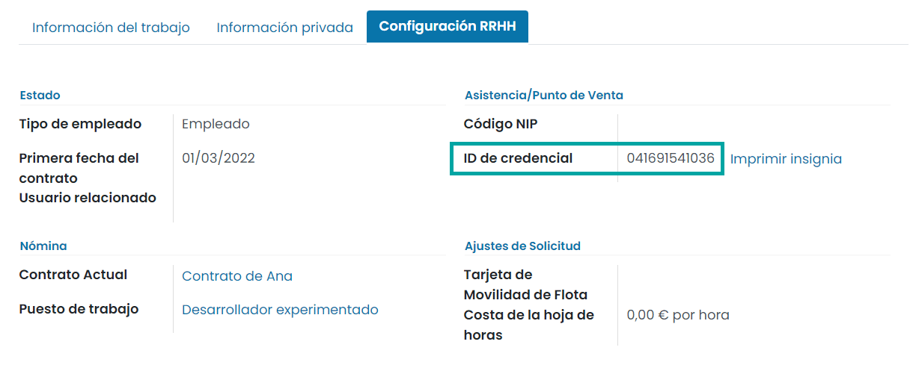

.. note::
   Si el empleado no tiene informado el número de empleado, y quieres generar uno de forma automática, puedes hacerlo
   pulsando el enlace **Generar** ubicado al lado del ID de credencial del empleado.

Una vez revisada la información del número de empleado, pulsa el enlace **Imprimir insignia**:

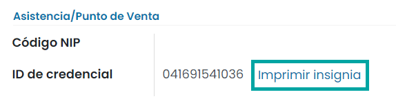

La aplicación genera un documento en formato PDF con la credencial del empleado y lo descarga en el directorio de
descargas configurado en el navegador:

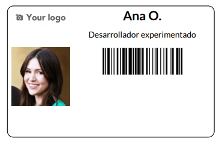

Lanzar plan de actividades del empleado
---------------------------------------

La pantalla :menuselection:`Empleados --> Configuración --> Planes` contiene varios planes predefinidos. Desde esta pantalla,
Daeris te brinda la posibilidad de incluir tanto las operaciones de incorporación como las de baja relacionadas con los
empleados de tu empresa:

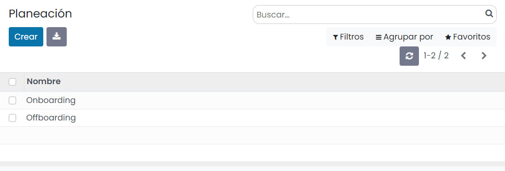

Mediante el botón *Crear* disponible en la ventana el sistema accederá a la pantalla de creación de un plan:

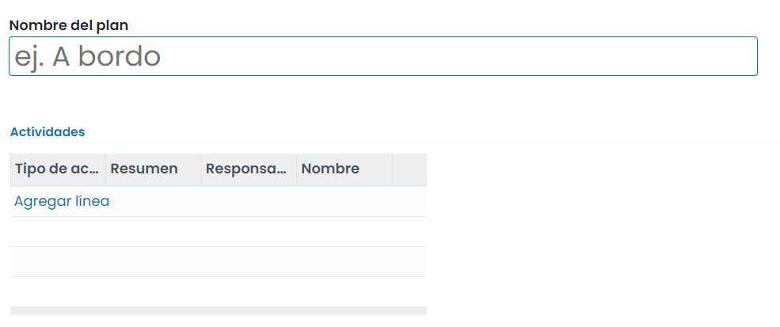

Debes proporcionar el nombre del plan y puedes asignar el tipo de actividad, el resumen, el responsable y el nombre
haciendo clic en la opción *Agregar línea*. Al hacer clic en el botón *Agregar línea*, aparecerá una ventana emergente
como se muestra en la imagen a continuación:

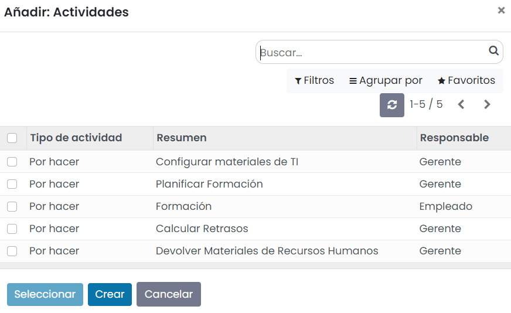

Desde esta ventana, puedes seleccionar las actividades predefinidas o crear una nueva usando los botones respectivos.
Daeris te brinda la posibilidad de incluir más de una actividad en una sola planificación.

Una vez hayas configurado tus planes, navega al detalle de un empleado desde la pantalla :menuselection:`Empleados --> Empleados --> Empleados`
y pulsa el botón **Lanzar plan**:

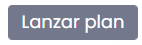

El sistema desplegará una ventana en donde se podrá seleccionar el plan de actividades a lanzar para el empleado:

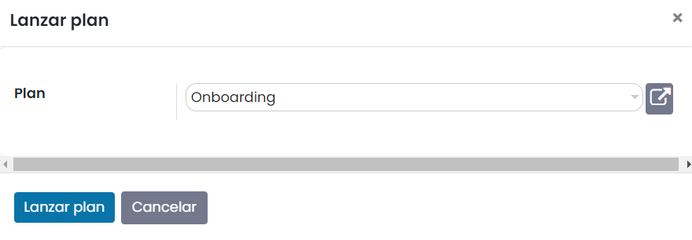

Tras lanzar el plan, la aplicación generará las actividades relacionadas con dicho plan, y se podrán visualizar desde
el apartado de *chatter* del empleado:

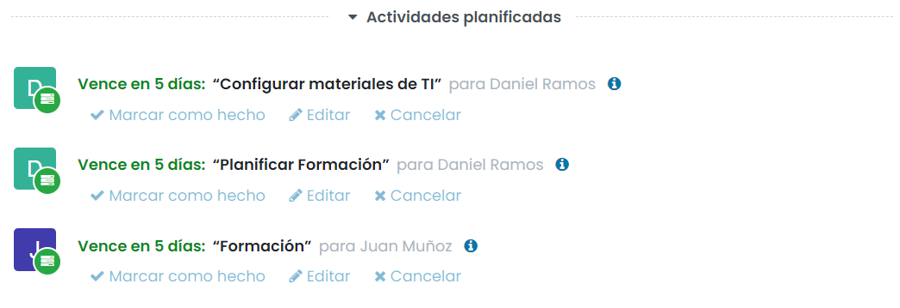

.. note::
   Para que sea posible lanzar el plan, tanto el empleado como su gerente, deben disponer de un usuario asociado en el
   campo *Usuario relacionado* de la pestaña **Configuración RRHH**.

Gestión de contratos
====================

Configuración
-------------

Configurar los puestos de trabajo
~~~~~~~~~~~~~~~~~~~~~~~~~~~~~~~~~

En la pantalla :menuselection:`Empleados --> Configuración --> Puestos de trabajo` es posible configurar varios puestos
de trabajo:

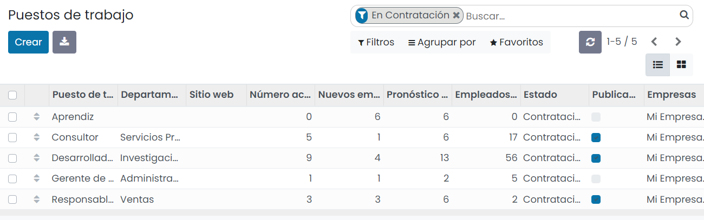

En esta ventana, puedes ver todos los puestos de trabajo predefinidos junto con detalles como el puesto de trabajo, el
departamento, el sitio web, el número actual de empleados, los nuevos empleados esperados, el total de empleados previstos,
los empleados contratados, el estado, publicado y la empresa. Tienes la opción de ver y editar cada uno de estos puestos
de trabajo configurados en detalle haciendo clic en el puesto de trabajo correspondiente.

Puedes configurar nuevos puestos de trabajo utilizando el botón *Crear*. El sistema navegará al formulario de creación de
puesto de trabajo:

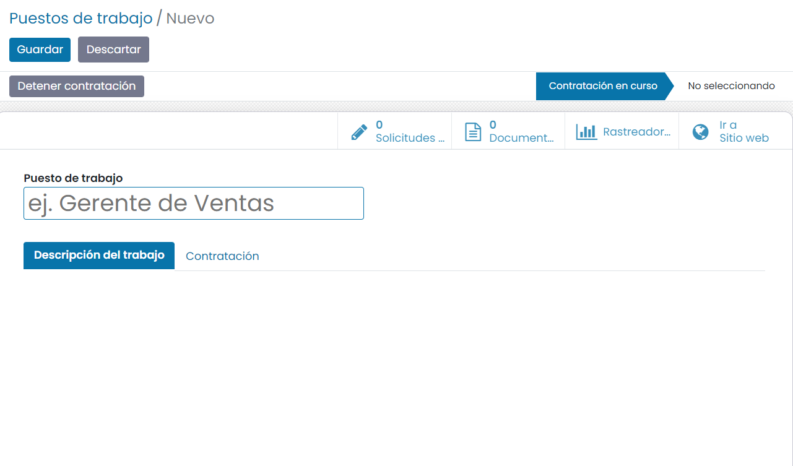

En esta ventana de creación de puestos de trabajo, puedes proporcionar el nombre del puesto de trabajo. Luego, en la
pestaña **Descripción del trabajo**, puedes informar una descripción del trabajo personalizada. Además, la pestaña
**Contratación** te permite introducir información relacionada con el proceso de selección para ese puesto de trabajo,
en caso de haberlo.

.. seealso::
   * :doc:`contratacion`

Una vez que completes todos los campos, puedes hacer clic en el botón *Guardar* para guardar los detalles.

Configurar los tipos de contrato
~~~~~~~~~~~~~~~~~~~~~~~~~~~~~~~~~

En la pantalla :menuselection:`Empleados --> Configuración --> Tipos de contrato` es posible configurar los diferentes
grupos de contribución de los contratos:

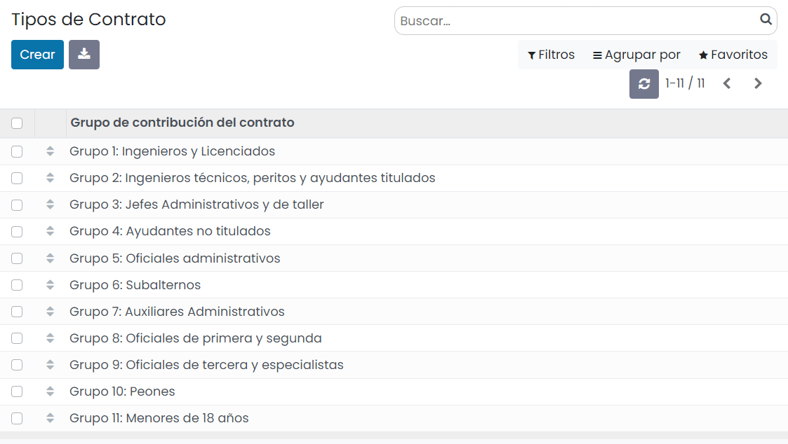

En esta ventana, puedes ver todos los tipos de contrato predefinidos. Tienes la opción de ver y editar cada uno de estos
tipos de contrato configurados en detalle haciendo clic en el tipo de contrato correspondiente.

Puedes configurar nuevos tipos de contrato utilizando el botón *Crear*. El sistema navegará al formulario de creación de
tipos de contrato, donde podrás informar el nombre:

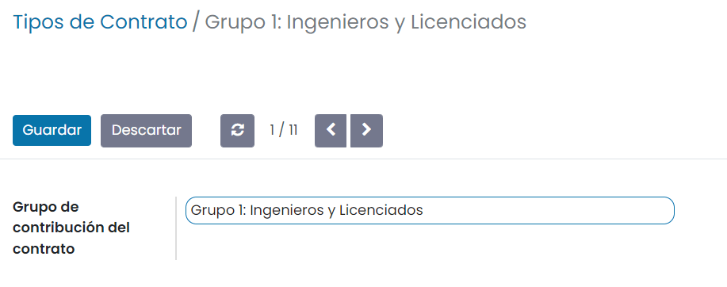

Una vez que completada la información, puedes hacer clic en el botón *Guardar* para guardar los detalles.

Configurar los motivos de salida de los empleados
~~~~~~~~~~~~~~~~~~~~~~~~~~~~~~~~~~~~~~~~~~~~~~~~~

En la pantalla :menuselection:`Empleados --> Configuración --> Motivos de salida` es posible definir varios motivos de
salida. Aquí se mostrarán todos los motivos de salida predefinidos en un formato de lista. También puedes crear nuevos
motivos de salida en la misma ventana haciendo clic en el botón *Crear*.

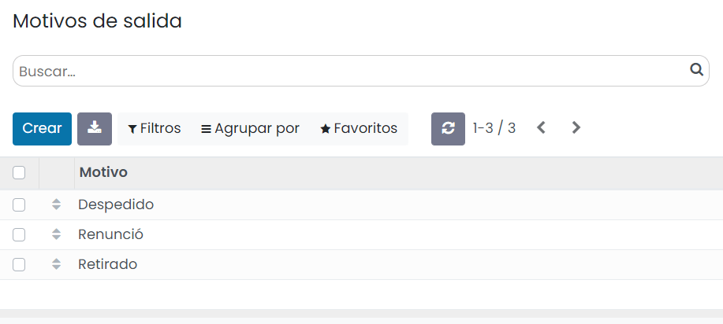

Crear un contrato de empleado
-----------------------------

Para crear un nuevo contrato de empleado, navega a la pantalla :menuselection:`Empleados --> Empleados --> Contratos`.
En esta pantalla puedes visualizar todos los empleados dados de alta en la aplicación, junto con sus contratos asociados:

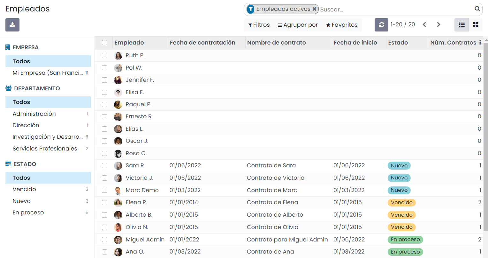

En el listado puedes encontrar información acerca del nombre del empleado, la fecha de contratación, el nombre del contrato,
la fecha de inicio del contrato, el estado, y el número de contratos asociados.

Al acceder al detalle de un empleado, puedes crear un nuevo contrato haciendo clic en el botón *Crear*:

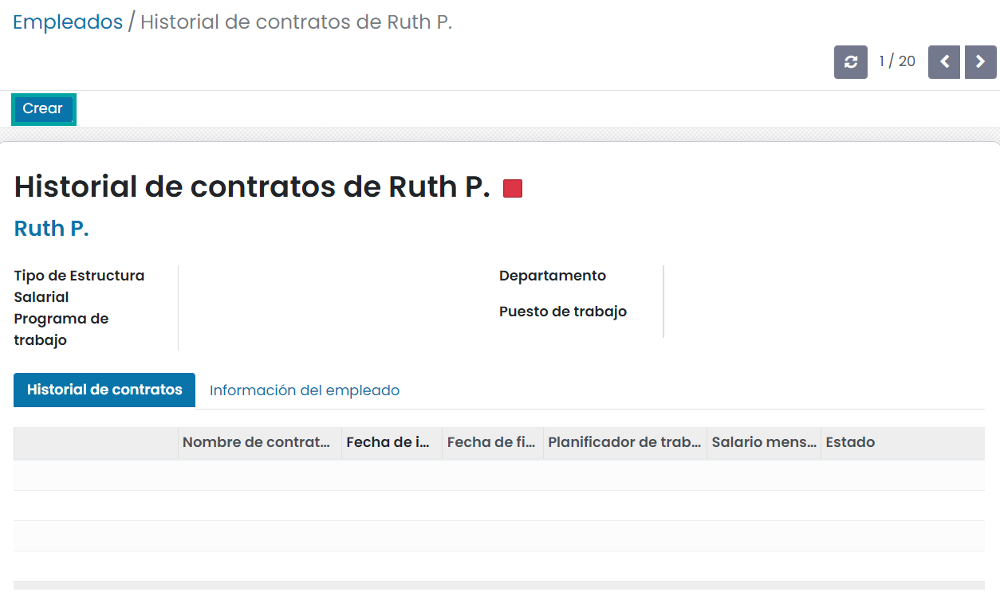

Esto te lleva a la pantalla de detalle del contrato. En esta ventana, puedes proporcionar la referencia del contrato y
el nombre del empleado. El campo fecha de inicio del contrato se asignará automáticamente, y también puedes informar la
fecha de finalización del contrato y el tipo de estructura salarial. El tipo de estructura salarial considerará cómo
se paga a un empleado con la organización o empresa. Después de asignar la estructura salarial, puedes informar el
horario de trabajo, el departamento, el puesto de trabajo, el tipo de contrato, y el responsable de recursos humanos.
Este responsable de recursos humanos es la persona responsable de validar el contrato de los empleados.

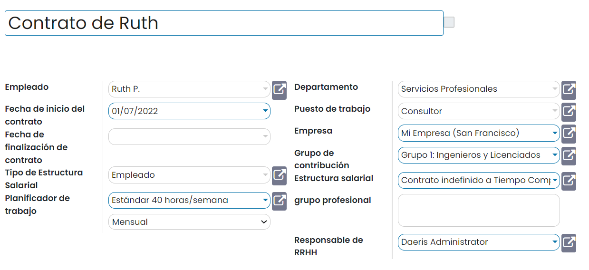

En la pestaña **Detalles del contrato**, debes completar la cuenta analítica, y el diario de salarios. También puedes
informar notas, si las hubiere.

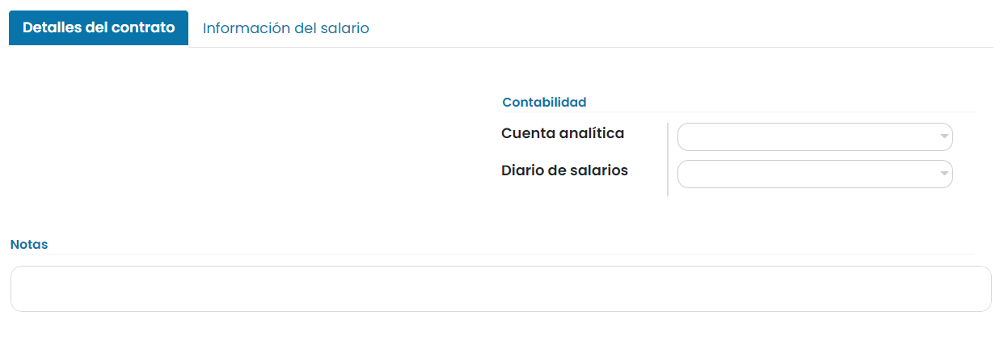

En la pestaña **Información del salario**, puedes completar los detalles del salario, como el salario en efectivo, el
salario en especie, los datos complementarios y el precio de los elementos extra:

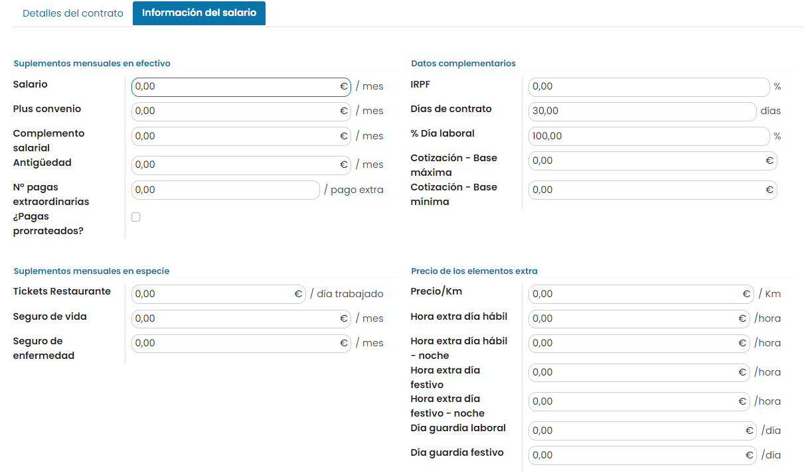

Una vez completados los campos necesarios, pulsa el botón *Guardar*. De esta manera, el nuevo contrato quedará dado de
alta en la aplicación.

El contrato del empleado podrá ser cambiado de estado mediante la barra ubicada en la parte superior del formulario:

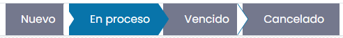

De esta manera será posible cambiar el estado del contrato a *En proceso*, cuando el contrato esté vigente, a *Vencido*
cuando el contrato haya finalizado, o a *Cancelado*, cuando el contrato decida ser cancelado.

Gestión de departamentos
========================

Crear un departamento de la compañía
------------------------------------

Para crear un nuevo departamento, navega a la pantalla :menuselection:`Empleados --> Departamentos`. En esta pantalla
puedes visualizar todos los departamentos dados de alta en la aplicación:

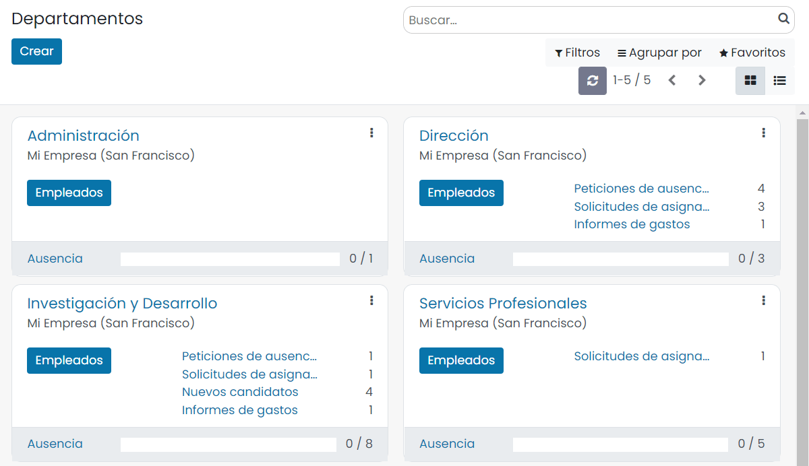

Cada uno de los departamentos muestra, además del nombre, un botón para consultar los empleados del departamento, e
información acerca de las ausencias, solicitantes de trabajo e informes de gastos del mismo:

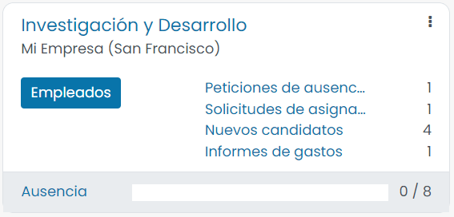

Desde la pantalla de departamentos puedes crear un nuevo departamento haciendo clic en el botón *Crear*. Esto te lleva a
la pantalla de detalle del departamento, en donde dispones de la siguiente información:

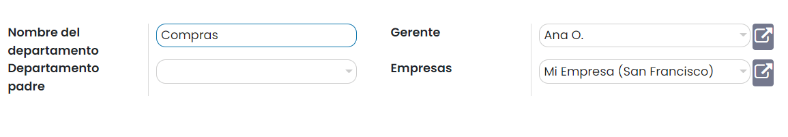

Los campos disponibles son los siguientes:

-  **Nombre de departamento**: Nombre del nuevo departamento creado.

-  **Gerente**: Empleado responsable del departamento.

-  **Departamento padre**: Permite informar una jerarquía de departamentos en la compañía.

-  **Empresas**: Empresa asociada al departamento.

Una vez completados los campos necesarios, pulsa el botón *Guardar*. De esta manera, el nuevo departamento quedará dado
de alta en la aplicación.