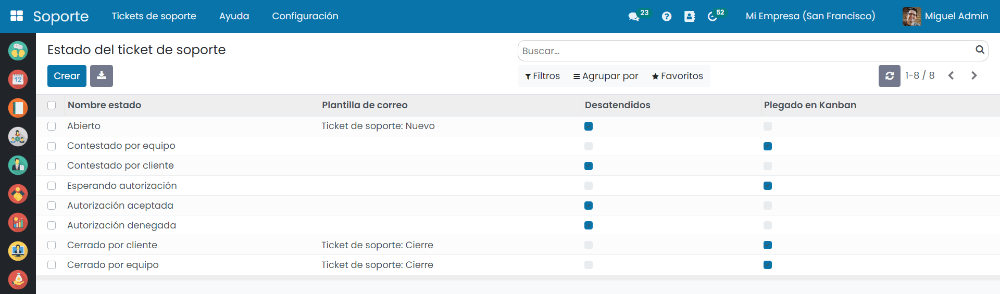
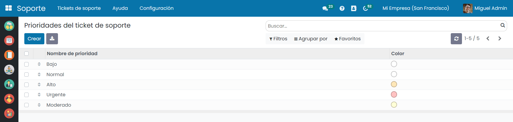
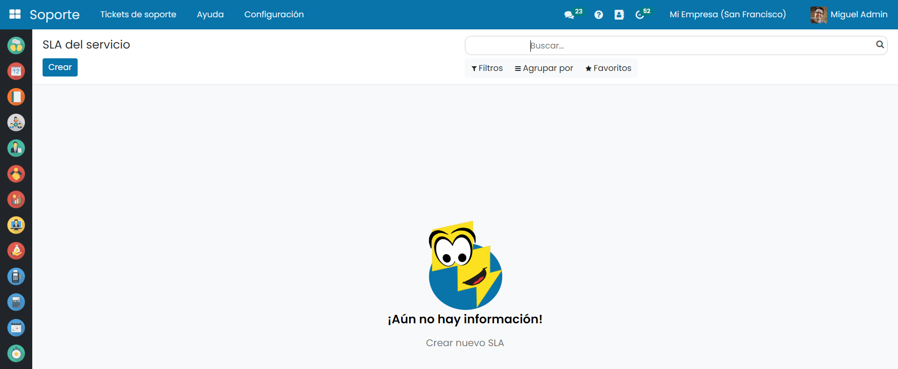
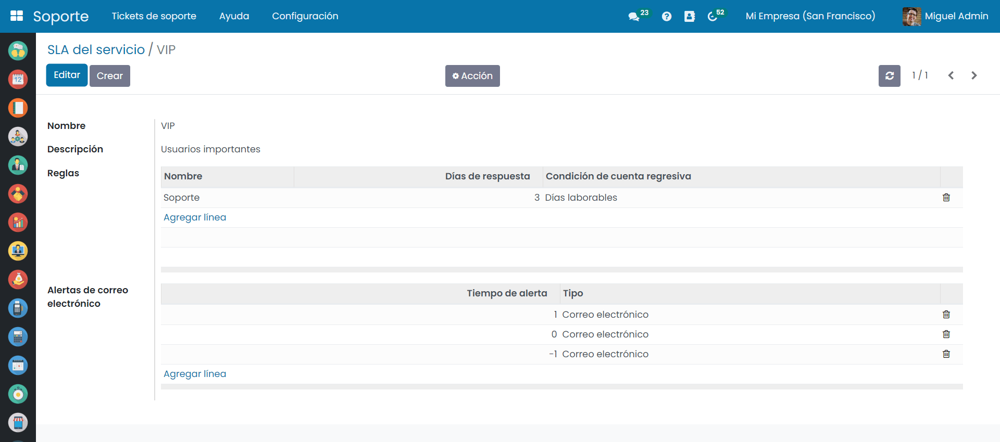

=======================
Configuración Básica
=======================

La aplicación de soporte de Daeris se puede configurar para adaptarla a tus necesidades de negocio, siendo posible configurar las categorías, estados, prioridades, tipologías, así como crear diferentes modelos de SLA (contratos de niveles de servicio).

.. youtube:: JxdAu2Qxel8
    :align: right
    :width: 700
    :height: 394

Categorías
==========================

Las *categorías* permiten clasificar y agrupar los tickets en función de las necesidades de tu negocio.

Cada categoría, permite asociar seguidores, asignar un gestor predeterminado, incorporar una encuesta de satisfacción,
requerir al cliente la firma en línea, así como establecer un pliego de términos y condiciones especifico.

Para crear una categoría de tickets de soporte, navega a la pantalla :menuselection:`Soporte --> Configuración --> Categorías` y haz clic sobre el botón *Crear*.

Sobre el formulario de detalle de la categoría es posible informar los siguientes campos:

- **Nombre**: Se recomienda incorporar un texto breve y descriptivo.
- **Seguidores**: Usuarios de la aplicación que tienen acceso a los tickets de soporte asociados a esta categoría. A estos usuarios se les notificará por correo electrónico cuando un ticket de soporte sea asociado a esta categoría.
- **Encuesta**: Cuestionario de medición de la satisfacción del cliente de los servicios prestados. Esta encuesta se emite cuando se cierra el ticket.
- **Usuario asignado predeterminado**: Empleado al que se le hace responsable de la gestión del ticket de forma predeterminada, cuando se asocia a esta categoría.
- **Firma en línea**: Si se informa esta opción, obliga al cliente a firmar en línea cuando se le solicita autorización.
- **Términos y condiciones**: Apartado que le aparece al cliente como términos y condiciones del servicio ofrecido.

Una vez completados los campos necesarios, pulsa el botón *Guardar*.

Estados
=======================

Los *estados* de los tickets, permiten generar un flujo de gestión y comunicación entre el cliente y el centro de soporte.

Los estados indican en qué fase se encuentra el ticket de soporte y si requiere ser atendido por el gestor (ticket desatendido).

Para configurar los estados de los tickets de soporte, navega a la pantalla :menuselection:`Soporte --> Configuración --> Estados`.

Por defecto, Daeris dispone de los siguientes estados:

- **Abierto (desatendido)**
- **Respondido por el equipo**
- **Cliente Contestado (desatendido)**
- **Esperando aprobación**
- **Aprobación aceptada (desatendido)**
- **Aprobación rechazada (desatendido)**
- **Cliente cerrado**
- **Cerrado por el equipo**

Cada estado dispone del campo *Plantilla de correo*, cuya finalidad es la de enviar una comunicación automática en el momento en el que el ticket se informa con ese valor.

El campo *desatendido* de un estado, permite ocultar de la página de inicio de tickets, todos los registros cuyo estado disponga de esta marca.

El campo *Plegado en Kanban* permite mostrar plegado el panel correspondiente al estado de la vista kanban.
Esta opción es muy útil para ocultar de la pantalla los registros que no requieren de nuestra atención.

.. important:: Se recomienda no editar los estados actuales debido a que son requeridos para realizar el flujo de gestión de tickets.

Prioridades
===========================

Las prioridades sirven para categorizar el nivel de criticidad de un ticket de soporte.

Para configurar las prioridades de los tickets, navega a la pantalla :menuselection:`Soporte --> Configuración --> Prioridades`.

Inicialmente, dispones de los siguientes valores:

- **Bajo**
- **Normal**
- **Moderado**
- **Alto**
- **Urgente**

El campo *Color* ,permite asociar un código de color a la prioridad.
Este color se incorpora como fondo del registro de los tickets sobre la vista Kanban.

.. important:: Se recomienda usar tonos suaves para que se visualice la información correctamente.

Tipologías
===========================

Los tipos sirven para categorizar el ámbito de gestión de un ticket de soporte.

Para configurar las tipologías de los tickets, navega a la pantalla :menuselection:`Soporte --> Configuración --> Tipos`.

Inicialmente, dispones de los siguientes valores:

- **Pregunta**
- **Servicio**
- **Incidencia**
- **Crítica**

El campo *Color* ,permite asociar un color a la tipología.
Este color se incorpora como fondo del campo tipo de los tickets sobre la vista Kanban.

.. important:: Se recomienda usar tonos suaves para que se visualice la información correctamente.

SLA
===================

Daeris permite definir distintos niveles de servicio que ofrecer a los clientes.

Para configurar los niveles de servicio (SLA) de los tickets de soporte, navega a la pantalla :menuselection:`Soporte --> Configuración --> SLA's`.

Al crear o editar un SLA, se debe informar, además del nombre y la descripción, las reglas que identificarán los días que dispone un agente para resolver un caso.

Al agregar una regla, es necesario incorporar las condiciones que deben cumplirse para que aplique el tiempo definido en la regla.

Solo se pueden crear condiciones en base a los campos categoría y prioridad, siendo posible combinar varias condiciones sobre una misma regla.

Posteriormente es posible informar los *días de respuesta* que dispondrá el agente en el caso que se cumpla esta regla.

El tiempo se puede contabilizar en días naturales (Todos los días) o en días de trabajo (Días laborables) sobre el campo *Condición de cuenta regresiva*.

También es posible definir distintas alertas por correo electrónico que recibirán los agentes en función de la fecha de vencimiento del SLA.

Por ejemplo, si se incorpora sobre el campo *tiempo de alerta*:

- **El valor 0**: se alertará al agente el día que caduque el SLA.
- **El valor 1**: se alertará al agente 1 día antes de que caduque el SLA.
- **El valor -1**: se alertará al agente 1 día después de haber caducado el SLA.

Finalmente, para asociar los SLA’s a los contactos de los clientes (clientes de tipo individual), navega a la pantalla :menuselection:`Contactos --> Contactos`.

Desde el detalle de un contacto, accede a la pestaña  *Ticket de soporte* e informa el contrato de SLA acordado con el cliente y el usuario que ofrecerá el soporte, en el caso de considerarse oportuno.

Ajustes
==========================

La aplicación de Soporte de Daeris permite configurar varias opciones relacionadas con su funcionalidad.
Para ello, navega a la pantalla :menuselection:`Soporte --> Configuración --> Ajustes`.

Sobre el formulario es posible configurar los siguientes apartados:

- **Enviar encuestas automáticamente**: Envía de forma automática la encuesta indicada en la categoría asociada al ticket cuando se cierra.
- **Activar el cálculo diario del SLA**: Si está informado, se calculan a diario las fechas de vencimiento de SLA de los tickets de soporte.

Una vez completados los campos necesarios, pulsa el botón *Guardar* y el botón *Aplicar*.
