========================
Sitio Web de soporte
========================

Daeris dispone de un apartado de soporte al cliente sobre el Sitio Web, que permite a tus clientes, consultar la documentación, así como crear y consultar sus tickets de soporte.

.. youtube:: 0F5rh1_Pats
    :align: right
    :width: 786
    :height: 442

Página inicial de soporte
===========================================================

Daeris dispone de una página de soporte sobre el sitio web, desde donde los clientes pueden consultar la documentación
y acceder al formulario de atención al cliente.

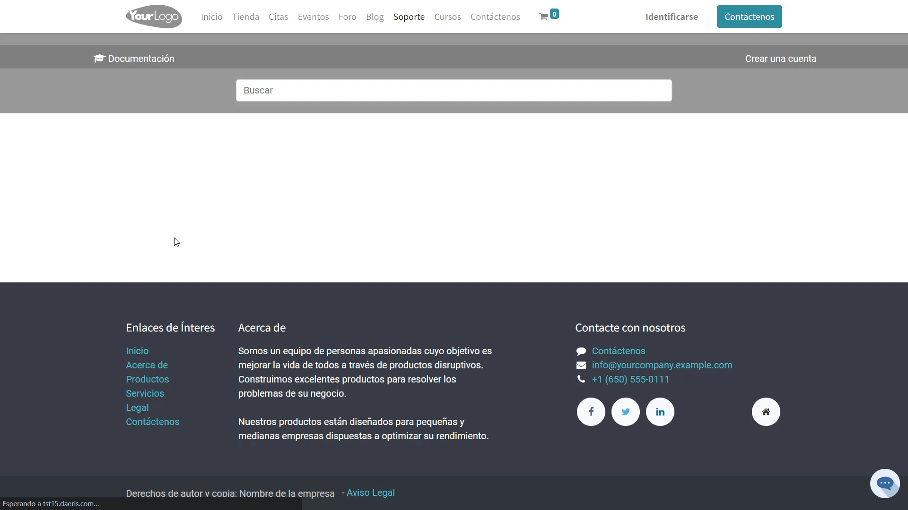

Para configurar la página inicial de soporte del sitio web, navega a la pantalla :menuselection:`Sitio Web --> Configuración --> Ajustes`
y sobre la sección *Portal de documentación de soporte*,  informa los siguientes campos:

- **Título de la página**: Título que se mostrará sobre la página inicial de soporte del sitio web.
- **Imagen de fondo de la página**: Imagen de fondo mostrada en la cabecera de la página.
- **Permitir el alta de tickets desde el Portal de ayuda**: Si se informa con el valor *Todos*, todos los visitantes del portal de ayuda tienen acceso al formulario de alta de tickets. En el caso de seleccionar *Solo usuarios registrados*, tan solo se permite registrar formularios a usuarios que se hayan dado de alta previamente en el sistema.

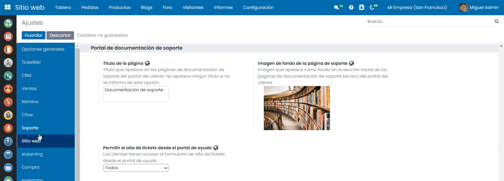

Si deseas que aparezca un enlace que permita a tus usuarios, registrarse en la plataforma como usuarios de forma autónoma, debes ir a la sección *Características* e
informar el campo *Cuenta de cliente* con el valor *Registro Gratis*. En el caso de incorporar el valor *Por invitación*, no se mostrará el enlace.

Una vez realizados los cambios, pulsa el botón *Guardar*.

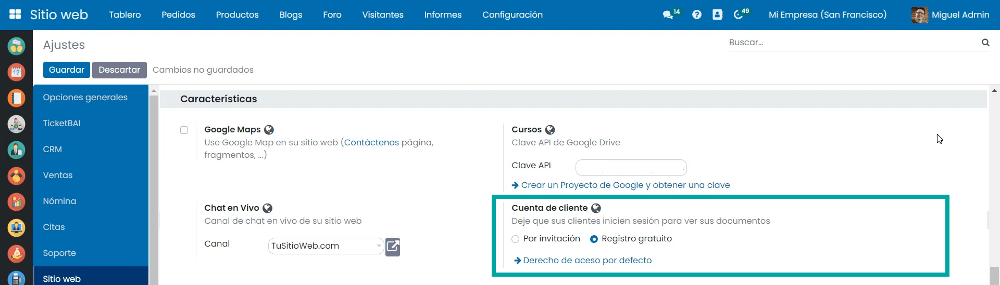

A partir de ese momento, al navegar a la página de soporte del sitio web, se podrán visualizar los cambios introducidos en los ajustes.

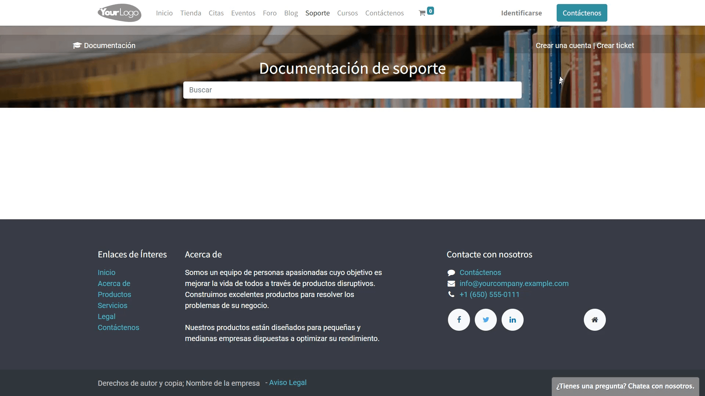

Grupos de ayuda
===========================================================

Los grupos de ayuda son contenedores de páginas web que permiten agrupar documentación de soporte de una temática particular.

Para crear un grupo, navega a la pantalla :menuselection:`Soporte --> Ayuda --> Grupos de ayuda` y haz clic sobre el botón *Crear*.

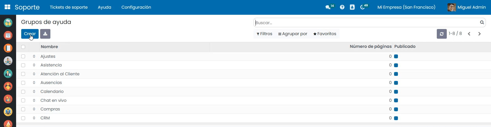

Sobre el formulario de detalle del grupo es posible informar los siguientes campos:

- **Título**: Se recomienda incorporar un texto breve y descriptivo.
- **Imagen**: Debe ser descriptiva ya que se muestra como fondo del grupo en el Sitio Web.Es recomendable usar el mismo tamaño para todas las imágenes de los grupos de soporte , 1200x400 en formato JPG o PNG de calidad media.

Sobre la pestaña *Contenido* es posible visualizar las páginas asociadas al grupo. El listado no es editable.

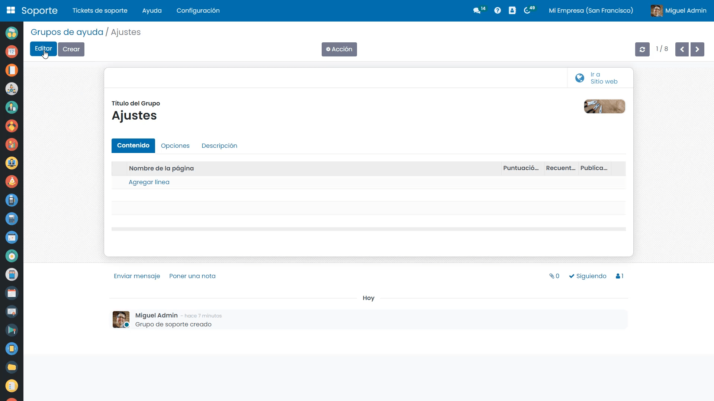

Sobre la pestaña *Opciones* es posible informar el *usuario responsable* del grupo y los *grupos con privilegios* de acceso.
En el caso de informar grupos de privilegios, el registro **deja de ser de acceso público sobre el Sitio Web** y solo lo pueden
visualizar, los integrantes de los grupos que se hayan informado.

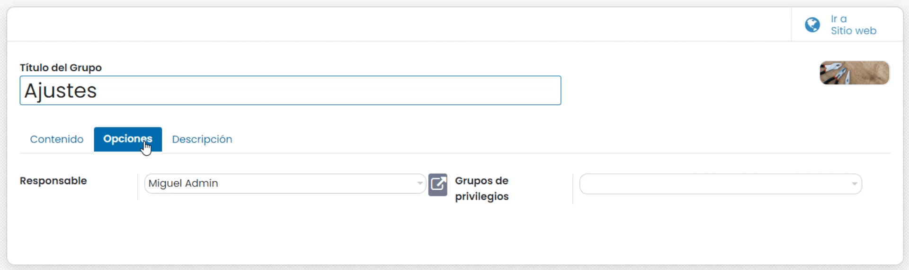

Sobre la pestaña *Descripción* se puede incorporar un texto de ayuda interna para los empleados el cual no aparecerá en el Sitio Web.

Una vez registrada la información deseada, pulsa el botón *Guardar*.

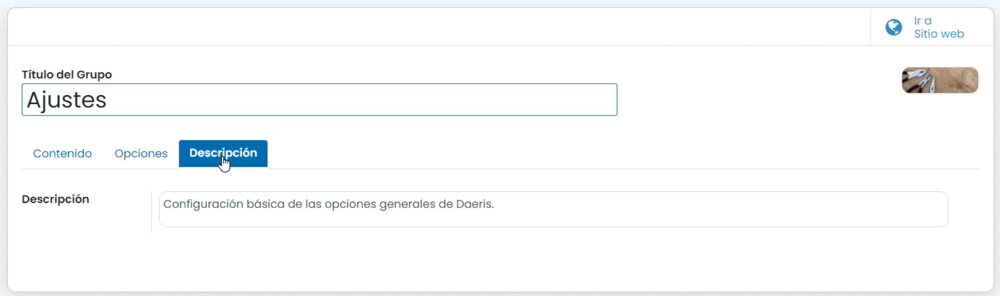

Mediante el botón *Ir al Sitio Web* es posible navegar a la página del grupo de ayuda del Sitio Web, desde donde es posible publicar u ocultar el grupo mediante el botón *Publicado*.

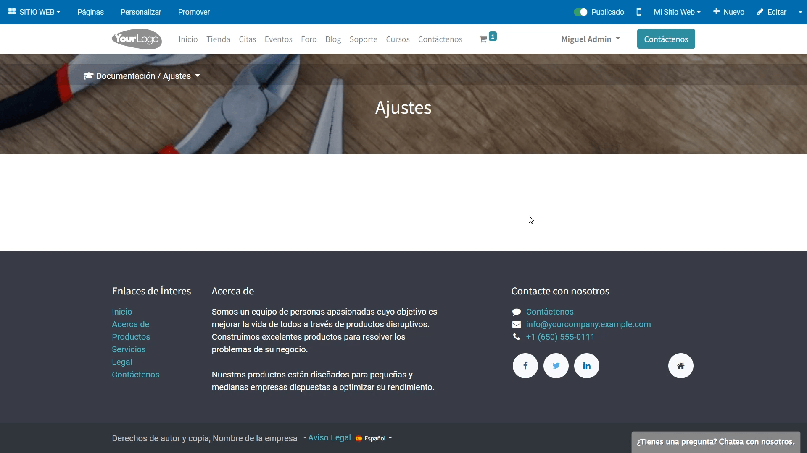

Categorías de páginas de ayuda
===========================================================

Las categorías de páginas de ayuda, permiten separar las páginas de un grupo sobre el menú del grupo.
Esta opción es muy útil para organizar las páginas por áreas de la misma temática.

Para crear una categoría, navega a la pantalla :menuselection:`Soporte --> Ayuda --> Categoría de páginas` y haz clic sobre el botón *Crear*.

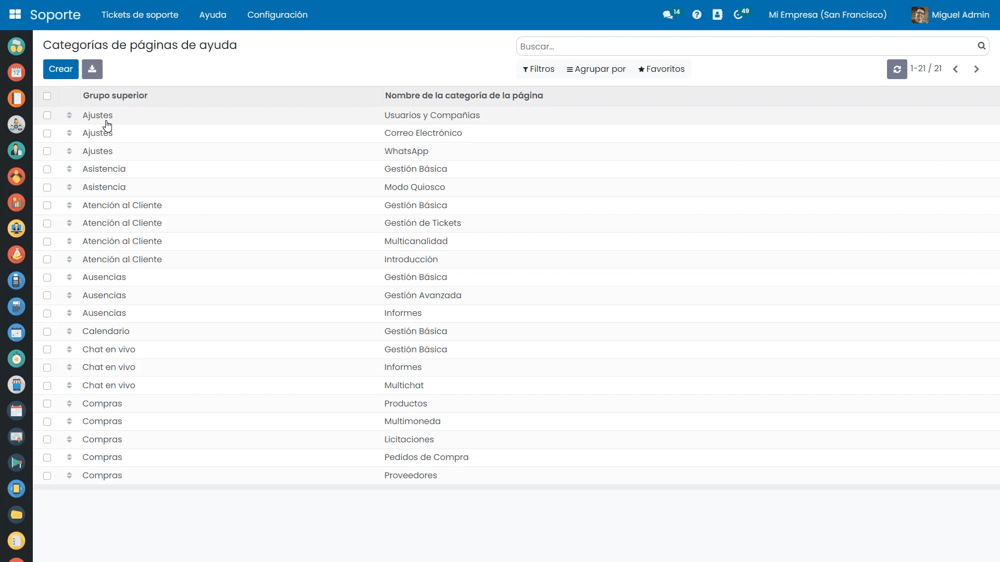

Sobre el formulario de detalle de la categoría es posible informar los siguientes campos:

- **Grupo superior**: Grupo de página de ayuda al que asociar la categoría.
- **Nombre**: Se recomienda incorporar un texto breve y descriptivo.
- **Secuencia**: Orden en la que aparecerá la categoría sobre el menú del grupo.

.. note::
   Es recomendable modificar la secuencia desde el listado de categorías de páginas de ayuda, arrastrando el registro hasta la posición deseada.

Una vez completado el registro, pulsa el botón *Guardar*.

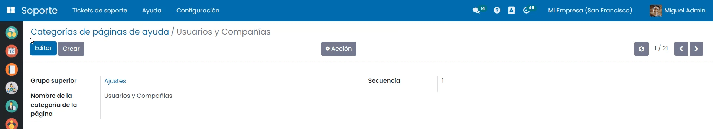

Páginas de ayuda
===========================================================

Las páginas de ayuda del sitio web, permiten crear documentación de soporte de una temática particular para los clientes y/o empleados.

Para crear una página de ayuda, navega a la pantalla :menuselection:`Soporte --> Ayuda --> Páginas de ayuda` y haz clic sobre el botón *Crear*.

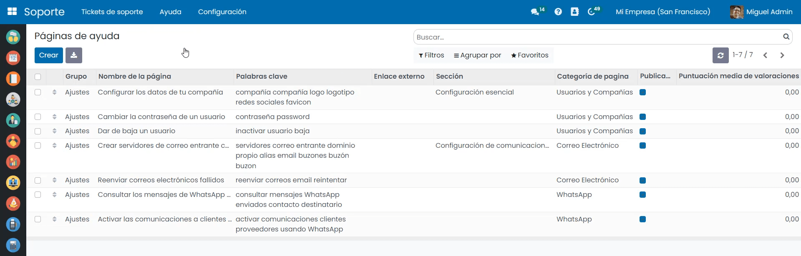

Sobre el formulario de detalle de la página es posible informar los siguientes campos:

- **Título**: Se recomienda incorporar un texto breve y descriptivo.

Sobre la pestaña *Documento* es posible informar los siguientes campos:

- **Grupo**: Nombre del grupo desde donde se accede a la página.
- **Sección**: Opcional. Permite agrupar categorías de ayuda por secciones en la página de índice del grupo. Si se desea usar esta funcionalidad, solo se debe informar sobre la primera página de ayuda de cada sección.
- **Secuencia**: Posición de la página de ayuda para mantener un **orden** respecto al resto de páginas asociadas al grupo.
- **Publicado**: Indica si la página está disponible en el caso de estar informado sobre el sitio web.
- **Categoría de página**: Permite agrupar diferentes páginas de ayuda de un grupo por categorías. El nombre de la categoría aparecerá en el índice de páginas del grupo.
- **Responsable**: Usuario gestor de la página.
- **Enlace externo**: Es posible especificar una URL de una página a la que se redirigirá a los usuarios cuando accedan a esta página de ayuda. Es posible incluir URLs de sitios web externos o URLs internas.
- **Enlace "URL" interno**: Campo no editable que muestra el enlace a la página.

.. note::
   Es recomendable modificar la secuencia desde el listado de páginas de ayuda, arrastrando el registro hasta la posición deseada.

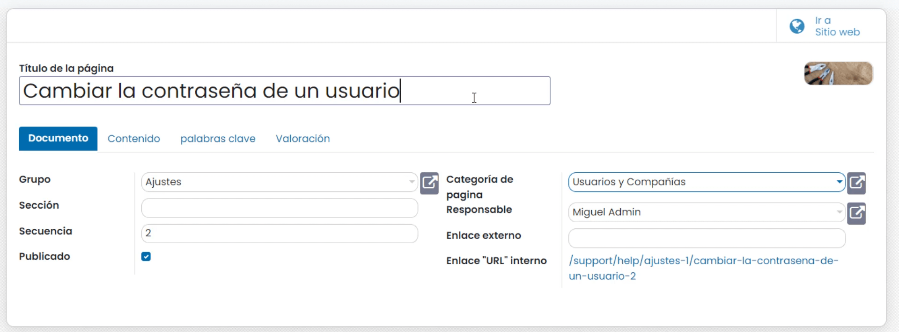

Sobre la pestaña *Contenido* es posible informar el contenido de tu página web, si bien, la opción recomendable es la de editarla una vez creada , desde el Sitio Web mediante el gestor de bloques.
En caso de haber informado un *enlace externo*, no se visualizará este contenido, sino que se redirigirá a la URL correspondiente.

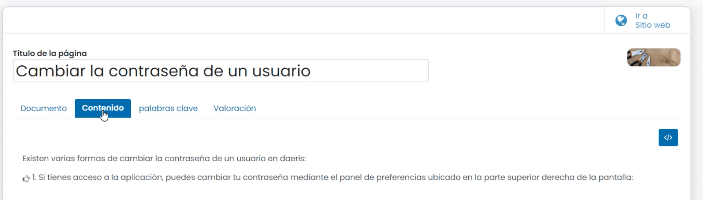

Sobre la pestaña *Palabras clave* es posible incorporar un conjunto de palabras separadas por espacios que se utilizarán a la hora de buscar páginas de ayuda desde el buscador de la página inicial de soporte.

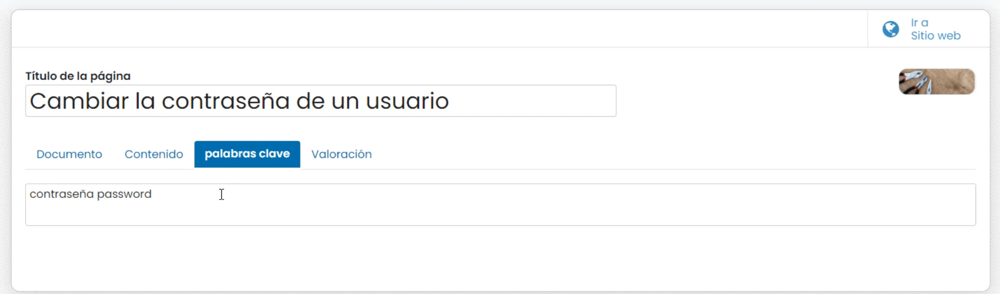

Sobre la pestaña *Valoración* es posible visualizar a modo de consulta la siguiente información:

- **Puntuación media de valoraciones**: Puntuación media otorgada a la página de ayuda por los visitantes que la han valorado .
- **Listado de valoraciones**: Desde donde se posible visualizar cada una de las calificaciones y comentarios recibidos sobre la página.

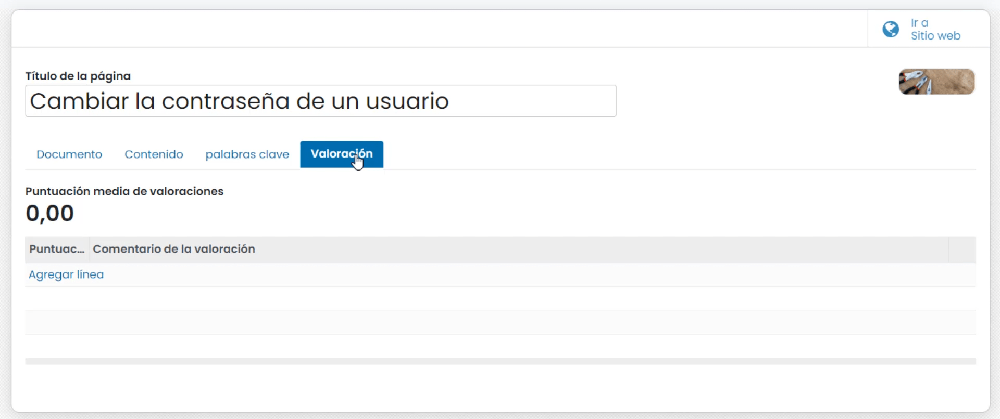

Una vez completado el registro, pulsa el botón *Guardar*.
Mediante el botón *Ir al Sitio Web* es posible navegar a la página de ayuda del Sitio Web, desde donde es posible editarla mediante el gestor de bloques del Sitio Web.

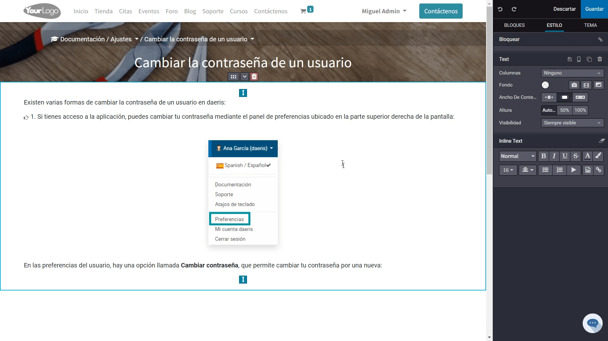