=======================
Gestión de Tickets
=======================

El módulo de gestión de **Soporte** de Daeris permite registrar los casos de los clientes y visitantes del Sitio Web, desde diferentes canales.
A partir de la entrada de un ticket de soporte en el sistema, el gestor y el cliente podrán interactuar en el caso mediante acciones (botones) disponibles en el propio ticket.

.. youtube:: 6YDzU1UDXr8
    :align: right
    :width: 700
    :height: 394

Responder (equipo)
===========================================================

Al acceder al detalle de un ticket de soporte desde la pantalla :menuselection:`Soporte --> Tickets de soporte`
, aparece el botón *Responder*, que permite enviar un correo electrónico al cliente.

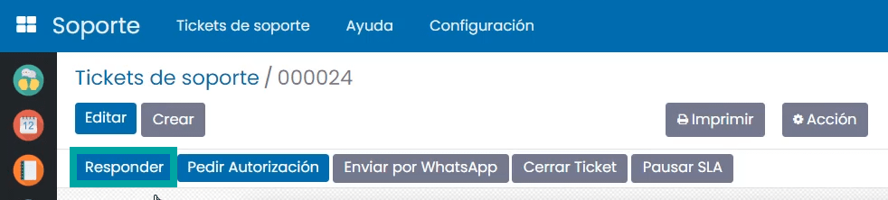

Al realizar esta acción se muestra un desplegable donde es posible introducir el cuerpo del correo.
El uso de plantillas de correo , aceleran la gestión de la respuesta.

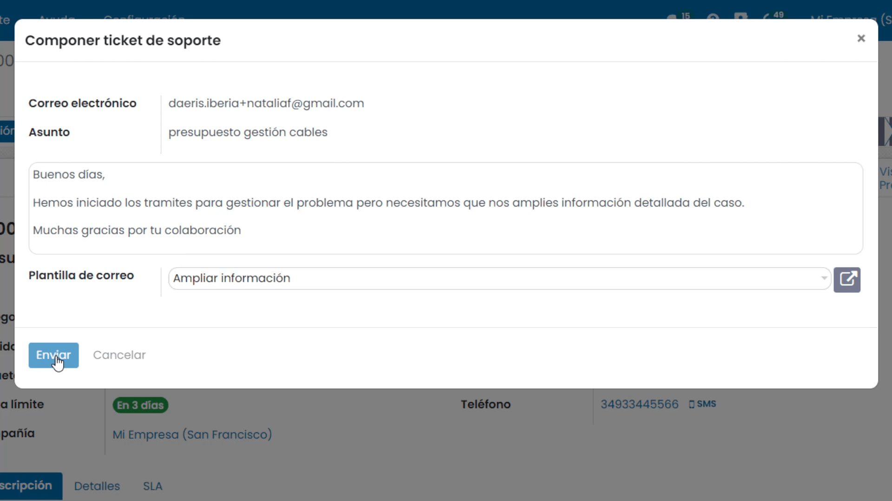

Una vez enviada la comunicación, el estado del ticket cambia a Contestado por equipo, un estado atendido en el que el equipo se mantiene a la espera de respuesta por parte del cliente.

Responder (cliente)
===========================================================

Un ticket respondido por el equipo genera un correo electrónico que es enviado al cliente.

El cliente puede *responder directamente al correo electrónico* recibido o acceder al formulario de gestión del portal y hacer clic
sobre el botón *Responder*.

En ambos casos, la información con la respuesta se introducirá en el sistema y el ticket cambiará de estado a *Contestado por cliente*,
un estado desatendido que requerirá de revisión por parte del equipo de soporte.

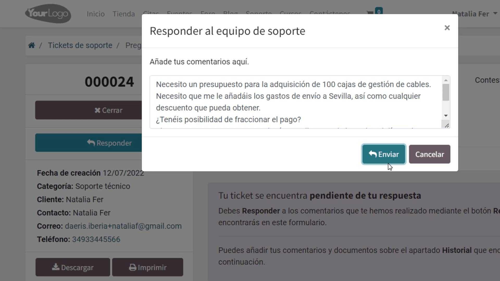

Estos tickets se pueden consultar desde la pantalla :menuselection:`Soporte --> Tickets de soporte`.

Solicitar autorización (equipo)
===========================================================

Ya sea porque se considera oportuno el cierre del ticket previo consentimiento del cliente o porque es necesaria autorización
para realizar una acción determinada, es posible proceder a *Pedir autorización* al cliente.

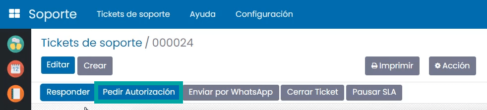

Para ello, navega al detalle de un ticket desde la pantalla :menuselection:`Soporte --> Tickets de soporte`.

Esta acción abre una nueva pantalla para enviar la solicitud de autorización. En este punto el agente deberá informar los
motivos por los que se requiere autorización del cliente.

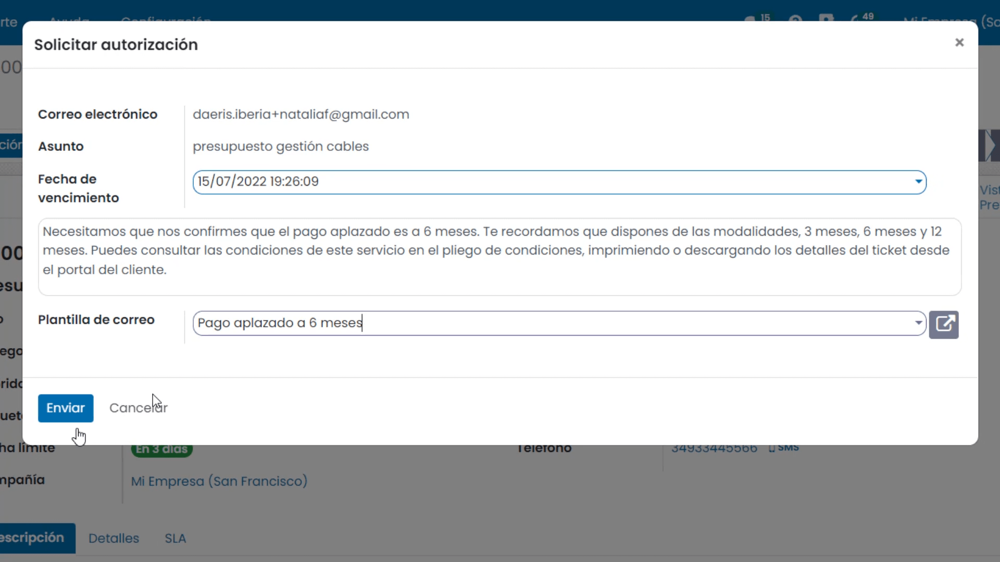

Al enviar la comunicación el estado del ticket cambia a *Esperando autorización*. El cliente recibe el correo, indicándole que
debe acceder al detalle del ticket desde la pantalla de portal para autorizar o rechazar la solicitud de autorización.

El ticket dispone de un estado atendido en el que el equipo se mantiene a la espera de respuesta por parte del cliente.

Autorizar / Denegar (Cliente)
===========================================================

Un ticket en estado *Esperando autorización* permite al cliente tomar la decisión de dar su consentimiento a la solicitud
presentada por el equipo o rechazarla.

Para ello, el cliente debe acceder a la página de detalle del ticket del portal web.

Sobre el formulario dispone de los botones *Autorizar* y *Denegar*.

Al hacer clic sobre el botón *Autorizar*, el estado del ticket cambia a *Autorización aceptada*.
Si el ticket dispone de la opción *Firma en línea*, se solicita al cliente que realice la acción de firmar sobre un desplegable antes de Autorizar el caso.

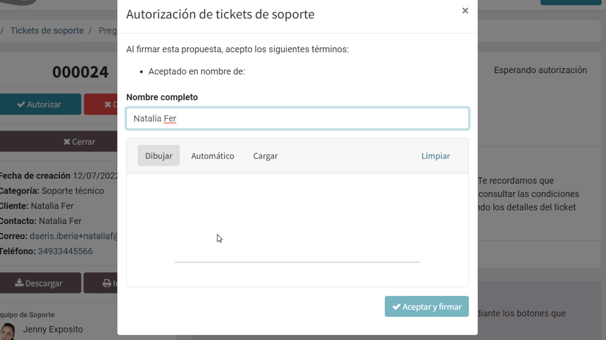

En el caso de que el cliente no desee ofrecer su autorización, debe hacer clic sobre el botón *Denegar*, acción que solicitará
al cliente que incorpore sobre un desplegable los motivos por los que rechaza la solicitud.

.. image:: gestión_de_tickets/denegar_tickets_portal.png
   :align: center
   :alt: Denegar tickets sobre el área privada de portal

Una vez el cliente ha completado la acción , el estado del ticket cambia a *Autorización denegada*.

Independientemente de que el cliente autorice o rechace la solicitud, el ticket quedará desatendido para que un agente pueda continuar con su gestión
desde la pantalla :menuselection:`Soporte --> Tickets de soporte`.

Cerrar (cliente)
===========================================================

Los clientes pueden visualizar sus tickets de soporte desde la página de Soporte del sitio web, pulsando el enlace de Mis tickets
Posteriormente, es posible acceder al detalle de un ticket pulsando en el enlace del número del ticket.

Desde la página de detalle del ticket, el cliente puede darlo por cerrado mediante el botón Cerrar Ticket

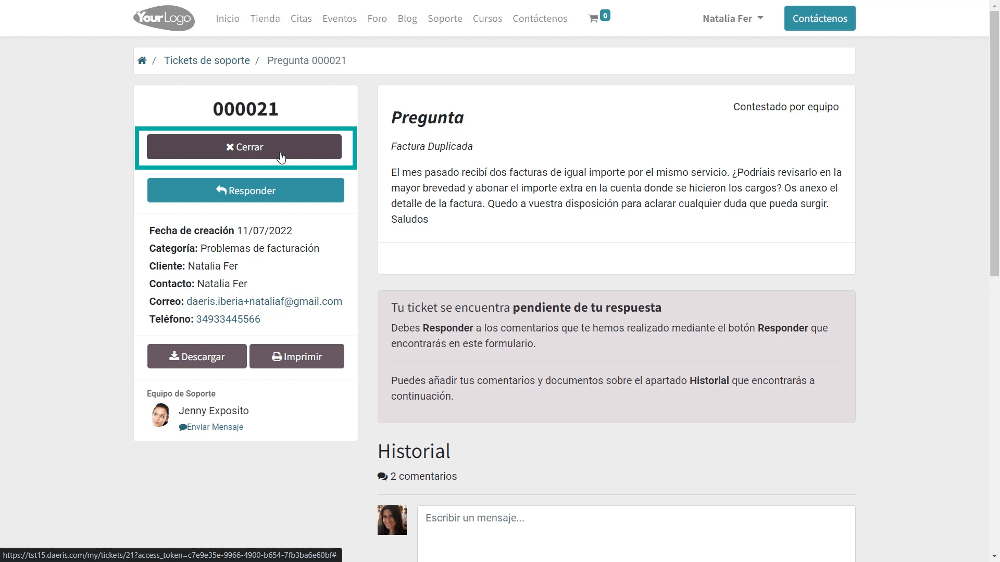

Esta acción procede a cambiar el estado del ticket a *Cerrado por cliente* emitiendo una comunicación al cliente, indicándole que se ha procedido al cierre del caso.
Además, permite al cliente valorar los servicios prestados mediante un cuestionario de satisfacción.

.. image:: gestión_de_tickets/satisfaccion.png
   :align: center
   :alt: Formulario de satisfacción al cerrar tickets sobre el área privada de portal

Cerrar (equipo)
===========================================================

Al acceder al detalle de un ticket de soporte desde la pantalla :menuselection:`Soporte --> Tickets de soporte`, aparece el botón *Cerrar*.

.. image:: gestión_de_tickets/boton_cerrar.png
   :align: center
   :alt: Botón cerrar tickets sobre la aplicación de soporte

Al hacer clic sobre este botón, se muestra una nueva ventana que solicita el motivo del cierre, el cual se procederá a notificar al cliente.

Es posible usar plantillas de correo que acelerarán la gestión de la respuesta.

Una vez informado el mensaje o plantilla, es necesario pulsar el botón Cerrar.

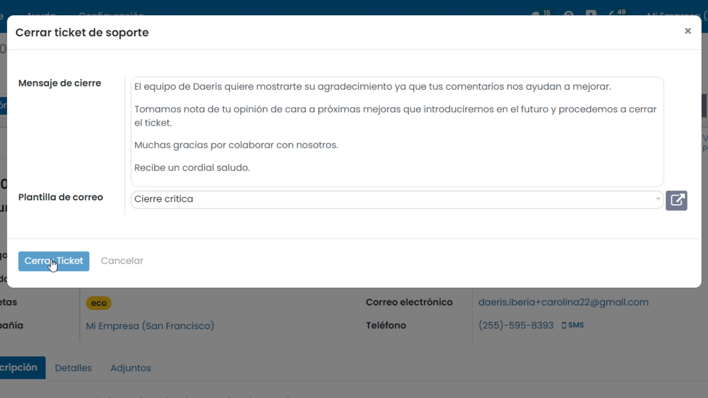

El ticket de soporte queda en estado *Cerrado por equipo* y el cliente recibe notificación por correo electrónico.

Envío automático de encuestas
===========================================================

Para activar el envío automático de encuestas de los tickets de soporte, navega a la pantalla :menuselection:`Soporte --> Configuración --> Ajustes`, y activa la opción *Enviar encuesta automaticamente*.
Posteriormente, haz clic sobre el botón *Guardar*.

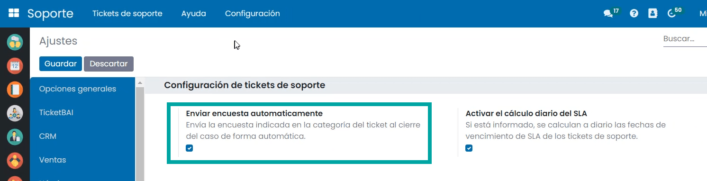

A partir de ese momento, cuando el equipo de soporte cierre un ticket, el cliente recibirá un correo indicando que rellene una
encuesta de satisfacción.

Es posible configurar la encuesta que recibirá el cliente, si se configura una encuesta distinta a la genérica en la categoría del ticket de soporte.

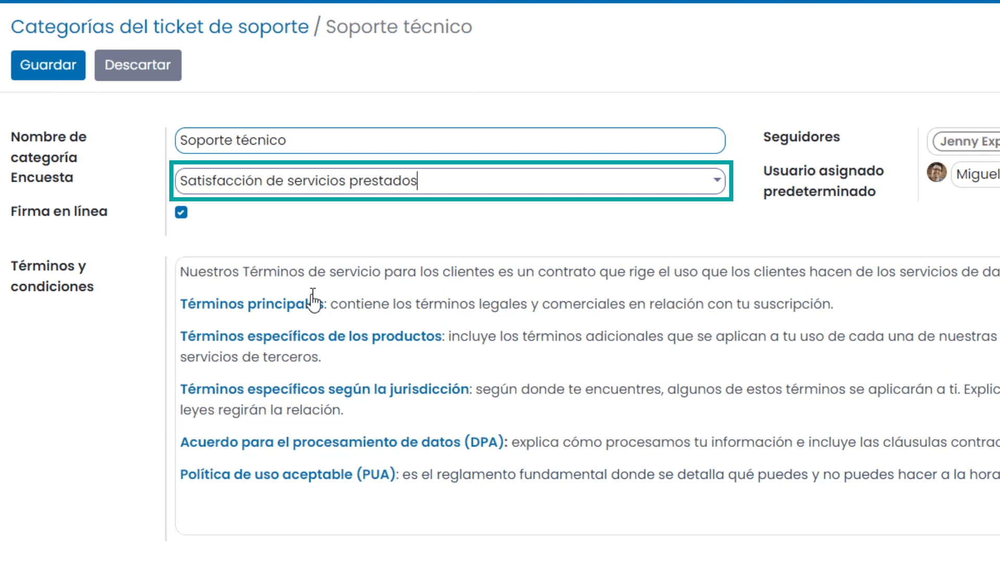

Si el cliente pulsa el enlace de la encuesta, se desplegará una nueva ventana desde donde poder completarla.

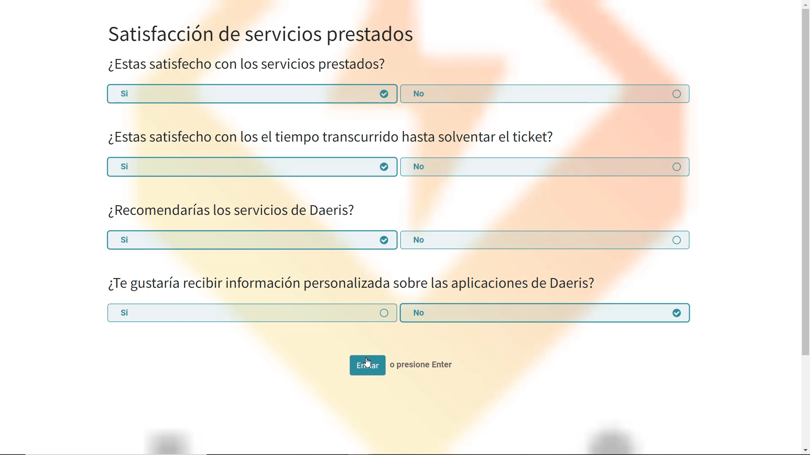

Si el cliente rellena la encuesta de satisfacción, será posible visualizar los resultados en el propio detalle del ticket, o en el caso de usar una encuesta distinta a la genérica, desde la aplicación de encuestas,

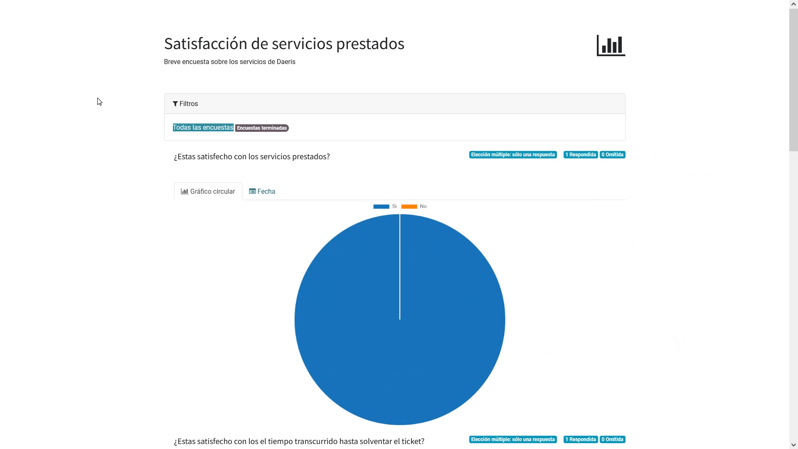

Envío manual de encuestas
===========================================================

Para enviar una encuesta de forma manual en un ticket de soporte, navega al detalle de un ticket desde la pantalla :menuselection:`Soporte --> Tickets de soporte`, y pulsa el botón *Enviar encuesta*:

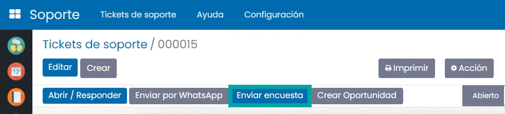

El cliente recibirá un correo indicando que rellene una encuesta de satisfacción.

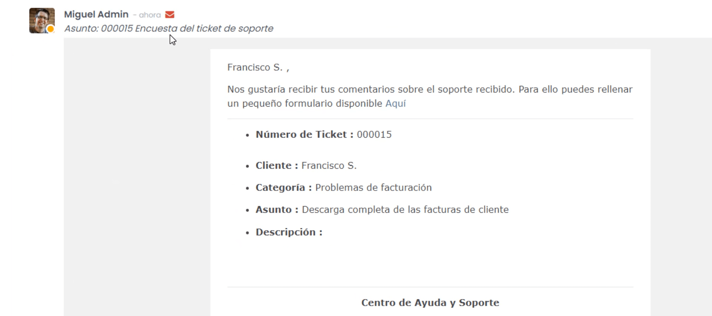

Si el cliente pulsa el enlace de la encuesta, esta se desplegará sobre una nueva ventana desde donde poder completarla.

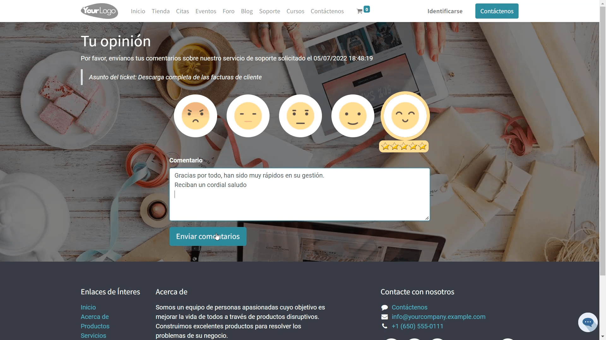

Si el cliente rellena la encuesta de satisfacción, será posible visualizar los resultados desde el propio detalle del ticket, o en el caso de usar una encuesta distinta a la genérica, desde la aplicación de encuestas,

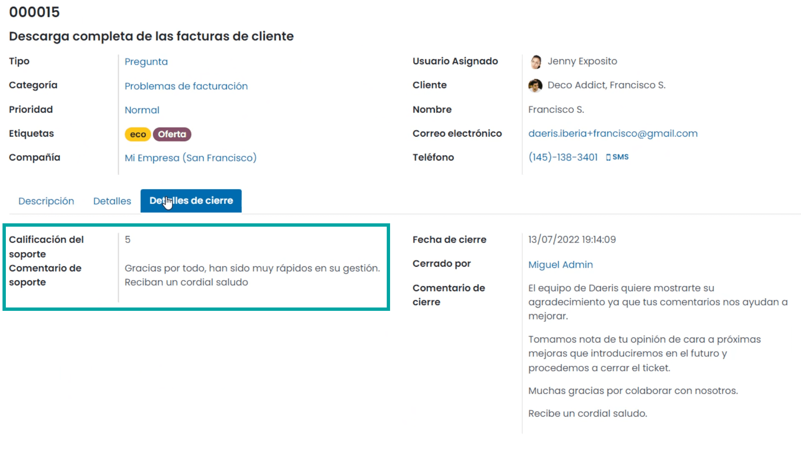

Enviar un mensaje de WhatsApp
===========================================================

Para enviar un mensaje de WhatsApp al cliente asociado a un ticket de soporte, navega a la pantalla :menuselection:`Soporte --> Tickets de soporte`,
y accede al detalle de un ticket. Desde esta pantalla, aparece el botón *Enviar por WhatsApp* que permite enviar un mensaje a través de WhatsApp.

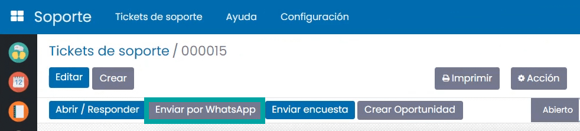

Es requerido activar las comunicaciones a través de WhatsApp desde la pantalla :menuselection:`Ajustes --> Opciones generales`,
informando la opción *Comunicaciones con WhatsApp*. Si no se activa esta opción, no se mostrará el botón para enviar por WhatsApp.

.. seealso::
   * :doc:`../../varios/whatsapp`

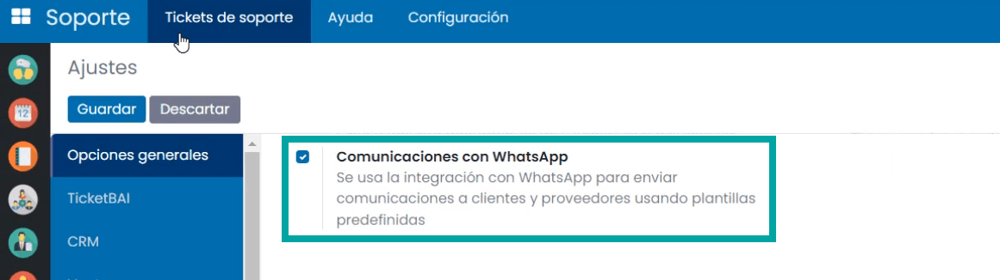

Al pulsar el botón *Enviar por WhatsApp*, el sistema desplegará una nueva ventana con los siguientes campos:

- **Destinatario**: Preinformado con el cliente asociado al ticket.
- **WhatsApp**: Número de móvil asociado al contacto. En caso de no disponer de un número de móvil asociado al contacto, no se podrá realizar el envío del mensaje. Los números de WhatsApp deben disponer del prefijo del número de país, seguido del número de teléfono, como, por ejemplo, 34666777888.
- **Plantillas**: Plantilla de comunicación asociada al mensaje. Por defecto, se informará la plantilla de comunicación de *Nuevo ticket de soporte*.
- **Mensaje**: Mensaje de WhatsApp a enviar al contacto. Es posible editar este mensaje en caso de no querer utilizar la plantilla por defecto.

Una vez completados los campos necesarios, pulsa el botón *Enviar*.

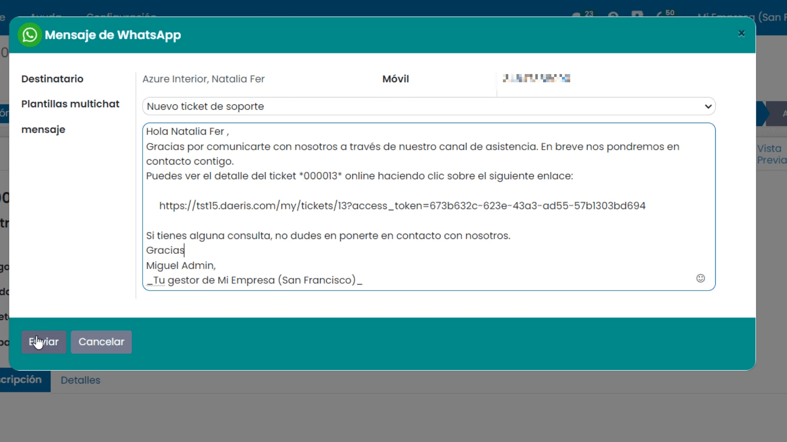

En caso de estar conectado a la aplicación mediante un dispositivo de escritorio, el sistema tratará de establecer conexión mediante la aplicación *WhatsApp Web*,
para lo cual, habrá que escanear el código QR mostrado en pantalla, e iniciar sesión en tu cuenta de WhatsApp.

Por otro lado, en caso de estar conectado a la aplicación mediante un dispositivo móvil, el sistema tratará de enviar el mensaje
mediante la aplicación WhatsApp instalada en el dispositivo.

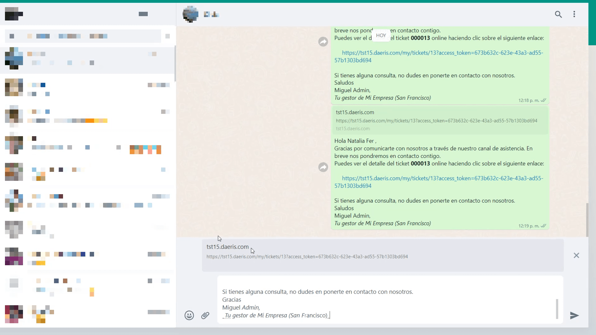

Una vez enviado el mensaje desde WhatsApp, cierra la ventana del mensaje mediante la cruz ubicada en la parte superior derecha del formulario.

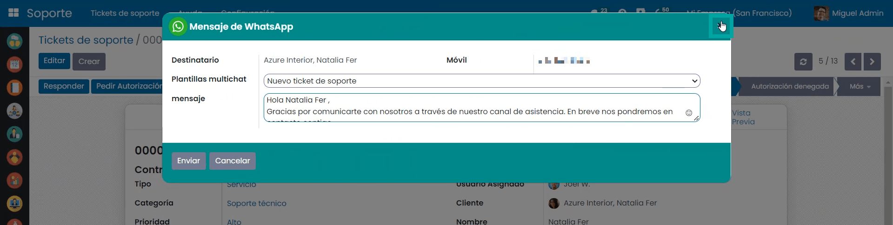