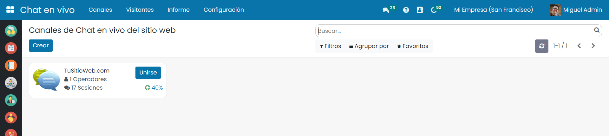
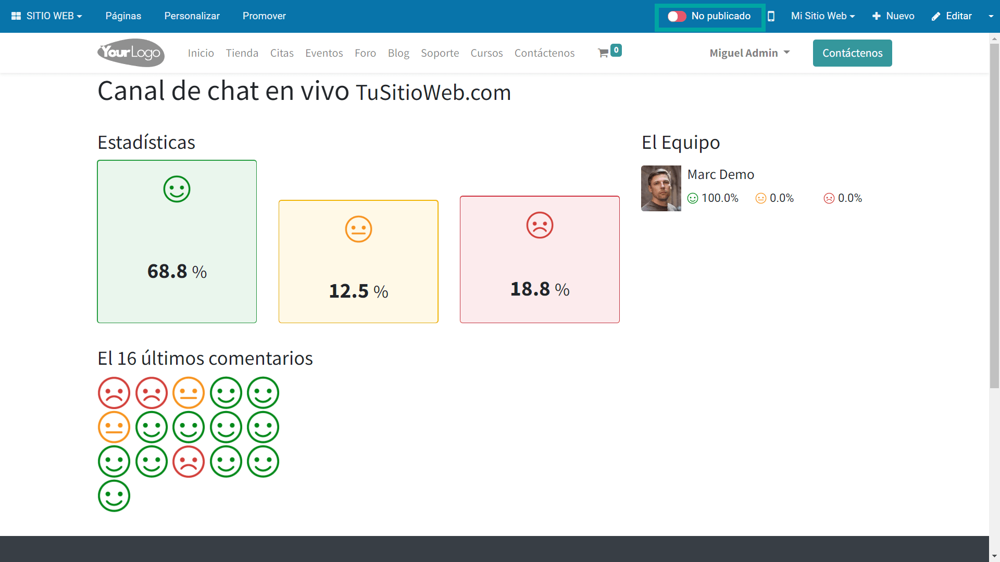

=======================
Multicanalidad
=======================

Un ticket de soporte es el registro de un servicio de atención al cliente el cual dispone de los detalles necesarios y el histórico de las comunicaciones para gestionarlo.
Un cliente o cliente potencial, puede requerir de los servicios de nuestra compañía y debe tener la posibilidad de ponerse en contacto con el centro de soporte. Es recomendable ofrecer distintos canales de contacto ya que aumenta el grado de satisfacción de los clientes.
Daeris permite la entrada de tickets desde el chat, correo electrónico, formulario web y aplicación de Soporte.

.. youtube:: GgP0VHxMhec
    :align: right
    :width: 700
    :height: 394

Crear un ticket desde aplicación
===========================================================

Para crear tickets de soporte, navega a la pantalla :menuselection:`Soporte --> Tickets de soporte` y haz clic sobre el botón *Crear*.

Sobre el formulario de detalle es posible introducir la siguiente información:

- **Asunto**: Se recomienda incorporar un texto breve y descriptivo de la necesidad del cliente.
- **Tipo**: Campo seleccionable que  permite categorizar el ámbito de gestión de un ticket.
- **Categoría**: Campo seleccionable que  permite categorizar en base a los servicios que ofrece tu negocio.
- **Prioridad**: Campo seleccionable que  permite categorizar el nivel de criticidad.
- **Etiquetas**: Permiten incorporar atributos.
- **Fecha límite**: Fecha máxima en la que se ha de resolver el caso.
- **Compañía**: Empresa de nuestro negocio a la que hace referencia el ticket, en el caso de trabajar con multiples compañias.
- **Usuario Asignado**: Usuario gestor del ticket
- **Cliente**: Nombre del cliente que solicita el servicio, en el caso de que se haya dado de alta como contacto.
- **Nombre**: Nombre del contacto que solicita el servicio.
- **Correo electrónico**: Email del contacto que solicita el servicio.
- **Teléfono**: Teléfono del contacto que solicita el servicio.

Sobre la pestaña *Descripción*, es posible informar las necesidades del cliente.

Sobre la pestaña *Detalles*, es posible incorporar la siguiente información:

- **Creado el**: Fecha de creación del ticket.
- **Canal**: Indica desde qué canal de entrada se ha generado el ticket.
- **Firma onLine**: Permite solicitar al cliente la firma en línea para autorizar las acciones que se le plateen.
- **Empresa del cliente**: Nombre de la empresa a la que hace referencia el contacto desde el formulario.
- **Producto**: Producto al que hace referencia el ticket.
- **Pedido de venta**: Pedido de venta al que hace referencia el ticket.

Una vez completados los campos necesarios, pulsa el botón *Guardar*.

Una vez registrados los datos, aparece el número de ticket y se emite comunicación al contacto por correo electronico ,indicando el inicio de las gestiones.

El estado del ticket es *Abierto* y queda disponible en la aplicación para su gestión por parte del *usuario asignado*.

Crear un ticket desde formulario web
===========================================================

Daeris permite el alta de tickets de soporte desde el sitio web a los usuarios registrados en la aplicación o a tus visitantes
si se ha configurado la opción correspondiente.

Para ello, navega a la pantalla :menuselection:`Sitio Web --> Configuración --> Ajustes` y sobre el campo
*Permitir el alta de tickets desde el portal de ayuda*, selecciona la opción *solo usuarios registrados*, en el caso de
que **solo los usuarios autentificados en la aplicación**, puedan *crear* tickets.
Si se selecciona la opción *Todos*, **cualquier visitante** puede registrar un ticket.

En el caso de querer proteger el envío de tus formularios de soporte frente al uso fraudulento de robots, es posible utilizar
la tecnología de Google ReCaptcha V3.

Para configurar tus claves, debes navegar a la pantalla :menuselection:`Ajustes --> Opciones Generales` y sobre el apartado *Integraciones*
informar el campo ReCaptcha, asi como la clave del sitio , la clave secreta y la puntuación mínima.

.. important:: Puedes obtener tus claves de Google ReCaptcha haciendo clic sobre el enlace `Generar claves reCAPTCHA v3 <http://www.google.com/recaptcha/admin>`_, opción que te llevará a la página de configuración de Google.

Para que un visitante o usuario registrado, puede dar de alta un ticket, debe hacer clic sobre el menú *soporte* del sitio web.
Desde la página principal de soporte, dispone del enlace *Crear ticket*.

Al hacer clic, se presenta un nuevo formulario donde es posible informar los siguientes campos:

- **Nombre**:  Nombre de la persona que realiza el alta. *Obligatorio*
- **Correo electrónico**: Correo electrónico de la persona que realiza el alta, y sobre el cual se realizarán las notificaciones referentes a las gestiones. *Obligatorio*
- **Teléfono**:  Número de teléfono de la persona que realiza el alta.
- **Compañía**: Compañía de la persona, en caso de representar a una empresa.
- **Categoría**:  Clasificación del ámbito del ticket. *Obligatorio*
- **Asunto**:  Texto breve sobre el motivo de la apertura del ticket. *Obligatorio*
- **Descripción**: Texto detallado del motivo de la apertura del ticket. *Obligatorio*
- **Adjuntos**: Fichero anexo que se puede incorporar al ticket. Solo es posible incorporar un fichero anexo por formulario.

Una vez completada la información requerida, se debe pulsar el botón *Enviar*.

En el caso de que se superen las validaciones pertinentes, el ticket quedará registrado en el sistema y se mostrará una
pantalla de agradecimiento.

El cliente recibirá un correo electrónico confirmando la creación del ticket.

Esta comunicación dispone de un enlace de acceso al ticket sobre el portal del cliente, desde donde es posible gestionarlo.

Crear un ticket desde correo electrónico
===========================================================

El sistema de gestión de soporte de Daeris permite el alta y gestión del ticket a través del correo electrónico.

Para permitir que cualquier emisor de un correo, pueda registrar tickets de soporte  es necesario disponer de una cuenta de correo electrónico exclusiva, la cual se debe
configurar como servidor de correo entrante. Para ello, debes navegar a la pantalla :menuselection:`Ajustes --> Correo electrónico --> Servidores de correo entrante`.

.. seealso::
   * :doc:`../../varios/correo_electronico/recibir_correos`

Una vez configurado se debe indicar sobre el campo *Crear un nuevo registro* el valor *Ticket de soporte*.

.. warning::
    Si aún no se ha confirmado el servidor de correo, informar el campo **Nuevo registro** creará **un nuevo ticket por cada correo** que exista actualmente en la **bandeja de entrada** de la cuenta de correo.

    Si no deseas que suceda esta situación debes configurar el servidor de correo sin la opción **Nuevo registro** y ejecutar el botón **Probar y confirmar**, hasta que el buzón quede en estado **Confirmado**. Pasados unos minutos, incorpora sobre el campo *Crear Nuevo registro* del servidor de correo el valor *Ticket de soporte*.

Una vez se ha configurado el sistema, es posible crear un ticket de soporte por correo electrónico enviando un nuevo correo a la dirección
de soporte configurada en el servidor de correo entrante.

Pasados unos minutos, el ticket de soporte se creará en el sistema, y será posible gestionarlo desde la la pantalla :menuselection:`Soporte --> Tickets de soporte`.

El ticket incluirá los siguientes campos informados:

- **Asunto**:  Asunto del correo
- **Descripción**: Cuerpo del correo
- **Tipo**: Por defecto, se corresponderá con el primer registro del listado de tipologías del sistema
- **Prioridad**:  Bajo
- **Correo electrónico**: Correo electrónico del emisor del correo
- **Cliente**: Se informará con un cliente en el caso de existir uno que coincida con la cuenta de correo que envía el correo. Si no existe, se crea un nuevo cliente incorporando como nombre y cuenta de correo, la cuenta de correo del emisor.
- **Creado el**:  Fecha de recepción del caso
- **Canal**:  Correo electrónico
- **Adjuntos**: Ficheros anexos asociados al correo.

Además, se emite una comunicación confirmando la recepción y apertura del caso.

.. important::
    En el caso de que el correo recibido sea una respuesta a un caso ya dado de alta, no se creará un nuevo ticket, si no que se asociará al ticket original.

Crear un ticket desde chat
===========================================================

Daeris permite a los gestores de chat, abrir tickets de soporte a partir de las comunicaciones realizadas con los visitantes de nuestro sitio web.

Para chatear con los clientes, es necesario que el canal esté publicado en el sitio web.

Para publicarlo, accede a la pantalla :menuselection:`Chat en vivo --> Canales` y haz clic sobre el canal deseado.

Sobre el formulario del canal, pulsa el botón *Ir al Sitio Web*.

Sobre la página del canal, haz clic sobre el botón *No publicado* para que el canal quede publicado.

.. seealso::
   * :doc:`../../sitios_web/chat_en_vivo`

Recordamos que para que un usuario pueda chatear con los visitantes ,este debe haberse unido previamente al canal.

Las conversaciones iniciadas por los visitantes aparecen en el módulo de Conversaciones y como un mensaje directo con lo que,
pueden ser respondidas desde cualquier página de Daeris. Si hay varios operadores a cargo de un canal, el sistema enviará las sesiones aleatoriamente entre ellos.

Para crear un ticket de soporte desde el chat, simplemente escribe el siguiente comando sobre el chat: /ticket asunto-del-ticket y presiona la tecla Intro.

El sistema confirmará la creación del ticket de soporte en el mismo chat, e incluirá la conversación mantenida con el visitante.

Mediante el enlace incluido en el chat, el agente podrá navegar al detalle del ticket de soporte creado y completarlo con la información
relevante como la categoría, nombre, correo, teléfono diagnóstico o usuario asignado.

Una vez completada la información ,el ticket de soporte podrá seguir siendo gestionado por agentes especializados hasta su correcta resolución.

Gestionar un ticket desde el Portal Web
===========================================================

Daeris permite a los clientes registrados la consulta y gestión de sus casos desde el portal web. Para ello, el cliente ha de
**autentificarse** en la plataforma y navegar a la página de soporte mediante la opción de menú **soporte** y hacer clic sobre el apartado **Mis tickets**.

También es posible acceder a través del area privada, haciendo clic sobre el enlace **Mi cuenta**, seleccionando la opción **Tickets de soporte**.

Esta página muestra un listado con todos los tickets del cliente ordenados por fecha de creación.

Al pulsar sobre el enlace del número del ticket , el sistema navega al formulario de detalle, desde donde es posible visualizar
la información ampliada, asi como realizar comentarios y añadir archivos adjuntos.

.. important::
    Un cliente no registrado puede acceder al detalle de un ticket, siempre que acceda a través del enlace que
    puede encontrar sobre los correos de alta y gestión del caso.

Si el ticket se encuentra en estado *Pendiente de respuesta*, el cliente dispone del botón *Responder* el cual le permite
responder el caso para que el equipo de soporte pueda continuar con la gestión.

En el caso de que el ticket se encuentre *Pendiente de autorización*, el cliente dispone de los botones *Autorizar* y *Denegar*
opciones que le permiten tomar una decisión sobre la autorización planteada por el equipo de soporte.

.. image:: multicanalidad/autorizar_tickets_portal.png
   :align: center
   :alt: Autorizar tickets sobre el área privada de portal

También se encuentra disponible sobre el formulario el botón *Cerrar*, que permite dar por concluidas las gestiones.
Esta opción se encuentra dispobible siempre que  el ticket no se encuentre en estado *Cerrado por equipo* ni *Cerrado por cliente*.

.. image:: multicanalidad/cerrar_tickets_portal.png
   :align: center
   :alt: Cerrar tickets sobre el área privada de portal

Mediante los botones **Descargar** e **Imprimir**, el cliente puede obtener una documento en formato pdf de los datos mas relevantes del caso.

