:show-content:

=====
Flota
=====

La aplicación Flota está destinada a gestionar la flota de vehículos de una empresa, permitiendo:

-  **Gestionar y asignar los vehículos**.
-  **Registrar los odómetros y entradas de combustible**.
-  **Gestionar reparaciones, servicios y mantenimiento**.
-  **Realizar seguimiento de la flota**.

.. youtube:: 0B5eZ6mxM84
    :align: right
    :width: 786
    :height: 442

Gestión de vehículos
=====================

Registrar vehículos
--------------------
Para gestionar los vehículos navega a la pantalla :menuselection:`Flota --> Flota --> Flota`, desde donde es posible
visualizar todos los vehículos agrupados por estado, en una pantalla en formato Kanban.

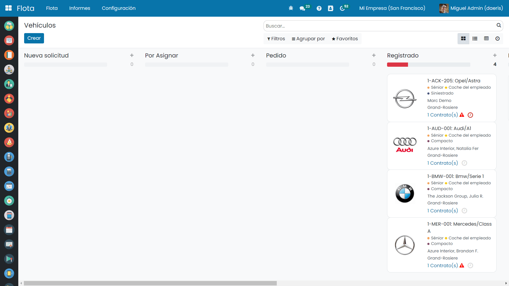

Para crear un nuevo vehículo haz clic sobre el botón *Crear* e informa sobre el formulario los detalles del vehículo.

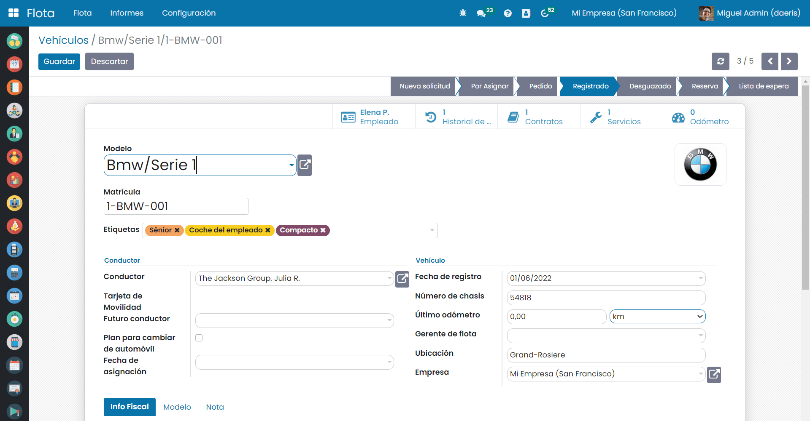

Sobre la pestaña de **Información fiscal** es posible incorporar la información relevante como el precio de compra o los
impuestos fiscales.

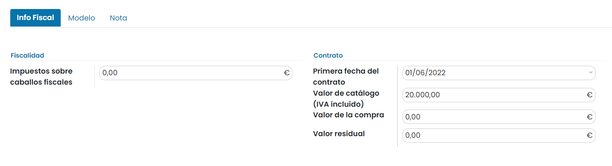

Sobre la pestaña **Modelo** se heredan los valores del vehículo seleccionado. Es posible editar en el caso de existir diferencias.

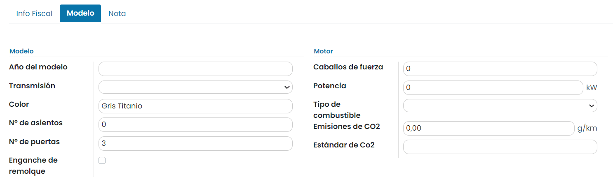

Sobre la pestaña **Notas** es posible incorporar notas adicionales.

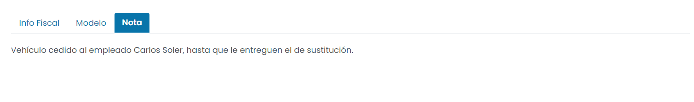

Una vez informados los campos haz clic sobre el botón *Guardar*.

Inicialmente, el vehículo dispone de estado *Registrado*, aunque puede modificarse pulsando el valor del estado deseado.

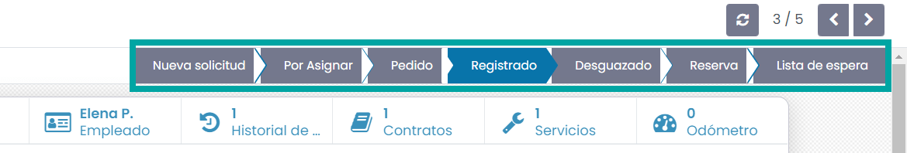

El estado del vehículo sirve para conocer su situación actual que, en función de las necesidades de tu negocio, puede disponer
de distintos valores.

Crear categorías y modelos de vehículos
---------------------------------------
Una categoría de vehículo es un agrupador que permite clasificar modelos de vehículos en base a las necesidades de cada negocio.

Para acceder a las categorías de modelos de vehículos, navega a la pantalla :menuselection:`Flota --> Configuración --> Categorías del modelo`,
desde donde es posible visualizar el listado de categorías disponible.

Para crear una nueva categoría haz clic sobre el botón *Crear* e informa un valor sobre el campo nombre. Posteriormente,
pulsa el botón *Guardar*.

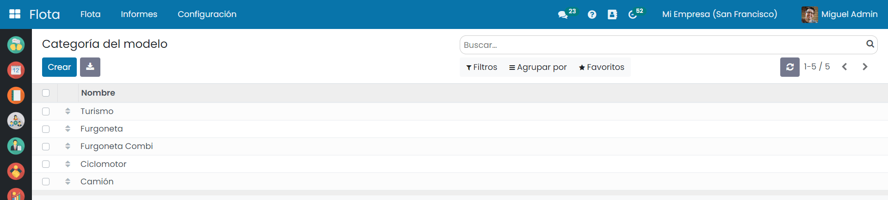

Para acceder a los modelos de vehículos, navega a la pantalla :menuselection:`Flota --> Configuración --> Modelos de vehículos`, desde
donde es posible visualizar el listado de modelos disponible, agrupado por fabricante.

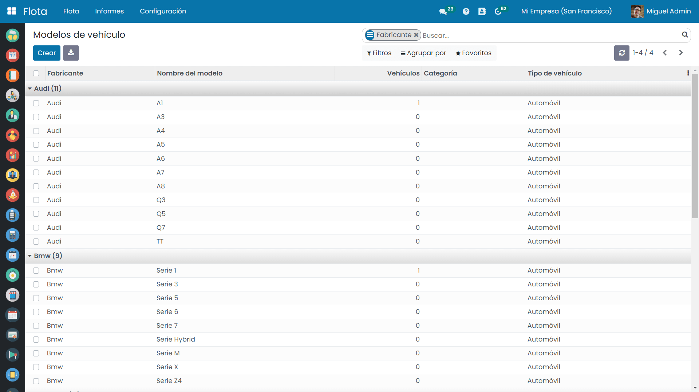

Para agregar un nuevo modelo haz clic sobre el botón *Crear* . Sobre el formulario, informa el nombre del modelo, fabricante,
tipo de vehículo y categoría.

Bajo la pestaña **Información**, podemos registrar los detalles técnicos del vehículo.

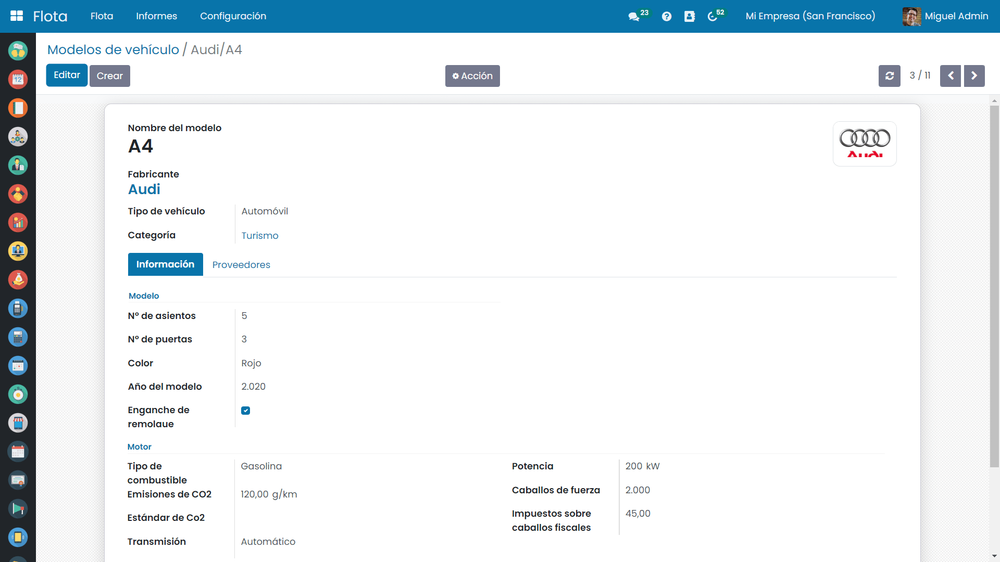

Sobre la pestaña **Proveedores** podemos asociar los proveedores que dan servicio al vehículo, que deben ser añadidos como contacto previamente.
Mediante el botón *Añadir*, se pueden asociar tantos proveedores como se desee.

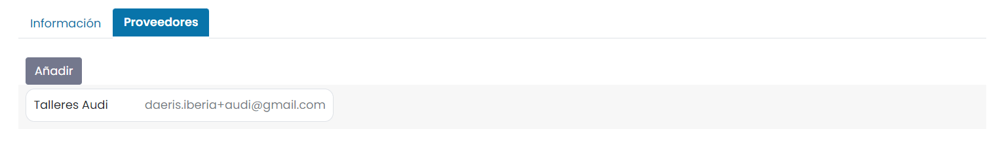

Una vez registrados los datos pulsa el botón *Guardar*.

Registrar fabricantes de vehículos
----------------------------------
Para registrar un nuevo fabricante de vehículos, navega a la pantalla :menuselection:`Flota --> Configuración --> Fabricantes`
, desde donde es posible visualizar el listado de fabricantes disponibles en formato Kanban.

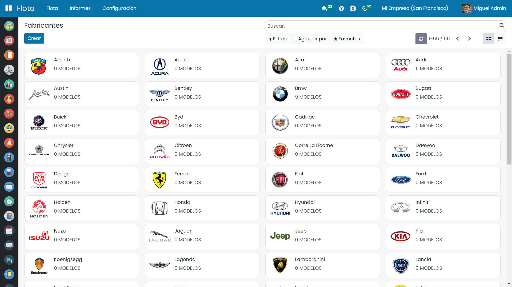

Para crear un nuevo fabricante, haz clic sobre el botón *Crear* e informa el nombre del fabricante, incorporando el logo sobre el
campo de imagen.

Recuerda hacer clic sobre el botón Guardar.

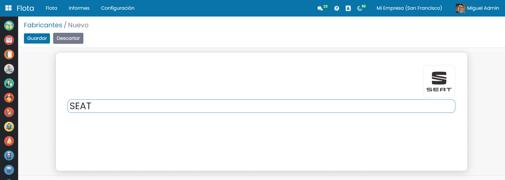

Registrar servicios
=====================

Mediante la aplicación de flota es posible llevar el seguimiento de todos los servicios realizados a tu vehículo.
Los servicios pueden ser de muchos tipos: reparaciones ocasionales, mantenimiento fijo, etc.

Para gestionar los servicios navega a la pantalla :menuselection:`Flota --> Servicios`
, desde donde es posible visualizar todos los servicios realizados.

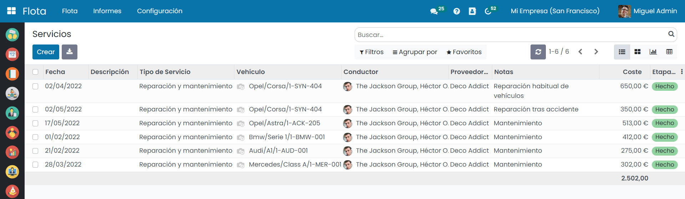

Para crear un nuevo servicio haz clic sobre el botón *Crear* y sobre el formulario, informa los siguientes campos:

-  **Descripción del servicio a realizar**.
-  **Tipo de servicio ofrecido**.
-  **Fecha de ejecución del servicio**.
-  **Coste total del servicio**.
-  **Proveedor**.
-  **Vehículo al que se le realiza el servicio**.
-  **Conductor asociado al vehículo**.
-  **Valor del odómetro en el momento de dejar el vehículo en el taller**.
-  **Notas sobre el servicio ofrecido**.

Recuerda hacer clic sobre el botón *Guardar* para registrar los cambios.

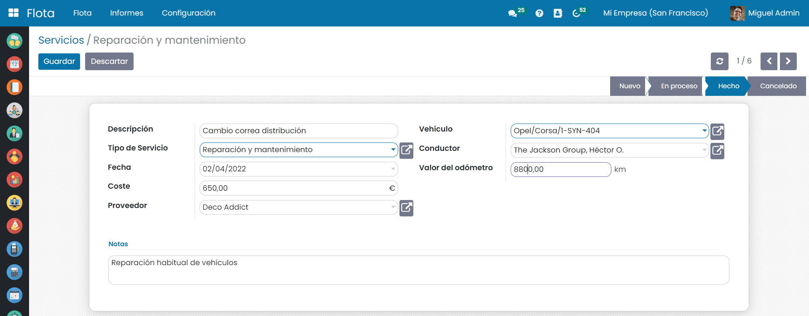

Una vez realizado el servicio, es necesario cambiar el estado del registro a *Hecho* haciendo clic sobre el valor de la barra
de estados.

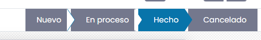

Gestión de contratos
=====================

Gestionar contratos de servicios asociados a vehículos
------------------------------------------------------
La aplicación de flota permite gestionar los contratos (leasing, seguros, etc) con sus servicios y costes relacionados.
Cada contrato puede incluir varios servicios (reparación, seguros, mantenimiento periódico).

Para gestionar los contratos navega a la pantalla :menuselection:`Flota --> Flota --> Contratos`, desde donde es posible
visualizar todos los contratos activos filtrados por el estado *En progreso*.

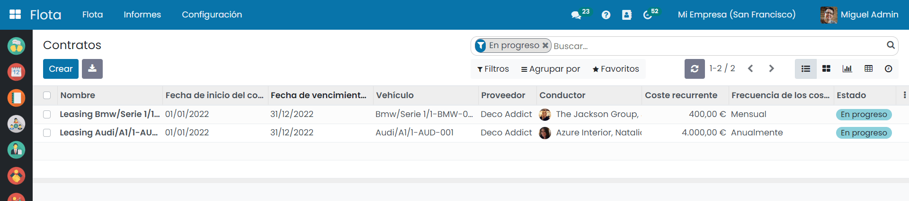

Para dar de alta un nuevo contrato haz clic sobre el botón *Crear* y sobre el formulario informa:

-  **Usuario responsable del contrato a quien se le notificará cuando esté próximo a vencer**.
-  **Tipo de contrato**.
-  **Proveedor que ofrece su servicio**.
-  **Referencia o código de contrato**.
-  **Vehículo asociado el contrato**.
-  **Coste de activación (coste fijo)**.
-  **Coste recurrente**.
-  **Fechas de facturación, inicio y fin de contrato**.

También es posible informar:

-  **Servicios incluidos donde se pueden asociar múltiples opciones**.
-  **Terminos y condiciones del contrato negociado con el proveedor**.

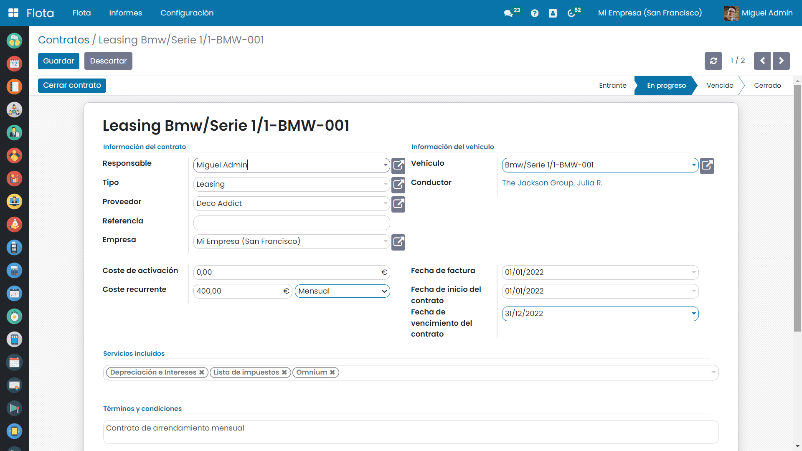

Gestionar alertas de vencimientos de contratos
----------------------------------------------
Con el objetivo de recordar el próximo vencimiento de un contrato en activo, el sistema emite una alerta 30 días antes de su
caducidad.

En el caso de querer modificar este intervalo de días, navega a la pantalla :menuselection:`Flota --> Configuración --> Ajustes`
, desde donde es posible informar el número de días deseado.

Recuerda hacer clic sobre el botón *Guardar* para aplicar los cambios.

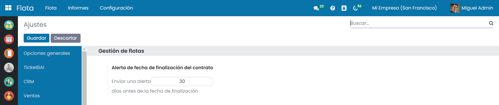

Las alertas se mostrarán al responsable del contrato, cuando el contrato esté **próximo a vencer el numero de días indicado**.

Análisis y registro
=====================

Crear registros de odómetro
---------------------------

La aplicación de flota permite gestionar los odómetros de los vehículos para llevar un control de los kilómetros realizados
sobre el vehículo.

Para gestionar los registros de odómetro navega a la pantalla :menuselection:`Flota --> Flota --> Odómetros`
, desde donde es posible visualizar todos los registros realizados.

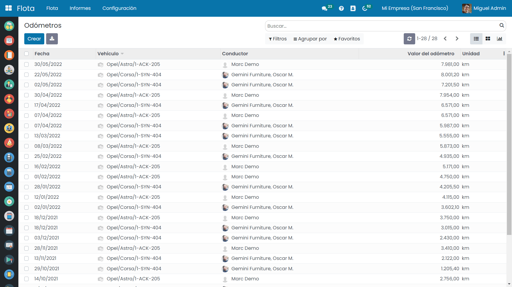

Para crear un nuevo registro de odómetro haz clic sobre el botón *Crear* e informa la fecha, el vehículo, conductor y los
kilómetros realizados.

Recuerda pulsar el botón *Guardar* para registrar los cambios.

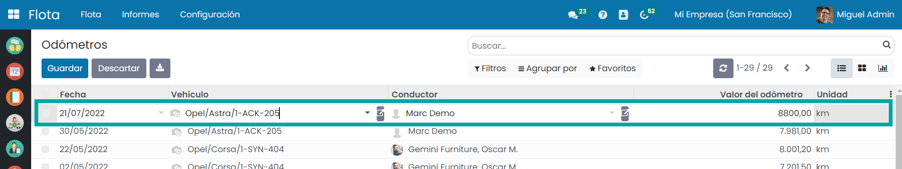

Analizar los costes de la flota
-------------------------------
Para analizar los costes de tu flota navega a la pantalla :menuselection:`Flota --> Informes --> Costes`
, desde donde es posible visualizar todos los costes de tu flota en pantalla gráfica y pivote.

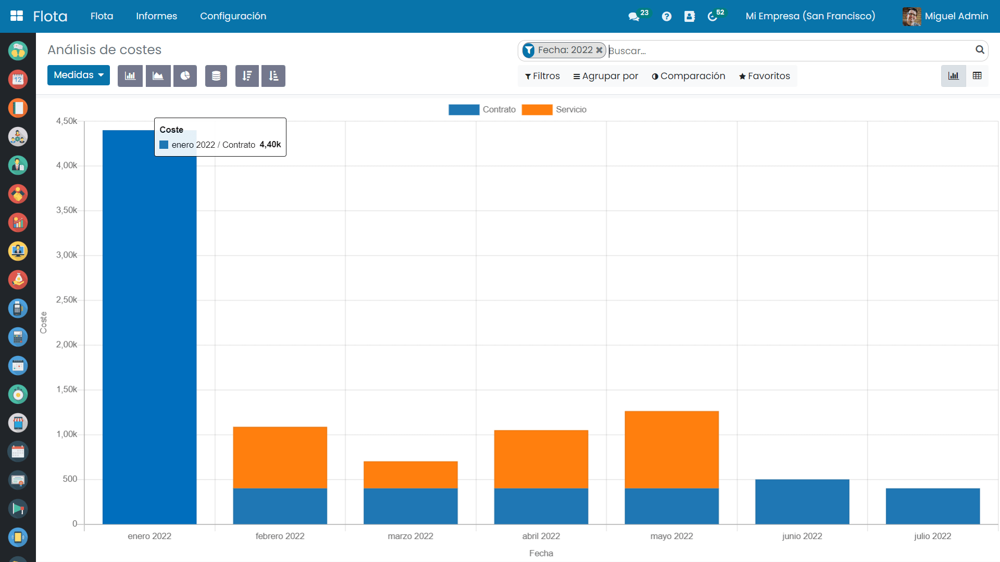

Mediante los paneles de filtrado y agrupación es posible **filtrar** por servicio, contrato y fechas, así como **agrupar** por los
campos más relevantes.

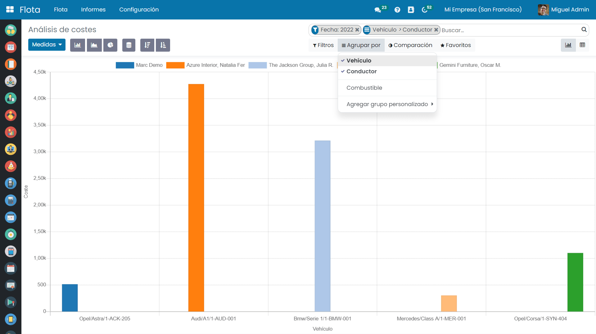