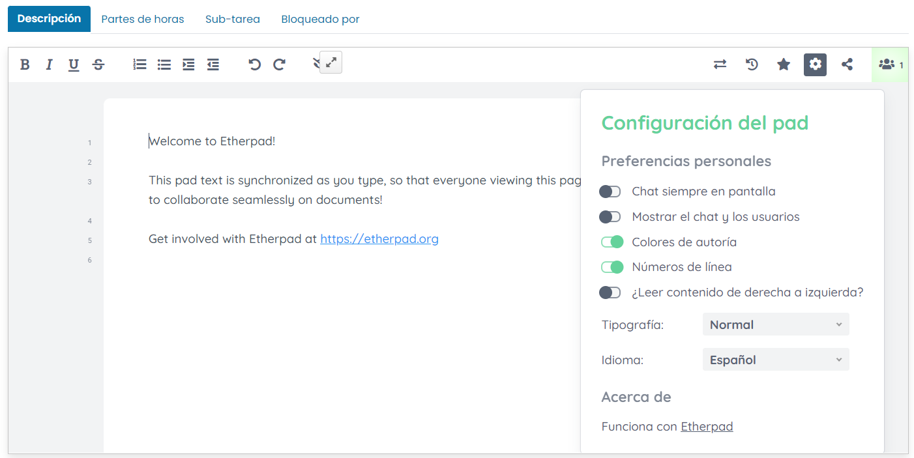
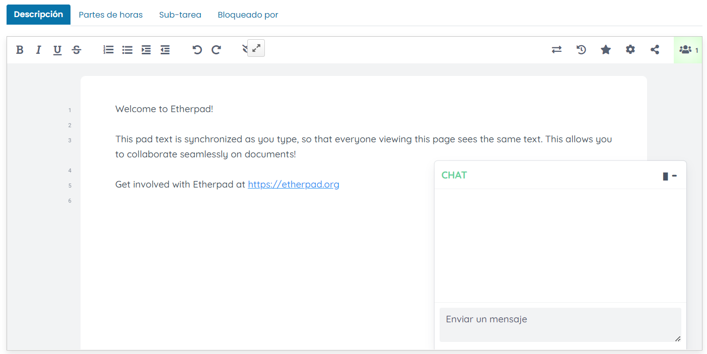
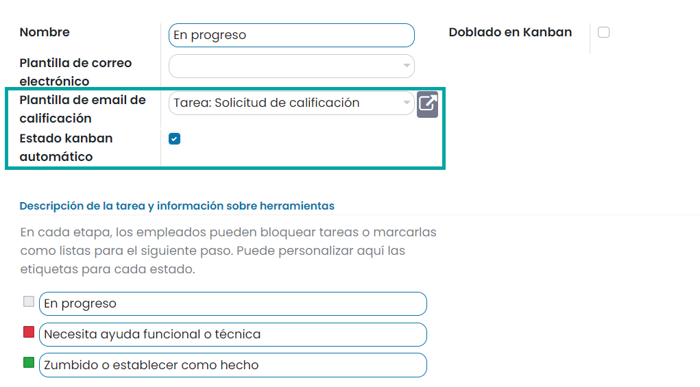

:show-content:

====================
Gestión de Proyectos
====================

En cada empresa habrá diferentes proyectos basados en diferentes operaciones. Cada proyecto tendrá su propia planificación,
organización, análisis y control de las operaciones para alcanzar el resultado final. El objetivo de los proyectos es
siempre alcanzar las metas definidas de la empresa. Puede ser difícil administrar cada proyecto de forma individual y
manual. Con Daeris, puedes ver el progreso de cada proyecto. Daeris te ayuda a administrar, analizar y verificar cada
proyecto de la empresa.

Configuración
=============

.. _servicios/gestion_de_proyecto/utilizar_pads_colaborativos:

Utilizar pads colaborativos en tareas de proyectos
--------------------------------------------------

El módulo de gestión de proyectos ofrece un flujo de trabajo flexible que ayuda a planificar y organizar tareas, analizar
planes de tiempo, asignar tareas para priorizarlas, estructurar proyectos en diferentes facturas y administrar contratos.

Siempre que emprendas cualquier proyecto, encontrarás que un solo proyecto contendrá varias tareas, y la mayoría de estas
tareas serán de trabajo en grupo por naturaleza. Por lo tanto, es esencial proporcionar una plataforma colaborativa en
tiempo real para trabajar en grupo. Los usuarios que contribuyan a un mismo contenido se beneficiarán en gran medida a
través de este tipo de opción.

Para que los usuarios puedan editar la descripción de las tareas de forma colaborativa en tiempo real, navega a la pantalla
:menuselection:`Proyecto --> Configuración --> Ajustes`, y marca la opción de **Pads colaborativos**:

Una vez marcada esta opción, pulsa el botón *Guardar* de la pantalla de Ajustes.

A continuación, se habilitarán dos nuevos campos:

-  **Servidor Pad**: Es el servidor en el que está instalada la instancia de Etherpad.

-  **Clave API Pad**: En este campo se debe informar la clave API de la instancia Etherpad para que sea posible realizar
   la conexión. Dicha clave API se encuentra en el fichero APIKEY.txt de la ruta base en donde se encuentra instalado Etherpad.

Ahora puedes crear un nuevo proyecto o editar un proyecto existente y marcar la opción de **Pads colaborativos** de
la pestaña de *Ajustes* del proyecto:

Una vez marcada la opción, pulsa el botón *Guardar* del formulario del proyecto.

A partir de este momento, al crear una nueva tarea dentro del proyecto o editar una tarea existente, el campo descripción
estará sincronizado con Etherpad, de manera que todos los que vean esta página verán el mismo texto. Esto permite colaborar
sin problemas en documentos compartidos:

Ahora puedes establecer tu propio color y nombre. Después de configurar el color deseado, todo lo que escribas se mostrará
en ese color elegido, lo que facilitará que otros usuarios comprendan su autoría:

.. image:: gestion_de_proyectos/color-etherpad.png
   :align: center
   :alt: Seleccionar color en etherpad

Para compartir este Pad y la fecha de creación en el Pad, Daeris ofrece una opción llamada compartir e incrustar. El enlace
y la URL para insertar se mostrarán de forma predeterminada. La opción de solo lectura restringe el Pad compartido de
cualquier tipo de edición:

Mediante el icono de configuración del Pad es posible configurar aspectos tales como la tipografía, el idioma, etc.:

El icono de línea de tiempo se usa para convertir la escritura en un vídeo. Tiene dos botones para reproducir y pausar el vídeo:

Por otro lado, el icono de importar y exportar se utiliza para importar y exportar los datos en el Pad colaborativo:

Por último, en caso de haber varios usuarios colaborando en el mismo Pad, es posible chatear con ellos mediante
el chat incorporado:

.. seealso::
   * :ref:`productividad/notas/utilizar_pads_colaborativos`

Autogenerar tareas para actividades regulares
---------------------------------------------

A veces, algunas tareas son recurrentes, y es posible que deban repetirse en ciertos intervalos. En dichos proyectos,
puedes habilitar la opción **Tarea recurrente** que te permitirá generar automáticamente tareas para actividades regulares.

Para ello, navega a la pantalla :menuselection:`Proyecto --> Configuración --> Ajustes`, y marca la opción de **Tareas recurrentes**:

Una vez marcada la opción, debes guardar los ajustes mediante el botón *Guardar*.

Ahora puedes crear un nuevo proyecto o editar un proyecto existente y marcar la opción de **Tareas recurrentes** de
la pestaña de *Ajustes* del proyecto:

A partir de ese momento será posible marcar tareas como recurrentes. Para ello, debes navegar al detalle de una tarea
desde la pantalla :menuselection:`Proyecto --> Proyectos`, accediendo al detalle de un proyecto, o desde la
pantalla :menuselection:`Proyecto --> Mis tareas`, en donde están disponibles tus tareas. En el detalle de la tarea,
activa la opción **Recurrente**, que habilitará la pestaña de **Recurrencia**:

En esta pestaña puedes definir cuándo se debe repetir la tarea y hasta cuándo. De acuerdo con los términos de recurrencia
seleccionados, se enumeran las próximas ocurrencias:

Realizar un seguimiento del progreso de los proyectos
-----------------------------------------------------

Para realizar un seguimiento del progreso de los proyectos mediante etapas del proyecto, navega a la pantalla
:menuselection:`Proyecto --> Configuración --> Ajustes`, y marca la opción de **Etapas del proyecto**:

Una vez marcada la opción, debes guardar los ajustes mediante el botón *Guardar*.

A continuación, pulsa el enlace *Configurar etapas*, que navegará al listado de etapas de proyecto, donde es posible
gestionar las etapas y crear nuevas etapas:

A partir de ese momento será posible realizar el seguimiento del progreso de los proyectos mediante etapas. Para ello,
navega a la pantalla :menuselection:`Proyecto --> Proyectos`, donde aparecerán los proyectos agrupados por etapas:

En esta pantalla podrás cambiar los proyectos de una etapa a otra, con la función de arrastrar y soltar.

Si accedes al detalle de un proyecto, también podrás modificar la etapa del proyecto mediante el flujo de estados:

Utilizar sub-tareas en los proyectos
------------------------------------

Es posible dividir las tareas de los proyectos en sub-tareas, para organizar el trabajo en objetivos menores. Para activar
esta funcionalidad, debes navegar a la pantalla :menuselection:`Proyecto --> Configuración --> Ajustes`, y activar la
opción **Sub-tarea**:

Una vez marcada la opción, debes guardar los ajustes mediante el botón *Guardar*.

Ahora puedes crear un nuevo proyecto o editar un proyecto existente y marcar la opción de **Sub-tarea** de
la pestaña de *Ajustes* del proyecto:

A partir de ese momento será posible asociar sub-tareas a una tarea existente. Para ello, debes navegar al detalle
de una tarea desde la pantalla :menuselection:`Proyecto --> Proyectos`, accediendo al detalle de un proyecto, o desde la
pantalla :menuselection:`Proyecto --> Mis tareas`, en donde están disponibles tus tareas. En la pestaña *Sub-tarea*,
dispones de un listado en donde puedes agregar sub-tareas a la tarea actual:

Al pulsar el enlace *Agregar línea*, será posible añadir el título, responsable, fecha límite y etapa de la sub-tarea:

Mediante el enlace *Ver tarea* del listado de sub-tareas, el sistema navegará al detalle de la tarea hija. En la tarea
hija aparece un botón inteligente que indica que la tarea dispone de una tarea padre:

Determinar el orden en el que se realizarán las tareas
------------------------------------------------------

Es posible determinar el orden en el que se realizarán las tareas estableciendo dependencias entre tareas. Para ello,
navega a la pantalla :menuselection:`Proyecto --> Configuración --> Ajustes`, y activa la opción **Dependencias de tareas**:

Una vez marcada la opción, debes guardar los ajustes mediante el botón *Guardar*.

Ahora puedes crear un nuevo proyecto o editar un proyecto existente y marcar la opción de **Dependencias de tareas** de
la pestaña de *Ajustes* del proyecto:

A partir de ese momento será posible establecer dependencias en una tarea existente. Para ello, debes navegar al detalle
de una tarea desde la pantalla :menuselection:`Proyecto --> Proyectos`, accediendo al detalle de un proyecto, o desde la
pantalla :menuselection:`Proyecto --> Mis tareas`, en donde están disponibles tus tareas. En la pestaña *Bloqueado por*,
dispones de un listado en donde puedes agregar dependencias a la tarea actual:

Al pulsar el enlace *Agregar línea*, será posible añadir el título, responsable, fecha límite y etapa de la dependencia:

Mediante el enlace *Ver tarea* del listado de dependencias, el sistema navegará al detalle de la tarea dependiente. En la
tarea dependiente aparece un botón inteligente que indica que la tarea dispone de una tarea bloqueante:

Hacer seguimiento del tiempo empleado en proyectos y tareas
-----------------------------------------------------------

Para hacer un seguimiento del tiempo empleado en proyectos y tareas, navega al detalle de un proyecto desde la pantalla
:menuselection:`Proyecto --> Configuración --> Proyectos`, y desde la pestaña **Ajustes**, activa la opción **Partes de horas**:

Una vez marcada la opción, debes guardar los ajustes mediante el botón *Guardar*.

A partir de ese momento será posible establecer partes de horas en una tarea existente. Para ello, debes navegar al detalle
de una tarea desde la pantalla :menuselection:`Proyecto --> Proyectos`, accediendo al detalle de un proyecto, o desde la
pantalla :menuselection:`Proyecto --> Mis tareas`, en donde están disponibles tus tareas. En la pestaña *Partes de horas*,
dispones de un listado en donde puedes informar las horas planificadas y agregar partes de horas a la tarea actual:

Al final del listado hay un resumen del total de horas dedicadas y de las horas restantes:

.. seealso::
   * :doc:`partes_de_horas`

Realizar un seguimiento de los costes e ingresos vinculados a los proyectos
---------------------------------------------------------------------------

Es posible realizar un seguimiento de los costes e ingresos vinculados a los proyectos. Para ello, navega a la
pantalla :menuselection:`Proyecto --> Configuración --> Ajustes`, y activa la opción **Rentabilidad**:

Una vez marcada la opción, debes guardar los ajustes mediante el botón *Guardar*.

A partir de ese momento será posible realizar un seguimiento de los costes e ingresos vinculados a los proyectos. Para
ello, debes navegar al detalle de un proyecto desde la pantalla :menuselection:`Proyecto --> Proyectos`, en donde estará
disponible un botón inteligente que mostrará el margen bruto del proyecto:

Al pulsar sobre el botón, el sistema mostrará un listado con todas las líneas analíticas asociadas al proyecto:

Desde la pestaña de **Ajustes** del proyecto, también será posible informar la cuenta analítica asociada al mismo:

Seguir la satisfacción de los clientes en tareas
------------------------------------------------

Es posible obtener calificaciones de los clientes acerca de las tareas llevadas a cabo en los proyectos, con el objetivo
de evaluar el rendimiento de tus equipos. Para activar esta funcionalidad, debes navegar a la pantalla
:menuselection:`Proyecto --> Configuración --> Ajustes`, y activar la opción **Calificación de clientes**:

Una vez marcada la opción, debes guardar los ajustes mediante el botón *Guardar*.

A continuación, debes navegar a la pantalla :menuselection:`Proyecto --> Configuración --> Proyectos` y acceder al detalle
del proyecto para el que quieras recibir calificación. En la pestaña de **Ajustes** del proyecto, debes informar el apartado
de **Calificación de clientes**:

Las opciones disponibles son las siguientes:

-  **Valoración al cambiar de estado**: Se enviará un correo electrónico de calificación cada vez que una tarea cambie de
   fase.

-  **Calificación periódica**: Se enviará un correo electrónico de forma periódica (diaria, semanal, dos veces al mes,
   mensual, trimestral, anual).

El siguiente paso consiste en seleccionar una plantilla de correo, que será la que se utilice a la hora de realizar el
envío a los clientes. Para ello, pulsa el enlace *Establecer una plantilla de correo electrónico de calificación en las etapas*,
y navega al detalle de la etapa que quieras configurar:

.. image:: gestion_de_proyectos/etapas-proyectos.png
   :align: center
   :alt: Listado de etapas de los proyectos

Debes informar los campos relacionados con la calificación de los clientes:

-  **Plantilla de email de calificación**: Si la configuración del proyecto es *Valoración al cambiar de estado*, se
   utilizará esta plantilla para enviar un correo al cliente cuando una tarea alcance este estado.

-  **Estado kanban automático**: Si se marca esta opción, se modifica automáticamente el estado de la tarea ante la
   calificación del cliente:

   -  Una buena calificación actualiza el estado de la tarea a *Listo para la siguiente etapa* (viñeta verde).

   -  Una calificación mala o media actualiza el estado de la tarea a *Bloqueado* (viñeta roja).

Por último, debes informar el cliente del que quieres recibir la calificación. Para ello, debes navegar al detalle de la
tarea e informar el cliente que quieres que reciba las notificaciones:

A partir de ese momento, se enviará un correo de forma automática al cliente para que califique la tarea. El envío del
correo se llevará a cabo de forma periódica, o bien cuando la tarea cambie de etapa, en función de la configuración del
proyecto. El cliente podrá entonces calificar la tarea pulsando uno de los iconos del correo:

Al pulsar uno de los iconos, se abrirá una ventana del explorador, en donde el cliente podrá enviar comentarios adicionales:

Tras enviar los comentarios, el cliente recibirá un mensaje de agradecimiento:

La calificación quedará asociada a la tarea en cuestión, y se podrá consultar desde el detalle de la tarea:

También será posible consultar el grado de satisfacción de los proyectos desde el kanban de proyectos:

Configurar las categorías de los proyectos
------------------------------------------

Daeris te permite crear etiquetas y, con la ayuda de las etiquetas, puedes encontrar fácilmente las tareas relacionadas.
En el módulo *Proyecto*, puedes crear etiquetas, que se pueden agregar a las tareas mientras las crea. Al adjuntar las
etiquetas a las tareas, es más fácil recuperar cada tarea con las mismas etiquetas con un simple clic.

Para configurar estas etiquetas, navega a la pantalla :menuselection:`Proyecto --> Configuración --> Categorías`. Se
muestra la lista de etiquetas existentes junto con los colores asignados:

Puedes crear nuevas etiquetas pulsando el botón *Crear*. Aparecerá una nueva fila donde tendrás que introducir el nombre
de la nueva etiqueta y también seleccionar un color para la etiqueta. Después de agregar estos dos datos, presiona el
botón *Guardar*:

Configurar los tipos de actividad de los proyectos
--------------------------------------------------

Puedes asignar diferentes actividades a diferentes proyectos. Con la ayuda de esto, puedes permitir que el usuario inicie
la planificación grupal y los aspectos de trabajo en equipo del proyecto para su finalización efectiva.

Puedes configurar estas actividades desde la pantalla :menuselection:`Proyecto --> Configuración --> Tipos de actividad`.
La lista de tipos de actividad se mostrará junto con su *Resumen predeterminado*, *Planificado en* y el *Tipo*.

Al seleccionar el tipo de actividad de la lista, puedes ver más detalles, como la acción que se llevará a cabo para el tipo
de actividad mencionado, la actividad sugerida y mucho más:

Puedes crear nuevos tipos de actividad en la lista. Para agregar nuevos tipos de actividad, pulsa el botón *Crear*. En
la página del formulario que se muestra, introduce los siguientes detalles:

-  **Nombre**: Introduce el nombre de la actividad en el campo dado.

-  **Acción**: Selecciona la acción que se debe realizar. Estas acciones activarán un comportamiento específico, como
   abrir una vista de calendario o marcar automáticamente como terminado cuando se cargue un documento.

-  **Usuario predeterminado**: Selecciona el usuario predeterminado en el menú desplegable.

-  **Resumen predeterminado**: Introduce un breve resumen de la actividad en el campo provisto.

-  **Tipo de encadenamiento**: Puedes elegir *Sugerir la siguiente actividad* o *Activar la siguiente actividad* como tipo
   de encadenamiento.

-  **Sugerir**: En este campo puedes sugerir una actividad que debe realizarse una vez que la actividad actual se marca
   como realizada.

-  **Plantillas de correo electrónico**: Selecciona una plantilla de correo electrónico que se enviará para la próxima actividad.

-  **Planificación**: Esteblece el número de días/semanas/meses antes de ejecutar la acción. Te permite planificar el
   plazo de acción.

-  **Nota por defecto**: Puedes agregar cualquier nota relacionada con la actividad en el espacio provisto.

Después de ingresar todos los detalles, presiona el botón *Guardar*.

Proyectos
=========

.. _servicios/gestion_de_proyecto/crear_un_proyecto:

Crear un proyecto
-----------------

Para crear un proyecto, debes navegar a la pantalla :menuselection:`Proyecto --> Proyectos`, y hacer clic en el botón *Crear*.
Al crear un nuevo proyecto el sistema mostrará un formulario en donde introducir la siguiente información:

-  **Nombre del proyecto**

-  **Facturable**: Marca esta opción si el proyecto es facturable.

-  **Partes de horas**: Marca esta opción si se deben poder informar partes de horas en el proyecto.

-  **Cree tareas enviando un correo electrónico a**: Mediante este campo es posible crear un nuevo alias que permita
   crear nuevas tareas asociadas al proyecto ante la recepción de un nuevo correo.

Una vez informados los campos necesarios, debes hacer clic en el botón *Crear*. La aplicación navega entonces a la pantalla
de gestión de las tareas del proyecto:

Desde esta pantalla puedes crear las etapas del proyecto, y dentro de cada una de las etapas, puedes añadir las tareas
correspondientes.

Para crear una etapa, debes informar el nombre de la etapa y pulsar el botón *Añadir*:

Una vez tienes creada la etapa, puedes añadir tareas haciendo clic en el botón *Crear* o en el icono **+** situado al
lado del nombre de la etapa:

Una vez completados los campos necesarios, debes pulsar el botón *Añadir*. La tarea quedará registrada en la etapa de
proyecto correspondiente:

Deberás completar estos mismos pasos para el resto de etapas y tareas que deba contener tu proyecto.

Crear actualizaciones del proyecto
----------------------------------

El módulo **Proyecto** de Daeris dispone de una función que te permitirá evaluar el estado del proyecto. Mientras configuras
el proyecto, puedes introducir el estado actual del proyecto. Este estado se puede cambiar de vez en cuando. Puedes ver
la actualización del proyecto actual al verificar el estado ubicado junto al título del proyecto. Si el estado no está
establecido, puedes establecerlo tu mismo de acuerdo con el progreso del proyecto. Este estado puede ser *En seguimiento*,
*En riesgo*, *Fuera de seguimiento* o *En espera*. Estos estados están marcados con diferentes colores que facilitan la
comprensión del estado. La función de estado del proyecto ayuda a obtener una instantánea del estado del proyecto y
también permite compartir este progreso con las partes interesadas:

Al pulsar el botón de estado del proyecto, el sistema navegará a la página de *Actualizaciones del proyecto*, donde puedes
comenzar a crear nuevas actualizaciones. Al mismo tiempo, los detalles sobre las ventas, el pronóstico de rentabilidad y
los hitos se muestran en el lado derecho.

Haz clic en el botón *Crear* para comenzar a crear una nueva actualización del proyecto. En la página que se muestra,
introduce los detalles de las actualizaciones, como el título de la actualización, el estado, el porcentaje de progreso,
el autor, es decir, quién está grabando la actualización, y la fecha en que se realizó la actualización. Se pueden
mencionar más detalles de la actualización en la pestaña *Descripción*:

En la pestaña de *Descripción*, puedes introducir una breve descripción del resumen del proyecto y cómo va en el menú
*Resumen del Sprint*. Al observar el resumen del sprint, las partes interesadas pueden obtener una visión clara del
progreso del proyecto y pueden evaluar fácilmente el informe:

Después de agregar toda la información requerida, pulsa el botón *Guardar*.

Desde la página de *Actualizaciones del proyecto*, puedes ver la cantidad total de tareas que se incluyen en el proyecto
en particular, el pronóstico de horas, la hoja de tiempo y la planificación, el presupuesto, los colaboradores, las horas
registradas, el gráfico de evolución, el tiempo facturable y el margen bruto. También puedes establecer hitos en el proyecto:

Los hitos son objetivos que creas al establecer una fecha límite para una tarea. Esto ayudará a comprender el ritmo de la
tarea asignada. Puedes crear un nuevo hito seleccionando la opción *Añadir objetivo*. En la ventana que se muestra,
introduce el nombre del nuevo hito junto con la fecha límite para lograr el hito. Una vez que hayas alcanzado el hito,
puedes marcar la opción *Solucionado*. Se pueden crear múltiples hitos en cada proyecto:

.. image:: gestion_de_proyectos/crear-hito.png
   :align: center
   :alt: Crear hito en el proyecto

Compartir un proyecto
---------------------

Desde la pantalla :menuselection:`Proyecto --> Proyectos`, puedes compartir un proyecto haciendo clic en el menú
desplegable del proyecto:

El sistema genera una URL, y permite realizar un envío de correo a una serie de destinatarios, con los que queda
compartido el proyecto:

.. important::
   Para que se permita compartir un proyecto, se debe editar el proyecto y marcar la opción de visbilidad adecuada en
   cada caso para seleccionar los usuarios que tendrán visibilidad del proyecto.

También es posible compartir un proyecto desde el detalle del mismo, mediante los botones ubicados en la cabecera del
formulario de detalle del proyecto:

Tareas
======

Crear tareas de un proyecto
---------------------------

Manualmente
~~~~~~~~~~~

Para crear tareas de un proyecto de forma manual, navega al detalle de un proyecto desde la pantalla
:menuselection:`Proyecto --> Proyectos`. Una vez tienes creada la etapa, puedes añadir tareas haciendo clic en el botón
*Crear* o en el icono **+** situado al lado del nombre de la etapa:

Una vez completados los campos necesarios, debes pulsar el botón *Añadir*. La tarea quedará registrada en la etapa de
proyecto correspondiente:

Por correo electrónico
~~~~~~~~~~~~~~~~~~~~~~

Al crear un nuevo proyecto, el sistema permite informar un alias de correo electrónico que permite crear nuevas tareas
asociadas al proyecto ante la recepción de un nuevo correo. También es posible informar el alias una vez creado el
proyecto, desde la pestaña de **Ajustes** del detalle del proyecto:

Mediante el campo *Aceptar los correos electrónicos de*, se puede definir el grupo de personas de las cuáles se aceptarán
correos electrónicos en el alias definido. Las opciones disponibles son las siguientes:

-  **Todos**: Todos los remitentes son aceptados.

-  **Empresas autenticadas**: Solo son aceptadas direcciones de correo asociadas a empresas dadas de alta en el sistema.

-  **Sólo seguidores**: Solo son aceptadas direcciones de correo asociadas a los seguidores del proyecto.

-  **Empleados autenticados**: Solo son aceptadas direcciones de correo asociadas a empleados dados de alta en el sistema.

Una vez configurado el alias de correo del proyecto, cuando se envíe un correo a ese alias, el sistema creará una tarea
asociada al proyecto, cuyo título de la tarea se corresponderá con el asunto del correo.

.. seealso::
   * :doc:`../varios/correo_electronico/recibir_correos`

Gestionar las tareas de los proyectos
-------------------------------------

Las tareas de los proyectos se pueden gestionar desde la pantalla :menuselection:`Proyecto --> Proyectos`, accediendo al
detalle de un proyecto, o desde la pantalla :menuselection:`Proyecto --> Mis tareas`, en donde están disponibles tus tareas.

Una vez creada una tarea, tienes varias opciones disponibles:

-  Mediante el icono de estrella, tienes la opción de marcar la tarea como favorita.

   .. image:: gestion_de_proyectos/tarea-favorita.png
      :align: center
      :alt: Marcar tarea como favorita

-  Mediante el icono de reloj, tienes la opción de planificar una actividad para la tarea.

   .. image:: gestion_de_proyectos/planificar-actividad.png
      :align: center
      :alt: Planificar actividad en una tarea

-  Mediante el recuadro puedes indicar cuando una tarea se encuentra completada y lista para la siguiente etapa (verde),
   cuando se encuentra bloqueada (rojo) y cuando se encuentra en proceso (gris).

   .. image:: gestion_de_proyectos/estado-tareas.png
      :align: center
      :alt: Estado de las tareas

Dentro del menú desplegable de la tarea, también dispones de varias opciones:

-  En primer lugar, puedes establecer una imagen de portada de la tarea.

   .. image:: gestion_de_proyectos/imagen-portada.png
      :align: center
      :alt: Imagen de portada de la tarea

   Al establecer una imagen de portada el sistema permite subir y configurar una imagen.

   .. image:: gestion_de_proyectos/imagen-portada-2.png
      :align: center
      :alt: Imagen de portada de la tarea (2)

   Una vez seleccionada la imagen, aparece como imagen de portada de la tarea.

   .. image:: gestion_de_proyectos/imagen-portada-3.png
      :align: center
      :alt: Imagen de portada de la tarea (3)

-  Por otro lado, también puedes compartir la tarea con alguno de los contactos de la aplicación, mediante el envío de
   un correo electrónico que contiene un enlace a la tarea.

   .. image:: gestion_de_proyectos/compartir-tarea.png
      :align: center
      :alt: Compartir tarea de un proyecto

   El sistema genera una URL, y permite realizar un envío de correo a una serie de destinatarios, con los que queda
   compartida la tarea.

   .. image:: gestion_de_proyectos/compartir-tarea-2.png
      :align: center
      :alt: Compartir tarea de un proyecto (2)

-  Mediante la opción de editar tarea puedes editar los datos de la tarea desde la vista de formulario.

   .. image:: gestion_de_proyectos/editar-tarea.png
      :align: center
      :alt: Editar tarea de un proyecto

   Desde este formulario, puedes modificar todos los datos de la tarea.

   .. image:: gestion_de_proyectos/editar-tarea-2.png
      :align: center
      :alt: Editar tarea de un proyecto (2)

-  Por último, puedes establecer un color para la tarea, que la hará más vistosa y te permitirá establecer una
   categorización en función de los colores.

   .. image:: gestion_de_proyectos/color-tarea.png
      :align: center
      :alt: Editar color de tarea de un proyecto

Informes
========

Obtener un análisis de tareas de los proyectos
----------------------------------------------

Para generar y ver el informe de tareas de los proyectos, navega a la pantalla :menuselection:`Proyecto --> Informes --> Análisis tareas`.
Se muestra la representación gráfica de cada proyecto en función de sus etapas:

Puedes agregar más medidas como *Días hasta la fecha límite*, *Horas reales*, *Horas planeadas*, *En proceso*, *Horas restantes*,
*Días hábiles para asignar*, *Días hábiles para cerrar*, *Horas de trabajo a asignar* y *Horas de trabajo para cerrar*:

Con la función de filtrado, puedes elegir las áreas en las que se debe mostrar el informe. Estos filtros son *Mis proyectos*,
*Proyectos de mi equipo*, *Mis tareas*, *Tareas de mi equipo*, *Destacado*, *Tareas tardías*, *Tiempo extra de las tareas*,
*Tareas no asignadas*, *Tareas abiertas*, *Fecha límite*, *Fecha de asignación* y *Última actualización de la etapa*:

El informe se puede agrupar según el proyecto, la etapa, los encargados, el cliente y la fecha límite:

El informe se puede ver en la vista de tipo gráfico y pivote:

.. seealso::
   * :ref:`productividad/informes/analizar_datos`