:show-content:

==============
Parte de Horas
==============

La gestión del tiempo es un elemento crucial en cualquier tipo de negocio. El sistema Daeris ofrece varios módulos para
simplificar las tareas relacionadas con las operaciones de la empresa y administrar de manera efectiva el valioso tiempo
de los empleados. Es muy importante realizar un seguimiento y llevar un registro del tiempo que dedican los empleados a
las tareas asignadas. Registrar el tiempo necesario para completar una tarea asignada ayudará a la empresa a garantizar
la precisión al facturar el tiempo facturable a los clientes. El módulo **Parte de Horas** actuará como un sistema de
gestión de tiempo eficiente que rastreará el tiempo exacto que los empleados dedican a los proyectos, clientes, reuniones,
etc. Las funcionalidades de este módulo se pueden integrar con Proyecto, Empleados y otros módulos de RRHH.

.. seealso::
   * :doc:`../ventas/ventas/metodo_facturacion/factura_prepago`
   * :doc:`../ventas/ventas/metodo_facturacion/tiempo_materiales`
   * :doc:`../ventas/ventas/metodo_facturacion/facturar_objetivos`

Configuración
=============

.. _servicios/partes_de_horas/unidad_codificacion:

Configurar la unidad de codificación de los partes de horas
-----------------------------------------------------------

Para configurar la unidad de codificación de los partes de horas, navega a la pantalla :menuselection:`Partes de horas --> Configuración`.
En la sección **Codificación de tiempo**, dispones de la **Unidad de codificación** para definir la unidad de tiempo
utilizada para registrar los partes de horas:

.. image:: partes_de_horas/unidad-codificacion.png
   :align: center
   :alt: Unidad de codificación de los partes de horas

Las opciones disponibles son *Horas* o *Días*. Una vez seleccionada la opción correspondiente, pulsa el botón *Guardar*
de la pantalla de ajustes.

.. _servicios/partes_de_horas/ausencias:

Generar partes de horas tras la validación de las ausencias
-----------------------------------------------------------

Daeris permite registrar automáticamente las horas trabajadas en proyectos / tareas cuando se solicita tiempo libre. Esto
permite un mejor control general sobre la validación de los partes de horas, ya que no deja lugar para el olvido y las
preguntas sobre ausencias que no han sido registradas por el empleado.

Para activar esta función, navega a la pantalla :menuselection:`Partes de horas --> Configuración` y marca la opción
**Ausencias**:

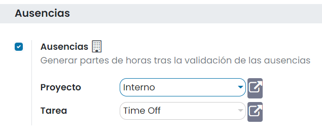

Una vez activada la opción, cambia el proyecto y tarea seleccionados por defecto, si así lo deseas. Tras hacer esto,
pulsa el botón *Guardar* de la pantalla de ajustes.

A continuación, navega a la pantalla :menuselection:`Ausencias --> Configuración --> Tipos de ausencia`. Selecciona o crea
el tipo necesario y decide si deseas que las solicitudes se validen o no:

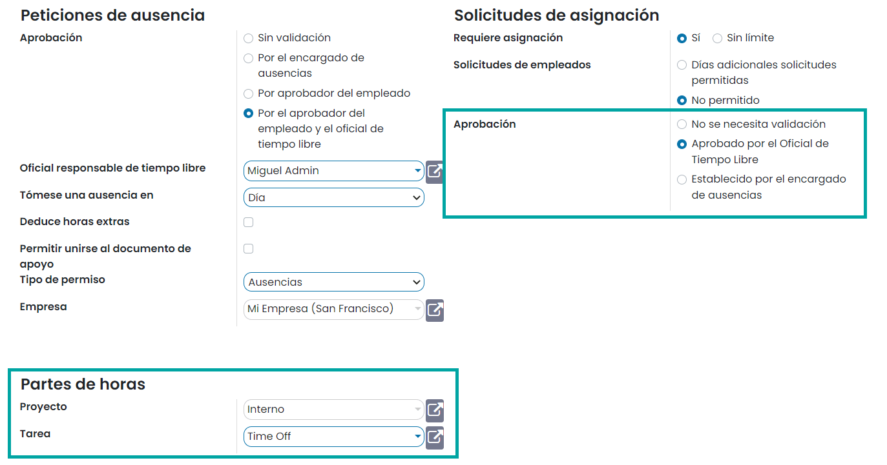

Ahora, una vez que el empleado ha solicitado su tiempo libre y la solicitud ha sido validada (o no, según la configuración
elegida), el tiempo se asigna automáticamente en *Partes de Horas*, bajo el respectivo proyecto y tarea.

En el siguiente ejemplo, el usuario solicitó una ausencia pagada del 8 al 28 de agosto:

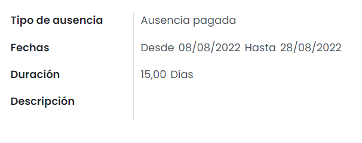

Teniendo en cuenta que se requiere validación para ese tipo de ausencia, el tiempo se asigna automáticamente después de
que la persona responsable de la validación lo haga. Si la validación no es necesaria, el tiempo libre solicitado se
muestra automáticamente en *Partes de Horas*:

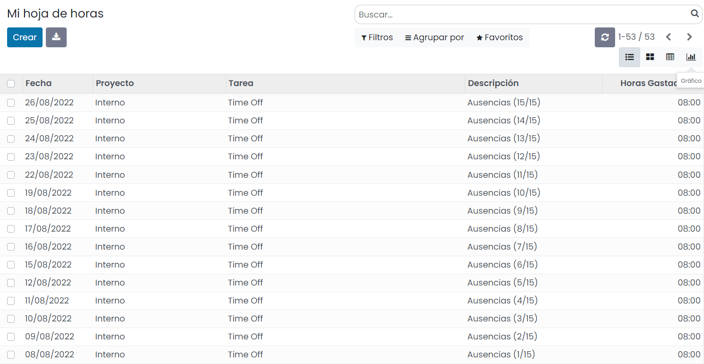

.. seealso::
   * :doc:`../recursos_humanos/ausencias`

Gestión básica
==============

Crear un parte de horas
-----------------------

Para crear un parte de horas navega a la pantalla :menuselection:`Partes de horas --> Partes de horas --> Mi hoja de horas`,
y pulsa el botón *Crear*:

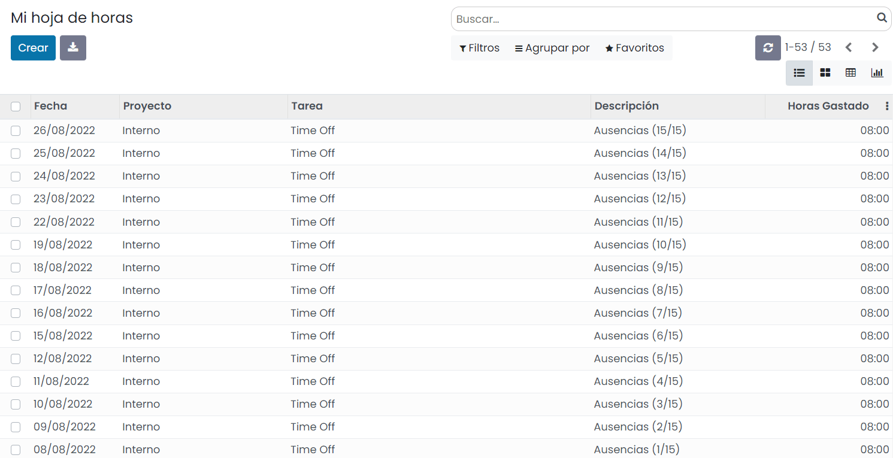

Al crear un nuevo registro, el sistema permite informar los siguientes campos sobre el mismo listado:

-  **Fecha**: Fecha en la que se realizó la tarea.

-  **Proyecto**: Proyecto relacionado con la tarea realizada.

-  **Tarea**: Tarea realizada.

-  **Descripción**: Descripción de la tarea realizada.

-  **Duración**: Duración de la tarea en horas o días, en función de la configuración.

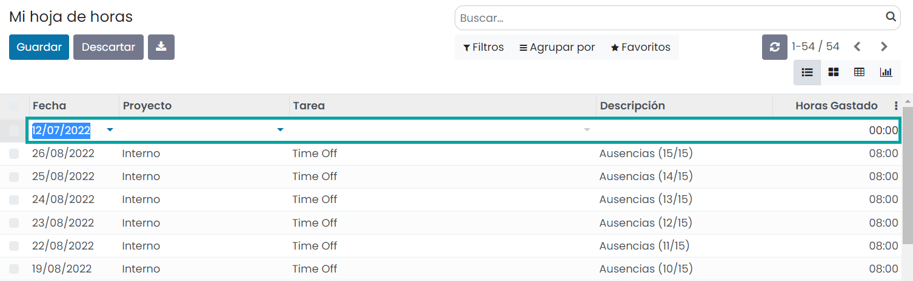

Una vez completados los campos necesarios, pulsa el botón *Guardar*.

Consultar todos los partes de horas
-----------------------------------

Para consultar todos los partes de horas, navega a la pantalla :menuselection:`Partes de horas --> Partes de horas --> Todos los partes de horas`:

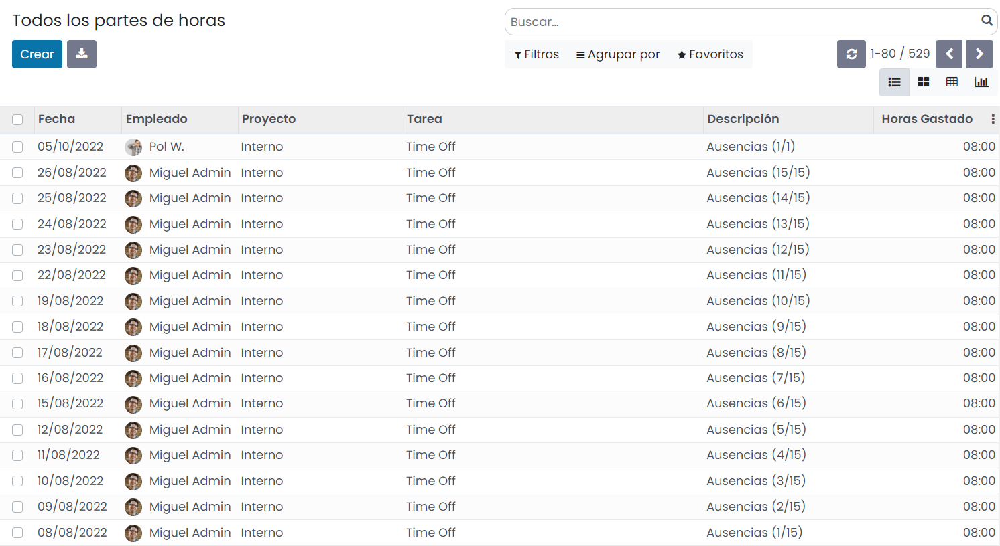

En el listado se podrán consultar todos los partes de horas de los empleados.

Al seleccionar uno o varios registros, se podrá imprimir el detalle de los partes de horas mediante la opción
del menú :menuselection:`Imprimir --> Entradas en la hoja de horas`:

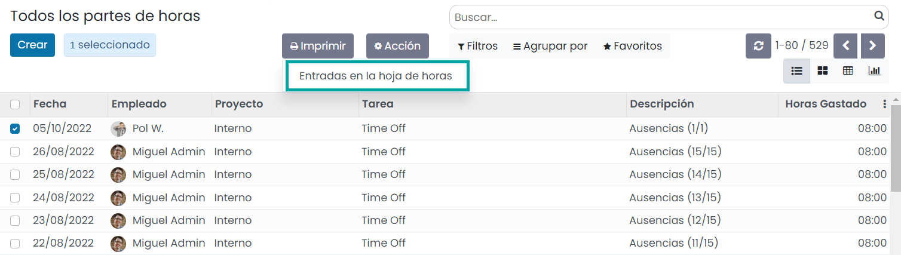

El sistema generará un fichero en formato PDF con la información de detalle de los partes de horas seleccionados:

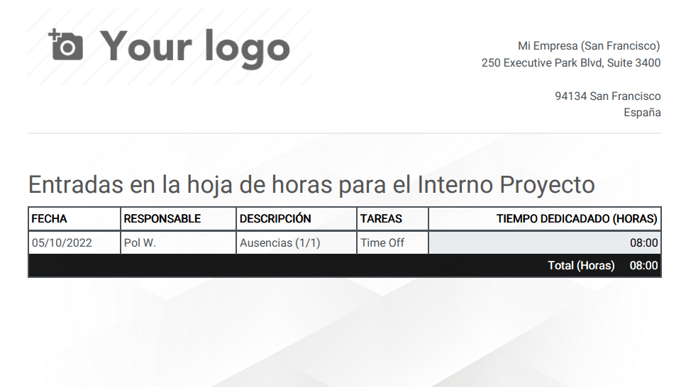

Registrar las horas de un servicio
----------------------------------

Cuando un empleado preste un servicio, podrá registrar las horas, siempre que disponga de una tarea asignada. Para ello,
el empleado debe navegar a la pantalla :menuselection:`Proyecto --> Mis tareas`, y acceder al detalle de la tarea. Desde
la pestaña **Partes de horas** será posible registrar las horas dedicadas a la tarea:

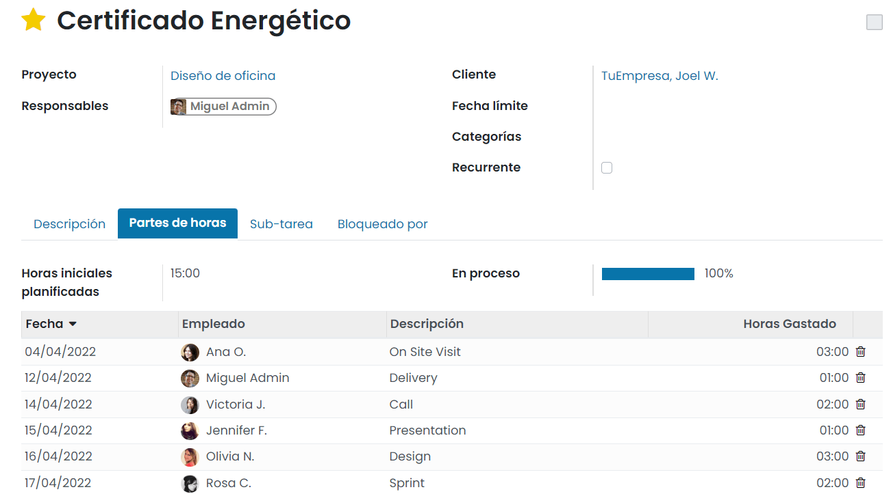

Desde esta pestaña se puede observar el porcentaje de progreso de la tarea, así como las horas restantes:

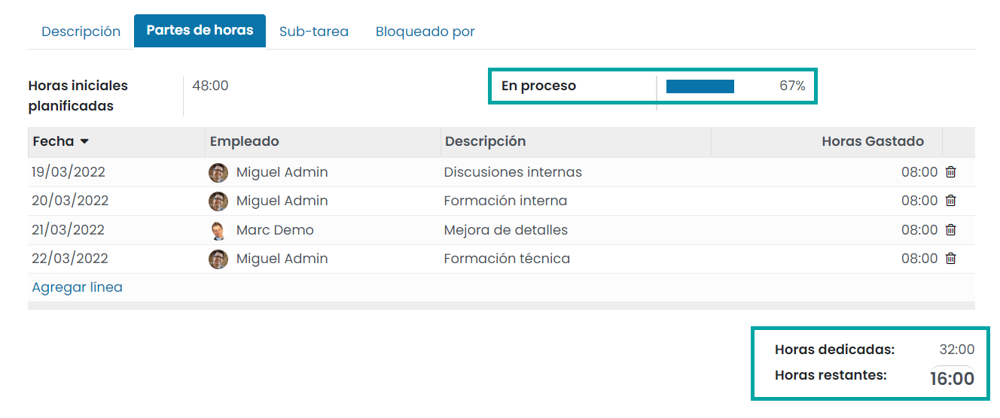

Una vez informado el parte de horas, cuando se haya completado la tarea, el empleado podrá marcar la tarea como realizada:

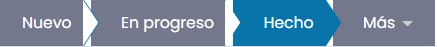

Informes
========

El menú **Informes** en el módulo de **Partes de Horas** de Daeris te ayudará a crear informes dinámicos sobre las hojas de tiempo
registradas en este módulo según el tipo de empleado, proyecto, tarea y facturación.

Partes de horas por empleado
----------------------------

El informe de partes de horas por empleado mostrará los partes de horas de cada empleado de tu empresa. Obtendrás los
detalles del total de horas trabajadas por un empleado en una semana o mes en particular.

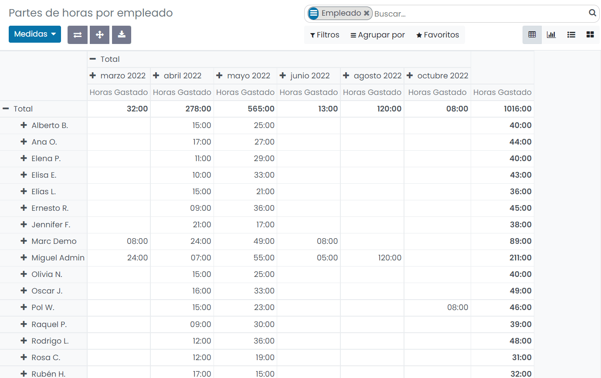

Este informe también se puede mostrar en vistas kanban, lista y gráfico:

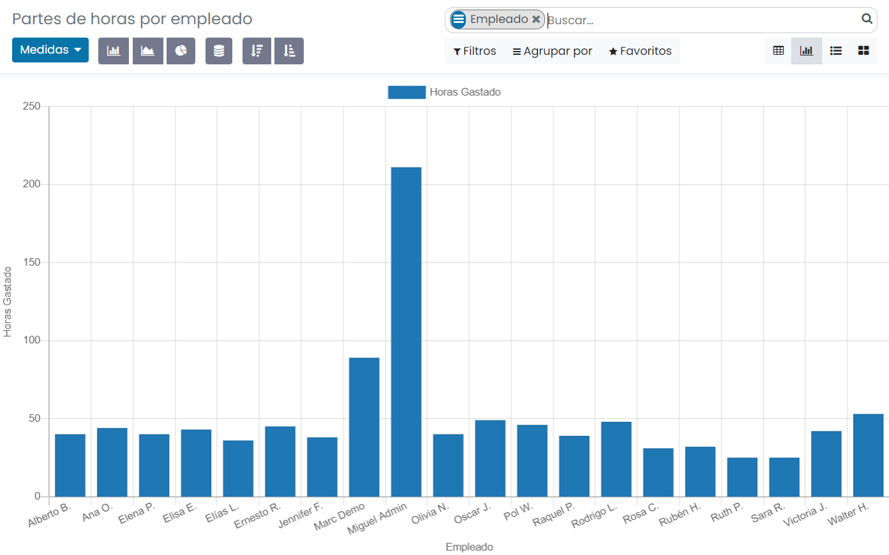

Partes de horas por proyecto
----------------------------

La opción de partes de horas por proyecto en el menú de Informes muestra los partes de horas basados en proyectos:

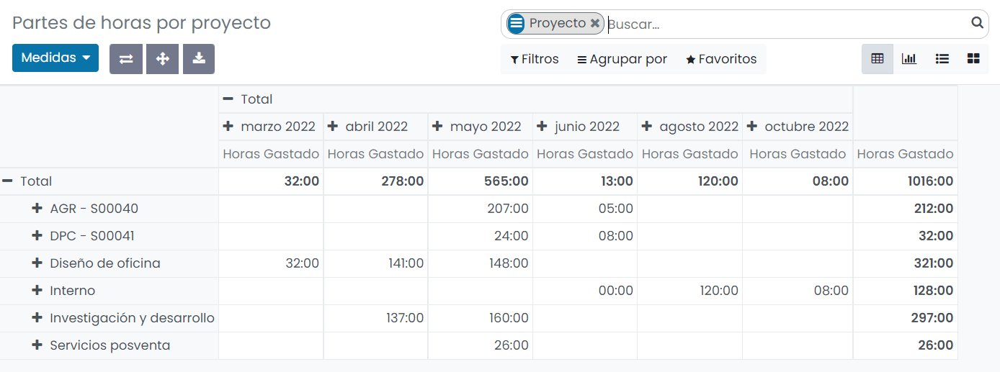

Como se puede observar, obtendrás la cantidad de horas dedicadas a un proyecto en particular, en una semana o mes
seleccionado. La vista de tabla se puede cambiar a vistas kanban, lista, y gráfico.

Partes de horas por tarea
-------------------------

El menú Informes incluye la opción de partes de horas por tarea, que te ayudará a generar informes sobre la cantidad de
horas trabajadas en una tarea específica semanal o mensualmente:

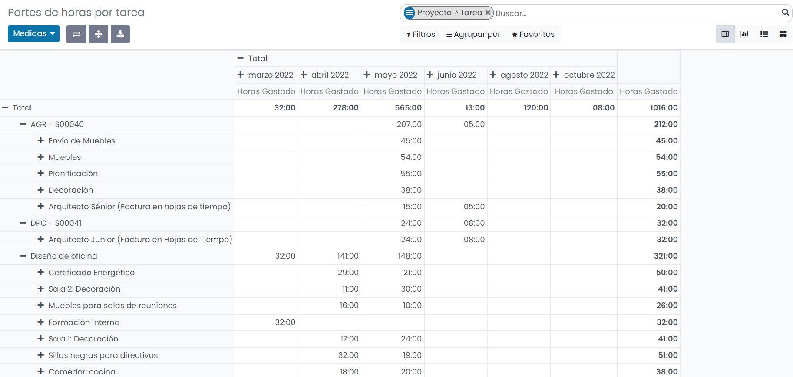

Partes de horas por tipo de facturación
---------------------------------------

Los partes de horas por tipo de facturación mostrarán los informes de los partes de horas según el tipo de facturación.
Puedes facturar tu producto de servicio en función de un precio fijo o una hoja de tiempo. Los informes sobre las horas
trabajadas en dichos tipos de facturación se pueden ver en esta plataforma como se muestra a continuación:

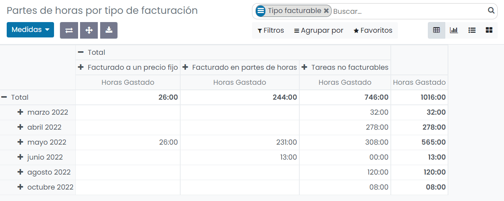

El informe también incluye los detalles de las tareas no facturables.

Parte de horas / Asistencia
---------------------------

El informe de parte de horas / asistencia se puede utilizar para analizar los partes de horas registrados en el sistema
con la asistencia:

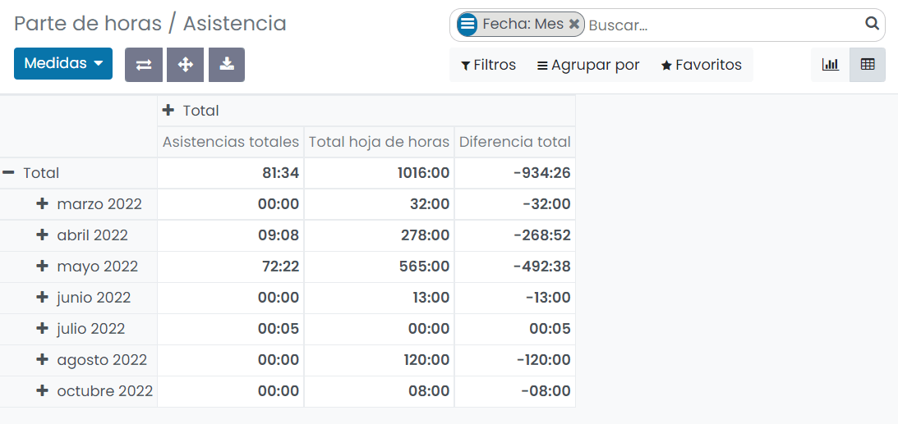

La vista dinámica muestra la cantidad de horas registradas en asistencia y partes de horas en cada mes, junto con la
diferencia entre ellas. También puedes usar la vista gráfica para analizar la asistencia y los partes de horas.

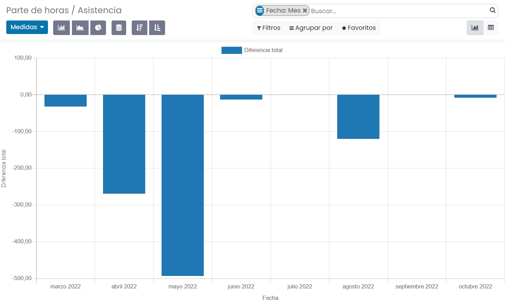