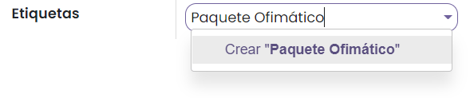
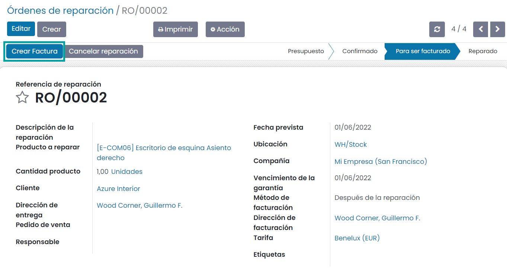

:show-content:

============
Reparaciones
============

La gestión de las reparaciones de los productos de una empresa aumenta la confianza de la marca y el grado de satisfacción
de los clientes. Una ineficiente gestión de las solicitudes de reparación puede generar insatisfacción y pérdida de negocio.

La aplicación de gestión de reparaciones está destinada a gestionar las reparaciones de los productos vendidos por tu
empresa, así como los productos en stock, permitiéndote planificar, ejecutar y supervisar las solicitudes de reparación.
También te permite analizar los detalles de los defectos de tus productos.

Configuración
=============

Configurar las etiquetas de órdenes de reparación
-------------------------------------------------

Las etiquetas de las órdenes de reparación sirven para buscar, identificar y agrupar tus órdenes de reparación. Para
gestionar las etiquetas puedes acceder a la pantalla :menuselection:`Reparaciones --> Configuración --> Etiquetas de órdenes de reparación`:

Para crear una nueva etiqueta haz clic sobre el botón *Crear* e introduce el nombre de la etiqueta.

También es posible crear etiquetas desde la propia orden de reparación, informando sobre el campo *Etiqueta* el nombre a
incorporar, seleccionando posteriormente la opción *Crear*.

Al hacer clic sobre el nombre de la etiqueta es posible cambiar el color e indicarle que se muestre plegado en formato Kanban:

Gestión de reparaciones
=======================

Consultar las órdenes de reparación
-----------------------------------

Para consultar las órdenes de reparación haz clic sobre la pantalla :menuselection:`Reparaciones`. Esta pantalla muestra
todas las órdenes de reparación, pudiendo ampliar los campos mostrados mediante el icono derecho de la cabecera:

La pantalla permite cambiar el formato a vista kanban, gráfico y pivote:

También es posible filtrar y agrupar por diversos campos mediante los menús correspondientes:

Crear órdenes de reparación
---------------------------

Para crear órdenes de reparación navega a la pantalla :menuselection:`Reparaciones` y haz clic sobre el botón *Crear*.
El sistema desplegará un formulario donde poder informar los siguientes campos:

-  **Prioridad**: Se informa haciendo clic sobre el icono de la estrella.

-  **Descripción de la reparación**

-  **Producto a reparar**: Desplegable con la lista de productos dados de alta en la aplicación.

-  **Cantidad producto**: Cantidad de productos a reparar.

-  **Cliente**: Cliente que solicita la reparación.

-  **Dirección de entrega**: Dirección de entrega del cliente.

-  **Pedido de venta**: En el caso de que el producto esté relacionado con una venta que se haya realizado al cliente.

-  **Responsable**: Usuario responsable de la orden de reparación.

-  **Fecha prevista**: Fecha prevista de reparación del producto.

-  **Ubicación**: Ubicación donde se almacena el producto a reparar.

-  **Compañía**: Compañía asociada a la orden de reparación.

-  **Vencimiento de la garantía**: Fecha de vencimiento de la garantía.

-  **Método de facturación**: Es posible seleccionar diferentes valores:

   -  **Sin factura**: En este caso no se realizará factura al cliente. Este comportamiento suele darse cuando el cliente
      dispone de una garantía o contrato de mantenimiento vigente y no debe abonar nada por los servicios prestados y
      piezas sustituidas.

   -  **Antes de la reparación**: Mediante esta opción se genera la factura antes de iniciar la reparación y se debe
      informar la dirección de facturación.

   -  **Después de la reparación**: Mediante esta opción se genera la factura después la reparación y se debe informar
      la dirección de facturación.

-  **Etiquetas**: Categorías o etiquetas asociadas a la orden de reparación.

En la pestaña **Piezas**, deberás incluir los detalles del producto para el que deseas crear una orden de reparación. Puedes
agregar los detalles de la parte del producto que debes añadir o eliminar para reparar los daños. Luego, el producto se
puede asignar junto con la descripción, la cantidad, la unidad de medida, el precio unitario, los impuestos y el subtotal:

En la pestaña **Operaciones** se deben incluir los detalles de todos los servicios necesarios para realizar la reparación:

.. image:: reparaciones/operaciones-ordenes-reparacion.png
   :align: center
   :alt: Operaciones de órdenes de reparación

La pestaña **Notas de reparación** te permite incluir una nota de reparación. De la misma manera, puedes incluir
notas del presupuesto en la pestaña **Notas del presupuesto**:

Al finalizar los cambios debes pulsar el botón *Guardar*. Esta acción asignará la referencia de la orden de reparación
y su estado, que inicialmente será el de *Presupuesto*:

Gestionar una reparación por etapas
-----------------------------------

Una orden de reparación puede pasar por los siguientes estados:

-  **Presupuesto**: Este estado se utiliza cuando se registra una nueva orden de reparación.

-  **Confirmado**: La etapa confirmada se puede utilizar cuando confirmes el pedido de reparación.

-  **En Reparación**: Se muestra cuando la reparación está en curso.

-  **Para ser facturado**: Esta etapa se establece cuando se genera la factura antes o después de que se realice la reparación.

-  **Reparado**: Aplica cuando se completa la reparación.

-  **Cancelado**: Aplica si se cancela la orden de reparación.

Una vez se ha dado de alta una orden de reparación, su estado inicial es el de *Presupuesto*. Es posible imprimir el
presupuesto para facilitárselo al cliente mediante el botón **Imprimir presupuesto**:

Al imprimir el presupuesto, es posible descargarlo y visualizarlo en PDF:

Por otro lado, también es posible enviar el presupuesto por correo al cliente mediante el botón **Enviar presupuesto**:

Al enviar el presupuesto se muestra un formulario desplegable con las opciones de envío preconfiguradas:

Para iniciar el proceso de reparación es necesario confirmar la reparación mediante el botón **Confirmar reparación**:

.. note::
   En función del método de facturación seleccionado, es posible generar la factura tras confirmar la reparación o
   tras finalizarla.

Una vez confirmada la reparación el estado de la misma cambiará a estado *Confirmado*:

Para iniciar el proceso de reparación se debe pulsar el botón **Iniciar reparación**:

Esta acción cambiará el estado de la orden a *En reparación*:

Para finalizar el proceso de reparación se debe pulsar el botón **Finalizar reparación**:

Esta acción cambiará el estado de la orden a *Reparado*, en caso de que el método de facturación sea *Sin factura*, o al
estado *Para ser facturado*, en caso de que el método de facturación sea *Antes de la reparación* o *Después de la reparación*.

En los casos en que las órdenes de reparación queden pendientes de ser facturadas, se puede generar la factura haciendo
clic sobre el botón **Crear factura**:

Esta acción cambia el estado de la orden a *Reparado* y se habilita un nuevo botón inteligente que incluye el acceso a
la factura:

Al hacer clic sobre el botón de facturas, es posible acceder al detalle. La factura dispone de estado borrador y se
completa con las líneas de productos a facturar:

Para poder confirmar la factura es requerido editarla e incorporar la fecha de la factura. Posteriormente haz clic
sobre el botón **Confirmar**, acción que cambiará su estado a *Publicado*. A partir de aquí, es posible enviar e imprimir
la factura, registrar pagos, gestionar rectificativas, así como reestablecer a borrador mediante los botones de gestión
de la factura:

Consultar movimientos de inventario de órdenes de reparación
------------------------------------------------------------

Una vez gestionada una orden de reparación, es posible consultar sus movimientos de inventario haciendo clic sobre el
botón inteligente **Movimientos productos** del formulario de detalle de la orden:

.. image:: reparaciones/movimientos-productos-ordenes-reparacion.png
   :align: center
   :alt: Movimientos de productos en órdenes de reparación

Al hacer clic sobre el botón, la aplicación navega al listado de movimientos de inventario asociados a la orden:

Informes
========

Para consultar los informes de las reparaciones puedes acceder a la pantalla :menuselection:`Reparaciones --> Informes --> Reparaciones`,
desde donde es posible extraer gráficos de barras, de líneas y circulares, así como aplicar filtros y agrupar por
diferentes campos:

Mediante los iconos del menú superior derecho es posible visualizar los datos en formato gráfico, kanban, lista y pivote:

