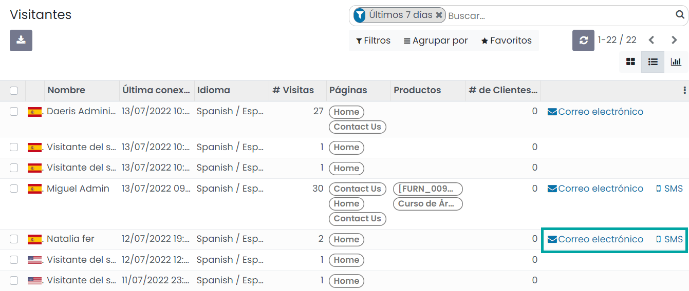
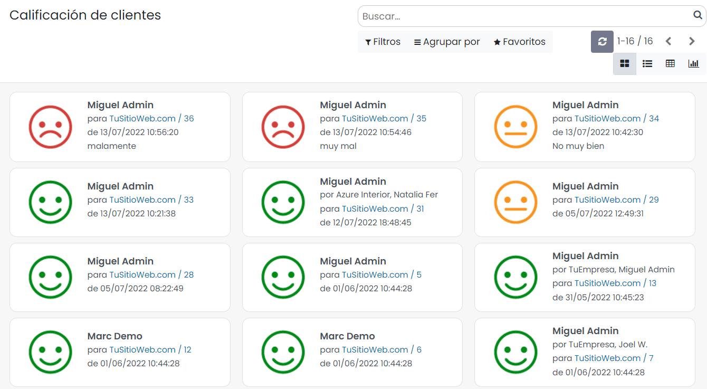

============
Chat en Vivo
============

Con el **Chat en Vivo** de Daeris, puedes establecer un contacto directo con los visitantes de tu sitio web. Un simple
cuadro de diálogo estará disponible en tu pantalla y les permitirá ponerse en contacto con uno de tus representantes de
ventas. De esta manera, puedes convertir fácilmente a tus visitantes en oportunidades de negocio potenciales. También
podrás brindar asistencia a tus clientes. En general, esta es la herramienta perfecta para mejorar la satisfacción del
cliente.

Configuración
=============

Configurar el canal de chat en vivo de tu sitio web
---------------------------------------------------

Para configurar el canal de chat en vivo de tu sitio web, navega a la pantalla :menuselection:`Sitio web --> Configuración --> Ajustes`,
y desde el apartado de *Características*, ubica el campo de **Chat en Vivo**:

Mediante este campo puedes seleccionar el canal al que estará vinculado el sitio web o crear uno nuevo.

Una vez realizados los cambios necesarios, pulsa el botón *Guardar* de la pantalla de ajustes.

Crear un canal de chat en vivo
------------------------------

Si quieres crear un nuevo canal de chat, puedes navegar a la pantalla de :menuselection:`Chat en vivo --> Canales`, y
pulsar sobre el botón *Crear*. También puedes editar un canal existente haciendo clic sobre el nombre del canal:

Al crear o editar un canal se abre el formulario de detalle del canal, en donde es posible informar los siguientes campos:

-  **Operadores**: Desde esta pestaña puedes añadir los usuarios que podrán atender este canal, así como visualizar los
   usuarios que ya pertenecen al canal.

   .. image:: chat_en_vivo/operadores-canal.png
      :align: center
      :alt: Operadores del canal de chat en vivo

-  **Opciones**: Desde esta pestaña dispones de los siguientes campos:

   -  **Texto del botón**: Texto por defecto mostrado en el botón de Soporte en vivo.

   -  **Color del botón de Chat en vivo**: Color predeterminado de fondo del botón de Chat en vivo.

   -  **Mensaje de bienvenida**: Mensaje de bienvenida automático que tu visitante verá al iniciarse una nueva sesión.

   -  **Entrada de texto**: Texto que se solicita al usuario que inicia el chat.

   -  **Color del encabezado del canal**: Color predeterminado de fondo del encabezado del canal una vez abierto.

   .. image:: chat_en_vivo/opciones-canal.png
      :align: center
      :alt: Opciones del canal de chat en vivo

-  **Reglas del canal**: Desde esta pestaña dispones de los siguientes campos:

   -  **Acción**: Por ejemplo, puedes elegir *Mostrar el botón* para que se muestre el botón de chat en los países en los
      que hablas el idioma. Por el contrario, puedes *Esconder el botón* para que no se muestre el botón de chat en los
      países en los que tu empresa no vende. Si seleccionas *Ventana emergente automática*, también puedes configurar el
      tiempo que tarda en abrirse automáticamente el panel de conversación.

   -  **URL Regex**: Expresión regular que especifica las páginas web en las que se aplicará esta regla. Por ejemplo, si
      informas *shop*, el chat solamente se mostrará en aquellas páginas que incluyan el texto *shop*, como es el caso de
      la tienda de Daeris.

   -  **País**: La regla solo aplicará para estos países. El país del visitante se calcula en función de su dirección IP,
      buscando dicha dirección IP en una base de datos de geolocalización de IPs. La base de datos de geolocalización de
      IPs se actualiza constantemente debido a la aparición de nuevas IPs, por lo que es posible que algunos visitantes
      no sean correctamente geolocalizados hasta pasado el tiempo necesario para que hayan sido incluidos en la base de datos.

   .. image:: chat_en_vivo/reglas-canal.png
      :align: center
      :alt: Reglas del canal de chat en vivo

-  **Widget**: Desde esta pestaña se indica cómo utilizar el widget de chat en vivo. Si tu sitio web fue creado con Daeris,
   entonces el chat en vivo se agrega automáticamente a él. Si tu sitio web no fue creado con Daeris, puedes copiar y pegar
   el código HTML proporcionado en esta pestaña en tu sitio web. También se proporciona una URL específica que puedes
   enviar a los clientes o proveedores para que accedan al chat en vivo.

   .. image:: chat_en_vivo/widget-canal.png
      :align: center
      :alt: Widget del canal de chat en vivo

Una vez informados los campos necesarios, pulsa el botón *Guardar* en el formulario del canal.

Gestionar solicitudes del chat
==============================

Unirse o salir de un canal de chat en vivo
------------------------------------------

En la pantalla :menuselection:`Chat en vivo --> Canales` puedes visualizar los canales disponibles. Mediante el botón
**Unirse**, puedes unirte al canal de chat:

Una vez unido al canal de chat, mediante el botón **Salir**, puedes abandonar el canal de chat:

Chatear con los clientes mediante el chat en vivo
-------------------------------------------------

En la práctica, las conversaciones iniciadas por los visitantes aparecerán en el módulo de *Conversaciones* y también
aparecerán como un mensaje directo. Por lo tanto, las consultas pueden ser respondidas desde cualquier parte de Daeris:

.. note::
   Las conversaciones se asignan según la carga de trabajo actual de los operadores.

Usar comandos
~~~~~~~~~~~~~

Los comandos son atajos útiles para completar ciertas acciones o para acceder a la información que puedas necesitar. Para
usar esta función, simplemente escribe los comandos en el chat. Las siguientes acciones están disponibles:

-  **/help**: Muestra la ayuda.

-  **/ticket asunto-del-ticket**: Crea un nuevo ticket de atención al cliente.

-  **/history**: Muestra las últimas 15 páginas visitadas por el visitante.

-  **/lead título**: Crea un nuevo cliente potencial.

-  **/leave**: Comando para salir del canal.

Enviar respuestas predefinidas
~~~~~~~~~~~~~~~~~~~~~~~~~~~~~~

Las respuestas preparadas te permiten crear sustitutos de oraciones genéricas que usas con frecuencia. Escribir una
palabra en lugar de varias te ahorrará mucho tiempo. Para agregar respuestas preparadas, navega a la pantalla
:menuselection:`Chat en vivo --> Configuración --> Respuestas predefinidas` y crea tantas como sea necesario:

Luego, para usarlas durante un chat, simplemente escribe `:` seguido del acceso rápido que asignaste:

Consultar los visitantes del sitio web
--------------------------------------

La pantalla :menuselection:`Chat en vivo --> Visitantes` mantiene todos los registros de los visitantes en tu sitio web:

El sistema te permite ver los registros en formato de vista kanban, lista y gráfico. El sistema describirá los detalles
de cada visitante del sitio web. Los detalles incluyen el nombre del visitante (si el nombre del visitante ya está
guardado en tu sistema; de lo contrario, se mostrará con un número), la hora de la última acción, la cantidad de visitas,
la cantidad de páginas visitadas, la cantidad de clientes potenciales u oportunidades y chats. Además, la pantalla
también muestra los botones **SMS** y **Correo electrónico** para iniciar la comunicación correspondiente:

Calificaciones
==============

Analizar la satisfacción de tus visitantes
------------------------------------------

Al finalizar el chat, el visitante del sitio web recibe un mensaje para calificar la atención recibida. Si el cliente
elije *No satisfecho* o *Muy insatisfecho*, entonces aparecerá un campo en el que se pueda escribir una explicación.
También se puede enviar por correo electrónico una copia de la conversación.

.. image:: chat_en_vivo/calificaciones-chat.png
   :align: center
   :alt: Calificaciones del chat en vivo

La calificación se muestra en la ventana del chat para el operador:

La respuesta se asocia al chat, de manera que es posible realizar un análisis de la atención recibida por los visitantes
del sitio. Esto lo puedes consultar desde la pantalla de :menuselection:`Chat en vivo --> Informe --> Calificación de clientes`:

.. image:: chat_en_vivo/informe-calificaciones-chat.png
   :align: center
   :alt: Informe de calificaciones del chat en vivo

También puedes consultar el porcentaje de visitantes satisfechos desde el formulario de detalle del canal, desde la
pantalla :menuselection:`Chat en vivo --> Canales`, en el botón ubicado en la parte superior derecha:

Hacer pública la calificación
-----------------------------

Para hacer públicas las calificaciones, accede al formulario de detalle de tu canal del sitio web desde la pantalla
:menuselection:`Chat en vivo --> Canales`, y haz clic en **Ir a sitio web**:

A continuación, pulsa en el botón *No publicado*, para publicar la calificación de ese canal en tu sitio web:

Informes
========

Historial de sesiones
---------------------

El menú **Historial de sesiones** disponible en la sección **Informes** de chat en vivo, brinda informes de todas las
sesiones creadas en el módulo de chat en vivo:

En esta pantalla obtendrás todos los historiales de sesiones creados en la plataforma. El informe contiene la información
vital de los historiales de cada sesión, como la fecha de la sesión, la hora, los asistentes, la cantidad de mensajes y
la calificación.

Estadísticas de sesión
----------------------

El menú **Estadísticas de sesión** te brindará todos los informes de estadísticas de la sesión en las vistas de tipo gráfico
y pivote:

Esta es la representación de gráfico de barras del informe, y también puedes cambiar a gráfico de líneas y gráfico circular.
El informe de estadísticas de sesión se puede ver en diferentes medidas. Para cambiar las medidas del gráfico, puedes hacer
clic en el campo *Medidas*:

Las medidas incluyen opciones como el número de participantes, duración promedio, mensaje promedio, días de actividad,
visitante anónimo, calificación, sesión no calificada, sesiónes sin respuesta, tiempo de respuesta y visitante feliz.

Además, el informe incluye varias opciones de filtrado y agrupación predeterminadas y personalizables que te permitirán
ordenar los datos. Los filtros predeterminados disponibles en el campo *Filtros* son sesiones perdidas, sesiones tratadas,
últimas 24 horas, esta semana y fecha de inicio de la sesión (mes, trimestre y año). De manera similar, las opciones
predeterminadas disponibles en la sección *Agrupar por* son código, canal, pperador, fecha de creación (hora) y fecha de
creación (año, trimestre, mes, semana y día).

También puedes hacer clic en el ícono del tipo de vista pivote, disponible en la esquina superior derecha de la ventana:

Análisis de operador
--------------------

El menú **Análisis de operador** disponible en la sección **Informes** del módulo de chat en vivo, te permitirá generar
informes de Chat en vivo basados en operadores de chat en vivo. Este informe se puede ver en la vista gráfico y pivote:

La imagen de arriba muestra la representación del gráfico circular. También puedes ver el informe en gráficos de barras y
de líneas. El campo *Medidas* disponible en la ventana incluye el número de sesiones, la duración promedio y el tiempo
de respuesta. También puedes aplicar varias opciones predeterminadas y personalizables, filtros, agrupar por, favoritos
y opciones de búsqueda.

Calificación de clientes
------------------------

El menú **Calificación de clientes** disponible en la sección **Informes** del módulo de chat en vivo te permite registrar
todas las respuestas recibidas de los visitantes del sitio web de acuerdo con la interacción entre el representante de
la empresa y los visitantes:

Aquí puedes ver todas las calificaciones de los clientes en la vista kanban. También puedes ver el informe en las vistas
lista, pivote y gráfico. La recopilación de calificaciones de los visitantes te ayudará a analizar, mejorar y fortalecer
la interacción de tu empresa con los clientes. Esta ventana también te proporciona varios filtros predeterminados y
personalizables, opciones de agrupación y funciones de búsqueda.

.. seealso::
   * :ref:`productividad/informes/analizar_datos`