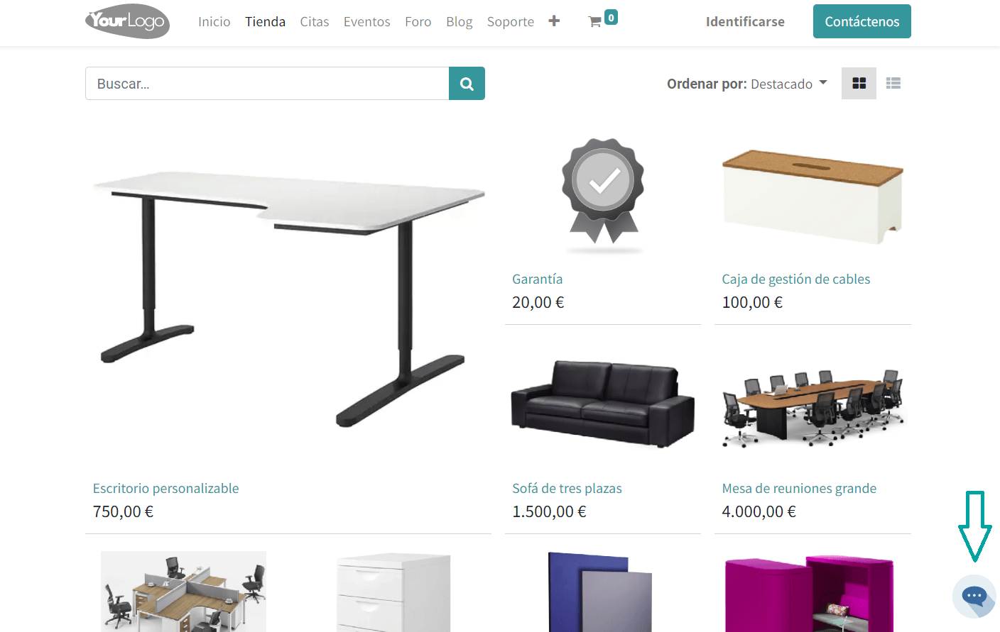
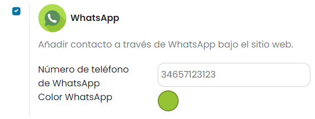
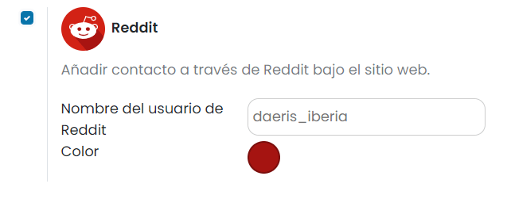

==========
Multi Chat
==========

El multi chat de Daeris te permite añadir un botón en el sitio web que permite a los visitantes ponerse en contacto
contigo a través de múltiples canales:

-  Chat en vivo

-  Correo electrónico

-  Teléfono

-  SMS

-  WhatsApp

-  Facebook

-  Skype

-  Twitter

-  Telegram

-  Facetime

-  Wechat

-  Viber

-  Line

-  Reddit

-  Slack

-  Snapchat

-  Hangouts

Activar el multi chat en el sitio web
=====================================

Para activar el multi chat, navega a la pantalla :menuselection:`Sitio web --> Configuración --> Ajustes`, y marca la
opción de activación del multi chat:

Mediante el campo **Posición del multichat**, puedes indicar si el botón de multi chat debe aparecer en la parte inferior
derecha o izquierda de la pantalla. Además, mediante el campo **Color primario del icono**, puedes seleccionar un color
para el icono que se adapte al diseño de tu sitio web.

Una vez informados los campos necesarios, pulsa el botón *Guardar*.

A partir de ese momento, siempre y cuando hayas configurado, al menos, una de las múltiples opciones de contacto, al
navegar al sitio web, aparecerá el icono de multi chat, en la ubicación deseada y con el color seleccionado:

Al pulsar el botón de multi chat, el sistema desplegará las distintas opciones de que el usuario dispone para ponerse en
contacto con el propietario del sitio web:

Configurar los distintos canales de contacto
============================================

Chat en vivo
------------

En caso de disponer de un canal de chat en vivo publicado en el sitio web, los visitantes del sitio web dispondrán de
una ventana que les permitirá iniciar una nueva conversación con uno de los agentes configurados. Para que esta ventana
no interfiera con el botón de multi chat, es posible integrar el chat en vivo junto con el resto de opciones de contacto
del multi chat. Para ello, navega a la pantalla :menuselection:`Sitio web --> Configuración --> Ajustes`, y activa la
opción de chat en vivo dentro del apartado de multi chat:

Mediante el campo **Color**, puedes especificar un color de fondo que se mostrará junto al icono de chat en vivo cuando
se despliegue esa opción del multi chat.

Una vez informados los campos necesarios, pulsa el botón *Guardar*.

Correo electrónico
------------------

Mediante el contacto a través de correo electrónico en el multi chat del sitio web, los visitantes pueden ponerse en
contacto contigo de manera fácil y rápida en la dirección de correo electrónico configurada.

Para ello, navega a la pantalla :menuselection:`Sitio web --> Configuración --> Ajustes`, y activa la opción de correo
electrónico dentro del apartado de multi chat:

En el campo **Correo electrónico** debes introducir la dirección de email utilizada para que los visitantes se pongan en
contacto contigo. Por otro lado, mediante el campo **Color**, puedes especificar un color de fondo que se mostrará junto
al icono de correo electrónico cuando se despliegue esa opción del multi chat.

Una vez informados los campos necesarios, pulsa el botón *Guardar*.

Teléfono
--------

Mediante el contacto a través de teléfono en el multi chat del sitio web, los visitantes pueden ponerse en contacto contigo
de manera fácil y rápida en el número de teléfono configurado. Esto es muy útil para los visitantes que accedan a tu sitio
web a través de un dispositivo móvil, ya que les permite realizar la llamada directamente a través de su dispositivo,
mediante la app de teléfono.

Para añadir este canal de contacto, navega a la pantalla :menuselection:`Sitio web --> Configuración --> Ajustes`, y activa
la opción de teléfono dentro del apartado de multi chat:

En el campo **Llamada de teléfono** debes introducir el número de teléfono utilizado para que los visitantes se pongan
en contacto contigo. Por otro lado, mediante el campo **Color**, puedes especificar un color de fondo que se mostrará
junto al icono de teléfono cuando se despliegue esa opción del multi chat.

Una vez informados los campos necesarios, pulsa el botón *Guardar*.

SMS
---

Mediante el contacto a través de SMS en el multi chat del sitio web, los visitantes pueden ponerse en contacto contigo
de manera fácil y rápida mediante un mensaje de texto en el número de teléfono configurado. Esto es muy útil para los
visitantes que accedan a tu sitio web a través de un dispositivo móvil, ya que les permite realizar el envío del mensaje
de texto directamente a través de su dispositivo, mediante la app de mensajería.

Para añadir este canal de contacto, navega a la pantalla :menuselection:`Sitio web --> Configuración --> Ajustes`, y activa
la opción de SMS dentro del apartado de multi chat:

En el campo **Número de teléfono** debes introducir el número de teléfono utilizado para que los visitantes se pongan en
contacto contigo. Por otro lado, mediante el campo **Color**, puedes especificar un color de fondo que se mostrará junto
al icono de SMS cuando se despliegue esa opción del multi chat.

Una vez informados los campos necesarios, pulsa el botón *Guardar*.

WhatsApp
--------

Mediante el contacto a través de WhatsApp en el multi chat del sitio web, los visitantes pueden ponerse en contacto
contigo de manera fácil y rápida mediante un mensaje de WhatsApp en el número de teléfono configurado. Esto es muy útil
para los visitantes que accedan a tu sitio web a través de un dispositivo móvil, ya que les permite realizar el envío del
mensaje directamente a través de su dispositivo, mediante la app de WhatsApp.

Para añadir este canal de contacto, navega a la pantalla :menuselection:`Sitio web --> Configuración --> Ajustes`, y
activa la opción de WhatsApp dentro del apartado de multi chat:

En el campo **Número de teléfono de WhatsApp** debes introducir el número de teléfono utilizado para que los visitantes
se pongan en contacto contigo, informando el código de país seguido del número de teléfono, tal y como se muestra en la
imagen. Por otro lado, mediante el campo **Color**, puedes especificar un color de fondo que se mostrará junto al icono
de WhatsApp cuando se despliegue esa opción del multi chat.

Una vez informados los campos necesarios, pulsa el botón *Guardar*.

Facebook Messenger
------------------

Mediante el contacto a través de Facebook Messenger en el multi chat del sitio web, los visitantes pueden ponerse en
contacto contigo de manera fácil y rápida mediante un mensaje de Facebook Messenger en la cuenta de Facebook configurada.
Esto es muy útil para los visitantes que accedan a tu sitio web a través de un dispositivo móvil, ya que les permite
realizar el envío del mensaje directamente a través de su dispositivo, mediante la app de Facebook Messenger.

Para añadir este canal de contacto, navega a la pantalla :menuselection:`Sitio web --> Configuración --> Ajustes`, y
activa la opción de Facebook dentro del apartado de multi chat:

En el campo **Facebook id** debes introducir el identificador de la cuenta de Facebook utilizada para que los visitantes
se pongan en contacto contigo. Por otro lado, mediante el campo **Color**, puedes especificar un color de fondo que se
mostrará junto al icono de Facebook cuando se despliegue esa opción del multi chat.

Una vez informados los campos necesarios, pulsa el botón *Guardar*.

Skype
-----

Mediante el contacto a través de Skype en el multi chat del sitio web, los visitantes pueden ponerse en contacto contigo
de manera fácil y rápida mediante un mensaje de Skype en la cuenta configurada. Esto es muy útil para los visitantes que
accedan a tu sitio web a través de un dispositivo móvil, ya que les permite realizar el envío del mensaje directamente a
través de su dispositivo, mediante la app de Skype.

Para añadir este canal de contacto, navega a la pantalla :menuselection:`Sitio web --> Configuración --> Ajustes`, y activa
la opción de Skype dentro del apartado de multi chat:

En el campo **Nombre del usuario de Skype** debes introducir el nombre de usuario de Skype utilizado para que los
visitantes se pongan en contacto contigo. Por otro lado, mediante el campo **Color**, puedes especificar un color de
fondo que se mostrará junto al icono de Skype cuando se despliegue esa opción del multi chat.

Una vez informados los campos necesarios, pulsa el botón *Guardar*.

Twitter
-------

Mediante el contacto a través de Twitter en el multi chat del sitio web, los visitantes pueden ponerse en contacto contigo
de manera fácil y rápida mediante un mensaje de Twitter en la cuenta configurada. Esto es muy útil para los visitantes
que accedan a tu sitio web a través de un dispositivo móvil, ya que les permite realizar el envío del mensaje directamente
a través de su dispositivo, mediante la app de Twitter.

Para añadir este canal de contacto, navega a la pantalla :menuselection:`Sitio web --> Configuración --> Ajustes`, y activa
la opción de Twitter dentro del apartado de multi chat:

En el campo **Identificador de usuario de Twitter** debes introducir el identificador de usuario de Twitter utilizado para
que los visitantes se pongan en contacto contigo.

.. note::
   Puedes obtener el identificador de tu cuenta de Twitter introduciendo tu nombre de usuario `aquí <https://tweeterid.com/>`_.

Por otro lado, mediante el campo **Color**, puedes especificar un color de fondo que se mostrará junto al icono de Twitter
cuando se despliegue esa opción del multi chat.

Una vez informados los campos necesarios, pulsa el botón *Guardar*.

Telegram
--------

Mediante el contacto a través de Telegram en el multi chat del sitio web, los visitantes pueden ponerse en contacto contigo
de manera fácil y rápida mediante un mensaje de Telegram en la cuenta configurada. Esto es muy útil para los visitantes que
accedan a tu sitio web a través de un dispositivo móvil, ya que les permite realizar el envío del mensaje directamente a
través de su dispositivo, mediante la app de Telegram.

Para añadir este canal de contacto, navega a la pantalla :menuselection:`Sitio web --> Configuración --> Ajustes`, y activa
la opción de Telegram dentro del apartado de multi chat:

En el campo **Nombre del usuario de Telegram** debes introducir el nombre de usuario utilizado para que los visitantes
se pongan en contacto contigo. Por otro lado, mediante el campo **Color**, puedes especificar un color de fondo que se
mostrará junto al icono de Telegram cuando se despliegue esa opción del multi chat.

Una vez informados los campos necesarios, pulsa el botón *Guardar*.

Facetime
--------

Mediante el contacto a través de FaceTime en el multi chat del sitio web, los visitantes pueden ponerse en contacto
contigo de manera fácil y rápida mediante una videollamada. Esto es muy útil para los visitantes que accedan a tu sitio
web a través de dispositivos iPhone, iPad, Mac y iPod touch, ya que les permite realizar la videollamada directamente a
través de su dispositivo.

Para añadir este canal de contacto, navega a la pantalla :menuselection:`Sitio web --> Configuración --> Ajustes`, y
activa la opción de FaceTime dentro del apartado de multi chat:

En el campo **Facetime apple id** debes introducir el identificador de usuario utilizado para que los visitantes se
pongan en contacto contigo. Por otro lado, mediante el campo **Color**, puedes especificar un color de fondo que se
mostrará junto al icono de FaceTime cuando se despliegue esa opción del multi chat.

Una vez informados los campos necesarios, pulsa el botón *Guardar*.

Wechat
------

Mediante el contacto a través de WeChat en el multi chat del sitio web, los visitantes pueden ponerse en contacto contigo
de manera fácil y rápida mediante un mensaje de WeChat en la cuenta configurada. Esto es muy útil para los visitantes
que accedan a tu sitio web a través de un dispositivo móvil, ya que les permite realizar el envío del mensaje directamente
a través de su dispositivo, mediante la app de WeChat.

Para añadir este canal de contacto, navega a la pantalla :menuselection:`Sitio web --> Configuración --> Ajustes`, y activa
la opción de WeChat dentro del apartado de multi chat:

En el campo **Identificador de Wechat** debes introducir el id de usuario utilizado para que los visitantes se pongan en
contacto contigo. Por otro lado, puedes subir tu **Código QR de WeChat** para que los visitantes de tu sitio web puedan
escanear tu código de usuario. Por último, mediante el campo **Color**, puedes especificar un color de fondo que se
mostrará junto al icono de WeChat cuando se despliegue esa opción del multi chat.

Una vez informados los campos necesarios, pulsa el botón *Guardar*.

Viber
-----

Mediante el contacto a través de Viber en el multi chat del sitio web, los visitantes pueden ponerse en contacto contigo
de manera fácil y rápida mediante un mensaje de Viber en el número de teléfono configurado. Esto es muy útil para los
visitantes que accedan a tu sitio web a través de un dispositivo móvil, ya que les permite realizar el envío del mensaje
directamente a través de su dispositivo, mediante la app de Viber.

Para añadir este canal de contacto, navega a la pantalla :menuselection:`Sitio web --> Configuración --> Ajustes`, y activa
la opción de Viber dentro del apartado de multi chat:

En el campo **Número de teléfono de Viber** debes introducir el número de teléfono utilizado para que los visitantes se
pongan en contacto contigo, informando el código de país seguido del número de teléfono, tal y como se muestra en la
imagen. Por otro lado, puedes subir tu **Código QR de Viber** para que los visitantes de tu sitio web puedan escanear tu
código de usuario. Por último, mediante el campo **Color**, puedes especificar un color de fondo que se mostrará junto al
icono de Viber cuando se despliegue esa opción del multi chat.

Una vez informados los campos necesarios, pulsa el botón *Guardar*.

Line
----

Mediante el contacto a través de Line en el multi chat del sitio web, los visitantes pueden ponerse en contacto contigo
de manera fácil y rápida mediante un mensaje de Line en la cuenta configurada. Esto es muy útil para los visitantes que
accedan a tu sitio web a través de un dispositivo móvil, ya que les permite realizar el envío del mensaje directamente
a través de su dispositivo, mediante la app de Line.

Para añadir este canal de contacto, navega a la pantalla :menuselection:`Sitio web --> Configuración --> Ajustes`, y activa
la opción de Line dentro del apartado de multi chat:

En el campo **Enlace de invitación de Line** debes introducir el nombre de cuenta utilizado para que los visitantes se
pongan en contacto contigo. Por otro lado, puedes subir tu **Código QR de Line** para que los visitantes de tu sitio web
puedan escanear tu código de usuario. Por último, mediante el campo **Color**, puedes especificar un color de fondo que
se mostrará junto al icono de Line cuando se despliegue esa opción del multi chat.

Una vez informados los campos necesarios, pulsa el botón *Guardar*.

Reddit
------

Mediante el contacto a través de Reddit en el multi chat del sitio web, los visitantes pueden ponerse en contacto contigo
de manera fácil y rápida mediante un mensaje de Reddit en la cuenta configurada. Esto es muy útil para los visitantes que
accedan a tu sitio web a través de un dispositivo móvil, ya que les permite realizar el envío del mensaje directamente a
través de su dispositivo, mediante la app de Reddit.

Para añadir este canal de contacto, navega a la pantalla :menuselection:`Sitio web --> Configuración --> Ajustes`, y activa
la opción de Reddit dentro del apartado de multi chat:

En el campo **Nombre del usuario de Reddit** debes introducir el nombre de usuario utilizado para que los visitantes se
pongan en contacto contigo. Por otro lado, mediante el campo **Color**, puedes especificar un color de fondo que se
mostrará junto al icono de Reddit cuando se despliegue esa opción del multi chat.

Una vez informados los campos necesarios, pulsa el botón *Guardar*.

Slack
-----

Slack es una herramienta de colaboración que puede sustituir al correo electrónico y ayudar a que tu equipo y tú podáis
trabajar más fácilmente. Un espacio de trabajo de Slack está formado por canales, en los que los miembros del equipo se
comunican y trabajan juntos.

Mediante el contacto a través de Slack en el multi chat del sitio web, los visitantes pueden acceder a tu canal, siempre
y cuando se permita el acceso de dichos usuarios al canal.

Para añadir este canal de contacto, navega a la pantalla :menuselection:`Sitio web --> Configuración --> Ajustes`, y activa
la opción de Slack dentro del apartado de multi chat:

En el campo **Nombre del canal de Slack** debes introducir el nombre de canal utilizado para que los visitantes puedan
acceder. Por otro lado, mediante el campo **Color**, puedes especificar un color de fondo que se mostrará junto al icono
de Slack cuando se despliegue esa opción del multi chat.

Una vez informados los campos necesarios, pulsa el botón *Guardar*.

Snapchat
--------

Mediante el contacto a través de Snapchat en el multi chat del sitio web, los visitantes pueden ponerse en contacto
contigo de manera fácil y rápida mediante un mensaje de Snapchat en la cuenta configurada. Esto es muy útil para los
visitantes que accedan a tu sitio web a través de un dispositivo móvil, ya que les permite realizar el envío del mensaje
directamente a través de su dispositivo, mediante la app de Snapchat.

Para añadir este canal de contacto, navega a la pantalla :menuselection:`Sitio web --> Configuración --> Ajustes`, y
activa la opción de Snapchat dentro del apartado de multi chat:

En el campo **Nombre de usuario de Snapchat** debes introducir el nombre de cuenta utilizado para que los visitantes se
pongan en contacto contigo. Por otro lado, puedes subir tu **Código QR de Snapchat** para que los visitantes de tu sitio
web puedan escanear tu código de usuario. Por último, mediante el campo **Color**, puedes especificar un color de fondo
que se mostrará junto al icono de Snapchat cuando se despliegue esa opción del multi chat.

Una vez informados los campos necesarios, pulsa el botón *Guardar*.

Hangouts
--------

Mediante el contacto a través de Hangouts en el multi chat del sitio web, los visitantes pueden ponerse en contacto contigo
de manera fácil y rápida mediante un mensaje de Hangouts en la cuenta configurada. Esto es muy útil para los visitantes
que accedan a tu sitio web a través de un dispositivo móvil, ya que les permite realizar el envío del mensaje directamente
a través de su dispositivo, mediante la app de Hangouts.

Para añadir este canal de contacto, navega a la pantalla :menuselection:`Sitio web --> Configuración --> Ajustes`, y activa
la opción de Hangouts dentro del apartado de multi chat:

En el campo **Nombre del usuario de Hangouts** debes introducir el identificador de tu cuenta de Google utilizada para
que tus usuarios se pongan en contacto contigo.

.. note::
   Puedes obtener el identificador de tu cuenta de Google accediendo a la siguiente `URL <https://get.google.com/albumarchive>`_. Tu
   identificador de cuenta de Google aparecerá al final de esa URL.

Por otro lado, mediante el campo **Color**, puedes especificar un color de fondo que se mostrará junto al icono de Hangouts
cuando se despliegue esa opción del multi chat.

Una vez informados los campos necesarios, pulsa el botón *Guardar*.