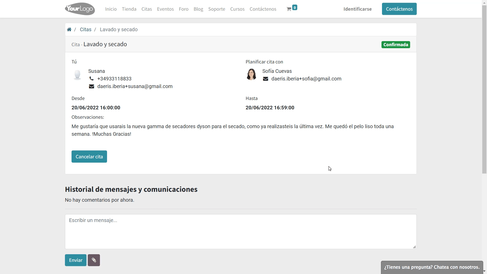
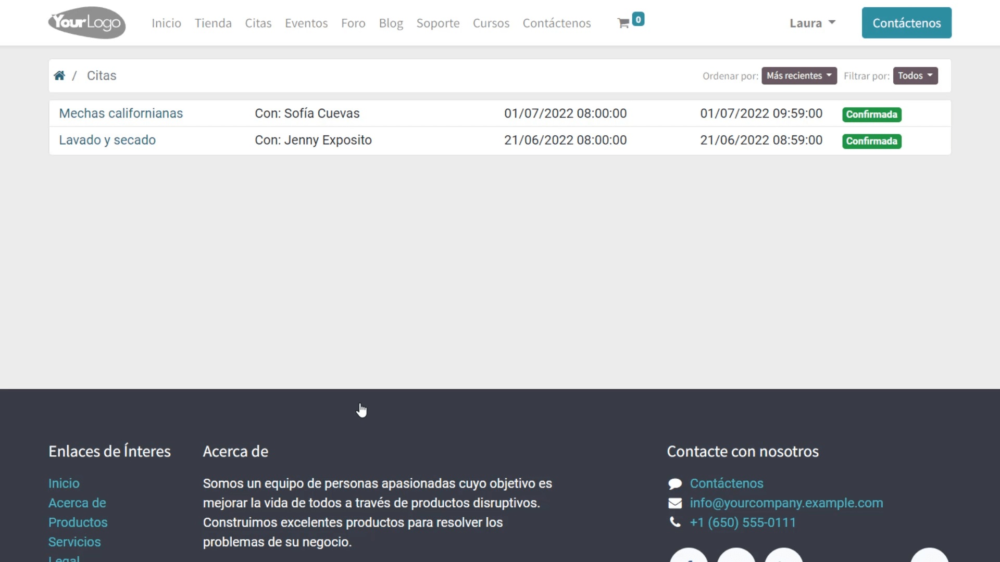

:show-content:

==========
Citas
==========

Daeris dispone de un servicio que permite a tus clientes, programar citas en el calendario de tus empleados a su conveniencia.
Gracias a la aplicación de citas, tus clientes serán autónomos a la hora de realizar reservas, permitiéndote gestionarlas fácilmente.

.. youtube:: T1PJS_ZdJUI
    :align: right
    :width: 700
    :height: 394

Configuración
=================

Crear un bloque de gestión de citas
-------------------------------------

Un *bloque de gestión de citas* es un apartado desde donde los clientes de nuestro sitio web pueden registrar sus citas con nuestros empleados.
Para gestionar los bloques de citas navega a la pantalla :menuselection:`Citas --> Citas`

Para crear un nuevo bloque pulsa el botón *Crear*. Esta acción mostrará un formulario donde es posible informar los siguientes campos:

- **Título**: Corto y descriptivo para que los visitantes puedan reconocer el tipo de cita.
- **Imagen**: Debe de ser descriptiva ya que se muestra como fondo de la cita en el sitio web.Es recomendable usar una imagen de 1280x800 en formato jpg de calidad media.

Al posicionarse sobre la pestaña *Ajustes* es posible informar los siguientes campos:

- **Publicado**: Indica si se muestra en el sitio web, en el caso de estar informado o esta oculto, sin acceso para los clientes. Por defecto está informado.
- **Sitio Web**: Este campo solo se muestra si estamos usando mas de un sitio web en nuestro sistema. Permite seleccionar el sitio web en el que se mostrará nuestro bloque de citas. Si no se informa, se mostrará en todos los sitios web.
- **Usuario especifico**: Permite indicar si todos los usuarios con franjas configuradas pueden atender la cita o si tan solo la pueden realizar unos usuarios en concreto. Si informamos esta opción aparecerá una nueva pestaña “Usuarios” desde donde podemos seleccionar los usuarios que pueden atender la cita.
- **Duración**: Se corresponde con el tiempo en formato hora: minutos que dura la cita. Es posible informar valores entre 00:05 minutos y 08:00 horas.
- **Ubicación**: El lugar desde donde se realizará la cita, en el caso de que sea presencial. Si es una cita online no se debe informar este campo.
- **Zona horaria**: Permite informar la zona horaria que se usará para concretar la cita.
- **Orden**: Se ha de informar con un valor numérico para indicar el orden en el que aparecerá el bloque de citas.
- **Recordatorios**: Permite informar tipos de recordatorio que serán asociados al evento para alertar por correo electrónico y/o aplicación, de la proximidad del inicio la cita.
- **Plantilla de planificación**: Plantilla de correo electrónico que se emite al cliente y al usuario que atiende la cita cuando se crea una nueva cita.
- **Plantilla pendiente confirmación**: Plantilla de correo electrónico que se emite al cliente y al usuario que atiende la cita cuando una pasa a estar pendiente de confirmación.
- **Plantilla de cancelación**: Plantilla de correo electrónico que se emite al cliente y al usuario que atiende la cita cuando se cancela una cita.

Al posicionarse sobre la pestaña *Opciones de portal* es posible informar los siguientes campos relacionados con las opciones que tienen los visitantes cuando generan una cita desde el portal:

- **Permitir publicar comentarios**: Si informamos esta opción, permitimos que los visitantes que gestionan una cita (estén registrados o no), puedan publicar comentarios sobre la misma cita.
- **Permitir cancelar citas desde el portal**: Si informamos esta opción, permitimos que los visitantes que gestionan una cita (estén registrados o no), puedan cancelarla.
- **Nº máximo de días para cancelar una cita**: Si informamos esta opción, permitimos que los visitantes que gestionan una cita (estén registrados o no), puedan cancelarla siempre que lo hagan antes del número de días indicado en este campo.
- **Mínimo número de días para planificar una cita**: Mediante esta opción se impide que el usuario pueda planificar la fecha de una cita desde hoy hasta el número de días indicado contando a partir de hoy.
- **Máximo número de días para planificar una cita**: Mediante esta opción se impide que el usuario pueda planificar la fecha de una cita después del número de días indicado contando a partir de hoy.

Sobre la pestaña *Contenido* es posible informar:

- **Mensaje de introducción**: Texto descriptivo del servicio ofertado que aparece junto al titulo cuando el cliente selecciona el bloque de la cita.
- **Mensaje de validación**: Texto que permite introducir, comentarios, recordatorios… Este texto aparece antes de que el cliente confirme la cita.

.. image:: citas/citas-contenido.png
   :align: center
   :alt: Opciones de contenido de citas

Una vez completado el registro haz clic sobre el botón *Guardar*

Mediante el botón *ir al sitio web* es posible visualizar el registro de la cita desde el sitio web.

Mediante el apartado *Citas* del sitio web es posible acceder al listado de todas las citas disponibles.

Configurar franjas horarias
----------------------------------

Las *franjas horarias*, permiten identificar la posibilidad del inicio de una cita para un usuario determinado en un día de la semana concreto (de lunes a domingo).
Cada franja horaria se corresponderá con una única posible cita, siempre que el usuario no tenga planificado ningún evento en el calendario que coincida con la cita.
Los clientes podrán seleccionar las franjas horarias libres de los usuarios asociados a las citas, siempre que la duración de la cita no se superponga con un evento posterior.

Para crear franjas horarias, navega a la pantalla :menuselection:`Citas --> Configuración --> Franjas horarias` y haz clic sobre el botón *Crear*.

Sobre el formulario puedes informar los siguientes campos:

- **Usuario**: Permite seleccionar entre los diferentes usuarios activos en la aplicación.
- **Dia**: Se corresponde con el día de la semana sobre el que se va a crear el registro.
- **Hora de inicio**: Permite informar la Hora y minuto en formato Hora:Minuto en la que empieza el registro.

Es necesario crear tantos registros como franjas vaya a disponer cada usuario.
Para ello, es muy útil, la opción de duplicar registro, disponible mediante el menú *acción* del propio formulario.

Una vez configuradas las franjas horarias de las citas, los usuarios podrán escoger la franja de planificación a partir de la fecha que hayan seleccionado previamente.

.. image:: citas/citas-formulario-franja.png
   :align: center
   :alt: Formulario de selección de franja horaria

Configurar la protección de envio de formularios frente a SPAM
----------------------------------------------------------------

Daeris protege el envío de formularios de citas mediante el sistema de validación de Google ReCaptcha v2.

Para que tus visitantes puedan enviar formularios deberán validar el cuadro de confirmación de Google ReCaptcha.

Para habilitar el sistema de Google ReCaptcha navega a la pantalla :menuselection:`Citas --> Configuración --> Ajustes` e informa sobre el campo *Clave ReCaptcha* tu clave de Google ReCaptcha.

Una vez informada la clave, debes pulsar el botón Guardar.

.. important:: Si no dispones de una clave ReCaptcha, puedes crear una `Aquí <http://www.google.com/recaptcha/admin>`_. La clave creada debe ser de tipo ReCaptcha v2 y el dominio debe coincidir con el dominio de tu instancia daeris.

Limitar el acceso al registro de citas
----------------------------------------

Daeris permite limitar la opción de crear registros de citas a usuarios registrados en el sistema.
Mediante esta opción, solo se permite generar citas si el cliente se ha registrado previamente en el portal de cliente y se ha autentificado en el sistema.
Para usar esta opción, navega a la pantalla :menuselection:`Citas --> Configuración --> Ajustes`.

.. important:: Esta opción solo está disponible para usuarios con permisos de administración de citas.

Mediante el campo *visibilidad*, podemos incorporar la opción *Usuarios no registrados*, opción por defecto o *Usuarios registrados*, opción que limitará la posibilidad de crear citas a clientes registrados en el sistema.

Si el visitante del sitio web pulsa el enlace de citas, se mostrará la siguiente pantalla:

Una vez realizados los cambios es necesario pulsar el botón *Guardar*.

.. important:: Si usamos la opción *Usuarios no registrados*, se creará un contacto con el nombre, cuenta de correo y teléfono que haya usado el cliente al registrar la cita, siempre que no exista una cuenta con estos valores en el sistema.

Gestión
=================

Consultar los registros de citas
----------------------------------

Para consultar la información del registro de citas, navega a la pantalla :menuselection:`Citas --> Informes --> Registros de citas`.
Es posible visualizar todos los registros de citas desde el listado, así como filtrarlos y agruparlos por diversos campos.

Al hacer clic sobre un registro, navegamos al formulario de detalle, desde donde es posible visualizar toda la información relacionada con la cita.

Para consultar la información de los registros de citas en formato gráfico, navega a la pantalla :menuselection:`Citas -->Informes -->Citas`.
Desde esta pantalla, es posible filtrar y agrupar por diversos campos mediante las opciones del menú.

También es posible visualizar los datos en modo pivote, haciendo clic sobre el icono de pantalla en modo pivote.

Visualizar citas en el calendario
----------------------------------

Para visualizar las citas en el calendario, navega a la pantalla :menuselection:`Citas --> Calendario`.
Desde esta pantalla es posible visualizar todos los eventos planificados del usuario.

Para visualizar el registro de calendario de todos los empleados, haz clic sobre la opción *Calendario de todos*.
Al hacer clic sobre un elemento es posible visualizar su contenido, así como interactuar con él.

Programar citas desde el sitio web
===================================

Para planificar una cita desde el sitio web, el visitante debe hacer clic sobre al menú *Citas*, desde donde se muestran todos los bloques de citas publicados.

Al hacer clic sobre un bloque, la aplicación navega al detalle de la cita, desde donde es posible informar los campos necesarios para registrarla.
En el caso de que la cita no esté configurada para un único usuario especifico, la aplicación muestra un primer campo, *Planificar cita con*, el cual permite seleccionar el usuario con el que el cliente quiere mantener la cita.

Una vez seleccionado el empleado, es posible informar el campo fecha.
Al hacer clic sobre él, se muestra un desplegable desde donde es posible seleccionar el día deseado.
Todos los días en los cuales, el empleado seleccionado dispone de una franja horaria disponible, se ven marcados en color y son seleccionables.

.. image:: citas/citas-fecha.png
   :align: center
   :alt: Formulario de una cita

Una vez seleccionada la fecha, el visitante puede seleccionar la franja horaria desde el campo de selección *Franja horaria*.

Una vez seleccionada la franja horaria, se ocultan los controles usados para seleccionar el empleado, fecha y franja y aparecen los siguientes:

- **Botón cambiar fecha**: Permite al visitante volver a la situación inicial para establecer el empleado, la fecha y la franja horaria.
- **Nombre**: En el caso de que el cliente no este registrado será requerido informarlo. Si el cliente esta registrado aparece preinformado.
- **Correo electrónico**: En el caso de que el cliente no este registrado será requerido informarlo. Si el cliente esta registrado aparece preinformado.
- **Teléfono**: En el caso de que el cliente no este registrado será requerido informarlo. Si el cliente esta registrado aparece preinformado.
- **Observaciones**: Bajo este apartado el cliente puede incorporar sus observaciones
- **Mensaje de validación**: Sobre un recuadro informativo aparece el valor del texto del mensaje de validación configurado en el bloque de la cita.
- **No soy un robot**: Sobre un recuadro, se solicita al visitante que confirme que no es un robot, usando el sistema google recaptcha. Hasta que no se realiza la validación, no se habilita el botón *Confirmar cita*.
- **Botón Confirmar cita**: Mediate este botón se registra la cita, siempre que los campos obligatorios hayan sido informados.

Al confirmar la cita, la aplicación muestra por pantalla un mensaje de confirmación.

.. image:: citas/citas-confirmación.png
   :align: center
   :alt: Formulario de una cita

Además, se envía una comunicación por correo electrónico a todos los asistentes de la cita:

Mediante el botón *Ver*, del correo electrónico generado, es posible visualizar el detalle de la cita desde portal, tanto para usuarios registrados como para usuarios no registrados.

En el caso de que sobre el bloque de citas se haya informado la opción “permitir publicar comentarios”, aparecerá un apartado “Historial de mensajes y comunicaciones” desde donde el cliente podrá emitir comunicaciones al empleado.

Al enviar la comunicación, esta aparecerá como un mensaje publicado.
Esta comunicación será visible por el empleado y le aparecerá como registro pendiente de lectura en su panel de conversaciones.

Al hacer clic sobre la notificación de conversación pendiente, se puede visualizar el contenido de la misma.

La nueva cita aparecerá registrada sobre el calendario del empleado, disponible sobre la aplicación citas haciendo clic sobre el menú calendario.

Gestionar citas desde el portal
================================

Para que los usuarios registrados en el portal, puedan consultar y gestionar sus citas, deben iniciar sesión y navegar al enlace *mi cuenta*, disponible sobre el desplegable que aparece junto a su nombre de usuario.

Sobre el listado de documentos, aparece un enlace hacia las citas además de un contador con el número de citas que dispone.

Al hacer clic sobre el enlace de citas la aplicación navega al listado de citas del cliente, desde donde puede visualizar el histórico de citas.

Al hacer clic sobre un registro, la aplicación navega a su detalle. Mediante el botón *cancelar* es posible cancelar una cita. Este botón solo aparecerá si el bloque de citas estas configurado con la opción *Permitir cancelar citas*.
Al cancelar una cita se emite comunicación al cliente, indicando la situación.

