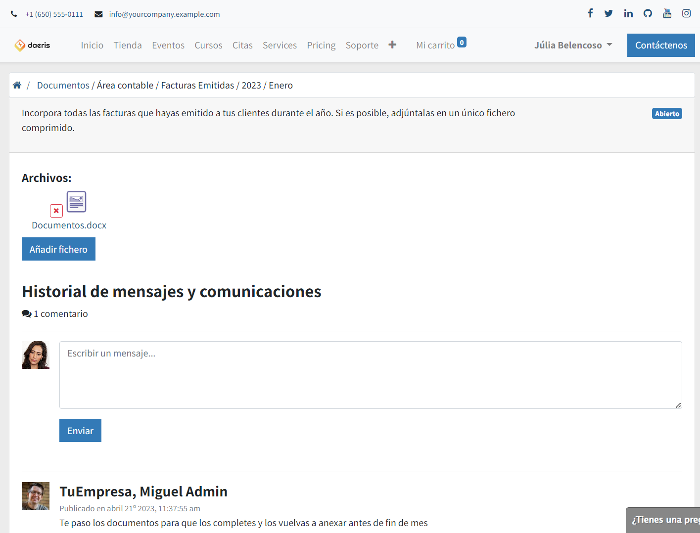

====================
Documentos (DMS)
====================

Daeris dispone de un **sistema de gestión documental** también llamado DMS (Document Management System en inglés) el cual te permite almacenar, administrar y compartir directorios y documentos con los usuarios que disponen de acceso al **portal** web.

Configuración
=================

Crear Áreas de directorios
---------------------------

Un *área de directorios* es un primer nivel de clasificación de directorios y sirve para realizar una clasificación funcional con la que disponer de un catálogo bien organizado.

Para gestionar áreas de directorios navega a la pantalla :menuselection:`Documentos --> Configuración --> Áreas`.

Para crear una nueva *Área* pulsa el botón **Crear**. Esta acción mostrará un formulario desde donde es posible informar los siguientes campos:

- **Nombre**: Se recomienda incorpora un nombre corto y descriptivo para realizar el primer nivel de clasificación de los directorios.
- **Compañía**: Por defecto se informa con la compañía sobre la que estamos trabajando y sirve para filtrar por ella en el caso de que trabajemos en modo multicompañía. Es posible dejarlo en blanco para ser visible por cualquier compañía.

Al posicionarse sobre la pestaña **Tipos** es posible visualizar los tipos asociados al área, en el caso de disponer de alguno.

Crear Estados de directorios
-----------------------------

Un *estado de directorios* sirve para otorgar permisos a los usuarios de portal sobre los documentos compartidos. Se pueden crear tantos estados como requiera tu negocio y al crear los directorios de los usuarios, se incorpora de forma predeterminada el estado relacionado con el tipo de directorio.

Para gestionar estados de directorios navega a la pantalla :menuselection:`Documentos --> Configuración --> Estado`.

Por defecto disponemos de los siguientes estados:

- **Abierto**: Permite al usuario de portal asociado al directorio *visualizar* el registro, así como *descargar*, *añadir* y *eliminar* ficheros.
- **En revisión**: Permite al usuario de portal asociado al directorio *visualizar* el registro, así como *descargar* y *añadir* ficheros.
- **Cerrado**: Permite al usuario de portal asociado al directorio *visualizar* el registro y *descargar* los ficheros.

.. image:: documentos/estados01.png
   :align: center
   :alt: Pantalla principal de estados de directorios

Para crear un nuevo Estado pulsa el botón **Crear**. Esta acción mostrará un formulario donde es posible informar los siguientes campos:

- **Nombre**: Se recomienda incorpora un nombre corto y descriptivo
- **Permisos**: Determina las acciones que puede realizar el usuario de portal sobre el directorio. Es posible seleccionar entre los siguientes valores:

    - **Leer**: Se permite *visualizar* el directorio, así como *descargar* ficheros.
    - **Crear/Leer**: Se permite *visualizar* el directorio, así como *descargar* y *añadir* ficheros.
    - **Crear/Leer/eliminar**: Se permite *visualizar* el directorio, así como *descargar*, *añadir* y *eliminar* ficheros.

Crear Tipos de directorios
-----------------------------

Un *tipo de directorio* es un segundo nivel de clasificación de directorios y sirve para realizar una clasificación funcional con la que disponer de un catálogo bien organizado. Los tipos de directorios se relacionan con las *áreas de directorios*, siendo estas el primer nivel de clasificación.

Para gestionar tipos de directorios navega a la pantalla :menuselection:`Documentos --> Configuración --> Tipos`. Desde este listado es posible visualizar en modo listado los tipos de directorios agrupados por *área*.

Para crear un nuevo *tipo* pulsa el botón **Crear**. Esta acción mostrará un formulario desde donde es posible informar los siguientes campos:

- **Área**: Permite seleccionar de entre las distintas áreas configuradas, el primer nivel de clasificación del directorio.
- **Estado**: Permite seleccionar de entre los distintos estados configurados, el estado que se incorporará de *forma predeterminada* al crear el directorio.
- **Intervalo**: Forma de crear los directorios. Se puede seleccionar entre:

    - **Ninguno**: Se creará un **único directorio** para cada usuario asociado al tipo
    - **Mes**: Se creará **un directorio por cada mes** (12 meses) entre los años indicados en los campos *Desde el año* y *Hasta el año*.
    - **Año**: Se creará **un directorio por cada año** entre los años indicados en los campos *Desde el año* y *Hasta el año*.

- **Desde el año**: Sirve para evaluar el número de directorios a crear en base al intervalo establecido.
- **Hasta el año**: Sirve para evaluar el número de directorios a crear en base al intervalo establecido. Se recomienda informar este campo con el valor del año vigente, para no crear confusión a los usuarios de portal al disponer de un volumen de directorios elevado.
- **Compañía**: Se relaciona con la compañía indicada en el Área y sirve para filtrar los directorios al trabajar en modo multicompañía.
- **Comentario**: Texto que aparecerá sobre el directorio a los usuarios de portal y tiene como principal función la de facilitar instrucciones sobre el tipo de archivo.

Al posicionarse sobre la pestaña **Clientes** es posible seleccionar aquellos usuarios de portal sobre los que se van a crear los directorios.

Crear y actualizar directorios
--------------------------------

Daeris crea un directorio por cada usuario de portal asociado a un tipo de directorio. Además, si este tipo de directorio dispone de un **intervalo Anual**, se crearán tantos directorios como intervalo de años se hayan seleccionado. Si el tipo de directorio dispone de un **intervalo Mensual**, se crearán tantos directorios como intervalo de años se hayan seleccionado multiplicado por 12 meses.

La ejecución de creación de los directorios se realiza de forma manual. Para realizarla, navega a la pantalla :menuselection:`Documentos --> Configuración --> Tipos` y posiciónate sobre el tipo sobre el que quieras crear los directorios. 

.. attention::
   Debes tener en cuenta que una vez hayas creado directorios mediante el botón **Crear directorios**, ya no será posible modificar el **nombre** del tipo, ni el **área** e **intervalo** seleccionado.

Sobre la pestaña **clientes**, selecciona todos los clientes con acceso al portal sobre los que quieres crear los directorios. 

Por último, haz clic sobre el botón **Crear directorios**. Sobre la pestaña **directorios** podrás visualizar todos los directorios generados a cada uno de los clientes con acceso al portal seleccionados.

.. tip::
   En el caso de crear directorios por años o meses, no se recomienda crear directorios para los años futuros a no ser que deban ser utilizados en la actualidad. Llegado el momento, es posible generar directorios para nuevos años, cambiando el valor del campo **Hasta el año** del tipo de directorio correspondiente y generar los nuevos directorios mediante el botón **Crear directorios**. Esta acción no tendrá afectación sobre los directorios ya generados y creará aquellos que no existan.

Gestión
=================

Gestionar directorios por usuarios internos
---------------------------------------------

Daeris permite gestionar los directorios ya generados permitiéndote modificar el estado, incorporar comentarios y añadir o eliminar nuevos ficheros. Para ello navega a la pantalla :menuselection:`Documentos --> Directorios`.

Sobre el buscado de la parte lateral izquierda es posible filtrar por los siguientes campos de los directorios:

- **Estado**: 
- **Área**: 
- **Tipo**: 
- **Cliente**: 
- **Mes**: 
- **Año**: 

También es posible cambiar el modo de visualizar los directorios mediante el botón de cambio de visualización a formato Kanban.

Al hacer clic sobre un directorio nos posicionamos sobre su detalle, desde done podemos modificar el **estado*. Al cambiar el estado del directorio se actualizan los **permisos** heredados del estado. Recordamos que los permisos determinan las acciones que puede realizar el usuario de portal sobre el directorio. Existen los siguientes permisos:

    - **Leer**: Se permite *visualizar* el directorio, así como *descargar* ficheros.
    - **Crear/Leer**: Se permite *visualizar* el directorio, así como *descargar* y *añadir* ficheros.
    - **Crear/Leer/eliminar**: Se permite *visualizar* el directorio, así como *descargar*, *añadir* y *eliminar* ficheros.

Al hacer clic sobre el botón **archivos**, es posible adjuntar tantos ficheros como sea requerido.

Mediante el botón **Enviar mensaje** disponible sobre el apartado inferior *(chatter)*, es posible incorporar **comentarios** que podrán ser visualizados y respondidos por los clientes.

Gestionar documentos por usuarios de portal
---------------------------------------------

Los clientes con acceso al portal web, pueden gestionar los directorios que previamente se le han creado, accediendo al apartado **Mi cuenta**, desde donde podrán visualizar el **número de directorios** que disponen bajo el apartado **Documentos**.

Al hacer clic sobre el **número de documentos** el usuario accede a la pantalla de directorios filtrada por el *Área* y *tipo de directorio* seleccionados.

El panel lateral izquierdo, muestra todas las áreas sobre las que el cliente dispone de directorios. Al hacer clic sobre un área el listado de tipos de directorios y directorios se actualizan, mostrando los directorios y tipos asociadas al área y tipo seleccionados.

El siguiente panel izquierdo, muestra todos los tipos asociados al área seleccionada sobre los que el usuario dispone de directorio. Al hacer clic sobre un tipo el listado de directorios se actualiza, mostrando los directorios asociados al tipo seleccionado.

Sobre el panel derecho se muestra un listado con todos los directorios que dispone el cliente aplicando los filtros de área y tipo seleccionados. El listado dispone de información valiosa, como:

- **Nombre**: 
- **Mes**: 
- **Año**: 
- **Estado**: 
- **Nº Archivos**: 

Al acceder al detalle de un directorio haciendo clic sobre el **nombre del directorio**, se visualizan los **comentarios** que dispone el *tipo* de directorio, y los **ficheros adjuntos**.

El cliente puede **descargar** el fichero, y en base a los **permisos** que disponga el **estado** del directorio, también podrá **subir** nuevos ficheros y **eliminarlos**.

Mediante el apartado inferior es posible consultar los **comentarios** aportados e incorporar de nuevos.

.. attention::
   Recuerda que los comentarios aportados por el cliente, se dirigen al creador de los directorios y se pueden visualizar desde el botón superior de conversaciones o desde la propia pantalla de conversaciones.

   .. image:: documentos/portal04.png
      :align: center
      :alt: Pantalla de comentarios