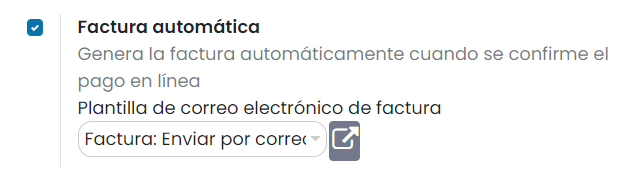

=====================
Método de facturación
=====================

Generar la factura automáticamente cuando se confirme el pago en línea
======================================================================

Para generar la factura automáticamente cuando se confirme el pago en línea, navega a la pantalla :menuselection:`Sitio web --> Configuración --> Ajustes`
y marca la opción **Factura automática**:

Una vez hecho esto, pulsa el botón *Guardar* de la pantalla de ajustes.

De esta manera, la factura se genera automáticamente y está disponible en el portal del cliente cuando el medio de pago
confirma la transacción. La factura se marca como pagada y el pago se registra en el diario de pagos definido en la
configuración del medio de pago.

.. note::
   Se recomienda este modo si emites la factura final en el pedido y no después de la entrega del mismo.