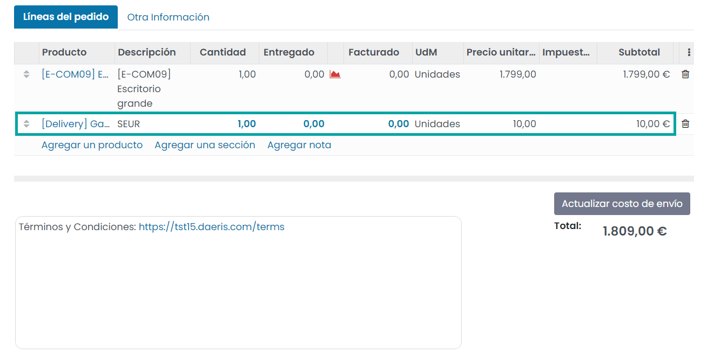

================
Métodos de envío
================

Configurar un método de envío
=============================

Mediante la configuración de los **métodos de envío** se ponen a disposición de los usuarios una serie de agencias de
transporte que se pueden seleccionar al realizar un pedido. Cada método de envío se puede configurar en base a una serie
de reglas para que, si se cumplen, aparezca como método de envío disponible al usuario. También se puede configurar el
precio del envío en función de las características del producto (dimensiones, peso, etc.).

Además, en base al método de envío seleccionado, siempre que sea uno de los preconfigurados y se haya informado el
código de seguimiento sobre el pedido, se permitirá el acceso mediante un botón al seguimiento del envío desde la web
de la agencia de transporte (para pedidos de Correos, Correos Express, Fedex, GLS, SEUR, TNT, UPS e Integra2).

Para configurar los métodos de envío, navega a la pantalla :menuselection:`Sitio web --> Configuración --> Métodos de envío`.
Por defecto, se encuentran preconfigurados varios métodos de envío:

.. image:: metodos_envio/listado-metodos-envio.png
   :align: center
   :alt: Listado de métodos de envío

Al crear un nuevo método de envío o editar uno de los existentes, el sistema navega al formulario de detalle, donde
puedes encontrar la siguiente información:

.. image:: metodos_envio/detalle-metodos-envio.png
   :align: center
   :alt: Formulario de detalle de métodos de envío

-  **Nombre**: Nombre descriptivo del método de envío.

-  **Proveedor**: Indica si el precio es fijo o se calcula en base a reglas. En el caso de indicar que es fijo aparece el
   campo **Precio fijo** sobre la pestaña **Precio**, donde puedes indicar el coste fijo del envío. En el caso de indicar
   que el coste es en base a reglas, puedes informar las reglas sobre la pestaña **Precio**. Mediante las reglas de precios
   puedes definir las condiciones en base al peso, dimensiones, cantidad de artículos, precio del pedido, etc. Al cumplirse
   una condición puedes definir el coste de envío. En este ejemplo se han configurado las siguientes reglas de precio:

   -  20,00 euros en el caso de que el peso sea menor que 5 kg

   -  50,00 euros en el caso de que el peso sea mayor o igual a 5 kg

   -  0,00 euros en el caso de que el precio sea mayor o igual a 300,00 euros

-  **Método de seguimiento**: En función del valor incorporado puedes acceder mediante un botón al seguimiento del envío
   desde la web de la agencia de transporte. Los métodos de seguimiento disponibles son los siguientes: Correos, Correos
   Express, Fedex, GLS, SEUR, TNT, UPS e Integra2.

-  **Sitio web**: Indica el sitio web en el que estará disponible este método de envío. Si este campo se deja en blanco,
   el método de envío estará disponible en todos los sitios web.

-  **Producto asociado a los gastos de envío**: Un gasto de envío es un producto que se asocia a la venta. Este campo se
   usa para definir dicho producto. En función del IVA asociado a este producto, se calculará el impuesto del coste del envío.

-  **Margen en la tarifa**: Porcentaje a añadir al precio del envío en el caso de que quieras aplicar una comisión.

-  **Gratuito si el importe del pedido es superior a**: Si el importe total del pedido (gastos de envío excluidos) es
   igual o superior a este valor, el envío es gratuito para el cliente.

Desde la pestaña **Disponibilidad de destino** se permite filtrar los transportistas según la dirección de entrega del
cliente. De este modo puedes incorporar países, provincias o rangos de códigos postales. Si la dirección de entrega
coincide con el país, provincia o rango de código postal, el método de envío estará disponible para el cliente.

Desde la pestaña **Descripción** se permite informar una descripción que quieras mostrar a tus clientes. Esta descripción
se informará sobre cada pedido, albarán y factura:

Una vez configurado el método de envío, se debe publicar el mismo mediante el botón ubicado en la parte superior derecha
del formulario:

.. image:: metodos_envio/publicar-metodos-envio.png
   :align: center
   :alt: Publicar métodos de envío

A partir de ese momento, cuando se realice una venta, los usuarios ya podrán utilizar el método de envío publicado.

Permitir que el cliente introduzca una dirección de envío
=========================================================

Para permitir que el cliente introduzca una dirección de envío distinta de la dirección de facturación en la tienda
online, navega a la pantalla :menuselection:`Sitio web --> Configuración --> Ajustes` y marca la opción **Dirección de envío**:

Una vez hecho esto, pulsa el botón *Guardar* de la pantalla de ajustes.

A partir de ese momento, cuando un cliente tramite un pedido en la tienda online, podrá informar una dirección de envío:

Informar el código de seguimiento de un pedido
==============================================

Una vez realizado el pago de un pedido, accediendo al detalle del mismo en la pantalla :menuselection:`Sitio web --> Pedidos --> Pedidos`,
puedes observar cómo se ha incluido una línea con el método de envío seleccionado y el coste asociado:

Posteriormente, cuando hayas tramitado con la empresa de transportes el envío, te emitirán un código de referencia para
realizar el seguimiento del paquete. Este número debes incorporarlo al sistema para que el cliente pueda realizar el
seguimiento de su paquete.

.. note::
   El servicio de seguimiento se puede realizar para pedidos de Correos, Correos Express, Fedex, GLS, SEUR, TNT, UPS e Integra2.

Para incorporar el código de seguimiento al pedido, navega a la entrega asociada al pedido desde el icono de entregas
ubicado en la parte superior derecha del formulario del pedido:

En el detalle de la entrega, navega a la pestaña de **Info adicional** e informa el código de seguimiento en el campo
**Número de seguimiento**:

.. image:: metodos_envio/informar-codigo-seguimiento-3.png
   :align: center
   :alt: Informar el código de seguimiento de un pedido (3)

Una vez incorporada la referencia de seguimiento, para validar que todo es correcto, haz clic sobre el icono de
seguimiento ubicado en la parte superior derecha del formulario:

El sistema abrirá la página web del transportista posicionándose sobre el pedido en cuestión:

Del mismo modo, si el cliente accede a su pedido a través del área privada de clientes, podrá encontrar el acceso al
seguimiento del pedido desde el apartado de **Órdenes de entrega** del detalle del pedido:

