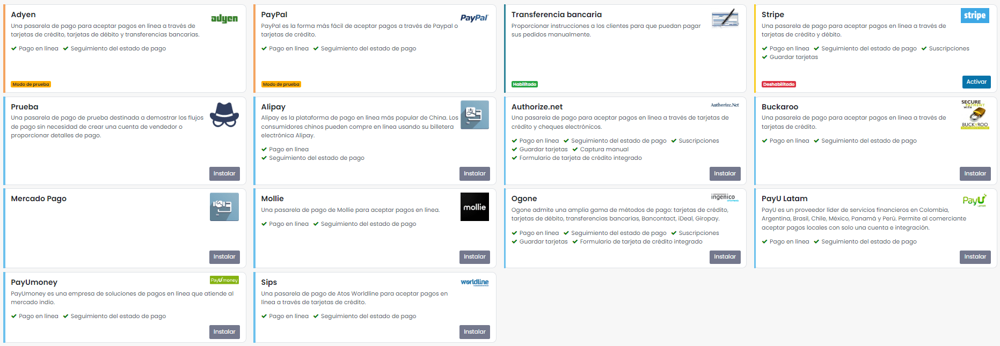
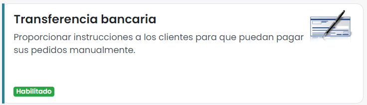
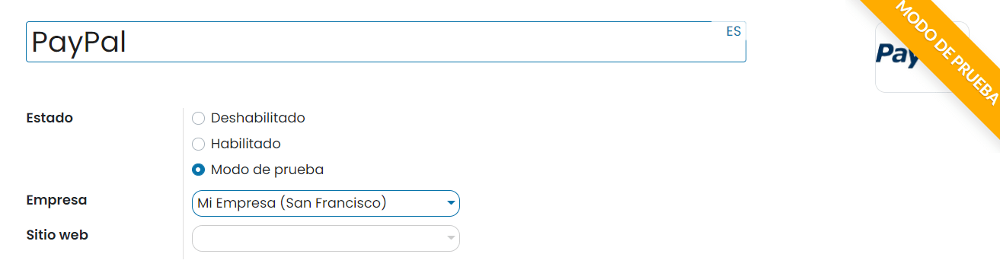

===============
Métodos de pago
===============

Gestionar los métodos de pago
=============================

Daeris ofrece la posibilidad de configurar diversos métodos de pago, en base a las necesidades de cada empresa. Desde la
pantalla :menuselection:`Sitio web --> Configuración --> Métodos de pago` puedes encontrar varios conectores, algunos de
ellos ya instalados, y otros que se pueden instalar en cualquier momento si se estima oportuno su uso:

Los métodos de pago disponibles en Daeris son los siguientes:

-  **Transferencia bancaria**: Proporciona instrucciones a los clientes para que puedan pagar sus pedidos manualmente
   mediante transferencia bancaria.

-  **Adyen**: Pasarela de pagos que acepta pagos online a través de tarjetas de crédito, débito y transferencias bancarias.

-  **Alipay**: Alipay es la plataforma de pago en línea más popular en China. Los consumidores chinos pueden comprar en
   línea usando su billetera electrónica Alipay.

-  **Authorize.net**: Pasarela de pagos que acepta pagos online a través de tarjetas de crédito y cheques electrónicos.

-  **Buckaroo**: Pasarela de pagos que acepta pagos online a través de tarjetas de crédito.

-  **Mollie**: Pasarela de pago de Mollie para aceptar pagos en línea.

-  **Ogone**: Servicios de pago Ingenico (anteriormente Ogone) admite tarjetas de crédito, tarjetas de débito y
   transferencias bancarias.

-  **PayPal**: PayPal es la forma más fácil de aceptar pagos via PayPal o tarjetas de crédito.

-  **PayU Latam**: PayU es un proveedor líder de servicios financieros en Colombia, Argentina, Brasil, Chile, México,
   Panamá y Perú. Permite al comerciante aceptar pagos locales con una sola cuenta e integración.

-  **PayUmoney**: PayU India es una compañía de soluciones de pagos en línea que atiende el mercado indio.

-  **Sips**: Pasarela de pagos de Atos Worldline que acepta pagos online a través de tarjetas de crédito.

-  **Stripe**: Pasarela de pagos que acepta pagos online a través de tarjetas de crédito.

.. note::
   Daeris también dispone de un método de pago de **Prueba** destinado a demostrar los flujos de pago sin necesidad de crear
   una cuenta de vendedor o proporcionar detalles de pago.

Configurar la transferencia bancaria como método de pago
========================================================

Mediante el método de pago de transferencia bancaria, se proporcionan instrucciones a los clientes para que puedan pagar
sus pedidos realizando una transferencia desde su banco a una cuenta especifica. Para configurar este método de pago
navega a la pantalla :menuselection:`Sitio web --> Configuración --> Métodos de pago`, y accede al detalle del método de
pago **Transferencia bancaria**:

El sistema navega al formulario de detalle del método de pago, en donde puedes encontrar la siguiente información:

-  **Nombre**: Nombre del método de pago.

-  **Imagen**: Imagen asociada al método de pago.

-  **Estado**: El estado del método de pago puede ser *Deshabilitado*, *Habilitado* o *Modo de prueba*. El modo de prueba
   se recomienda en el momento de configurar el método de pago.

-  **Empresa**: Empresa asociada al método de pago.

-  **Sitio web**: Sitio web en donde estará disponible el método de pago. Si este campo se deja en blanco, el método de
   pago estará disponible en todos los sitios web.

Desde la pestaña **Configuración**, dispones de la siguiente información:

-  **Mostrado como**: Descripción del método de pago para los clientes. Si no se define, se utilizará el nombre.

-  **Habilitar códigos QR**: Habilita el uso de códigos QR al pagar por transferencia bancaria.

-  **Comunicación**: Es posible establecer aquí el tipo de comunicación que aparecerá en los pedidos de venta. La comunicación
   se le dará al cliente cuando elija el método de pago. Los valores posibles son *Basado en el documento de referencia*
   o *Basado en la identificación del cliente*.

-  **Países**: Los países para los que está disponible este método de pago. Si no se establece ninguno, está disponible para
   todos los países.

Desde la pestaña **Mensajes**, dispones de la siguiente información:

-  **Mensaje pendiente**: Este mensaje le aparecerá al cliente para aclararle que el pedido empezará a tramitarse una vez
   recibido el pago.

Una vez configurado el método de pago, guarda el registro mediante el botón *Guardar*.

A partir de ese momento, cuando un cliente realice un pedido desde la tienda online, el método de pago de transferencia
bancaria aparecerá como método de pago disponible en la página de confirmación del pedido:

Cuando el cliente pulse el botón **Pagar ahora**, le aparecerá una pantalla indicándole que el pedido está pendiente
hasta recibir el pago, junto con las instrucciones para realizar la transferencia bancaria:

Inmediatamente se le envía al cliente el presupuesto por correo electrónico y se genera en Daeris un presupuesto en estado
enviado. Este presupuesto se puede consultar desde la pantalla :menuselection:`Sitio web --> Pedidos --> Órdenes sin pagar`:

A partir de ese momento, el presupuesto queda pendiente de recibir la transferencia del cliente. En el momento en que el
cliente haga la transferencia, podrás confirmar el presupuesto, crear la factura y conciliar el pago recibido.

Configurar PayPal como método de pago
=====================================

Para pagar con PayPal necesitas disponer de una `cuenta de PayPal de tipo vendedor <https://www.paypal.com/es/business/getting-started>`__.
Por otro lado, si necesitas configurar una cuenta para realizar pruebas, puedes crear una `cuenta de desarrollador <https://developer.PayPal.com/>`__.

Lo que necesitas de tu cuenta de vendedor PayPal para poder configurar la integración con Daeris es lo siguiente:

-  Copiar el **correo electrónico de la cuenta de vendedor**. Este correo lo puedes encontrar en la *Configuración de la cuenta*,
   desde el apartado *Información del titular de la cuenta*:

   .. image:: metodos_pago/paypal.png
      :align: center
      :alt: CConfigurar PayPal como método de pago

-  Copiar el **Id de cuenta del vendedor**. Este identificador lo puedes encontrar en la *Configuración de la cuenta*,
   desde el apartado *Información de la empresa*:

   .. image:: metodos_pago/paypal-2.png
      :align: center
      :alt: CConfigurar PayPal como método de pago (2)

-  Activar el retorno automático incorporando la URL de retorno `https://miempresa.daeris.com/shop/confirmation` o
   `https://miempresa.com/shop/confirmation` donde *miempresa* se corresponde con el nombre de dominio de tu instancia Daeris.
   Esto se puede hacer desde la *Configuración de la cuenta*, en el menú :menuselection:`Pagos en sitio web --> Preferencias de sitio web`:

   .. image:: metodos_pago/paypal-3.png
      :align: center
      :alt: CConfigurar PayPal como método de pago (3)

-  Activar la transferencia de datos de pago y copiar el token de identidad. Esto se puede hacer desde la *Configuración de la cuenta*,
   en el menú :menuselection:`Pagos en sitio web --> Preferencias de sitio web`:

   .. image:: metodos_pago/paypal-4.png
      :align: center
      :alt: CConfigurar PayPal como método de pago (4)

-  Desbloquear los pagos en sitios web no codificados. Esto se puede hacer desde la *Configuración de la cuenta*, en el
   menú :menuselection:`Pagos en sitio web --> Preferencias de sitio web`:

   .. image:: metodos_pago/paypal-5.png
      :align: center
      :alt: CConfigurar PayPal como método de pago (5)

-  Editar la configuración de notificaciones de pago instantáneas (IPN) y activar la recepción de mensajes de IPN utilizando
   la URL de notificación `https://miempresa.daeris.com/payment/PayPal/ipn` o `https://miempresa.com/payment/PayPal/ipn`
   donde *miempresa* se corresponde con el nombre de dominio de tu instancia Daeris. Esto se puede hacer desde la
   *Configuración de la cuenta*, en el menú :menuselection:`Pagos en sitio web --> Notificaciones de pago instantáneas`:

   .. image:: metodos_pago/paypal-6.png
      :align: center
      :alt: Configurar PayPal como método de pago (6)

.. note::
   Para más información acerca de como configurar tu cuenta de vendedor, contacta directamente con PayPal. Si lo deseas,
   también puedes contactar con los servicios profesionales de Daeris mediante nuestro `formulario de contacto <https://daeris.com/contactus>`__.

Una vez dispongas de los datos de tu cuenta de PayPal, y hayas realizado los ajustes necesarios, para configurarlo como
método de pago en Daeris, navega a la pantalla :menuselection:`Sitio web --> Configuración --> Métodos de pago`, y pulsa
el botón **Instalar** del método de pago PayPal:

Una vez instalado, accede al detalle del método de pago. El sistema navega al formulario de detalle del método de pago,
en donde puedes encontrar la siguiente información:

-  **Nombre**: Nombre del método de pago.

-  **Imagen**: Imagen asociada al método de pago.

-  **Estado**: El estado del método de pago puede ser *Deshabilitado*, *Habilitado* o *Modo de prueba*. El modo de prueba
   se recomienda en el momento de configurar el método de pago.

-  **Empresa**: Empresa asociada al método de pago.

-  **Sitio web**: Sitio web en donde estará disponible el método de pago. Si este campo se deja en blanco, el método de
   pago estará disponible en todos los sitios web.

Desde la pestaña **Credenciales**, dispones de la siguiente información:

-  **Correo electrónico**: Correo electrónico de la cuenta de vendedor de PayPal.

-  **ID de la cuenta de comerciante**: Id de cuenta de vendedor de PayPal.

-  **Habilitar IPN**: Notificación de pago instantánea (IPN) es una función de PayPal que envía mensajes sobre pagos
   (y otros eventos de transacciones) directamente de PayPal a los sistemas de servidor de tu(s) sitio(s) web. Esta opción
   debe estar activada para un correcto funcionamiento del método de pago.

Desde la pestaña **Configuración**, dispones de la siguiente información:

-  **Mostrado como**: Descripción del método de pago para los clientes. Si no se define, se utilizará el nombre.

-  **Iconos de pago compatibles**: Iconos de pago que aparecerán junto con este método de pago al realizar un pedido
   desde la tienda online.

-  **Países**: Los países para los que está disponible este método de pago. Si no se establece ninguno, está disponible para
   todos los países.

-  **Diario de pago**: Diario asociado a la cuenta donde se esperará recibir el pago.

Desde la pestaña **Cargos**, dispones de la siguiente información:

-  **Añadir cargos extra**: Mediante esta opción puedes incorporar comisiones fijas o en porcentaje tanto para ventas
   nacionales como internacionales.

Desde la pestaña **Mensajes**, dispones de la siguiente información:

-  **Mensaje de ayuda**: El mensaje que se muestra para explicar y ayudar en el proceso de pago.

-  **Mensaje pendiente**: Mensaje mostrado si la compra no finaliza correctamente una vez finalizado el proceso de pago.

-  **Mensaje de terminado**: Mensaje mostrado si la compra finaliza correctamente una vez finalizado el proceso de pago.

-  **Mensaje cancelado**: Mensaje mostrado si el pedido es cancelado durante el proceso de pago.

Una vez configurado el método de pago, guarda el registro mediante el botón *Guardar*.

A partir de ese momento, cuando un cliente realice un pedido desde la tienda online, el método de pago PayPal aparecerá
como método de pago disponible en la página de confirmación del pedido:

Cuando el cliente pulse el botón **Pagar ahora**, le aparecerá una pantalla para completar el pago con PayPal, y si todo
es correcto, se devolverá al cliente a la página de confirmación del pago.

Configurar Stripe como método de pago
=====================================

Para pagar con Stripe necesitas disponer de una `cuenta en su plataforma <https://dashboard.stripe.com/register>`__.
Una vez dada de alta la cuenta, accede a tu panel de control de Stripe, y desde el menú de **Desarrolladores**, navega
al apartado de **Claves de API**. En este apartado puedes encontrar tu clave pública y clave secreta, necesarias para
configurar la integración con Daeris:

.. note::
   Para más información acerca de como configurar tu cuenta, contacta directamente con Stripe. Si lo deseas, también
   puedes contactar con los servicios profesionales de Daeris mediante nuestro `formulario de contacto <https://daeris.com/contactus>`__.

Una vez dispongas de los datos de tu cuenta de Stripe, para configurarlo como método de pago en Daeris, navega a la pantalla
:menuselection:`Sitio web --> Configuración --> Métodos de pago`, y pulsa el botón **Instalar** del método de pago Stripe:

Una vez instalado, accede al detalle del método de pago. El sistema navega al formulario de detalle del método de pago,
en donde puedes encontrar la siguiente información:

-  **Nombre**: Nombre del método de pago.

-  **Imagen**: Imagen asociada al método de pago.

-  **Estado**: El estado del método de pago puede ser *Deshabilitado*, *Habilitado* o *Modo de prueba*. El modo de prueba
   se recomienda en el momento de configurar el método de pago.

-  **Empresa**: Empresa asociada al método de pago.

-  **Sitio web**: Sitio web en donde estará disponible el método de pago. Si este campo se deja en blanco, el método de
   pago estará disponible en todos los sitios web.

Desde la pestaña **Credenciales**, dispones de la siguiente información:

-  **Clave publicable**: En este campo debes introducir la clave pública de tu cuenta de Stripe.

-  **Clave secreta**: En este campo debes introducir la clave secreta de tu cuenta de Stripe.

Desde la pestaña **Configuración**, dispones de la siguiente información:

-  **Mostrado como**: Descripción del método de pago para los clientes. Si no se define, se utilizará el nombre.

-  **Iconos de pago compatibles**: Iconos de pago que aparecerán junto con este método de pago al realizar un pedido
   desde la tienda online.

-  **Permitir guardar métodos de pago**: Esta opción permite a los clientes guardar su tarjeta de crédito y reutilizarla
   para una compra posterior.

-  **Países**: Los países para los que está disponible este método de pago. Si no se establece ninguno, está disponible para
   todos los países.

-  **Diario de pago**: Diario asociado a la cuenta donde se esperará recibir el pago.

Desde la pestaña **Mensajes**, dispones de la siguiente información:

-  **Mensaje de ayuda**: El mensaje que se muestra para explicar y ayudar en el proceso de pago.

-  **Mensaje pendiente**: Mensaje mostrado si la compra no finaliza correctamente una vez finalizado el proceso de pago.

-  **Mensaje de terminado**: Mensaje mostrado si la compra finaliza correctamente una vez finalizado el proceso de pago.

-  **Mensaje cancelado**: Mensaje mostrado si el pedido es cancelado durante el proceso de pago.

Una vez configurado el método de pago, guarda el registro mediante el botón *Guardar*.

A partir de ese momento, cuando un cliente realice un pedido desde la tienda online, el método de pago Stripe aparecerá
como método de pago disponible en la página de confirmación del pedido:

.. image:: metodos_pago/stripe-7.png
   :align: center
   :alt: Configurar Stripe como método de pago (7)

Cuando el cliente pulse el botón **Pagar ahora**, le aparecerá una pantalla para completar el pago con Stripe, y si todo
es correcto, se devolverá al cliente a la página de confirmación del pago.

